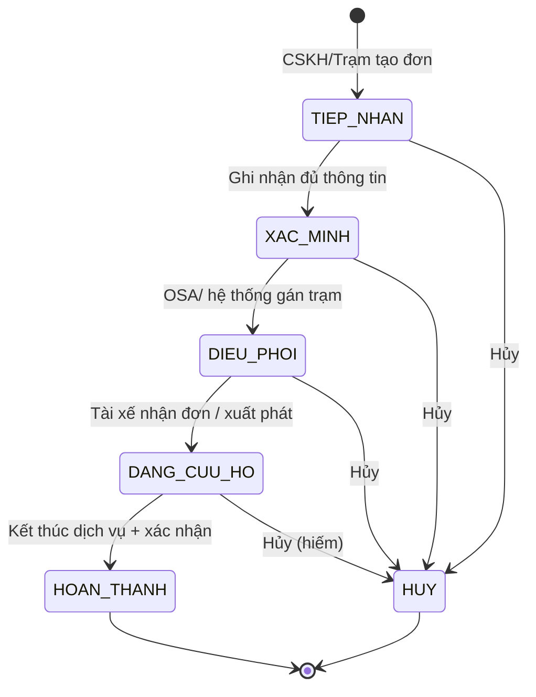

# Logic nghiệp vụ — Báo cáo quản trị vận hành đơn cứu hộ (Giám sát cứu hộ › Tổng quan)

**Phiên bản:** 1.9  
**Đối tượng:** Business Analyst, Product Owner, Dev, QA  
**Màn hình tham chiếu:** VETC Tactical Ops — *Giám sát cứu hộ* — tab **Tổng quan**  
**Phạm vi:** KPI, SLA, funnel chuyển đổi, bản đồ thời gian thực, cảnh báo, nguồn lực  
**Nguồn tính SLA đơn:** `rescue_order_v2` + `rescue_order_history` + `ro_resource_work_order` (query báo cáo đơn)  
**Nguồn ngưỡng SLA/KPI (master):** [Google Sheets — KPI Duration](https://docs.google.com/spreadsheets/d/1vja3aMeko8mAvnkYHKymkR0ngxp-OZcP99kh4H2eLEk/edit?gid=0#gid=0) → chi tiết [kpi-duration-matrix.md](./kpi-duration-matrix.md)

---

## 1. Mục đích & phạm vi

### 1.1 Mục đích
Cung cấp **bức tranh vận hành thời gian thực** cho điều hành trung tâm (OSA/Admin): số lượng đơn theo trạng thái, tuân thủ SLA theo giai đoạn, hiệu suất đối tượng tham gia (trạm, tài xế, CSKH), và danh sách đơn cần can thiệp ngay.

### 1.2 Đối tượng sử dụng
| Vai trò | Quyền trên màn hình |
|--------|---------------------|
| **ADMIN** | Xem toàn bộ; lọc; tải báo cáo; drill-down đơn |
| **OSA** | Xem toàn bộ vùng phụ trách; điều phối từ cảnh báo/map |
| **CSKH** | Xem tổng quan; drill-down đơn do mình/đội xử lý (nếu cấu hình phân quyền) |
| **STATION** | Không truy cập màn Tổng quan trung tâm (chỉ portal trạm) |
| **DRIVER** | Không truy cập |

### 1.3 Phạm vi dữ liệu mặc định
- **Thời gian:** Ngày hiện tại (00:00–23:59, timezone `Asia/Ho_Chi_Minh`), trừ khi người dùng chọn bộ lọc khác.
- **Đơn tính:** `rescue_order_v2.rescue_order_code` (vd. `RS12605010004`); khóa nội bộ `rescue_order_v2_id`.
- **Phạm vi báo cáo mặc định (theo SQL hiện tại):** `ro.order_type = 'INTERNAL'` (đơn nội bộ VETC).
- **Loại trừ khỏi KPI/SLA:** Đơn **Test/Demo**; đơn **`sla_eligible = false`** (§5.6); đơn **`CANCELLED`**.
- **`DRAFT`:** Được đếm trong **Tổng đơn** / thẻ Tiếp nhận; **không** đưa vào tính % SLA (§5.7).

### 1.4 Bảng & trường dữ liệu chính (production)

| Bảng | Vai trò |
|------|---------|
| `rescue_order_v2` | Header đơn: mã, `status`, `state` hiện tại, OSA (`operator_id`), loại đơn, khoảng cách kéo |
| `rescue_order_history` | Nhật ký trạng thái: `state`, `duration` (giây) từng lần ở trạng thái |
| `ro_resource_work_order` | Lệnh giao việc nguồn lực; `is_book` xác định điều phối tự động |
| `staff` | OSA: `staff.fullname` qua `ro.operator_id` |
| `rescue_order_rate` | CSAT: `type = 1`, join `rescue_order_v2_id` |
| `kpi_sla_config_version` / `kpi_sla_config_rule` | Cấu hình ngưỡng SLA/KPI trên **cùng DB master** |
| `kpi_order_state_duration_fact`, `kpi_order_sla_fact`, `kpi_dashboard_snapshot_5m` | Bảng tổng hợp KPI/SLA trên **DB master** (không query nghiệp vụ realtime) |

---

## 2. Đối tượng tham gia & trách nhiệm SLA/KPI

| Đối tượng | Mã | Vai trò trong đơn | Chỉ số gắn trên dashboard |
|-----------|-----|-------------------|---------------------------|
| **Khách hàng** | CUSTOMER | Người được cứu hộ / chủ xe | CSAT (sau hoàn thành) |
| **CSKH** | CSKH | Tiếp nhận, xác minh thông tin, cập nhật địa chỉ/dịch vụ | SLA giai đoạn Tiếp nhận, Xác minh; cảnh báo “Trễ” gắn `assigned_cskh` |
| **OSA** | OSA | Điều phối đối tác/trạm, escalade | SLA Điều phối; hành động từ Command Queue (màn giám sát chi tiết) |
| **Trạm cứu hộ** | STATION | Đơn vị thực hiện tại địa bàn | Tỷ lệ trạm đạt SLA; % hoạt động nguồn lực |
| **Tài xế** | DRIVER | Người lái xe cứu hộ được phân công | KPI tài xế; vị trí trên bản đồ |
| **Đối tác** | PARTNER | NCC cung cấp dịch vụ (ví dụ CARPLA) | Không hiển thị KPI riêng trên Tổng quan (chi tiết ở tab Nguồn lực) |
| **Xe cứu hộ** | VEHICLE | Phương tiện thực hiện | Trạng thái GPS, ETA trên map |

---

## 3. Vòng đời đơn cứu hộ (trạng thái nghiệp vụ)

### 3.1 Sơ đồ trạng thái chính (map với UI)



### 3.2 Ánh xạ `rescue_order_v2.state` → UI dashboard

Thời lượng từng giai đoạn lấy từ **`rescue_order_history.duration`** (giây), quy đổi phút: `ROUND(SUM(duration)/60, 2)` theo từng `state` (CTE `kpi_duration`).

| `ro.state` (history / hiện tại) | Nhãn nghiệp vụ | Cột KPI (phút) | Thẻ UI dashboard |
|--------------------------------|----------------|----------------|------------------|
| `DRAFT`, `WAITING_CONFIRM` | Tạo / chờ xác nhận | `TAO_DON` | **Tiếp nhận** |
| `CONFIRMED` | Đã xác nhận đơn | `XAC_NHAN` | (giai đoạn CSKH/OSA — không có thẻ riêng) |
| `WAITING_PROVIDER_ACCEPT` | Chờ trạm/NCC nhận | `DIEU_PHOI` | **Điều phối** |
| `WAITING_DRIVER_ACCEPT` | Chờ tài xế nhận | `TAI_XE_TIEP_NHAN` | **Điều phối** (**gộp** với chờ NCC) |
| `DRIVER_ON_THE_WAY` | Xe đang đến hiện trường | `DI_CHUYEN_TOI_DIEM` | **Đang cứu hộ** |
| `RESCUE_IN_PROGRESS` | Thực hiện cứu hộ tại chỗ | `THUC_HIEN_CUU_HO` | **Đang cứu hộ** |
| `RESCUE_MOVE_TO_TOWING_POINT` | Kéo xe về điểm đích | `THOI_GIAN_KEO_XE` | **Đang cứu hộ** (chỉ đơn kéo xe) |
| `RESCUE_COMPLETED_BY_DRIVER` | Tài xế báo hoàn thành | `OSA_HOAN_THANH` | Chờ OSA đóng đơn |
| Trạng thái kết thúc (`status` terminal) | Hoàn thành / Huỷ | — | **Hoàn thành** / **Huỷ** |

**Đếm thẻ snapshot (đơn đang xử lý):** dùng `ro.state` **hiện tại** (không cộng lịch sử).

```sql
-- Tiếp nhận
COUNT(*) FILTER (WHERE ro.state IN ('DRAFT','WAITING_CONFIRM'))

-- Điều phối (gộp chờ NCC + chờ tài xế)
COUNT(*) FILTER (WHERE ro.state IN ('WAITING_PROVIDER_ACCEPT','WAITING_DRIVER_ACCEPT'))

-- Đang cứu hộ
COUNT(*) FILTER (WHERE ro.state IN (
  'DRIVER_ON_THE_WAY','RESCUE_IN_PROGRESS','RESCUE_MOVE_TO_TOWING_POINT'
))

-- Hoàn thành / Huỷ
-- ro.status = 'COMPLETED'  → Hoàn thành
-- ro.status = 'CANCELLED'  → Huỷ
```

**Lưu ý:** `ro.status` = trạng thái tổng quát; `ro.state` = trạng thái phụ chi tiết — dashboard ưu tiên **`state`** cho đếm realtime và **`history`** cho SLA phút.

### 3.3 Loại đơn & loại hỗ trợ (từ SQL báo cáo đơn)

| Trường / điều kiện | Giá trị hiển thị | Ảnh hưởng SLA |
|--------------------|------------------|---------------|
| `order_type = 'INTERNAL'` AND `package_purchase_id IS NULL` | **Đơn lẻ** | Ngưỡng SLA chuẩn |
| `order_type = 'INTERNAL'` AND `package_purchase_id IS NOT NULL` | **Đơn gói** | Có thể miễn/ nới ngưỡng (cấu hình) |
| `rescue_distance > 0` | **Kéo xe** | SLA tổng ≤ **120 phút**; ngưỡng kéo theo km (§5.4); kéo **> 30 km** → `sla_eligible = false` |
| `rescue_distance = 0` (hoặc NULL) | **Hỗ trợ tại chỗ** | SLA tổng ≤ **60 phút**; không có `THOI_GIAN_KEO_XE` |

### 3.4 Loại điều phối (`dispatch` CTE)

| `dispatch_type` | Điều kiện SQL |
|-----------------|---------------|
| **Điều phối tự động** | Tồn tại ít nhất 1 dòng `ro_resource_work_order` với `is_book = 'Y'` cho `rescue_order_id` |
| **Điều phối thủ công** | Không có `is_book = 'Y'` (mặc định khi LEFT JOIN null) |

Dùng cho: phân tích KPI OSA, báo cáo export, drill-down (không bắt buộc trên thẻ Tổng quan).

### 3.5 Trạng thái con (map & cảnh báo)

| Trạng thái con UI | `ro.state` |
|-------------------|------------|
| Đang di chuyển | `DRIVER_ON_THE_WAY` |
| Thực hiện tại chỗ | `RESCUE_IN_PROGRESS` |
| Đang kéo xe | `RESCUE_MOVE_TO_TOWING_POINT` |
| Chờ điều phối | `WAITING_PROVIDER_ACCEPT` |
| Chờ tài xế | `WAITING_DRIVER_ACCEPT` |
| Quá hạn SLA | Bất kỳ `state` nào có thời lượng tích lũy > ngưỡng (§13.3) |

---

## 4. Cấu trúc màn hình & logic từng khối

### 4.1 Điều hướng & hành động chung

| Thành phần | Logic nghiệp vụ |
|------------|-----------------|
| Tab **Tổng quan** | Màn mặc định; load toàn bộ widget §4.2–4.9 |
| Tab **Nguồn lực** | Chi tiết trạm/xe/tài xế (ngoài phạm vi tài liệu này) |
| Tab **Heatmap** | Mật độ sự cố/đơn theo lưới địa lý (ngoài phạm vi) |
| **Bộ lọc** | Áp dụng cho **tất cả** widget: khoảng thời gian, vùng địa lý (tỉnh/quận), trạm, đối tác, loại dịch vụ, ưu tiên |
| **Tải báo cáo** | Xuất snapshot theo bộ lọc hiện tại (Excel/PDF): KPI cards, funnel, SLA, top tài xế, danh sách cảnh báo |

**Làm mới dữ liệu:** Polling mỗi **30 giây** (cấu hình) + WebSocket/push khi có thay đổi trạng thái đơn hoặc GPS. Hiển thị *“Cập nhật lúc HH:mm”* trên widget **Tổng hợp đơn**.

---

### 4.2 Hàng thẻ — Trạng thái đơn thời gian thực

#### 4.2.1 Tổng đơn
- **Công thức:** `COUNT(order)` WHERE `created_at` ∈ [Từ, Đến] AND `is_test = false`
- **% xu hướng (ví dụ +2.1%):**  
  `((Tổng_kỳ_hiện_tại - Tổng_kỳ_trước) / Tổng_kỳ_trước) × 100`  
  Kỳ trước = cùng độ dài kỳ ngay trước (vd. hôm qua nếu lọc “Hôm nay”).
- **Sparkline:** Số đơn tạo mới theo bucket (15 phút / 1 giờ tùy khoảng lọc), tối đa 24 điểm.

#### 4.2.2 Tiếp nhận / Điều phối / Đang cứu hộ
- Đếm theo §3.2 tại thời điểm `snapshot_time` (thời điểm refresh).
- **Không** cộng dồn lịch sử — chỉ đơn **đang** ở trạng thái.

#### 4.2.3 Hoàn thành
- **Tổng lũy kế:** `COUNT(*)` WHERE `ro.status = 'COMPLETED'` trong kỳ lọc.
- **Hôm nay:** Thêm `AND completed_at::date = CURRENT_DATE` (hoặc trường tương đương).

#### 4.2.4 Huỷ
- **Tổng lũy kế:** `COUNT(*)` WHERE `ro.status = 'CANCELLED'` trong kỳ lọc.
- **Hôm nay:** `AND cancelled_at::date = CURRENT_DATE`.
- Đơn `CANCELLED`: **`sla_eligible = false`** — không tính SLA.

#### 4.2.5 Tổng đơn & DRAFT
- **Tổng đơn** gồm cả `state = 'DRAFT'` (và mọi trạng thái trong kỳ).
- **SLA / funnel %:** Chỉ đơn `sla_eligible = true` (§5.6); `DRAFT` không vào mẫu số SLA.

---

### 4.3 Bản đồ giám sát (trung tâm)

#### 4.3.1 Layer & biểu tượng
| Layer | Nguồn | Hiển thị khi |
|-------|--------|--------------|
| **Sự cố** (tam giác đỏ) | `order.incident_lat/lng` | Đơn chưa `COMPLETED`/`CANCELLED` |
| **Xe cứu hộ** (icon xe) | GPS thiết bị / app tài xế | Đơn `IN_RESCUE` và có `vehicle_id` |
| **Trạm** (tùy chọn) | Tọa độ trạm | Tab Nguồn lực / cấu hình layer |

#### 4.3.2 Popup xe (ví dụ: *Đang di chuyển · 20 phút · 5 km*)
| Trường | Logic |
|--------|--------|
| Trạng thái | Map `vehicle_sub_status` → nhãn: *Đang di chuyển*, *Tại hiện trường*, *Đang kéo xe* |
| Thời gian | **ETA** = thời gian còn lại dự kiến đến điểm kế tiếp (hiện trường hoặc gara), tính từ routing API hoặc `(khoảng_cách_còn / vận_tốc_tb)` |
| Khoảng cách | Km còn lại đến điểm kế tiếp (làm tròn 0.1 km) |
| Biển số / Model | Từ master `vehicle` gắn đơn |

#### 4.3.3 Quy tắc tương tác
- Click marker đơn → highlight đơn trên funnel/cảnh báo (nếu có).
- Chỉ hiển thị tối đa **N** xe (cấu hình, mặc định 200) trong viewport; ưu tiên đơn quá hạn SLA trước.

---

### 4.4 Tổng hợp đơn (biểu đồ cột theo tuần)

- **Trục X:** T2–CN trong tuần hiện tại (hoặc 7 ngày gần nhất nếu lọc tuỳ chỉnh).
- **Trục Y:** Số đơn **tạo mới** (`created_at`) mỗi ngày.
- **% xu hướng (+2.4%):** So sánh tổng 7 ngày hiện tại vs 7 ngày trước.
- **Timestamp:** `last_aggregated_at` từ job tổng hợp hoặc thời điểm API trả về.

---

### 4.5 Tổng quan SLA (bảng cảnh báo giai đoạn)

Đây là **số đơn đang vi phạm hoặc sắp vi phạm** SLA vận hành, không phải % đạt SLA.

| Chỉ số UI | Định nghĩa đếm | Ngưỡng mặc định | Mức cảnh báo |
|-----------|----------------|-----------------|--------------|
| **Chờ > Xm** | `state IN ('DRAFT','WAITING_CONFIRM')` AND `TAO_DON` > `warning_min` (sheet, mốc CSKH) | `warning_min` / `risk_min` | Vàng / Đỏ |
| **ĐANG** | `ro.state` = `state_code` trên sheet AND cột KPI > `warning_min` | Theo [kpi-duration-matrix](./kpi-duration-matrix.md) | Vàng |
| **Vượt ETA** | `now > eta_deadline` (GPS/routing) | Ngoài history | **RỦI RO** (đỏ) |

**Màu trạng thái:**  
- Vàng: vi phạm ngưỡng cảnh báo (warning).  
- Đỏ: vi phạm ngưỡng rủi ro hoặc vượt ETA.

---

### 4.6 Phiếu chuyển đổi (Conversion Funnel)

Funnel mô tả **luồng lũy kế** trong kỳ lọc (không phải snapshot).

| Bước | Sự kiện ghi nhận | Công thức số lượng | % so với bước 1 |
|------|------------------|-------------------|-----------------|
| 1. Tiếp nhận | `created_at` | Tất cả đơn hợp lệ trong kỳ | 100% |
| 2. Xác minh | `verified_at` NOT NULL | Đơn đã xác minh | `(Bước2/Bước1)×100` |
| 3. Điều phối | `dispatched_at` NOT NULL | Đơn đã gán trạm/đối tác | `(Bước3/Bước1)×100` |
| 4. Cứu hộ | `rescued_started_at` NOT NULL | Đơn tài xế bắt đầu thực hiện | `(Bước4/Bước1)×100` |
| 5. Hoàn thành | `completed_at` NOT NULL | Đơn kết thúc thành công | `(Bước5/Bước1)×100` |

**Quy tắc:** Bước sau ≤ bước trước. Nếu không → báo lỗi dữ liệu (đơn nhảy trạng thái thiếu timestamp).

**Drop-off:** `Bước_i - Bước_{i+1}` dùng phân tích nguyên nhân (CSKH chậm, không trạm, tài xế từ chối…).

---

### 4.7 Chỉ số hiệu suất (4 thẻ KPI)

#### 4.7.1 SLA Tổng quát (%)
- **Định nghĩa:** Tỷ lệ đơn **hoàn thành trong kỳ** đạt **toàn bộ** SLA giai đoạn (§5.3).
- **Công thức:**  
  `SLA_overall = (Số đơn completed AND sla_met = true) / (Số đơn completed trong kỳ) × 100`
- **Xu hướng %:** So với kỳ trước cùng độ dài.
- **Sparkline:** % SLA theo ngày trong kỳ.

#### 4.7.2 Mức độ CSAT
- **Nguồn:** `rescue_order_rate` JOIN `rescue_order_v2_id`, **`type = 1`**.
- **Điểm:** `AVG(score)` (hoặc cột điểm trên bảng — PO xác nhận tên field).
- **Phân bổ hài lòng:** % bản ghi có điểm ≥ 4 (thang 5).
- **Mẫu số:** Đơn `status = 'COMPLETED'` có bản ghi `type = 1`.
- **Mục tiêu sheet:** CSAT ≥ **90%** (KPI sau dịch vụ — §VII sheet).

```sql
LEFT JOIN rescue_order_rate ror
  ON ror.rescue_order_v2_id = ro.rescue_order_v2_id
 AND ror.type = 1
```

#### 4.7.3 Tỷ lệ trạm đạt SLA (%)
- **Đơn vị:** Theo `station_id`.
- **Một trạm đạt SLA trong kỳ khi:**  
  `(Số đơn completed của trạm có sla_met = true) / (Số đơn completed của trạm) ≥  Ngưỡng trạm` (mặc định **95%**).
- **Chỉ số dashboard:**  
  `(Số trạm đạt ngưỡng) / (Số trạm có ≥1 đơn completed trong kỳ) × 100`

#### 4.7.4 Tỷ lệ tài xế đạt KPI (%)
- **Đơn vị:** Theo `driver_id`.
- **KPI tài xế (xem §6.2):** Điểm tổng hợp ≥ ngưỡng (mặc định **80%**).
- **Chỉ số dashboard:**  
  `(Số tài xế đạt KPI) / (Số tài xế có ≥1 đơn gán trong kỳ) × 100`

---

### 4.8 Quản lý tài xế (danh sách)

| Trường UI | Nguồn / logic |
|-----------|----------------|
| Tên + mã xe | `driver.name`, `vehicle.code` (vd. *Xe cẩu 02*) |
| % KPI | Điểm KPI tổng hợp kỳ lọc (§6.2), làm tròn số nguyên |
| Thanh màu | Xanh ≥ 80%; Vàng 60–79%; Đỏ < 60% (cấu hình) |
| Sắp xếp | Mặc định KPI tăng dần (ưu tiên hiển thị tài xế yếu) |
| Giới hạn | Top/bottom **5** trên Tổng quan; xem đầy đủ ở tab Nguồn lực |

---

### 4.9 Nguồn lực (tóm tắt)

| Chỉ số | Logic |
|--------|--------|
| **Trạm** | `COUNT(station)` WHERE `status = ACTIVE` trong phạm vi lọc địa lý |
| **Xe** | `COUNT(vehicle)` đăng ký hoạt động |
| **Tài xế** | `COUNT(driver)` có tài khoản active |
| **% Đang hoạt động** | `(Trạm/xe/tài xế có trạng thái ON_DUTY hoặc đang gắn đơn) / Tổng tương ứng × 100` |

Ví dụ UI *94% Đang hoạt động*: áp dụng trên **tài xế** (hoặc cấu hình weighted — cần PO chốt 1 định nghĩa duy nhất).

---

### 4.10 Cảnh báo (danh sách bên phải)

#### 4.10.1 Điều kiện sinh cảnh báo
Mỗi đơn có thể sinh **nhiều** cảnh báo; hiển thị theo mức độ ưu tiên (Đỏ > Vàng).

| Loại | Tag UI | Điều kiện |
|------|--------|-----------|
| Khởi tạo chậm | `KHỞI TẠO` | `RECEIVED` > 3 phút |
| Xác minh chậm | `XÁC MINH` | Chưa `verified_at` > 5 phút sau tiếp nhận |
| Điều phối chậm | `ĐIỀU PHỐI` | Chưa gán trạm > 10 phút sau xác minh |
| Vượt ETA | `VƯỢT ETA` | `now > eta_deadline` |
| Không đối tác | `KHÔNG TRẠM` | `partner_status = NO_PARTNER` > 15 phút |

#### 4.10.2 Nội dung dòng cảnh báo
- **Mã đơn:** `order_id` (link mở chi tiết đơn).
- **Trễ:** `now - sla_stage_deadline` (phút), làm tròn lên.
- **CSKH:** `assigned_cskh.username` (người chịu trách nhiệm giai đoạn đầu).

#### 4.10.3 Sắp xếp & giới hạn
- Sắp: Mức độ (Đỏ trước) → Thời gian trễ (giảm dần).
- Hiển thị tối đa **50** dòng; scroll load thêm.

---

## 5. SLA — Định nghĩa chi tiết (bám `rescue_order_history` + Google Sheets)

> **Master config:** [Google Sheets](https://docs.google.com/spreadsheets/d/1vja3aMeko8mAvnkYHKymkR0ngxp-OZcP99kh4H2eLEk/edit?gid=0#gid=0) → import vào **`kpi_sla_config_*` trên DB master**. Chi tiết: [kpi-duration-matrix.md](./kpi-duration-matrix.md), kiến trúc DB: §14.

### 5.1 Các mốc SLA — map cột `kpi_duration` (số từ sheet)

**Thực tế:** `ROUND(SUM(duration)/60, 2)` theo `state`. **Ngưỡng:** `kpi_sla_config_rule.sla_seconds` trên DB master (sheet = **giây**, import một lần).

| `kpi_column` | `state` | Đối tượng | SLA (giây) | Phút | Ghi chú |
|--------------|---------|-----------|------------|------|---------|
| `TAO_DON` | `DRAFT`, `WAITING_CONFIRM` | CSKH | 60 | 1 | |
| `DIEU_PHOI` | `WAITING_PROVIDER_ACCEPT` | PROVIDER | 180 | 3 | |
| `TAI_XE_TIEP_NHAN` | `WAITING_DRIVER_ACCEPT` | DRIVER | 300 | 5 | Gộp thẻ **Điều phối** |
| `DI_CHUYEN_TOI_DIEM` | `DRIVER_ON_THE_WAY` | DRIVER | 1800/2400/3600 | 30/45/60 | PA1 / PA2 / PA3 |
| `THUC_HIEN_CUU_HO` | `RESCUE_IN_PROGRESS` | DRIVER | 1800/2400/3600 | 30/40/60 | Mức nguy hiểm 1/2/3 |
| `THOI_GIAN_KEO_XE` | `RESCUE_MOVE_TO_TOWING_POINT` | DRIVER | 1800/3600 | 30/60 | ≤10km / ≤30km; **>30km: không tính SLA** |
| `OSA_HOAN_THANH` | `RESCUE_COMPLETED_BY_DRIVER` | OSA | 300 | 5 | |

**SLA tổng:** Tại chỗ ≤ **3600s (60 phút)**; Kéo xe ≤ **7200s (120 phút)**.

### 5.2 Đạt / không đạt từng giai đoạn (config-driven)

Join `kpi_duration` với `kpi_sla_config_rule` (bản ACTIVE trên master) theo `kpi_column` + điều kiện loại đơn/hỗ trợ:

```sql
sla_stage_met := (k.duration_seconds <= cfg.sla_seconds)
  AND cfg.active = 'Y'
  AND (/* apply_support_type: KEO_XE | TAI_CHO | ALL */)
  AND (/* apply_danger_level, apply_priority_area, apply_distance_max_km */);

alert_level := CASE
  WHEN k.kpi_value > cfg.risk_min    THEN 'RUI_RO'
  WHEN k.kpi_value > cfg.warning_min THEN 'CANH_BAO'
  ELSE 'BINH_THUONG'
END;
```

**Ví dụ tương đương (khi chưa có bảng config):**

```sql
sla_tao_don_met := (k."TAO_DON" * 60 <= (SELECT sla_seconds FROM kpi_sla_config_rule WHERE kpi_column = 'TAO_DON' AND active = 'Y'));
-- ... lặp cho từng kpi_column
```

- Cho phép **miễn trừ** (`sla_exemption`) → giai đoạn được coi đạt dù vượt ngưỡng.

### 5.3 SLA đơn (`sla_met`)

Chỉ áp dụng khi **`sla_eligible = true`** AND **`ro.status = 'COMPLETED'`**.

```sql
sla_met := sla_eligible
       AND sla_tao_don_met AND sla_dieu_phoi_met AND sla_tai_xe_met
       AND sla_di_chuyen_met AND sla_thuc_hien_met
       AND sla_keo_xe_met  -- chỉ KEO_XE + km <= 30
       AND sla_osa_hoan_thanh_met
       AND sla_tong_met;   -- 60p (TAI_CHO) hoặc 120p (KEO_XE)
```

Đơn **`CANCELLED`**, **kéo > 30 km**, thiếu `danger_level` / PA: `sla_eligible = false` → **không** tính vào % SLA Tổng quát.

### 5.6 Đơn không tính SLA (`sla_eligible = false`)

Xem danh sách đầy đủ [kpi-duration-matrix.md §6](./kpi-duration-matrix.md). Dashboard: filter / thẻ *Đơn chưa áp dụng SLA*.

### 5.7 `DRAFT` — Tổng đơn có, SLA không

| Widget | `DRAFT` |
|--------|---------|
| Tổng đơn | Có |
| Tiếp nhận (snapshot) | Có (với `WAITING_CONFIRM`) |
| % SLA Tổng quát, funnel, KPI | Không (cho đến khi đủ điều kiện SLA) |

### 5.4 Cảnh báo realtime — thời lượng **đang chạy**

Với đơn **chưa kết thúc**, cộng thêm duration của segment `rescue_order_history` đang mở:

```text
duration_live(state) = SUM(duration đã đóng) + (NOW() - started_at của state hiện tại)
```

So sánh `duration_live` với **`warning_min` / `risk_min` trên sheet** (không hard-code 3m/10m) → cảnh báo **Chờ > Xm** / **ĐANG** (§4.5, §4.10).

### 5.5 ETA động (map — bổ sung ngoài history)

- GPS + routing khi `ro.state IN ('DRIVER_ON_THE_WAY','RESCUE_MOVE_TO_TOWING_POINT')`.
- **Vượt ETA:** `now > eta_deadline` (bảng ETA/GPS riêng, không thay thế `kpi_duration`).

---

## 6. KPI — Theo đối tượng

### 6.1 KPI Trạm (Station)

| Thành phần | Trọng số mặc định | Cách tính trong kỳ |
|------------|-------------------|---------------------|
| Tỷ lệ đơn đạt SLA | 40% | % đơn `sla_met` của trạm |
| Thời gian điều phối TB | 25% | AVG(`dispatched_at - verified_at`) chuẩn hóa 0–100 vs target 10p |
| Tỷ lệ từ chối đơn | 15% | Penalty: % đơn trạm từ chối |
| CSAT trung bình | 20% | AVG survey_score chuẩn hóa /5 |

**Trạm đạt SLA (dashboard):** % đơn đạt ≥ 95% (§4.7.3).

### 6.2 KPI Tài xế (Driver) — hiển thị % trên list

Tính từ các cột `kpi_duration` của đơn gán tài xế (`ro_resource_work_order`):

| Thành phần | Trọng số | Cách tính (SQL) |
|------------|----------|-----------------|
| Nhận việc đúng hạn | 25% | % đơn `TAI_XE_TIEP_NHAN` ≤ 5 phút |
| Di chuyển đến điểm | 30% | % đơn `DI_CHUYEN_TOI_DIEM` ≤ 20 phút |
| Thực hiện cứu hộ | 25% | % đơn `THUC_HIEN_CUU_HO` ≤ 30 phút (+ `THOI_GIAN_KEO_XE` ≤ 30 nếu kéo xe) |
| CSAT | 10% | AVG khảo sát (bảng riêng) |
| Penalty từ chối/nhả | 10% | % đơn có history quay lại `WAITING_DRIVER_ACCEPT` |

**Điểm KPI:** Tổng có trọng số, scale **0–100%**.  
**Ngưỡng đạt:** ≥ **80%** (xanh), 60–79% (vàng), < 60% (đỏ).

### 6.3 KPI CSKH (không hiển thị trên Tổng quan nhưng dùng cho cảnh báo)

- Thời gian trung bình Tiếp nhận → Xác minh.
- Số đơn quá hạn giai đoạn CSKH trong danh sách cảnh báo.
- Gắn trách nhiệm: `assigned_cskh_id` tại `created_at`.

### 6.4 KPI OSA

Gắn `ro.operator_id` → `staff.fullname` (cột **OSA** trong query mẫu):

| Chỉ số | Công thức từ SQL |
|--------|------------------|
| Thời gian điều phối TB | `AVG("DIEU_PHOI")` theo `operator_id` |
| Thời gian đóng đơn TB | `AVG("OSA_HOAN_THANH")` theo `operator_id` |
| % điều phối tự động | `COUNT(dispatch_type = 'Điều phối tự động') / COUNT(*)` |
| % đơn đạt SLA tổng | `AVG(sla_met)` theo `operator_id` |

---

## 7. Quy tắc bộ lọc (ảnh hưởng toàn màn)

| Tiêu chí | Áp dụng lên |
|----------|-------------|
| Khoảng thời gian | Mọi aggregate (cards, funnel, KPI, biểu đồ) |
| Tỉnh/Quận | Map, đơn, trạm, heatmap |
| Trạm / Đối tác | Đơn, KPI trạm, nguồn lực |
| Loại dịch vụ | Funnel, SLA, CSAT |
| Mức ưu tiên | Map, cảnh báo |
| Trạng thái đơn | Cards hàng trên (snapshot) |

**Mặc định khi vào màn:** Hôm nay + toàn quốc (hoặc vùng user được phân quyền).

---

## 8. Báo cáo tải xuống

**Nút:** *Tải báo cáo*

| Sheet / Phần | Nội dung |
|--------------|----------|
| Tổng quan | Snapshot các thẻ §4.2, §4.7 |
| Funnel | Bảng §4.6 + drop-off |
| SLA | Bảng vi phạm §4.5 + chi tiết đơn vi phạm |
| Tài xế | Danh sách đầy đủ KPI §4.8 |
| Cảnh báo | Danh sách §4.10 tại thời điểm export |
| Metadata | Bộ lọc, user export, timestamp |

Định dạng: **xlsx** (ưu tiên) hoặc **pdf** dashboard.

---

## 9. Yêu cầu phi chức năng

| Hạng mục | Yêu cầu |
|----------|---------|
| Độ trễ hiển thị | ≤ 3s load lần đầu; refresh ≤ 1s (cache aggregate) |
| GPS | Cập nhật ≤ 30s; đánh dấu offline nếu > 2 phút không ping |
| Phân quyền | Row-level theo vùng/trạm nếu cấu hình |
| Audit | Log export báo cáo, log thay đổi SLA exemption |

---

## 10. Ánh xạ dữ liệu (gợi ý cho Dev/BA)

### 10.1 CTE chuẩn (dùng chung mọi widget dashboard)

```sql
-- (1) Loại điều phối
WITH dispatch AS (
    SELECT rrwo.rescue_order_id,
        CASE WHEN MAX(CASE WHEN rrwo.is_book = 'Y' THEN 1 ELSE 0 END) = 1
             THEN 'Điều phối tự động' ELSE 'Điều phối thủ công' END AS dispatch_type
    FROM ro_resource_work_order rrwo
    GROUP BY rrwo.rescue_order_id
),
-- (2) Thời lượng SLA từng mốc (phút)
kpi_duration AS (
    SELECT roh.rescue_order_v2_id,
        ROUND(SUM(CASE WHEN roh.state IN ('WAITING_CONFIRM','DRAFT')
            THEN roh.duration/60.0 ELSE 0 END), 2) AS "TAO_DON",
        ROUND(SUM(CASE WHEN roh.state = 'CONFIRMED'
            THEN roh.duration/60.0 ELSE 0 END), 2) AS "XAC_NHAN",
        ROUND(SUM(CASE WHEN roh.state = 'WAITING_PROVIDER_ACCEPT'
            THEN roh.duration/60.0 ELSE 0 END), 2) AS "DIEU_PHOI",
        ROUND(SUM(CASE WHEN roh.state = 'WAITING_DRIVER_ACCEPT'
            THEN roh.duration/60.0 ELSE 0 END), 2) AS "TAI_XE_TIEP_NHAN",
        ROUND(SUM(CASE WHEN roh.state = 'DRIVER_ON_THE_WAY'
            THEN roh.duration/60.0 ELSE 0 END), 2) AS "DI_CHUYEN_TOI_DIEM",
        ROUND(SUM(CASE WHEN roh.state = 'RESCUE_IN_PROGRESS'
            THEN roh.duration/60.0 ELSE 0 END), 2) AS "THUC_HIEN_CUU_HO",
        ROUND(SUM(CASE WHEN roh.state = 'RESCUE_MOVE_TO_TOWING_POINT'
            THEN roh.duration/60.0 ELSE 0 END), 2) AS "THOI_GIAN_KEO_XE",
        ROUND(SUM(CASE WHEN roh.state = 'RESCUE_COMPLETED_BY_DRIVER'
            THEN roh.duration/60.0 ELSE 0 END), 2) AS "OSA_HOAN_THANH"
    FROM rescue_order_history roh
    GROUP BY roh.rescue_order_v2_id
),
-- (3) Base đơn + OSA + KPI
order_base AS (
    SELECT ro.*, s.fullname AS osa_name, d.dispatch_type, k.*
    FROM rescue_order_v2 ro
    LEFT JOIN staff s ON s.staff_id = ro.operator_id
    LEFT JOIN dispatch d ON d.rescue_order_id = ro.rescue_order_v2_id
    LEFT JOIN kpi_duration k ON k.rescue_order_v2_id = ro.rescue_order_v2_id
    WHERE ro.order_type = 'INTERNAL'
      AND ro.created_at::date BETWEEN :from_date AND :to_date
      -- + filter tỉnh, trạm, loại hỗ trợ...
)
```

### 10.2 Thay timestamp events bằng `state` history

| Khái niệm BRD cũ | Thay thế production |
|------------------|---------------------|
| `verified_at` | Lần đầu `ro.state` rời `WAITING_CONFIRM`/`DRAFT` → có thể suy từ history |
| `dispatched_at` | Lần đầu vào `WAITING_PROVIDER_ACCEPT` hoặc có `ro_resource_work_order` |
| `rescued_started_at` | Lần đầu `DRIVER_ON_THE_WAY` hoặc `RESCUE_IN_PROGRESS` |
| `completed_at` | `ro.status` chuyển terminal hoàn thành |
| OSA phụ trách | `ro.operator_id` → `staff.fullname` |

### 10.2 Liên kết màn hình chi tiết trong hệ thống hiện tại

| Hành động từ Tổng quan | Điều hướng gợi ý |
|------------------------|------------------|
| Click mã đơn / cảnh báo | `/details` — Chi tiết đơn (CSKH/Guest) |
| Điều phối khẩn | `/rescue-supervision` — Màn command (map + queue) |
| Đơn cần xác minh | `/create` hoặc `/supporting` — Luồng xác minh/điều phối |

---

## 11. Logic SQL theo từng section màn hình Tổng quan

> Tất cả query dùng `order_base` (§10.1). `:from_date`, `:to_date` = bộ lọc thời gian dashboard.

### 11.1 §4.2 — Hàng thẻ trạng thái đơn

| Thẻ UI | Logic đếm (snapshot `ro.state` / `ro.status`) |
|--------|-----------------------------------------------|
| **Tổng đơn** | `COUNT(*)` FROM `order_base` trong kỳ |
| **Tiếp nhận** | `COUNT(*) WHERE ro.state IN ('DRAFT','WAITING_CONFIRM')` |
| **Điều phối** | `COUNT(*) WHERE ro.state IN ('WAITING_PROVIDER_ACCEPT','WAITING_DRIVER_ACCEPT')` |
| **Đang cứu hộ** | `COUNT(*) WHERE ro.state IN ('DRIVER_ON_THE_WAY','RESCUE_IN_PROGRESS','RESCUE_MOVE_TO_TOWING_POINT')` |
| **Hoàn thành** | `COUNT(*) WHERE ro.status IN (:status_completed)` — lũy kế kỳ |
| **Hoàn thành — Hôm nay** | Thêm `AND ro.completed_at::date = CURRENT_DATE` |
| **Huỷ** | `COUNT(*) WHERE ro.status IN (:status_cancelled)` |
| **% xu hướng Tổng đơn** | So sánh `COUNT` kỳ hiện tại vs kỳ trước (cùng độ dài) |
| **Sparkline** | `COUNT(*) GROUP BY date_trunc('hour', ro.created_at)` |

```sql
-- Ví dụ aggregate một lần cho 6 thẻ
SELECT
  COUNT(*) AS tong_don,
  COUNT(*) FILTER (WHERE state IN ('DRAFT','WAITING_CONFIRM')) AS tiep_nhan,
  COUNT(*) FILTER (WHERE state IN ('WAITING_PROVIDER_ACCEPT','WAITING_DRIVER_ACCEPT')) AS dieu_phoi,
  COUNT(*) FILTER (WHERE state IN ('DRIVER_ON_THE_WAY','RESCUE_IN_PROGRESS','RESCUE_MOVE_TO_TOWING_POINT')) AS dang_cuu_ho,
  COUNT(*) FILTER (WHERE status = 'COMPLETED') AS hoan_thanh,
  COUNT(*) FILTER (WHERE status = 'COMPLETED' AND completed_at::date = CURRENT_DATE) AS hoan_thanh_hom_nay,
  COUNT(*) FILTER (WHERE status = 'CANCELLED') AS huy
FROM order_base;
```

### 11.2 §4.3 — Bản đồ giám sát

| Layer | SQL / nguồn |
|-------|-------------|
| Sự cố | `rescue_order_v2` tọa độ hiện trường; `state` NOT IN terminal |
| Xe cứu hộ | Join `ro_resource_work_order` / bảng GPS; `state IN ('DRIVER_ON_THE_WAY','RESCUE_MOVE_TO_TOWING_POINT')` |
| Popup trạng thái | Map `ro.state` → nhãn tiếng Việt (§3.5) |
| Popup thời gian | `DI_CHUYEN_TOI_DIEM` (đang đi) hoặc `THOI_GIAN_KEO_XE` (đang kéo) + ETA GPS nếu có |
| Ưu tiên hiển thị | `ORDER BY` đơn vi phạm SLA trước: `duration_live > ngưỡng` |

```sql
SELECT ro.rescue_order_code, ro.state, ro.incident_lat, ro.incident_lng,
       k."DI_CHUYEN_TOI_DIEM", k."THOI_GIAN_KEO_XE"
FROM order_base ob
JOIN rescue_order_v2 ro ON ro.rescue_order_v2_id = ob.rescue_order_v2_id
WHERE ro.state IN ('DRIVER_ON_THE_WAY','RESCUE_IN_PROGRESS','RESCUE_MOVE_TO_TOWING_POINT');
```

### 11.3 §4.4 — Tổng hợp đơn (biểu đồ cột)

```sql
SELECT ro.created_at::date AS ngay,
       COUNT(*) AS so_don_tao_moi
FROM order_base ob
JOIN rescue_order_v2 ro ON ro.rescue_order_v2_id = ob.rescue_order_v2_id
GROUP BY 1
ORDER BY 1;
```

- **% +2.4%:** `(SUM 7 ngày hiện tại - SUM 7 ngày trước) / SUM 7 ngày trước × 100`.

### 11.4 §4.5 — Tổng quan SLA (bảng cảnh báo — đếm đơn đang vi phạm)

| Chỉ số UI | Logic SQL (đơn chưa hoàn thành) |
|-----------|----------------------------------|
| **Chờ > 3m** | `ro.state IN ('DRAFT','WAITING_CONFIRM')` AND (`TAO_DON` > 3 OR `duration_live` > 3) |
| **ĐANG** | `ro.state` = mốc tương ứng AND cột KPI > ngưỡng §5.1 (vd. `DIEU_PHOI` > 10 khi `state = 'WAITING_PROVIDER_ACCEPT'`) |
| **Vượt ETA** | Bảng ETA/GPS: `now > eta_deadline` (ngoài `kpi_duration`) |

```sql
-- Ví dụ: Chờ > 3m
SELECT COUNT(*) FROM order_base ob
WHERE ob.state IN ('DRAFT','WAITING_CONFIRM')
  AND COALESCE(ob."TAO_DON", 0) > 3;

-- Ví dụ: ĐANG — Điều phối quá 10 phút
SELECT COUNT(*) FROM order_base ob
WHERE ob.state = 'WAITING_PROVIDER_ACCEPT'
  AND COALESCE(ob."DIEU_PHOI", 0) > 10;
```

### 11.5 §4.6 — Phiếu chuyển đổi (Funnel)

Funnel = **số đơn trong kỳ đã từng đạt mốc** (dựa trên history có `duration` > 0 hoặc đã qua `state`):

| Bước UI | Điều kiện có mặt trong kỳ |
|---------|---------------------------|
| 1. Tiếp nhận | Mọi đơn `order_base` |
| 2. Xác minh | `"XAC_NHAN" > 0` OR đã có history `CONFIRMED` |
| 3. Điều phối | `"DIEU_PHOI" > 0` OR history `WAITING_PROVIDER_ACCEPT` |
| 4. Cứu hộ | `"DI_CHUYEN_TOI_DIEM" > 0` OR `"THUC_HIEN_CUU_HO" > 0` OR kéo xe |
| 5. Hoàn thành | `status IN (:status_completed)` |

```sql
SELECT
  COUNT(*) AS buoc_1_tiep_nhan,
  COUNT(*) FILTER (WHERE "XAC_NHAN" > 0) AS buoc_2_xac_minh,
  COUNT(*) FILTER (WHERE "DIEU_PHOI" > 0) AS buoc_3_dieu_phoi,
  COUNT(*) FILTER (WHERE "DI_CHUYEN_TOI_DIEM" > 0 OR "THUC_HIEN_CUU_HO" > 0) AS buoc_4_cuu_ho,
  COUNT(*) FILTER (WHERE status = 'COMPLETED') AS buoc_5_hoan_thanh
FROM order_base;
```

% hiển thị: `(buoc_n / buoc_1) × 100`.

### 11.6 §4.7 — Bốn thẻ KPI hiệu suất

#### SLA Tổng quát (%)

```sql
SELECT ROUND(
  100.0 * COUNT(*) FILTER (WHERE sla_met = true)
  / NULLIF(COUNT(*) FILTER (WHERE status = 'COMPLETED' AND sla_eligible), 0)
, 2) AS sla_tong_quat_pct
FROM (
  SELECT ob.*,
    (COALESCE("TAO_DON",0) <= 5 AND COALESCE("XAC_NHAN",0) <= 3
     AND COALESCE("DIEU_PHOI",0) <= 10 AND COALESCE("TAI_XE_TIEP_NHAN",0) <= 5
     AND COALESCE("DI_CHUYEN_TOI_DIEM",0) <= 20 AND COALESCE("THUC_HIEN_CUU_HO",0) <= 30
     AND (rescue_distance <= 0 OR COALESCE("THOI_GIAN_KEO_XE",0) <= 30)
     AND COALESCE("OSA_HOAN_THANH",0) <= 5
    ) AS sla_met
  FROM order_base ob
  JOIN rescue_order_v2 ro USING (rescue_order_v2_id)
) t;
```

#### CSAT — không có trong SQL mẫu

Join bảng khảo sát (`survey_score`) theo `rescue_order_v2_id`; logic giữ §4.7.2.

#### Tỷ lệ trạm đạt SLA (%)

```sql
-- Cần join provider/station_id từ ro_resource_work_order hoặc rescue_order_v2
SELECT ROUND(100.0 * COUNT(DISTINCT station_id) FILTER (WHERE station_sla_pct >= 95)
  / NULLIF(COUNT(DISTINCT station_id), 0), 2)
FROM (
  SELECT station_id,
    100.0 * COUNT(*) FILTER (WHERE sla_met) / COUNT(*) AS station_sla_pct
  FROM order_with_station
  WHERE status = 'COMPLETED'
  GROUP BY station_id
) s;
```

#### Tỷ lệ tài xế đạt KPI (%)

Tính KPI tài xế từ các cột: `TAI_XE_TIEP_NHAN`, `DI_CHUYEN_TOI_DIEM`, `THUC_HIEN_CUU_HO`, `THOI_GIAN_KEO_XE` (§6.2 cập nhật); % tài xế đạt ngưỡng ≥ 80%.

```sql
-- KPI tài xế đơn giản hóa từ SLA mốc tài xế
driver_score := f(TAI_XE_TIEP_NHAN, DI_CHUYEN_TOI_DIEM, THUC_HIEN_CUU_HO, THOI_GIAN_KEO_XE);
```

### 11.7 §4.8 — Quản lý tài xế (Top 5)

```sql
SELECT driver_id, driver_name, vehicle_code,
       ROUND(driver_kpi_score) AS kpi_pct
FROM (
  SELECT driver_id,
    AVG(CASE WHEN sla_met THEN 100 ELSE 0 END) AS driver_kpi_score  -- hoặc công thức §6.2
  FROM order_base ob
  JOIN ro_resource_work_order rrwo ON rrwo.rescue_order_id = ob.rescue_order_v2_id
  WHERE ob.status = 'COMPLETED'
  GROUP BY driver_id
) t
ORDER BY kpi_pct ASC
LIMIT 5;
```

### 11.8 §4.9 — Nguồn lực

Không nằm trong SQL mẫu — aggregate từ master `station`, `vehicle`, `driver`:

- **Đang hoạt động:** tài xế có `ro.state` đang gắn đơn cứu hộ / `ON_DUTY`.

### 11.9 §4.10 — Cảnh báo

```sql
SELECT ro.rescue_order_code,
       ro.state,
       s.fullname AS osa,
       CASE
         WHEN ro.state IN ('DRAFT','WAITING_CONFIRM') AND "TAO_DON" > 3
           THEN 'KHỞI TẠO'
         WHEN ro.state = 'WAITING_PROVIDER_ACCEPT' AND "DIEU_PHOI" > 10
           THEN 'ĐIỀU PHỐI'
         WHEN ro.state = 'WAITING_DRIVER_ACCEPT' AND "TAI_XE_TIEP_NHAN" > 5
           THEN 'CHỜ TÀI XẾ'
         -- ...
       END AS alert_tag,
       GREATEST("TAO_DON" - 3, "DIEU_PHOI" - 10, 0) AS tre_phut
FROM order_base ob
JOIN rescue_order_v2 ro ON ro.rescue_order_v2_id = ob.rescue_order_v2_id
LEFT JOIN staff s ON s.staff_id = ro.operator_id
WHERE /* có ít nhất một điều kiện vi phạm */
ORDER BY tre_phut DESC
LIMIT 50;
```

- **CSKH trên UI:** nếu có `created_by` / `cskh_id` trên `rescue_order_v2` thì hiển thị; nếu không → hiển thị **OSA** (`operator_id`).

### 11.10 §8 — Báo cáo tải xuống

Export = query báo cáo đơn (mẫu user cung cấp) **UNION** aggregate sheet:

```sql
-- Chi tiết từng đơn (đã có)
SELECT ro.created_at::date, s.fullname AS "OSA", ro.rescue_order_code,
       ro.status, ro.state, loai_don, loai_ho_tro, dispatch_type,
       k."TAO_DON", k."XAC_NHAN", ... , sla_met
FROM order_base ...

-- + sheet tổng hợp: kết quả các query §11.1–11.9
```

---

## 12. Quyết định đã chốt (2026-05)

| # | Chủ đề | Quyết định |
|---|--------|------------|
| 1 | `ro.status` | `COMPLETED` = Hoàn thành; `CANCELLED` = Huỷ |
| 2 | Master SLA | Google Sheets → import; cấu hình lưu **`kpi_sla_config_*` trên DB master**; tổng hợp §14 |
| 3 | Tại chỗ / Kéo xe | Ngưỡng **khác nhau** (60p vs 120p tổng; ETA PA; kéo theo km) — [kpi-duration-matrix.md §3–5](./kpi-duration-matrix.md) |
| 4 | `WAITING_DRIVER_ACCEPT` | **Gộp** thẻ **Điều phối** |
| 5 | CSAT | `rescue_order_rate`, `type = 1` |
| 6 | Đơn không rõ SLA | `sla_eligible = false` — báo cáo riêng, **không** tính % SLA |
| 7 | `DRAFT` | Có trong **Tổng đơn**; **không** tính SLA |

### 12.1 Còn cần PO/Dev bổ sung tên cột DB

- Trường **mức nguy hiểm** (1/2/3) cho `RESCUE_IN_PROGRESS`.
- Trường **PA** (PA1/PA2/PA3) cho ETA đến hiện trường.
- Trường **km kéo** để phân bucket ≤10 / ≤30 / >30.
- Tên cột **điểm** trên `rescue_order_rate` (`score` / `rate` / …).
- `warning_seconds` / `risk_seconds` mặc định trên `kpi_sla_config_rule` (vd. 80%/100% SLA).

---

## 13. Ma trận kiểm thử chấp nhận (UAT gợi ý)

| ID | Kịch bản | Kết quả mong đợi |
|----|----------|------------------|
| UAT-01 | Tạo đơn mới | Thẻ Tiếp nhận +1 trong vòng 30s |
| UAT-02 | Vượt `warning_min` mốc TAO_DON (sheet) | Cảnh báo vàng/đỏ đúng ngưỡng CSKH |
| UAT-03 | Gán tài xế, GPS di chuyển | Map hiển thị xe; popup ETA/km cập nhật |
| UAT-04 | Hoàn thành trong SLA tổng | SLA Tổng quát tăng; đơn vào funnel bước 5 |
| UAT-05 | Hoàn thành trễ ETA | Cảnh báo VƯỢT ETA; đơn `sla_met = false` |
| UAT-06 | Lọc “Hôm nay” + 1 tỉnh | Tất cả widget chỉ phản ánh tỉnh đó |
| UAT-07 | Export báo cáo | File chứa đúng snapshot + metadata bộ lọc |
| UAT-08 | Đơn `is_book = 'Y'` | `dispatch_type` = Điều phối tự động |
| UAT-09 | Đơn kéo xe `rescue_distance > 0` | SLA tổng ≤ 120p; kéo > 30km → `sla_eligible = false` |
| UAT-11 | Đơn `DRAFT` | Tổng đơn +1; không vào % SLA |
| UAT-12 | CSAT `rescue_order_rate.type=1` | Thẻ CSAT chỉ đơn có rate type 1 |
| UAT-10 | So sánh `TAO_DON` query vs history | Khớp SUM `duration` state DRAFT/WAITING_CONFIRM |

---

## Phụ lục A — Query báo cáo đơn (tham chiếu gốc)

Logic cốt lõi từ query BA cung cấp — dùng làm **fact table** cho export và kiểm chứng SLA từng đơn:

- CTE `dispatch`: `is_book = 'Y'` → Điều phối tự động.
- CTE `kpi_duration`: SUM `duration/60` theo từng `roh.state`.
- Filter: `order_type = 'INTERNAL'`, `created_at::date` trong kỳ.
- Dimension: OSA (`staff.fullname`), loại đơn, loại hỗ trợ, `dispatch_type`, 8 cột phút SLA.

Cột `sla_met` (bổ sung khi triển khai): tính từ §5.2–5.3 trên 8 cột + `rescue_distance`.

---

## 14. Thiết kế database lưu trữ KPI/SLA (một DB master)

Mục tiêu: Toàn bộ nghiệp vụ, **cấu hình SLA/KPI** và **bảng tổng hợp phục vụ dashboard** nằm trên **một DB master duy nhất**. Dashboard/API **không** aggregate trực tiếp từ `rescue_order_history` mỗi request; chỉ đọc bảng tổng hợp đã được job cập nhật định kỳ trên cùng DB đó.

### 14.1 Kiến trúc trên DB master (phân nhóm logic, không tách DB)

```text
DB MASTER (một instance / một schema nghiệp vụ)
|
|-- [A] Bảng nghiệp vụ (OLTP – đã có)
|     rescue_order_v2
|     rescue_order_history
|     ro_resource_work_order
|     rescue_order_rate
|     staff, station, driver, ...
|
|-- [B] Bảng cấu hình SLA/KPI (cấu hình trên hệ thống)
|     kpi_sla_config_version
|     kpi_sla_config_rule
|     (import từ Google Sheet lần đầu; sau đó Admin sửa trên UI → ghi DB master)
|
|-- [C] Bảng tổng hợp KPI/SLA (materialized / aggregate)
|     kpi_order_state_duration_fact   -- gộp duration theo state (từ history)
|     kpi_order_sla_fact              -- SLA từng đơn (eligible, met, từng mốc)
|     kpi_dashboard_snapshot_5m       -- thẻ KPI + snapshot realtime
|     kpi_dashboard_timeseries_1h     -- biểu đồ theo giờ/ngày
|     kpi_entity_daily_score          -- (tùy chọn) KPI theo tài xế/trạm/OSA
|     kpi_job_control                 -- trang thai consumer / job
|
|-- [D] API Dashboard
      SELECT từ nhóm [C] (+ join nhóm [B] khi cần hiển thị ngưỡng)
      KHÔNG quét nhóm [A] theo kiểu báo cáo nặng mỗi lần load màn hình
```

**Nguyên tắc:**
- Không có DB ODS/DM riêng; job chạy **trong cùng DB master** (stored procedure / scheduler / service nội bộ).
- Cấu hình SLA đọc từ `kpi_sla_config_*` trên master, không file rời production.
- Khi đổi ngưỡng: tạo **version mới** trên master — **không** ghi đè đơn đã tính theo version cũ (xem §14.9); Job C refresh snapshot theo fact hiện có.

### 14.2 Bảng cấu hình ngưỡng (config động)

Lưu trên **DB master**, tách 2 bảng để quản lý phiên bản:

```sql
CREATE TABLE kpi_sla_config_version (
  version_id        BIGSERIAL PRIMARY KEY,
  version_code      VARCHAR(32) UNIQUE NOT NULL,   -- vd: SLA_2026Q2_V1
  source_type       VARCHAR(16) NOT NULL,          -- SHEET | UI | API
  source_ref        TEXT,                          -- link sheet / ticket
  status            VARCHAR(16) NOT NULL DEFAULT 'DRAFT', -- DRAFT|ACTIVE|ARCHIVED
  effective_from    TIMESTAMPTZ NOT NULL,
  effective_to      TIMESTAMPTZ,
  created_by        VARCHAR(64) NOT NULL,
  created_at        TIMESTAMPTZ NOT NULL DEFAULT NOW(),
  approved_by       VARCHAR(64),
  approved_at       TIMESTAMPTZ
);

CREATE TABLE kpi_sla_config_rule (
  rule_id               BIGSERIAL PRIMARY KEY,
  version_id            BIGINT NOT NULL REFERENCES kpi_sla_config_version(version_id),
  sla_type              VARCHAR(32) NOT NULL,      -- Dispatch SLA | Execution SLA
  kpi_column            VARCHAR(64) NOT NULL,      -- TAO_DON, DIEU_PHOI...
  owner_object          VARCHAR(32) NOT NULL,      -- CSKH/OSA/DRIVER/PROVIDER
  pre_state             VARCHAR(64),
  after_state           VARCHAR(64),
  sla_seconds           INT NOT NULL,
  warning_seconds       INT,
  risk_seconds          INT,
  apply_support_type    VARCHAR(16) DEFAULT 'ALL', -- TAI_CHO|KEO_XE|ALL
  apply_order_type      VARCHAR(16) DEFAULT 'ALL', -- DON_LE|DON_GOI|ALL
  apply_priority_area   VARCHAR(8),                -- PA1|PA2|PA3
  apply_danger_level    SMALLINT,                  -- 1|2|3
  apply_distance_min_km NUMERIC(8,2),
  apply_distance_max_km NUMERIC(8,2),
  count_in_sla_total    BOOLEAN NOT NULL DEFAULT TRUE,
  active                BOOLEAN NOT NULL DEFAULT TRUE
);
```

### 14.3 Bảng fact trung gian (không tính lại từ history mỗi lần)

```sql
CREATE TABLE kpi_order_state_duration_fact (
  rescue_order_v2_id BIGINT NOT NULL,
  state_code         VARCHAR(64) NOT NULL,
  duration_seconds   BIGINT NOT NULL DEFAULT 0,
  first_entered_at   TIMESTAMPTZ,
  last_exited_at     TIMESTAMPTZ,
  last_event_at      TIMESTAMPTZ NOT NULL,
  updated_at         TIMESTAMPTZ NOT NULL DEFAULT NOW(),
  PRIMARY KEY (rescue_order_v2_id, state_code)
);
CREATE INDEX idx_kpi_state_duration_event_at ON kpi_order_state_duration_fact(last_event_at);
```

Ý nghĩa: bảng này là kết quả gộp từ `rescue_order_history`, giúp tính `TAO_DON`, `DIEU_PHOI`... bằng phép cộng đơn giản.

### 14.4 Bảng SLA theo đơn (serving cho drill-down/export)

```sql
CREATE TABLE kpi_order_sla_fact (
  rescue_order_v2_id      BIGINT PRIMARY KEY,
  rescue_order_code       VARCHAR(64) NOT NULL,
  order_date              DATE NOT NULL,
  status                  VARCHAR(32) NOT NULL,
  state                   VARCHAR(64),
  order_type              VARCHAR(16),
  support_type            VARCHAR(16),   -- TAI_CHO | KEO_XE
  dispatch_type           VARCHAR(32),   -- TU_DONG | THU_CONG
  operator_id             BIGINT,
  station_id              BIGINT,
  driver_id               BIGINT,
  config_version_id       BIGINT NOT NULL REFERENCES kpi_sla_config_version(version_id),
  tao_don_seconds         BIGINT,
  dieu_phoi_seconds       BIGINT,
  tai_xe_tiep_nhan_seconds BIGINT,
  di_chuyen_seconds       BIGINT,
  thuc_hien_seconds       BIGINT,
  keo_xe_seconds          BIGINT,
  osa_hoan_thanh_seconds  BIGINT,
  sla_tong_seconds        BIGINT,
  sla_eligible            BOOLEAN NOT NULL,
  sla_met                 BOOLEAN,
  sla_exclusion_reason    VARCHAR(128),  -- CANCELLED, TOW_GT_30KM, MISSING_PA...
  csat_score              NUMERIC(4,2),  -- từ rescue_order_rate type=1
  calculated_at           TIMESTAMPTZ NOT NULL DEFAULT NOW(),
  source_updated_at       TIMESTAMPTZ
);
CREATE INDEX idx_kpi_order_sla_fact_date ON kpi_order_sla_fact(order_date);
CREATE INDEX idx_kpi_order_sla_fact_status ON kpi_order_sla_fact(status);
CREATE INDEX idx_kpi_order_sla_fact_operator ON kpi_order_sla_fact(operator_id);
```

### 14.5 Bảng aggregate cho dashboard (nhanh, ổn định)

```sql
CREATE TABLE kpi_dashboard_snapshot_5m (
  snapshot_at            TIMESTAMPTZ NOT NULL,
  timezone               VARCHAR(64) NOT NULL DEFAULT 'Asia/Ho_Chi_Minh',
  scope_key              VARCHAR(128) NOT NULL, -- toàn quốc / vùng / tenant
  total_orders           INT NOT NULL,
  tiep_nhan_orders       INT NOT NULL,
  dieu_phoi_orders       INT NOT NULL,
  dang_cuu_ho_orders     INT NOT NULL,
  completed_orders       INT NOT NULL,
  cancelled_orders       INT NOT NULL,
  sla_overall_pct        NUMERIC(6,2),
  csat_avg               NUMERIC(4,2),
  csat_good_pct          NUMERIC(6,2),
  station_sla_pct        NUMERIC(6,2),
  driver_kpi_pass_pct    NUMERIC(6,2),
  not_eligible_orders    INT NOT NULL DEFAULT 0,
  PRIMARY KEY (snapshot_at, scope_key)
);

CREATE TABLE kpi_dashboard_timeseries_1h (
  bucket_at              TIMESTAMPTZ NOT NULL,
  scope_key              VARCHAR(128) NOT NULL,
  created_orders         INT NOT NULL,
  completed_orders       INT NOT NULL,
  cancelled_orders       INT NOT NULL,
  sla_overall_pct        NUMERIC(6,2),
  PRIMARY KEY (bucket_at, scope_key)
);
```

### 14.6 Job tính toán (cùng DB master, event-driven)

**Phát hiện đơn đổi state:** subscribe topic **`update-state`** (publish từ service `rescue_order` khi chuyển state). **Không** quét delta/watermark trên `rescue_order_history` theo chu kỳ.

| Thành phần | Kích hoạt | Đọc | Ghi |
|------------|-----------|-----|-----|
| **Rescue Order** | Nghiệp vụ đổi state | — | `rescue_order_v2`, `rescue_order_history` + **publish topic** |
| **Consumer — SYNC_STATE_DURATION** | Message topic | `rescue_order_history` (**theo `order_id` trong message**) | `kpi_order_state_duration_fact`, `kpi_sla_recalc_queue`, `kpi_job_control` |
| **B — BUILD_ORDER_SLA** | Queue / trigger sau Consumer | `kpi_order_state_duration_fact`, `kpi_sla_config_*`, `rescue_order_v2`, `rescue_order_rate` | `kpi_order_sla_fact`, `kpi_job_control` |
| **C — BUILD_DASHBOARD** | 5 phút hoặc trigger thủ công | `kpi_order_sla_fact`, `rescue_order_v2` (snapshot trạng thái) | `kpi_dashboard_snapshot_5m`, `kpi_dashboard_timeseries_1h` |
| **D — ENTITY_DAILY** (tùy chọn) | 1 ngày | `kpi_order_sla_fact` | `kpi_entity_daily_score` |
| **Reconcile** (dự phòng) | 1 ngày hoặc khi consumer lag | So sánh fact vs history (phạm vi hẹp) | Bù thiếu nếu mất message |

**Payload topic `update-state` (tối thiểu):** `rescue_order_v2_id`, `from_state`, `to_state`, `event_at`; khuyến nghị thêm `duration`, `message_id` (idempotent).

**Queue Job B (tùy chọn):**

```sql
CREATE TABLE kpi_sla_recalc_queue (
  order_id       BIGINT NOT NULL,
  enqueued_at    TIMESTAMPTZ NOT NULL DEFAULT NOW(),
  processed_at   TIMESTAMPTZ,
  PRIMARY KEY (order_id, enqueued_at)
);
CREATE INDEX idx_kpi_sla_recalc_pending ON kpi_sla_recalc_queue (enqueued_at)
  WHERE processed_at IS NULL;
```

Nguyên tắc:
- Mọi thao tác **READ/WRITE trong một transaction DB master** (hoặc một connection pool tới master).
- Consumer **at-least-once** + **idempotent** (`UPSERT` fact theo `order_id` + `state_code`).
- `kpi_job_control`: theo dõi consumer/worker (lag, lần chạy OK), không dùng watermark quét history định kỳ.
- **Không** backfill tự động khi kích hoạt version SLA mới (§14.9).
- Job C: chu kỳ 5 phút **hoặc** trigger thủ công (§14.12).

### 14.7 Bảng điều khiển job & audit

```sql
CREATE TABLE kpi_job_control (
  job_name          VARCHAR(64) PRIMARY KEY,      -- SYNC_STATE_FACT, BUILD_ORDER_SLA...
  last_success_at   TIMESTAMPTZ,
  last_run_at       TIMESTAMPTZ,
  last_status       VARCHAR(16),                  -- SUCCESS|FAILED|RUNNING
  last_error        TEXT,
  rows_processed    BIGINT,
  updated_at        TIMESTAMPTZ NOT NULL DEFAULT NOW()
);
```

### 14.8 Chính sách API/dashboard (đọc master, nhóm bảng tổng hợp)

- API kết nối **DB master**, ưu tiên SELECT:
  - `kpi_dashboard_snapshot_5m`, `kpi_dashboard_timeseries_1h`
  - `kpi_order_sla_fact` (drill-down, export, cảnh báo)
  - `kpi_sla_config_rule` (chỉ khi màn cấu hình / hiển thị ngưỡng)
- **Không** chạy `SUM(duration)` trên `rescue_order_history` trong request HTTP.
- Map realtime (nếu cần): có thể đọc **nhẹ** `rescue_order_v2.state` cho thẻ snapshot đang xử lý; SLA % và funnel lấy từ `kpi_order_sla_fact` / snapshot.
- Snapshot trễ > 10 phút: `is_stale_data = true`.

### 14.9 Versioning SLA theo thời điểm (đổi ngưỡng không ảnh hưởng đơn đã tính)

SLA mang tính **chốt theo thời điểm**. Mỗi dòng `kpi_order_sla_fact` lưu `config_version_id` — đó là bộ ngưỡng đã dùng khi tính, không thay khi Admin bật version mới.

**Chọn version khi Job B tính (lần đầu hoặc đơn chưa có fact):**

| Trường | Quy tắc |
|--------|---------|
| `sla_anchor_at` | Ưu tiên `rescue_order_v2.completed_at`; chưa hoàn thành → `created_at` |
| Version áp dụng | Bản `ACTIVE` có `effective_from <= sla_anchor_at` và (`effective_to` IS NULL hoặc `> sla_anchor_at`) |

**Khi Admin kích hoạt version V2 (`effective_from = T1`):**

| Tình huống | Hành vi Job B |
|------------|----------------|
| Đơn **đã có** `kpi_order_sla_fact` + `config_version_id` (đã tính theo V1) | **Giữ nguyên** — không cập nhật `sla_met` / `config_version_id` theo V2 |
| Đơn **mới** hoặc **chưa có** fact, `sla_anchor_at >= T1` | Tính bằng **V2** |
| Đơn đang xử lý, chưa có fact, `sla_anchor_at < T1` | Tính bằng **V1** (nếu còn hiệu lực) |

**Không** overwrite rule trên version `ACTIVE` cũ; luôn tạo `kpi_sla_config_version` mới (`DRAFT` → `ACTIVE`), version cũ → `ARCHIVED`.

**Backfill (tùy chọn, ngoài luồng mặc định):** API Admin `POST /kpi/jobs/build-order-sla/run?force_recalc=true` + phạm vi đơn/ngày — chỉ dùng khi PO chủ đích soát lại; audit bắt buộc.

**Snapshot dashboard:** aggregate từ `kpi_order_sla_fact` hiện có (mỗi đơn giữ `config_version_id` của nó); % SLA tổng là trung bình có trọng số theo đơn eligible, không “kéo lại” đơn cũ sang ngưỡng mới.

### 14.10 Partition & index khuyến nghị

- `kpi_order_sla_fact`: partition theo `order_date` (tháng).
- `kpi_dashboard_snapshot_5m`: partition theo tháng hoặc tuần.
- Index tối thiểu:
  - `(order_date, status)`
  - `(operator_id, order_date)`
  - `(station_id, order_date)`
  - `(driver_id, order_date)`
  - `(sla_eligible, sla_met, order_date)`

### 14.11 Sequence — tính SLA và đổ bảng tổng hợp (một DB master)

**Diagram:** [SLA-sequence-preview.puml](./SLA-sequence-preview.puml) · **Chi tiết bảng/trường/SQL:** [SLA-flow-data-dictionary.md](./SLA-flow-data-dictionary.md)

#### 14.11.1 Flowchart chi tiết — khớp Step trên diagram

**Diagram:** [SLA-sequence-preview.puml](./SLA-sequence-preview.puml) (`autonumber` — cột **Step** = số trên diagram).  
**Chi tiết SQL/bảng/trường:** [SLA-flow-data-dictionary.md](./SLA-flow-data-dictionary.md)

**Ánh xạ nhóm `==` trên diagram → Step:**

| Nhóm trên diagram | Step |
|-------------------|------|
| Bước 1: Đơn đổi trạng thái — Phát sự kiện | **1–2** |
| Bước 2: Consumer — Cập nhật duration | **3–9** |
| Bước 3: Job B — Tính SLA | **10–16** |
| Bước 4: Job C — Tổng hợp chỉ số | **17–19** |
| Bước 5: API trả dữ liệu Dashboard | **20–25** |
| Trường hợp: Đổi ngưỡng SLA | **26–33** |
| Trường hợp: Làm mới Dashboard thủ công | **34–46** |

*Reconcile dự phòng (không vẽ trên diagram): xem cuối §14.11.1.*

---

##### Bước 1 — Đơn đổi trạng thái / Phát sự kiện (Step 1–2)

| Step | Tên bước | Đối tượng thực hiện | Mô tả | Dữ liệu |
|:----:|----------|---------------------|--------|---------|
| **1** | Cập nhật trạng thái đơn và ghi nhật ký chuyển state | **rescue-order-service** → **Database Core** | Khi nghiệp vụ chuyển đơn sang state mới (xác nhận, điều phối, tài xế nhận, đang cứu hộ, hoàn thành, huỷ…), service cập nhật `state`/`status` trên header đơn và **ghi một dòng** (hoặc cập nhật) trên nhật ký `rescue_order_history` kèm `duration` (giây) của state vừa kết thúc. Đây là nguồn sự thật cho mọi tính toán SLA sau này. Chỉ xử lý đơn trong phạm vi báo cáo (vd. `order_type = 'INTERNAL'` theo BRD). | **Ghi DB:** `rescue_order_v2` (`id`, `code`, `state`, `status`, `created_at`, `completed_at`, `operator_id`, `rescue_distance`, …). **Ghi DB:** `rescue_order_history` (`rescue_order_v2_id`, `state`, `duration`, thời điểm event). **Liên quan:** `ro_resource_work_order` nếu gán nguồn lực trong cùng transaction. |
| **2** | Gửi sự kiện `update-state` | **rescue-order-service** → **Topic** | Ngay sau khi ghi DB thành công, publish message (mã đơn, state cũ/mới, thời điểm). Có `message_id` để idempotent. Publish lỗi → retry hoặc Reconcile (cuối §14.11.1). | **Topic:** `update-state`. **Payload:** `rescue_order_v2_id`, `from_state`, `to_state`, `event_at`, `message_id`, `duration` (tùy chọn). |

---

##### Bước 2 — Consumer / Cập nhật duration (Step 3–9)

| Step | Tên bước | Đối tượng thực hiện | Mô tả | Dữ liệu |
|:----:|----------|---------------------|--------|---------|
| **3** | Nhận message từ topic | **Job A** (Consumer đồng bộ Duration) | Consumer thuộc nhóm consumer group subscribe topic `update-state`. Mỗi message tương ứng **một lần** đơn đổi state (có thể nhiều message/phút cho cùng đơn nếu chuyển nhanh). Consumer **không** quét toàn bộ bảng history — chỉ phản ứng theo message. | **Đọc:** message Kafka/event bus. **Không ghi** tại bước này. |
| **4** | Xử lý trùng lặp an toàn (theo message_id) | **Job A** | Trước khi tính toán, kiểm tra `message_id` (hoặc offset) đã xử lý chưa. Nếu đã xử lý → **bỏ qua** (at-least-once delivery). Nếu chưa → tiếp tục. Tránh cộng đôi duration khi broker gửi lại message. | **Tham chiếu:** `message_id` / offset đã lưu (cache hoặc bảng processed — tùy triển khai). |
| **5** | Lấy tổng thời gian theo từng state (chỉ đơn trong message) | **Job A** → **Database Core** | Với `rescue_order_v2_id` trong message, đọc **toàn bộ** `rescue_order_history` của **đơn đó** và gộp `SUM(duration)` theo từng `state`. Cách này đúng kể cả khi một đơn qua lại cùng state nhiều lần hoặc history được sửa bổ sung. **Không** đọc các đơn khác. Nếu message đã mang `duration` state vừa chốt, vẫn nên re-sum cả đơn để an toàn. | **Đọc:** `rescue_order_history` WHERE `rescue_order_v2_id = :id`. **Kết quả trung gian:** map `{ state_code → duration_seconds, first_entered_at, last_exited_at, last_event_at }`. |
| **6** | Thời gian đã gộp theo state | **Database Core** → **Job A** | DB trả tập duration đã aggregate cho từng state của đơn. Job A map `state` nghiệp vụ sang các cột logic KPI (vd. `DRAFT`+`WAITING_CONFIRM` → `TAO_DON`; `WAITING_DRIVER_ACCEPT` gộp thẻ Điều phối — xem §5, [kpi-duration-matrix.md](./kpi-duration-matrix.md)). | **Nội bộ Job A:** cấu trúc duration theo state / `kpi_column`. |
| **7** | Lưu / cập nhật bảng thời gian đơn | **Job A** → **Database Core** | Upsert vào `kpi_order_state_duration_fact`: mỗi cặp `(rescue_order_v2_id, state_code)` một dòng với `duration_seconds`, `last_event_at`, `updated_at`. Đây là lớp trung gian để Job B không đọc lại history thô. | **Ghi:** `kpi_order_state_duration_fact` (PK: `rescue_order_v2_id` + `state_code`). |
| **8** | Đưa đơn vào hàng đợi tính SLA (hoặc báo Job B ngay) | **Job A** → **Database Core** | Sau khi lưu duration, đánh dấu đơn cần Job B: (a) insert `kpi_sla_recalc_queue`, hoặc (b) gọi trực tiếp API nội bộ Job B với `order_id`. Mục tiêu: SLA dashboard cập nhật gần realtime sau mỗi lần đổi state. | **Ghi (tùy chọn):** `kpi_sla_recalc_queue` (`order_id`, `enqueued_at`). **Hoặc:** lời gọi nội bộ Job B (không qua DB). |
| **9** | Ghi nhận consumer đã xử lý xong | **Job A** → **Database Core** | Cập nhật `kpi_job_control` cho job `SYNC_STATE_DURATION`: `last_success_at`, `last_status = SUCCESS`, `rows_processed`. Dùng giám sát vận hành (consumer có chết không), **không** dùng làm watermark quét history. | **Ghi:** `kpi_job_control` (`job_name = SYNC_STATE_DURATION`, `last_success_at`, `last_status`, `rows_processed`, `updated_at`). |

---

##### Bước 3 — Job B / Tính SLA (Step 10–16)

| Step | Tên bước | Đối tượng thực hiện | Mô tả | Dữ liệu |
|:----:|----------|---------------------|--------|---------|
| **10** | Lấy danh sách đơn cần tính SLA (từ hàng đợi hoặc Job A) | **Job B** | Job B lấy `order_id` từ `kpi_sla_recalc_queue` (chưa `processed_at`) hoặc danh sách truyền từ Job A. Có thể chạy theo lô nhỏ (batch) mỗi 1–2 phút để drain queue. **Không** quét toàn bộ `kpi_order_sla_fact`. | **Đọc:** `kpi_sla_recalc_queue` WHERE `processed_at IS NULL`. **Đầu ra:** danh sách `rescue_order_v2_id`. |
| **11** | Đọc thời gian + thông tin đơn | **Job B** → **Database Core** | Với mỗi `order_id`: đọc fact duration (Step **7**) và header đơn để xác định: `support_type` (Tại chỗ / Kéo xe từ `rescue_distance`), `dispatch_type` (`is_book`), `status`, `state`, PA, mức nguy hiểm, km kéo, OSA, trạm, tài xế. Map duration state → các cột `tao_don_seconds`, `dieu_phoi_seconds`, … | **Đọc:** `kpi_order_state_duration_fact`, `rescue_order_v2`, `ro_resource_work_order`. **Đọc (CSAT):** `rescue_order_rate` WHERE `type = 1`. |
| **12** | Chọn bộ ngưỡng SLA theo thời điểm chốt | **Job B** → **Database Core** | Tính `sla_anchor_at`: nếu `status = COMPLETED` → `completed_at`; ngược lại → `created_at`. Chọn `kpi_sla_config_version` **ACTIVE** sao cho `effective_from <= sla_anchor_at` và (`effective_to` IS NULL hoặc `> sla_anchor_at`). **Nếu đơn đã có** `kpi_order_sla_fact` với `config_version_id` đã chốt → xem Step **29** (§14.11.2), không đổi version. (Ghi chú `sla_anchor_at` trên diagram: note sau Step 12.) | **Đọc:** `kpi_sla_config_version`, `kpi_sla_config_rule`. **Tham số:** `sla_anchor_at`. **Đọc (kiểm tra chốt):** `kpi_order_sla_fact.config_version_id` nếu đã tồn tại. |
| **13** | Nhận bộ rule SLA tương ứng | **Database Core** → **Job B** | DB trả tập rule: `kpi_column`, `sla_seconds`, `warning_seconds`, `risk_seconds`, `apply_support_type`, `apply_priority_area`, `apply_danger_level`, `apply_distance_max_km`, … theo §5 và [kpi-duration-matrix.md](./kpi-duration-matrix.md). | **Nội bộ Job B:** danh sách rule đã lọc theo loại đơn. |
| **14** | Đánh giá đủ điều kiện SLA, từng mốc, SLA đơn | **Job B** | (1) Xác định `sla_eligible`: loại trừ huỷ, kéo >30km, thiếu PA/danger, DRAFT-only cho % SLA, … (§5.6). (2) So từng mốc: `duration_seconds <= sla_seconds` theo rule khớp `kpi_column` + điều kiện PA/km/mức nguy hiểm. (3) Tính `sla_tong_met` (60 phút Tại chỗ / 120 phút Kéo xe). (4) `sla_met` chỉ khi `eligible` AND `COMPLETED` AND tất cả mốc đạt (§5.3). (5) Mức cảnh báo: so `warning_seconds` / `risk_seconds` nếu cần cho danh sách cảnh báo. | **Nội bộ:** `sla_eligible`, `sla_met`, `sla_exclusion_reason`, từng cờ mốc đạt/không, `csat_score`. |
| **15** | Lưu kết quả SLA từng đơn | **Job B** → **Database Core** | Upsert **một dòng** `/ đơn` vào `kpi_order_sla_fact`: lưu duration từng mốc, `sla_eligible`, `sla_met`, `sla_exclusion_reason`, `config_version_id`, `calculated_at`, `source_updated_at` (= `last_event_at` max từ duration fact). Đây là bảng phục vụ drill-down, export, danh sách cảnh báo. | **Ghi:** `kpi_order_sla_fact` (toàn bộ cột §14.4). **Cập nhật queue:** `kpi_sla_recalc_queue.processed_at` nếu dùng queue. |
| **16** | Ghi nhận Job B đã xử lý xong | **Job B** → **Database Core** | Cập nhật `kpi_job_control` (`BUILD_ORDER_SLA`): thời điểm thành công, số đơn đã xử lý, lỗi nếu có. | **Ghi:** `kpi_job_control` (`job_name = BUILD_ORDER_SLA`, …). |

---

##### Bước 4 — Job C / Tổng hợp chỉ số (Step 17–19)

| Step | Tên bước | Đối tượng thực hiện | Mô tả | Dữ liệu |
|:----:|----------|---------------------|--------|---------|
| **17** | Đọc kết quả SLA các đơn | **Job C** (`BUILD_DASHBOARD`) | **Kích hoạt:** scheduler **5 phút** gọi trực tiếp Job C (cùng Step 17–19), hoặc Step **37–40** (làm mới thủ công). Đọc `kpi_order_sla_fact` theo `scope_key` + bộ lọc; có thể đếm nhẹ `rescue_order_v2.state` cho thẻ đang xử lý. | **Đọc:** `kpi_order_sla_fact`, (nhẹ) `rescue_order_v2.state`, `status`. |
| **18** | Tính thẻ KPI, % SLA, CSAT… ghi snapshot | **Job C** → **Database Core** | Aggregate theo `scope_key` (thẻ Tổng quan §3–§4) và ghi snapshot + timeseries. Trên diagram gộp **tính + ghi** trong một mũi tên. | **Nội bộ:** chỉ số KPI. **Ghi:** `kpi_dashboard_snapshot_5m`, `kpi_dashboard_timeseries_1h` (§14.5). |
| **19** | Ghi nhận Job C đã cập nhật | **Job C** → **Database Core** | Cập nhật `kpi_job_control.last_success_at` → API tính `is_stale_data` (Step **24**/**25**). | **Ghi:** `kpi_job_control` (`BUILD_DASHBOARD`). |

---

##### Bước 5 — API trả dữ liệu Dashboard (Step 20–25)

| Step | Tên bước | Đối tượng thực hiện | Mô tả | Dữ liệu |
|:----:|----------|---------------------|--------|---------|
| **20** | Đọc dữ liệu dashboard đã tổng hợp | **API Dashboard** → **Database Core** | Khi user mở tab **Tổng quan** hoặc đổi bộ lọc, API đọc **bản snapshot mới nhất** theo `scope_key` + `timezone`. **Không** chạy aggregate trên `rescue_order_history`. Trả `updated_at` = `snapshot_at` hoặc `last_success_at` Job C. | **Đọc:** `kpi_dashboard_snapshot_5m` (ORDER BY `snapshot_at` DESC LIMIT 1). **Đọc:** `kpi_dashboard_timeseries_1h` (cho biểu đồ). |
| **21** | Đọc chi tiết SLA đơn (drill-down, cảnh báo, export) | **API Dashboard** → **Database Core** | Cho drill-down đơn, bảng cảnh báo, export Excel/PDF: đọc `kpi_order_sla_fact` có lọc (`sla_eligible`, `sla_met`, `operator_id`, ngày…). Có thể join nhẹ `rescue_order_v2` cho mã đơn hiển thị nếu chưa denormalize. | **Đọc:** `kpi_order_sla_fact`. **Đọc (tùy chọn):** `rescue_order_v2` (`code`, `state`). |
| **22** | Bộ dữ liệu sẵn sàng hiển thị | **Database Core** → **API Dashboard** | DB trả snapshot + fact; API ghép DTO (thẻ KPI, biểu đồ, cảnh báo) và tính `is_stale_data` so `last_success_at` Job C. | **Đọc:** snapshot + fact → **Response nội bộ** DTO. |
| **23** | Trả dữ liệu + thời điểm cập nhật | **API Dashboard** → **FE Dashboard** | HTTP 200 + JSON; FE bind thẻ số, biểu đồ, “Cập nhật lúc …”. | **Response:** payload + `updated_at`. |
| **24** | `alt` — Dữ liệu dashboard quá cũ (> 10 phút) | **API Dashboard** → **FE Dashboard** | Nhánh `alt` trên diagram: banner stale, gợi ý **Làm mới** (Step **34–46**). | **Response:** `is_stale_data: true`. |
| **25** | `else` — Dữ liệu được coi là cập nhật | **API Dashboard** → **FE Dashboard** | Nhánh `else` trên diagram: hiển thị bình thường. | **Response:** `is_stale_data: false`. |

---

##### Reconcile dự phòng (không có Step trên diagram)

| Step | Tên bước | Đối tượng thực hiện | Mô tả | Dữ liệu |
|:----:|----------|---------------------|--------|---------|
| **R1** | Phát hiện lệch | **Job reconcile** (định kỳ) | Chạy khi consumer lag, mất message, hoặc 1 lần/ngày: so sánh đơn có history mới trong 24h nhưng `kpi_order_state_duration_fact` chưa cập nhật. | **Đọc:** `rescue_order_history`, `kpi_order_state_duration_fact`, offset/lag consumer. |
| **R2** | Bù duration & SLA | **Job reconcile** | Với từng `order_id` lệch: chạy lại logic Step **5–15** (gộp duration → tính SLA). | **Ghi:** `kpi_order_state_duration_fact`, `kpi_order_sla_fact`. |
| **R3** | Refresh dashboard | **Job C** | Gọi Job C sau reconcile (Step **17–19**). | **Ghi:** `kpi_dashboard_snapshot_5m`, … |

**Điểm kiểm soát:** Một DB · topic-driven · SLA theo thời điểm (`config_version_id`) · API không aggregate history.

---

#### 14.11.2 Đổi ngưỡng SLA — không sửa đơn đã tính (Step 26–33)

Áp dụng khi PO thay đổi ngưỡng / import sheet. Tham chiếu §14.9. *(Refresh dashboard sau đổi ngưỡng: chạy Job C Step **17–19** hoặc **37–40** — không vẽ riêng trên diagram.)*

| Step | Tên bước | Đối tượng thực hiện | Mô tả | Dữ liệu |
|:----:|----------|---------------------|--------|---------|
| **26** | Tạo bản ghi KPI mới, chỉnh rule, kích hoạt | **Admin** → **API Dashboard** | Admin mở **Cấu hình SLA**: tạo `DRAFT`, sửa rule, đặt `effective_from = T1`, phê duyệt (nếu có). | **Request:** `version_code`, `rules[]`, `effective_from`. |
| **27** | Lưu phiên bản V2; ngừng hiệu lực V1 | **API Dashboard** → **Database Core** | V2 → `ACTIVE`; V1 → `ARCHIVED`. Không sửa rule trên V1. | **Ghi:** `kpi_sla_config_version`, `kpi_sla_config_rule`. |
| **28** | Xử lý từng đơn trong hàng đợi | **Job B** → **Database Core** | Job B lấy đơn cần xử lý; **không** backfill toàn bộ đơn cũ. Vòng `loop` trên diagram — rẽ nhánh Step **29–33**. | **Đọc:** queue / `kpi_order_sla_fact`. |
| **29** | `alt` — Đơn đã tính SLA với phiên bản cũ | **Job B** | Giữ nguyên ngưỡng và kết quả đã chốt; **không** áp dụng V2. | **Không ghi đè** `kpi_order_sla_fact`. |
| **30** | `else` — Áp dụng ngưỡng phiên bản V2 | **Job B** → **Database Core** | Đơn mới / chưa có fact, `sla_anchor_at >= T1`. | **Ghi:** `kpi_order_sla_fact`, `config_version_id` = V2. |
| **31** | Lưu kết quả với phiên bản V2 | **Job B** → **Database Core** | Tiếp nối Step 30 trên diagram (mũi tên thứ hai nhánh V2). | **Ghi:** `kpi_order_sla_fact`. |
| **32** | `else` — Áp dụng ngưỡng phiên bản V1 | **Job B** → **Database Core** | Đơn đang xử lý, chưa có fact, `sla_anchor_at < T1`. | **Đọc:** rule V1. |
| **33** | Lưu kết quả với phiên bản V1 | **Job B** → **Database Core** | Tiếp nối Step 32 (mũi tên thứ hai nhánh V1). | **Ghi:** `kpi_order_sla_fact`, `config_version_id` = V1. |

**Ngoài diagram (tùy chọn):** Backfill `force_recalc` qua API → Job B — chỉ khi PO chủ đích; audit bắt buộc (§14.9).

---

#### 14.11.3 Làm mới Dashboard thủ công (Step 34–46)

Khi không muốn chờ Job C 5 phút hoặc `is_stale_data = true` (Step **24**). **API → Job C trực tiếp** (Step **36**); DB chỉ do Job C ghi sau khi tính (note trên diagram).

| Step | Tên bước | Đối tượng thực hiện | Mô tả | Dữ liệu |
|:----:|----------|---------------------|--------|---------|
| **34** | Bấm "Làm mới" | **Admin** → **FE Dashboard** | Người dùng chủ động refresh; quyền ADMIN/điều hành. | — |
| **35** | Yêu cầu cập nhật Dashboard ngay | **FE Dashboard** → **API Dashboard** | FE gọi API refresh kèm `scope_key`, bộ lọc. | **Request:** `scope_key`, filters. |
| **36** | Gọi trực tiếp Job C | **API Dashboard** → **Job C** | **Không** ghi DB để kích hoạt. Gọi service Job C (phạm vi, bộ lọc). Note diagram: chỉ Job C ghi DB sau khi tính. | **Invocation:** internal Job C. |
| **37** | Đọc dữ liệu cần tổng hợp | **Job C** → **Database Core** | Cùng logic Step **17**. | **Đọc:** `kpi_order_sla_fact`, `rescue_order_v2` (nhẹ). |
| **38** | Tính thẻ KPI, % SLA, CSAT… | **Job C** | Cùng logic Step **18** (phần tính toán). | **Nội bộ:** chỉ số KPI. |
| **39** | Lưu snapshot và chuỗi thời gian | **Job C** → **Database Core** | Cùng logic Step **18** (phần ghi DB). | **Ghi:** `kpi_dashboard_snapshot_5m`, `kpi_dashboard_timeseries_1h`. |
| **40** | Ghi nhận trạng thái lần chạy (tùy chọn) | **Job C** → **Database Core** | Cùng Step **19** — `kpi_job_control`. | **Ghi:** `kpi_job_control`. |
| **41** | Hoàn thành / mã tiến trình | **Job C** → **API Dashboard** | Trả kết quả cho API (`200` hoặc `202` + `job_id`). | **Response:** status, `job_id`, `snapshot_at`. |
| **42** | Đã cập nhật / cho phép tải lại | **API Dashboard** → **FE Dashboard** | API báo FE có thể refresh. | **Response:** trạng thái job. |
| **43** | Tải lại dữ liệu Dashboard | **FE Dashboard** → **API Dashboard** | GET dashboard (hoặc poll job). | **Request:** GET dashboard. |
| **44** | Đọc dữ liệu đã tổng hợp mới | **API Dashboard** → **Database Core** | Cùng Step **20–22**. | **Đọc:** snapshot, fact. |
| **45** | Bộ dữ liệu mới | **Database Core** → **API Dashboard** | Cùng Step **22**. | **Đọc:** payload mới. |
| **46** | Hiển thị dữ liệu mới, không stale | **API Dashboard** → **FE Dashboard** | Cùng Step **23** + nhánh **25** (`is_stale_data: false`). | **Response:** payload + `updated_at`. |

**Lưu ý:** Step **37–40** = **17–19** (cùng nghiệp vụ Job C); khác **kích hoạt** (Step **36** từ API). Không tính lại SLA đơn — cần Job B (Step **10–16**).

### 14.12 Làm mới dashboard thủ công (tóm tắt)

Chi tiết từng Step: **§14.11.3 (Step 34–46)**. Job C định kỳ: **Step 17–19** (scheduler gọi trực tiếp Job C).

- UI stale khi `last_success_at` (Job C) > **10 phút** → Step **24** gợi ý làm mới.
- API **không** ghi DB để kích hoạt Job C; Step **36** gọi thẳng Job C.
- Response: `200` hoặc `202` + poll; phạm vi chỉ snapshot — SLA đơn cần Job B (Step **10–16**).

---

*Tài liệu v1.9 — Flowchart §14.11 khớp Step diagram (1–46); event-driven topic update-state.*
