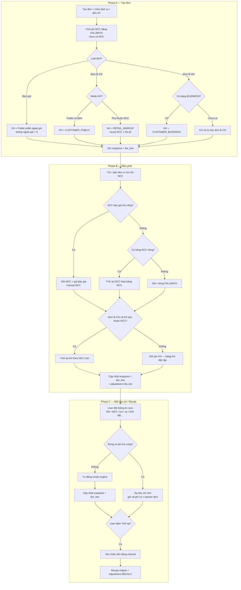
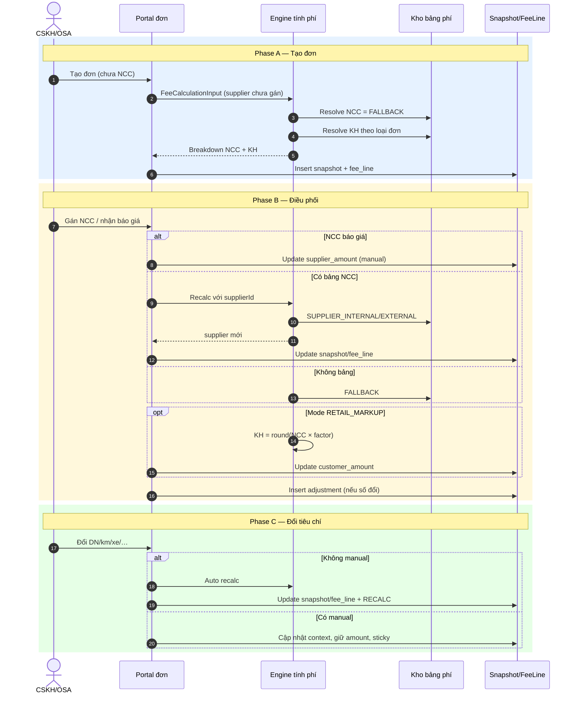

# BRD — Luồng tính phí trên đơn cứu hộ (chi tiết)

| Thuộc tính    | Giá trị                                                                                  |
| ------------- | ---------------------------------------------------------------------------------------- |
| Phiên bản     | 1.0                                                                                      |
| Ngày          | 2026-08-04                                                                               |
| BRD tổng quan | [BRD-Tong-quan-cau-hinh-va-tinh-phi-don.md](./BRD-Tong-quan-cau-hinh-va-tinh-phi-don.md) |
| Schema        | [fee-schema-redesign.md](./fee-schema-redesign.md)                                       |
| Mục tiêu      | Mô tả chi tiết tính phí NCC/KH từ tạo đơn → điều phối → đổi tiêu chí/recalc              |

---

## 1. Mục đích

Chuẩn hóa **một luồng nghiệp vụ tính phí trên đơn** theo 3 phase:

1. **Tạo đơn** (chưa có NCC)
2. **Điều phối / gán đơn vị cứu hộ**
3. **Đổi tiêu chí / tính lại phí**

Mỗi phase ghi rõ cách chọn bảng, khi nào recalc KH/NCC, và tác động dữ liệu runtime (`snapshot` / `fee_line` / `adjustment`).

---

## 2. Chart tổng quan

PlantUML: [order-fee-flow-overview.puml](./diagrams/order-fee-flow-overview.puml)

### Đọc chart ngắn

| Phase        | NCC                       | KH                                  |
| ------------ | ------------------------- | ----------------------------------- |
| Tạo đơn      | Fallback (chưa gán NCC)   | Theo loại đơn (gói / lẻ CN / lẻ DN) |
| Điều phối    | Bảng NCC hoặc giá báo giá | Chỉ recalc nếu lẻ CN phụ thuộc NCC  |
| Đổi tiêu chí | Recalc nếu không manual   | Cùng rule; sticky nếu đang manual   |

---

## 3. Mô tả luồng theo phase

### 3.1. Phase A — Tạo đơn (chưa có NCC)

#### A1. Phí NCC

- Đơn mới **chưa gán NCC** → chưa chọn được bảng `SUPPLIER_EXTERNAL` / `SUPPLIER_INTERNAL` theo supplier.
- Hệ thống tính **phí NCC base** theo bảng `SUPPLIER_EXTERNAL_FALLBACK` (hoặc fallback nội bộ tương đương khi cấu hình dùng chung).
- Snapshot ghi nhận bảng fallback + version ACTIVE tại thời điểm tính.
- `supplier_source` = `FALLBACK` (hoặc tương đương).

#### A2. Phí KH theo loại đơn

| Loại đơn                                   | Cách tính KH                                                                                                | `customer_fee_mode`                                                                   |
| ------------------------------------------ | ----------------------------------------------------------------------------------------------------------- | ------------------------------------------------------------------------------------- |
| **Đơn gói**                                | Phần trong gói không thu thêm; phần **ngoài gói** tính theo `CUSTOMER_PUBLIC`. Không ngoài gói → KH = **0** | `PACKAGE_PUBLIC`                                                                      |
| **Đơn lẻ (cá nhân)** — bảng Public cố định | Tính độc lập trên `CUSTOMER_PUBLIC`                                                                         | `RETAIL` / `PACKAGE_PUBLIC` tùy cấu hình sản phẩm; ưu tiên Public cố định khi có bảng |
| **Đơn lẻ (cá nhân)** — phụ thuộc NCC       | `round(supplier_amount × retail_markup_factor)`                                                             | `RETAIL_MARKUP`                                                                       |
| **Đơn lẻ (DN) có bảng riêng**              | `CUSTOMER_BUSINESS` khớp `enterprise_code`                                                                  | `BUSINESS`                                                                            |
| **Đơn lẻ (DN) chưa có bảng riêng**         | Xử lý **giống đơn lẻ cá nhân** (Public hoặc Markup)                                                         | `RETAIL` / `RETAIL_MARKUP`                                                            |

#### A3. Dữ liệu ghi lúc tạo

- Insert/update `rescue_order_fee_snapshot`
- Insert N × `rescue_order_fee_line` (mỗi dịch vụ trên đơn)
- Chưa có `adjustment` trừ khi user chỉnh tay ngay sau tạo

---

### 3.2. Phase B — Điều phối / tìm được đơn vị cứu hộ

#### B1. Phí NCC

| Tình huống                                                                           | Hành vi                                                                                                             |
| ------------------------------------------------------------------------------------ | ------------------------------------------------------------------------------------------------------------------- |
| NCC có bảng phí riêng (`SUPPLIER_INTERNAL` / `SUPPLIER_EXTERNAL` theo `supplier_id`) | **Tính lại** base theo bảng NCC ACTIVE + version mới nhất thỏa điều kiện                                            |
| NCC không có bảng riêng                                                              | Giữ fallback hoặc resolve `SUPPLIER_EXTERNAL_FALLBACK`                                                              |
| NCC **báo giá** (thoả thuận ngoài bảng)                                              | Ghi `supplier_amount` = giá báo giá; `is_supplier_manual = true`; `supplier_source = Bao_gia_NCC` (hoặc `Thủ công`) |

#### B2. Phí KH

| Loại đơn / mode             | Khi gán NCC                                                |
| --------------------------- | ---------------------------------------------------------- |
| Đơn gói                     | **Không** đổi KH chỉ vì gán NCC (vẫn Public ngoài gói / 0) |
| Đơn lẻ DN (`BUSINESS`)      | **Không** đổi KH chỉ vì gán NCC (bảng DN độc lập)          |
| Đơn lẻ CN — Public cố định  | **Không** đổi KH chỉ vì gán NCC                            |
| Đơn lẻ CN — `RETAIL_MARKUP` | **Tính lại KH** theo NCC mới × hệ số                       |

#### B3. Dữ liệu ghi lúc điều phối

- Cập nhật snapshot: `supplier_table_*`, `supplier_version`, context NCC
- Cập nhật `fee_line.supplier_*` (± `customer_*` nếu Markup)
- Nếu đổi số so với lần trước → `rescue_order_fee_adjustment` type `RECALC` hoặc `NCC_ASSIGN`

---

### 3.3. Phase C — Đổi tiêu chí / tính lại phí

Áp dụng rule đã chốt (OP-01 / BR-21 / BR-22):

| Sự kiện                                                                        | Không manual                                                                       | Có phí thủ công                                                       |
| ------------------------------------------------------------------------------ | ---------------------------------------------------------------------------------- | --------------------------------------------------------------------- |
| Đổi thông tin core (DN, NCC, km, xe, chỗ/tải, thời tiết, timeWindow, dịch vụ…) | **Tự động recalc** engine (NCC + KH theo mode)                                     | Áp tiêu chí mới, **giữ số tiền**, bật sticky / `feeCriteriaOutOfSync` |
| User bấm **Tính lại**                                                          | Recalc                                                                             | Recalc sau xác nhận ghi đè                                            |
| Admin đổi cấu hình bảng phí master                                             | Đơn đã snapshot **không tự đổi**; chỉ đơn mới / recalc tường minh dùng version mới | Giống cột trái khi user chủ động recalc                               |

**Thông tin core** tối thiểu (BR-ORD-20 / BR-20): doanh nghiệp, NCC/đơn vị cứu hộ, khoảng cách kéo, loại xe / số chỗ / trọng tải, thời tiết, `timeWindow`, đầu dịch vụ trên đơn.

---

## 4. Use case phát sinh & tác động dữ liệu

### 4.1. Bảng use case

| UC          | Tên                                     | Tiền điều kiện                              | Luồng chính                                  | Hậu điều kiện                               | Tác động dữ liệu                                                                                                               |
| ----------- | --------------------------------------- | ------------------------------------------- | -------------------------------------------- | ------------------------------------------- | ------------------------------------------------------------------------------------------------------------------------------ |
| **UC-T01**  | Tạo đơn gói (chưa NCC)                  | Đơn gói, có/không phần ngoài gói            | NCC = fallback; KH = Public ngoài gói hoặc 0 | Có phí khởi tạo                             | **snapshot:** supplier=FALLBACK, mode=`PACKAGE_PUBLIC`; **fee_line:** supplier từ fallback, customer từ Public/0               |
| **UC-T02a** | Tạo đơn lẻ CN — Public cố định          | Không DN / không Markup                     | NCC=fallback; KH=`CUSTOMER_PUBLIC`           | Phí KH độc lập NCC                          | **snapshot:** mode Public/RETAIL cố định; **fee_line:** customer từ Public                                                     |
| **UC-T02b** | Tạo đơn lẻ CN — Markup                  | Cấu hình phụ thuộc NCC                      | NCC=fallback; KH=`round(NCC×factor)`         | KH đổi khi NCC đổi sau này                  | **snapshot:** mode=`RETAIL_MARKUP`, lưu `retail_markup_factor`; **fee_line:** customer từ công thức markup                     |
| **UC-T03a** | Tạo đơn lẻ DN có bảng                   | Có `enterprise_code` + bảng BUSINESS ACTIVE | NCC=fallback; KH=`CUSTOMER_BUSINESS`         | KH theo DN                                  | **snapshot:** mode=`BUSINESS`, customer_table=DN; **fee_line:** customer từ DN; có thể tách KHCN/KHDN                          |
| **UC-T03b** | Tạo đơn lẻ DN chưa có bảng              | Có DN nhưng không match BUSINESS            | Xử lý như UC-T02a/b                          | Giống lẻ CN                                 | Như UC-T02 tương ứng                                                                                                           |
| **UC-D01**  | Gán NCC có bảng riêng                   | Đã tạo đơn; chọn NCC có fee table           | Recalc NCC theo bảng NCC                     | Snapshot NCC đổi version/bảng               | **snapshot:** cập nhật supplier_table/version; **fee_line:** cập nhật `supplier_amount`; **adjustment:** `NCC_ASSIGN`/`RECALC` |
| **UC-D02**  | Gán NCC không bảng                      | NCC không có EXTERNAL/INTERNAL riêng        | Giữ/resolve FALLBACK                         | NCC vẫn fallback                            | **snapshot:** supplier vẫn fallback (ghi `supplier_id` trên đơn); amount có thể không đổi                                      |
| **UC-D03**  | NCC báo giá thủ công                    | NCC gửi giá ngoài bảng                      | Ghi giá báo giá, cờ manual NCC               | Không auto đè khi đổi tiêu chí (sticky NCC) | **fee_line:** `is_supplier_manual=true`, source báo giá; **adjustment:** `MANUAL_EDIT`                                         |
| **UC-D04**  | Gán NCC + đơn Markup                    | Mode `RETAIL_MARKUP`                        | Sau recalc NCC → recalc KH                   | KH đổi theo NCC mới                         | **fee_line:** cập nhật cả supplier + customer; **adjustment:** `RECALC`                                                        |
| **UC-D05**  | Gán NCC + đơn gói / DN / Public cố định | Mode không phụ thuộc NCC                    | Chỉ recalc NCC                               | KH giữ nguyên                               | Chỉ `supplier_`* trên fee_line/snapshot                                                                                        |
| **UC-R01**  | Đổi tiêu chí — không manual             | Không cờ manual                             | Auto recalc NCC+KH theo mode                 | Phí đồng bộ tiêu chí                        | **snapshot:** `input_context_json` mới; **fee_line:** amounts mới; **adjustment:** `RECALC`                                    |
| **UC-R02**  | Đổi tiêu chí — đang manual              | Có manual KH và/hoặc NCC                    | Không auto recalc; sticky                    | Banner lệch                                 | **snapshot/context** có thể cập nhật tiêu chí; **fee_line amounts giữ**; flag `out_of_sync`; không bắt buộc adjustment amount  |
| **UC-R03**  | Recalc tường minh                       | User bấm Tính lại                           | Xác nhận nếu manual → engine                 | Đồng bộ lại; xóa sticky                     | **fee_line:** overwrite catalog lines (giữ `isCustom`); **adjustment:** `RECALC` before/after                                  |
| **UC-C01**  | Đổi cấu hình bảng phí ACTIVE            | Admin activate version mới                  | Đơn cũ giữ snapshot version cũ               | Đơn mới dùng version mới                    | **Không** update `rescue_order_fee_`* của đơn cũ; master: version cũ EXPIRED, mới ACTIVE                                       |

### 4.2. Ma trận tác động bảng runtime

| Sự kiện            | `rescue_order_fee_snapshot`             | `rescue_order_fee_line`             | `rescue_order_fee_adjustment` | `fee_table*` master     |
| ------------------ | --------------------------------------- | ----------------------------------- | ----------------------------- | ----------------------- |
| Tạo đơn            | Insert                                  | Insert N dòng                       | —                             | Chỉ đọc ACTIVE          |
| Gán NCC (bảng)     | Update supplier ref/version             | Update supplier (± customer Markup) | RECALC / NCC_ASSIGN           | Chỉ đọc                 |
| NCC báo giá        | Có thể giữ table ref + ghi note/context | Update supplier + manual flag       | MANUAL_EDIT                   | Không                   |
| Đổi tiêu chí auto  | Update context                          | Update amounts                      | RECALC                        | Chỉ đọc                 |
| Sticky             | Context có thể đổi                      | Amount giữ                          | Optional note                 | Không                   |
| Recalc nút         | Update full                             | Overwrite catalog                   | RECALC                        | Chỉ đọc                 |
| Đổi master version | Không đụng đơn cũ                       | Không                               | Không                         | Insert/activate version |

---

## 5. Rule bases (luồng đơn)

| ID        | Quy tắc                                                                                               | Tham chiếu   |
| --------- | ----------------------------------------------------------------------------------------------------- | ------------ |
| BR-ORD-01 | Khi tạo đơn chưa có NCC: phí NCC tính theo bảng **fallback**.                                         | Phase A      |
| BR-ORD-02 | Đơn gói: KH chỉ thu phần ngoài gói theo Public; không ngoài gói = 0.                                  | BR-15        |
| BR-ORD-03 | Đơn lẻ CN: KH = Public cố định **hoặc** `RETAIL_MARKUP` từ NCC × hệ số (theo cấu hình sản phẩm/bảng). | BR-14        |
| BR-ORD-04 | Đơn lẻ DN có bảng BUSINESS → dùng BUSINESS; không có → xử lý như lẻ CN.                               | BR-13        |
| BR-ORD-05 | Khi gán NCC: luôn đánh giá lại phí NCC (bảng NCC / fallback / báo giá).                               | Phase B      |
| BR-ORD-06 | Khi gán NCC: chỉ recalc KH nếu mode phụ thuộc NCC (`RETAIL_MARKUP`).                                  | Phase B      |
| BR-ORD-07 | Đổi tiêu chí không manual → auto recalc; có manual → không auto recalc (sticky).                      | BR-21, BR-22 |
| BR-ORD-08 | Recalc tường minh ghi đè dòng catalog; giữ dòng dịch vụ tùy chỉnh (`isCustom`).                       | BR-24        |
| BR-ORD-09 | Đổi cấu hình master không tự cập nhật đơn đã snapshot.                                                | BR-06        |
| BR-ORD-10 | Mọi đổi số tiền có ý nghĩa nghiệp vụ nên ghi `rescue_order_fee_adjustment` (before/after).            | Schema       |

---

## 6. Sequence chi tiết — tạo đơn & điều phối

PlantUML: [order-fee-flow-sequence.puml](./diagrams/order-fee-flow-sequence.puml)

---

## 7. Open points còn lại (không blocking luồng chính)

| #      | Chủ đề                                                                                            | Ghi chú                             |
| ------ | ------------------------------------------------------------------------------------------------- | ----------------------------------- |
| OP-F01 | Khi chưa NCC, fallback dùng `SUPPLIER_EXTERNAL_FALLBACK` hay thêm kind `UNASSIGNED`?              | Hiện chốt: dùng FALLBACK hiện có    |
| OP-F02 | Đơn lẻ CN chọn Public cố định vs Markup — cấu hình ở đâu (loại bảng / cờ đơn / tham số hệ thống)? | Cần PO gắn master config            |
| OP-F03 | NCC báo giá: có cho phép vừa giữ matched table vừa override amount không?                         | Đề xuất: có, + `is_supplier_manual` |

---

## 8. Tham chiếu

| Artifact                                                                                 | Vai trò                                                                 |
| ---------------------------------------------------------------------------------------- | ----------------------------------------------------------------------- |
| [BRD-Tong-quan-cau-hinh-va-tinh-phi-don.md](./BRD-Tong-quan-cau-hinh-va-tinh-phi-don.md) | Rule tổng, permission, OP đã chốt                                       |
| [fee-schema-redesign.md](./fee-schema-redesign.md)                                       | snapshot / fee_line / adjustment                                        |
| `rescueFeeMockData.ts`                                                                   | `resolveSupplierTable` / `resolveCustomerTable` / `calculateRescueFees` |

