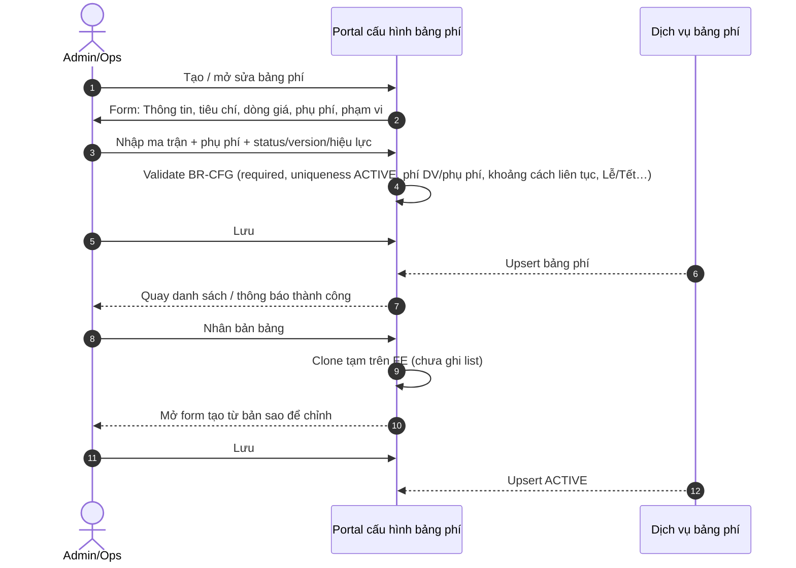
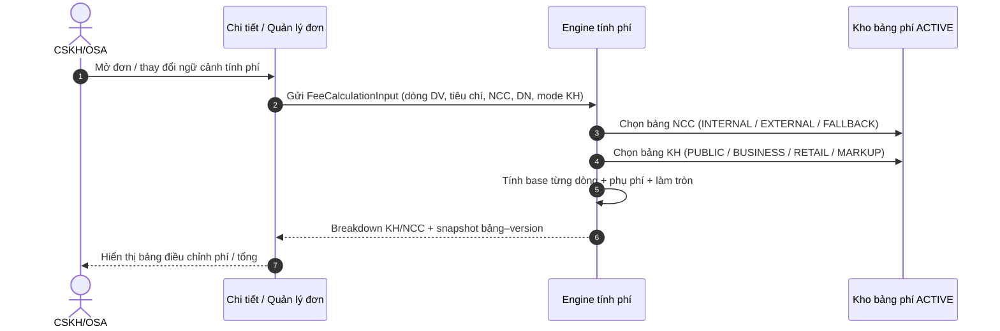
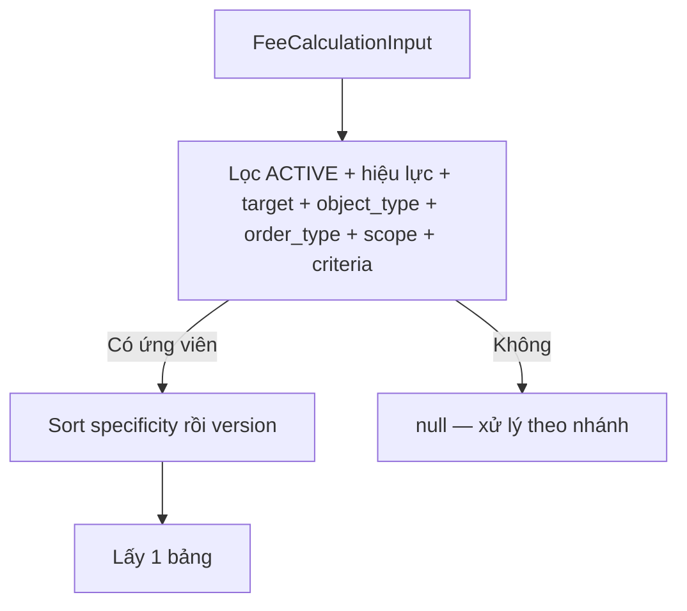
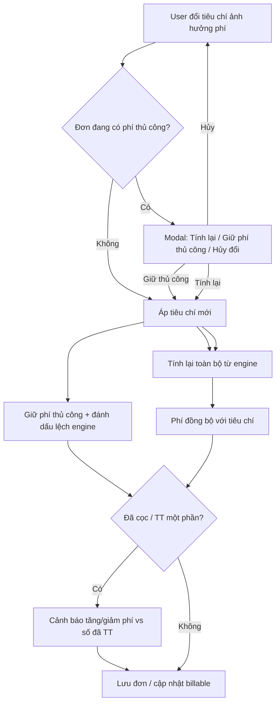
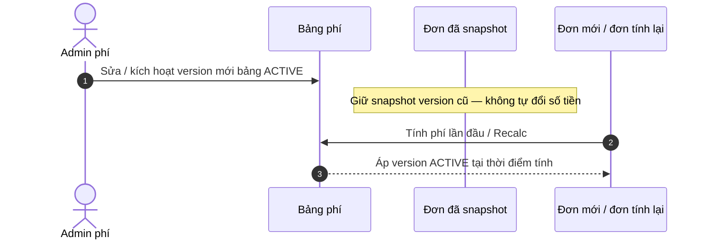

# BRD — Tổng quan cấu hình bảng phí và tính phí trên đơn cứu hộ

| Thuộc tính                        | Giá trị                                                                |
| --------------------------------- | ---------------------------------------------------------------------- |
| Phiên bản                         | 1.0                                                                    |
| Ngày                              | 2026-08-03                                                             |
| Phân tích UI ma trận              | [analysis-rescue-fee-matrix-ui.md](./analysis-rescue-fee-matrix-ui.md) |
| BRD UI ma trận (chi tiết màn lọc) | [BRD-UI-ma-tran-bang-phi.md](./BRD-UI-ma-tran-bang-phi.md)             |
| BRD luồng tính phí trên đơn       | [BRD-Luong-tinh-phi-tren-don.md](./BRD-Luong-tinh-phi-tren-don.md)     |
| Schema phí                        | [fee-schema-redesign.md](./fee-schema-redesign.md)                     |
| Map PTI DN                        | [fee-table-pti-enterprise.md](./fee-table-pti-enterprise.md)           |
| Thanh toán (sau khi có phí)       | `rsa-docs/docs/rescue_order_payment/BRD-Tong-quan-thanh-toan.md`       |
| Confluence                        | —                                                                      |
| Figma                             | —                                                                      |
| Preview                           | `/rescue-fee-config*`, `/details` (GuestOrderDetails)                  |

---

## 1. Mô tả nghiệp vụ

### 1.1. Mục đích

Cho phép hệ thống **cấu hình bảng phí độc lập cho KH và NCC**, **chọn bảng phù hợp và tính phí trên đơn cứu hộ**, đồng thời xử lý đúng khi **điều chỉnh đơn / chỉnh tay phí / đã thanh toán một phần**. Mục tiêu: số phí minh bạch, truy vết được bảng–version đã áp, và không phá vỡ luồng thanh toán.

### 1.2. Trong phạm vi (In scope)

- Vòng đời bảng phí: tạo, sửa, nhân bản, hiệu lực (status/version), xem chi tiết, lịch sử phiên bản.
- Tiêu chí ma trận, dòng giá, phụ phí có điều kiện.
- Chọn bảng phí (partner / customer) theo ngữ cảnh đơn.
- Engine tính phí dịch vụ + phụ phí + làm tròn + chế độ KH (Public / DN / Lẻ / Markup).
- Snapshot phí gắn đơn (bảng + version + số tiền đã tính).
- Màn **Quản lý / Chi tiết đơn** (Portal): hiển thị phí, đổi tiêu chí, tính lại, phí thủ công (sticky), cảnh báo khi đã cọc/TT một phần.
- Tương tác với `billable` / remain / refund sau khi phí đổi (tham chiếu BRD thanh toán).

### 1.3. Ngoài phạm vi (Out of scope)

- Chi tiết API Ecom / TGTT / QR sync (xem BRD thanh toán).
- Migration dual-write `price_policy*` → `fee_*` (xem schema redesign).
- Portal trạm (Station*) tính phí local chưa gắn engine mới — ghi Open point.
- Màn tạo đơn (CreateRescueOrder) chưa gắn engine — ghi Open point.
- VAT chi tiết trên từng price line (VAT thuộc lớp charge / xuất thu).

### 1.4. Hệ thống tham gia

| Hệ thống                                   | Vai trò                                       |
| ------------------------------------------ | --------------------------------------------- |
| Portal cứu hộ (CMS)                        | Cấu hình bảng phí; xem/sửa phí trên đơn       |
| Dịch vụ bảng phí / engine                  | Chọn bảng, tính phí, trả breakdown            |
| Master danh mục tiêu chí                   | Catalog tiêu chí / phụ phí                    |
| Đơn cứu hộ (`rescue_order_*`)              | Snapshot phí, dòng dịch vụ, charge            |
| Thanh toán (`rescue_order_payment` / Ecom) | Cọc, còn lại, hoàn theo `billable` / `remain` |

### 1.5. Khái niệm cốt lõi

| Khái niệm                   | Mô tả ngắn                                                              |
| --------------------------- | ----------------------------------------------------------------------- |
| Bảng phí Partner/NCC (`PARTNER_*`) | Giá chi trả / đối soát NCC                                              |
| Bảng phí KH (`CUSTOMER_*`)  | Giá thu / hiển thị với KH                                               |
| Dòng giá                    | Một mức giá theo tổ hợp tiêu chí AND + cách tính FIXED/PER_UNIT         |
| Phụ phí                     | FIXED (cộng tiền) hoặc COEFFICIENT (nhân hệ số), có điều kiện kích hoạt |
| Snapshot                    | Bản ghi bảng–version–số tiền đã áp trên đơn tại thời điểm tính          |
| Phí thủ công (manual)       | Số phí do người dùng chỉnh tay, có thể “dính” khi đổi tiêu chí          |
| Sticky fee                  | Giữ phí thủ công sau khi đổi tiêu chí; đánh dấu lệch với engine         |

---

## 2. Sequence flow and description

> **Chi tiết luồng tính phí trên đơn (tạo → điều phối → đổi tiêu chí):** [BRD-Luong-tinh-phi-tren-don.md](./BRD-Luong-tinh-phi-tren-don.md)

### 2.1. Cấu hình bảng phí (tạo / sửa / nhân bản)

#### Bảng mô tả

| Step | Step name                    | Actor     | Description                                                          |
| ---- | ---------------------------- | --------- | -------------------------------------------------------------------- |
| 1    | Mở form                      | Admin/Ops | Vào `/rescue-fee-config/create` hoặc `/edit/:id`                     |
| 2    | Khai báo chung               | Admin/Ops | Target KH/Partner, object_type, order_type, hiệu lực, làm tròn, stack phụ phí, markup KH lẻ |
| 3    | Khai báo tiêu chí & dòng giá | Admin/Ops | Các chiều ma trận + dòng giá theo dịch vụ                            |
| 4    | Phụ phí                      | Admin/Ops | Điều kiện + FIXED/COEFFICIENT                                        |
| 5    | Lưu                          | System    | Validate BR-CFG rồi upsert; mock không bắt buộc “duyệt publish” tách bước |
| 6    | Nhân bản                     | System    | Clone tạm FE, version/code gợi ý; Lưu mới ghi ACTIVE vào danh sách   |

**TO-BE schema (đề xuất vận hành):** version **ACTIVE bất biến**; sửa = tạo version mới rồi kích hoạt. Chi tiết DB: [fee-schema-redesign.md](./fee-schema-redesign.md).

---

### 2.2. Chọn bảng phí và tính phí khi tạo / nạp đơn

Mỗi đơn cứu hộ chọn **hai bảng độc lập**: bảng **NCC** (`target = PARTNER`) và bảng **KH** (`target = CUSTOMER`), rồi tính dòng giá + phụ phí trên từng bảng. Chi tiết thuật toán chọn bảng / map field / match dòng: [BRD-Luong-tinh-phi-tren-don.md §3](./BRD-Luong-tinh-phi-tren-don.md). Phase tạo đơn / điều phối: cùng file §4.

#### Bảng mô tả (tóm tắt)

| Step | Step name      | Actor  | Description                                                           |
| ---- | -------------- | ------ | --------------------------------------------------------------------- |
| 1    | Chuẩn bị input | System | Tập hợp dịch vụ trên đơn, km, thời tiết, DN, loại NCC, …              |
| 2    | Resolve NCC    | Engine | INTERNAL → `PARTNER_INTERNAL`; EXTERNAL → bảng NCC rồi fallback      |
| 3    | Resolve KH     | Engine | RETAIL / BUSINESS / PACKAGE_PUBLIC / RETAIL_MARKUP                    |
| 4    | Match dòng giá | Engine | Điều kiện AND; progressive kéo nếu có; cẩu theo khoảng `roadDistance` |
| 5    | Phụ phí        | Engine | Kích hoạt theo điều kiện; stack hệ số hoặc lấy max theo cấu hình      |
| 6    | Snapshot       | System | Lưu id/code/version bảng + số tiền + thời điểm tính                   |

#### Các bước xác định bảng phí (chi tiết)

##### Bước 0 — Thu thập ngữ cảnh đơn (`FeeCalculationInput`)

| Nhóm | Trường chính | Dùng để |
| ---- | ------------ | ------- |
| KH | `customerType` (`PACKAGE` / `RETAIL` / `RETAIL_BUSINESS`), `corporateCustomerId` | Nhánh chọn bảng KH / mode |
| NCC | `partnerType` (`INTERNAL` / `EXTERNAL`), `partnerId`, `partnerName` | Nhánh chọn bảng NCC |
| Thời điểm | `asOfDate` (mặc định ngày hiện tại) | Lọc hiệu lực `validFrom`–`validTo` |
| Tiêu chí match bảng | Các key trong `criteria` bảng (DN, NCC, …) | `tableMatchesContext` |
| Dòng dịch vụ | `lines[]` (loại DV, km, chỗ, tải, …) | **Sau** khi đã chọn bảng — match dòng giá / phụ phí |

> Chọn **bảng** chỉ dựa target/object_type/order_type/scope/criteria/hiệu lực. Match **dòng giá** diễn ra sau khi đã có bảng (không dùng để chọn bảng).

##### Bước 1 — Bộ lọc ứng viên chung (`selectPriceTable`)

Áp dụng giống nhau khi tìm 1 bảng theo `target` + danh sách `object_types`:

1. `target` khớp (`CUSTOMER` hoặc `PARTNER`).
2. `status = ACTIVE` (BR-05).
3. `asOfDate` nằm trong `[validFrom, validTo]`.
4. `object_type` ∈ danh sách `object_type` đang tìm (vd. chỉ `PARTNER_EXTERNAL`).
5. **Scope:** nếu bảng có `scope.corporateCustomerId` / `scope.partnerId` thì phải khớp context đơn; bảng không khai scope chiều đó → coi là không giới hạn chiều đó.
6. **Criteria bảng:** mọi tiêu chí nhóm AND phải khớp; nhóm OR (nếu có) ít nhất một khớp. Bảng không có criteria → luôn đạt bước này.
7. **Xếp hạng** (lấy **1** bảng đầu):
   - Specificity cao hơn thắng (`corporateCustomerId` / `partnerId` trên scope + số criteria).
   - Cùng specificity → `version` cao hơn.
   - **Không** dùng `priority` (deprecated — xem [BRD luồng đơn §3](./BRD-Luong-tinh-phi-tren-don.md) / BR-ORD-11).

Không còn ứng viên sau lọc → `null` (xử lý theo nhánh NCC/KH bên dưới — BR-12 / BR-13 / BR-14).

##### Bước 2 — Xác định bảng NCC (`resolvePartnerTable`)

| # | Điều kiện trên đơn | Hành vi chọn bảng | Kết quả nếu không có |
| - | ------------------ | ----------------- | -------------------- |
| 2.1 | **Chưa gán NCC** (Phase A tạo đơn) | Dùng `PARTNER_EXTERNAL` + `is_fallback` (ACTIVE, thường `isFallback = true`) | Lỗi nghiệp vụ — không bịa giá (BR-12) |
| 2.2 | `partnerType = INTERNAL` | `selectPriceTable` object_type `PARTNER_INTERNAL`; nếu null → lấy bảng INTERNAL ACTIVE mặc định | Lỗi nếu vẫn không có |
| 2.3 | `partnerType = EXTERNAL` + có `partnerId` | Ưu tiên `PARTNER_EXTERNAL` khớp `partnerId` | Sang 2.4 |
| 2.4 | EXTERNAL không có bảng riêng | `PARTNER_EXTERNAL` + `is_fallback` | Lỗi (BR-12) |
| 2.5 | NCC **báo giá thủ công** | **Không** đổi bảng bắt buộc; ghi đè `partner_amount` + cờ manual (vẫn có thể giữ ref bảng đã resolve để audit) | — |

##### Bước 3 — Xác định bảng KH + `customerFeeMode` (`resolveCustomerTable`)

Thứ tự đánh giá (một đơn chỉ ra **một** mode):

| # | Điều kiện | Bảng / mode | Ghi chú |
| - | --------- | ----------- | ------- |
| 3.1 | Đơn **gói** (`customerType = PACKAGE`) | `object_type=CUSTOMER_INDIVIDUAL` + `order_type` gói (Public) → mode `PACKAGE_PUBLIC` | Trong gói = 0; ngoài gói tính Public rồi trừ quyền lợi (BR-15) |
| 3.2 | Đơn lẻ **DN** (`RETAIL_BUSINESS` hoặc có `corporateCustomerId`) | `CUSTOMER_BUSINESS` khớp `corporateCustomerId` → mode `BUSINESS` | Không có bảng DN → xử lý như lẻ CN (3.3/3.4) theo [BRD luồng đơn](./BRD-Luong-tinh-phi-tren-don.md); BR-13 khi bắt buộc có bảng DN |
| 3.3 | Đơn lẻ CN + có bảng `CUSTOMER_INDIVIDUAL` ma trận (không markup-only) | Bảng CN → mode `RETAIL` | Tính độc lập trên bảng KH |
| 3.4 | Đơn lẻ CN + không có bảng CN ma trận / cấu hình phụ thuộc Partner | Không gắn bảng KH ma trận → mode `RETAIL_MARKUP` | `customer = round(NCC × retailMarkupFactor)` (BR-14) |
| 3.5 | Đơn lẻ CN + Public cố định (cấu hình sản phẩm) | `CUSTOMER_INDIVIDUAL` Public | KH không đổi khi chỉ gán NCC |

##### Bước 4 — Sau khi đã có bảng: tính số trên đơn (không chọn bảng nữa)

1. Với mỗi dòng dịch vụ: match `fee_price_line` / `serviceRules` theo điều kiện AND (xe, chỗ, tải, `distanceKm`, `roadDistance`, …).
2. Áp phụ phí bảng tương ứng (NCC và/hoặc KH).
3. Làm tròn theo `roundMode` bảng.
4. Ghi `ro_fee_snapshot` (id/code/**version** NCC & KH, mode, context) + `fee_line` (BR-17).

##### Bước 5 — Khi nào chạy lại bước 2–4

| Sự kiện | Resolve lại NCC? | Resolve lại KH? |
| ------- | ---------------- | --------------- |
| Tạo đơn (chưa NCC) | Fallback | Theo loại đơn (bước 3) |
| Gán / đổi NCC | Có (trừ báo giá manual sticky) | Chỉ nếu mode `RETAIL_MARKUP` |
| Đổi tiêu chí (DN, km, xe, …) không manual | Có | Có |
| Đổi tiêu chí khi đang manual | Không auto (sticky) — chỉ khi user **Tính lại** | Cùng rule |
| Đổi cấu hình master bảng phí | **Không** đụng đơn đã snapshot | Đơn mới / recalc tường minh mới lấy version ACTIVE mới |

---

### 2.3. Điều chỉnh đơn → tính lại phí (có / không phí thủ công)

#### Bảng mô tả

| Step | Step name       | Actor    | Description                                                                 |
| ---- | --------------- | -------- | --------------------------------------------------------------------------- |
| 1    | Đổi tiêu chí    | CSKH/OSA | DN, thời tiết, mức độ, km kéo, NCC/đơn vị cứu hộ, …                         |
| 2    | Kiểm tra manual | System   | Có dòng nguồn “Thủ công” / cờ manual KH hoặc NCC                            |
| 3a   | Không manual    | System   | Áp tiêu chí → **tính lại engine** (yêu cầu TO-BE; xem Open point OP-01)     |
| 3b   | Có manual       | User     | Chọn: tính lại hết / giữ sticky / hủy đổi tiêu chí                          |
| 4    | Sticky          | System   | Tiêu chí mới + phí cũ; banner “đang giữ phí thủ công”                       |
| 5    | Tính lại        | System   | Rebuild dòng catalog từ engine; **giữ** dòng dịch vụ tùy chỉnh (`isCustom`) |
| 6    | Thanh toán      | System   | Nếu đã TT một phần → cảnh báo tăng phí (trả thêm) / giảm phí (hoàn)         |

---

### 2.4. Đổi cấu hình bảng phí sau khi đơn đã tính

| Step | Step name                   | Actor  | Description                                                        |
| ---- | --------------------------- | ------ | ------------------------------------------------------------------ |
| 1    | Đổi cấu hình                | Admin  | Sửa bảng rồi Lưu (ACTIVE) hoặc kích hoạt version mới               |
| 2    | Đơn cũ                      | System | **Không** tự recalc khi bảng thay đổi; số phí theo snapshot đã lưu |
| 3    | Đơn mới / Recalc tường minh | System | Dùng bảng ACTIVE + version mới nhất thỏa điều kiện chọn bảng       |

---

### 2.5. Liên kết phí đơn ↔ thanh toán (tóm tắt)

Chi tiết đầy đủ: BRD thanh toán. Trong phạm vi phí:

| Tình huống                                 | Hành vi mong muốn                                                  |
| ------------------------------------------ | ------------------------------------------------------------------ |
| Tăng `billable` sau khi đã cọc/TT một phần | `remain` tăng; có thể mở lại yêu cầu thanh toán phần còn lại       |
| Giảm `billable` dưới số đã TT              | Phát sinh / tăng `refund_amount` (hoàn thủ công theo quy trình TT) |
| Đổi số tiền cọc khi DEPOSIT đã SUCCESS     | **Không cho** (422 / chặn UI) — theo BRD thanh toán                |
| Đổi phí khi còn QR PENDING lệch `remain`   | Expire QR cũ → tạo QR mới theo `remain`                            |

---

## 3. Permission

| Vai trò         | Cấu hình bảng phí                                     | Xem phí trên đơn                     | Sửa phí / hệ số trên đơn                           | Tính lại engine | Đổi tiêu chí đơn ảnh hưởng phí |
| --------------- | ----------------------------------------------------- | ------------------------------------ | -------------------------------------------------- | --------------- | ------------------------------ |
| **ADMIN**       | CRUD + nhân bản + kích hoạt                           | Có                                   | Có                                                 | Có              | Có                             |
| **OSA**         | Xem (nếu được cấp); không sửa master trừ khi ủy quyền | Có                                   | Có (điều chỉnh nghiệp vụ)                          | Có              | Có                             |
| **CSKH**        | Không                                                 | Có                                   | Hạn chế (theo RBAC; thường xem + cập nhật dịch vụ) | Theo RBAC       | Có trong phạm vi cập nhật đơn  |
| **STATION**     | Không                                                 | Xem đơn trạm                         | Điều chỉnh local hiện tại — **chưa** engine mới    | —               | Theo portal trạm               |
| **DRIVER / KH** | Không                                                 | Không / chỉ số phải trả (nếu có app) | Không                                              | Không           | Không                          |

**Row-level:** bảng phí BUSINESS theo `corporate_customer_id`; bảng EXTERNAL theo `partnerId`. Đơn: theo vùng / đội / đơn được gán.

---

## 4. Screen Description

### 4.1. Luồng màn hình

| #   | Tên màn                                      | Điều kiện vào                | Hành động chính                                                   |
| --- | -------------------------------------------- | ---------------------------- | ----------------------------------------------------------------- |
| 1   | Danh sách cấu hình bảng phí                  | Menu cấu hình phí            | Lọc, mở chi tiết, tạo, nhân bản                                   |
| 2   | Tạo / Sửa bảng phí                           | Từ danh sách                 | Tab thông tin, dòng giá, phụ phí, phạm vi; Lưu                    |
| 3   | Chi tiết bảng phí                            | Từ danh sách                 | Xem ma trận + lọc; lịch sử version; nhân bản; sang sửa            |
| 4   | Danh mục tiêu chí                            | Menu tiêu chí                | CRUD catalog tiêu chí                                             |
| 5   | Chi tiết yêu cầu cứu hộ (Quản lý đơn)        | Từ danh sách đơn             | Xem bảng phí áp dụng, điều chỉnh phí, đổi tiêu chí, tính lại, lưu |
| 6   | Modal bảng phí đã áp                         | Từ Chi tiết đơn              | Xem snapshot; link sang chi tiết bảng phí                         |
| 7   | Modal cảnh báo phí thủ công                  | Đổi tiêu chí khi đang manual | Tính lại / Giữ / Hủy                                              |
| 8   | Modal cảnh báo đổi phí KH khi đã TT một phần | Lưu đơn phí đổi              | Xác nhận tiếp tục / hủy                                           |

### 4.2. Chi tiết từng màn

#### Danh sách cấu hình bảng phí

| Thành phần | Mô tả                               |
| ---------- | ----------------------------------- |
| Bộ lọc     | Target, object_type, order_type, status, mã/tên        |
| Hàng bảng  | Code, tên, version, status, phạm vi |
| Thao tác   | Xem, sửa, nhân bản                  |

#### Tạo / Sửa bảng phí

| Thành phần                 | Mô tả                                                                   |
| -------------------------- | ----------------------------------------------------------------------- |
| Tab thông tin & tham số    | Header, hiệu lực, làm tròn, stack phụ phí, markup                       |
| Tab dòng giá theo tiêu chí | Ma trận theo đầu DV; nút tiêu chí bổ sung dạng icon+badge; lọc cấu hình |
| Tab phụ phí                | Rule phụ phí có điều kiện                                               |
| Lưu                        | Validate BR-CFG rồi upsert                                              |

Chi tiết lọc ma trận xem/chi tiết: [BRD-UI-ma-tran-bang-phi.md](./BRD-UI-ma-tran-bang-phi.md).

#### Chi tiết yêu cầu cứu hộ — khối phí

| Thành phần             | Mô tả                                                 |
| ---------------------- | ----------------------------------------------------- |
| Strip bảng phí áp dụng | Tên/code/version bảng NCC & KH; mở modal chi tiết     |
| Bảng điều chỉnh        | Dòng dịch vụ: giá cố định, hệ số, thành tiền NCC / KH |
| Tổng                   | Tổng NCC, tổng KH, chênh lệch / bảo lãnh (nếu có)     |
| Banner sticky          | Hiện khi đang giữ phí thủ công lệch tiêu chí          |
| Nút tính lại           | Gọi engine; cảnh báo nếu đang manual                  |
| Lưu đơn                | Đồng bộ `billable`; cảnh báo nếu đã TT một phần       |

### 4.3. Màn phụ / Dialog / Toast

| Màn                           | Mục đích                                              |
| ----------------------------- | ----------------------------------------------------- |
| AppliedFeeTablesModal         | Xem snapshot bảng đã chọn                             |
| ManualFeeRecalcWarningModal   | Chọn xử lý khi đổi tiêu chí / recalc với phí thủ công |
| CustomerFeeChangeWarningModal | Cảnh báo tăng/giảm phí so với số đã TT / baseline     |

---

## 5. Use case

| UC    | Tên use case                            | Nhóm         | Actor          | Tiền điều kiện                | Màn hình & luồng                        | Hậu điều kiện                                        | Tác động dữ liệu                                | Quy tắc           |
| ----- | --------------------------------------- | ------------ | -------------- | ----------------------------- | --------------------------------------- | ---------------------------------------------------- | ----------------------------------------------- | ----------------- |
| UC-01 | Tạo bảng phí mới                        | Cấu hình     | Admin          | Có quyền cấu hình             | Form tạo → Lưu                          | Bảng xuất hiện trong danh sách                       | Insert `fee_table` (+ version/rules)            | BR-01, BR-02, BR-CFG-01..05 |
| UC-02 | Sửa bảng phí                            | Cấu hình     | Admin          | Bảng tồn tại, được phép sửa   | Form sửa → Lưu                          | Cấu hình cập nhật, status ACTIVE                     | Update rules/version theo chính sách versioning | BR-03, BR-CFG-01..05 |
| UC-03 | Nhân bản bảng phí                       | Cấu hình     | Admin          | Bảng nguồn tồn tại            | List/Detail → Nhân bản → form tạm FE    | Chưa có trên list đến khi Lưu → ACTIVE               | Deep-copy rules trên FE; Lưu thì insert          | BR-04             |
| UC-04 | Kích hoạt / hết hiệu lực                | Cấu hình     | Admin          | Version hợp lệ                | Form hoặc màn duyệt (TO-BE)             | Chỉ version ACTIVE được chọn cho đơn mới             | Đổi status; ACTIVE bất biến (TO-BE)             | BR-03, BR-05      |
| UC-05 | Xem / lọc ma trận trên Chi tiết bảng    | Cấu hình     | CSKH/Ops/Admin | Bảng có dòng giá              | Chi tiết bảng phí                       | Tìm đúng dòng theo DV/xe/chỗ/tải                     | Không ghi DB                                    | BR-UI (BRD riêng) |
| UC-06 | Tính phí lần đầu trên đơn               | Đơn          | System/CSKH    | Đơn có dịch vụ + ngữ cảnh     | Chi tiết đơn / tạo đơn (khi gắn engine) | Có breakdown + snapshot                              | Ghi snapshot + dòng phí                         | BR-10–BR-18       |
| UC-07 | Đổi tiêu chí đơn (không phí thủ công)   | Đơn          | CSKH/OSA       | Đơn đang mở sửa               | Chi tiết đơn                            | Phí tính lại theo tiêu chí mới                       | Cập nhật snapshot/số tiền                       | BR-20, BR-21      |
| UC-08 | Đổi tiêu chí khi đang phí thủ công      | Đơn          | CSKH/OSA       | Có cờ manual                  | Modal cảnh báo                          | Theo lựa chọn: recalc / sticky / hủy                 | Cập nhật tiêu chí ± phí ± flag lệch             | BR-22, BR-23      |
| UC-09 | Giữ sticky rồi tính lại sau             | Đơn          | CSKH/OSA       | `feeCriteriaOutOfSync`        | Banner + nút tính lại                   | Phí đồng bộ engine; xóa cờ lệch                      | Overwrite dòng catalog; giữ custom              | BR-23, BR-24      |
| UC-10 | Chỉnh tay giá / hệ số một dòng          | Đơn          | OSA/CSKH       | Chế độ cập nhật phí           | Bảng điều chỉnh                         | Dòng đánh dấu thủ công                               | Cập nhật amount + manual flag                   | BR-25             |
| UC-11 | Thêm dịch vụ tùy chỉnh trên đơn         | Đơn          | OSA            | Đang sửa đơn                  | Thêm dòng custom                        | Dòng không bị xóa khi recalc engine                  | Insert dòng `isCustom`                          | BR-24             |
| UC-12 | Đổi bảng phí master sau khi đơn đã tính | Cấu hình→Đơn | Admin          | Đơn đã có snapshot            | Sửa bảng ACTIVE                         | Đơn cũ không đổi số; đơn mới/recalc dùng version mới | Version mới ACTIVE                              | BR-05, BR-06      |
| UC-13 | Lưu đơn khi phí tăng sau đã cọc         | Đơn+TT       | OSA            | Đã TT một phần                | Modal cảnh báo                          | `billable`↑, `remain`↑                               | Cập nhật charge; có thể PENDING FINAL           | BR-30, BR-31      |
| UC-14 | Lưu đơn khi phí giảm dưới đã TT         | Đơn+TT       | OSA            | Đã TT > billable mới          | Modal cảnh báo                          | `refund_amount` tăng                                 | Cập nhật charge                                 | BR-30, BR-32      |
| UC-15 | Thiếu bảng NCC / thiếu fallback         | Đơn          | System         | EXTERNAL không có bảng        | Tính phí                                | Báo lỗi rõ; không tạo số ảo                          | Không ghi snapshot thành công                   | BR-12             |
| UC-16 | KH DN thiếu bảng BUSINESS               | Đơn          | System         | Có `corporateCustomerId`           | Tính phí                                | Báo lỗi thiếu bảng DN                                | Không ghi snapshot thành công                   | BR-13             |
| UC-17 | KH lẻ không có bảng RETAIL              | Đơn          | System         | Mode RETAIL                   | Tính phí                                | `RETAIL_MARKUP` từ hệ số bảng NCC                    | Snapshot mode MARKUP                            | BR-14             |
| UC-18 | Đơn gói / Public trừ quyền lợi gói      | Đơn          | System         | Có `packageBenefitAmount`     | Tính phí                                | Trừ quyền lợi theo thứ tự dòng                       | Amount KH sau trừ gói                           | BR-15             |

---

## 6. Rule bases

### 6.1. Quy tắc cấu hình

| ID    | Quy tắc                                                                                                                                                       |
| ----- | ------------------------------------------------------------------------------------------------------------------------------------------------------------- |
| BR-01 | Bảng phí tách `target = CUSTOMER | PARTNER`; không trộn policy KH/NCC trên cùng bản ghi như model `price_policy` cũ.                                         |
| BR-02 | Một bảng chứa nhiều dịch vụ / nhiều dòng giá; điều kiện trên cùng dòng = **AND**.                                                                             |
| BR-03 | (TO-BE) Version **ACTIVE** không sửa nội dung dòng giá; chỉnh sửa tạo version mới rồi kích hoạt. Preview mock có thể cho sửa trực tiếp — cần chốt triển khai. |
| BR-04 | Nhân bản chỉ **sao chép tạm trên FE** (không ghi danh sách); tăng gợi ý version/code; user chỉnh rồi **Lưu → ACTIVE**. Không có trạng thái nháp (DRAFT). |
| BR-05 | Chỉ bảng `status = ACTIVE` và còn hiệu lực theo ngày được chọn khi tính phí.                                                                                  |
| BR-06 | Đổi cấu hình bảng **không** tự cập nhật số tiền các đơn đã có snapshot.                                                                                       |
| BR-07 | Kéo xe theo `distanceKm`: nếu cùng tổ hợp có **cả FIXED và PER_UNIT** → chọn **FIXED gần nhất** (`from` lớn nhất với `km >= from`), cộng giá FIXED đó + các bậc PER_UNIT có `from >= to` của FIXED đó; **bỏ qua** mọi bậc trước FIXED gần nhất. Chỉ FIXED → lấy FIXED gần nhất. Chỉ PER_UNIT → cộng dồn đơn vị từng bậc. |
| BR-08 | Cẩu: bậc theo `roadDistance` (mét); không dùng progressive kiểu kéo; tư thế `cranePosture` chỉ bậc >150m khi cấu hình.                                        |
| BR-09 | Phụ phí COEFFICIENT: stack theo `stackSurcharges` (nhân các hệ số) hoặc lấy hệ số lớn nhất; có thể có `exclusiveGroup` và `capAmount`.                        |
| BR-CFG-01 | Khi lưu (luôn `ACTIVE`): 1 `corporateCustomerId` chỉ 1 bảng ACTIVE; 1 `partnerId` chỉ 1 bảng ACTIVE; bảng không gắn DN/NCC tối đa 1 ACTIVE theo `(target, object_type, order_type)`. Bản sao nhân bản chỉ tạm trên FE cho đến khi Lưu. |
| BR-CFG-02 | Lưu bắt buộc: `code`, `name`, `validFrom`; `validFrom ≤ validTo` nếu có Đến; `CUSTOMER_BUSINESS` → `corporateCustomerId`; `PARTNER_EXTERNAL` → `partnerId`. Khai báo `includesVat` (đã/chưa bao gồm VAT) trên tham số bảng. |
| BR-CFG-03 | Hai chế độ **loại trừ nhau** trên bảng `CUSTOMER_INDIVIDUAL` (lẻ): (A) **chỉ hệ số** (`retailMarkupFactor > 0`) — không có dòng giá / phụ phí; (B) **ma trận đầy đủ** — bắt buộc dòng giá + phụ phí như bảng thường, `retailMarkupFactor = 0`. Các `object_type` khác không dùng hệ số KH lẻ. |
| BR-CFG-04 | Trong cùng tổ hợp tiêu chí (AND, cùng dịch vụ), các khoảng `distanceKm` / `roadDistance` BETWEEN phải liên tục: chạm biên OK (`[0,10]`+`[10,9999]`); cấm gap và overlap nội. |
| BR-CFG-05 | Phụ phí thời gian bắt buộc đủ Từ–Đến; phụ phí Lễ/Tết bắt buộc ≥ 1 ngày `holidayDates`. Tiêu chí ma trận kiểu LIST phải có `allowedValues`. |

### 6.2. Quy tắc chọn bảng & tính phí

| ID    | Quy tắc                                                                                                                                                         |
| ----- | --------------------------------------------------------------------------------------------------------------------------------------------------------------- |
| BR-10 | Chọn bảng: lọc ACTIVE + hiệu lực + khớp scope + khớp criteria bảng → sắp xếp **specificity → version** → lấy 1. **Không** dùng `priority` (deprecated). Chi tiết: [BRD-Luong-tinh-phi-tren-don.md §3](./BRD-Luong-tinh-phi-tren-don.md). |
| BR-11 | NCC INTERNAL dùng `PARTNER_INTERNAL`; EXTERNAL ưu tiên bảng theo `partnerId`, không có thì `PARTNER_EXTERNAL` + `is_fallback`.                                      |
| BR-12 | Không tìm được bảng NCC phù hợp (kể cả fallback) → **lỗi nghiệp vụ**, không bịa giá.                                                                            |
| BR-13 | Mode BUSINESS bắt buộc có bảng `CUSTOMER_BUSINESS` khớp `corporateCustomerId`.                                                                                       |
| BR-14 | Mode RETAIL: có bảng RETAIL thì tính độc lập trên bảng KH; không có thì `RETAIL_MARKUP` = round(NCC × `retailMarkupFactor`).                                    |
| BR-15 | Mode PACKAGE_PUBLIC: tính theo Public rồi trừ `packageBenefitAmount` theo thứ tự dòng.                                                                          |
| BR-16 | Làm tròn theo `roundMode` bảng (mặc định đề xuất `NEAREST_1000`).                                                                                               |
| BR-19 | `includesVat` trên bảng phí là cờ khai báo mức giá đã/chưa gồm VAT; engine mock hiện **không** tự tách/cộng VAT khi tính — dùng để hiển thị / đối soát.       |
| BR-17 | Snapshot đơn lưu tối thiểu: id/code/name/version bảng NCC & KH, `customerFeeMode`, markup (nếu có), thời điểm tính, breakdown số tiền — **không** dump cả bảng. |
| BR-18 | Margin = phí KH − phí NCC (sau khi đã áp mode tương ứng).                                                                                                       |

### 6.3. Quy tắc trên đơn (điều chỉnh / manual / sticky)

| ID    | Quy tắc                                                                                                                                                                                                                   |
| ----- | ------------------------------------------------------------------------------------------------------------------------------------------------------------------------------------------------------------------------- |
| BR-20 | Các thay đổi sau **bắt buộc đánh giá lại phí**: doanh nghiệp, thời tiết, mức độ sự cố, khoảng cách kéo, NCC / đơn vị cứu hộ, loại/đầu dịch vụ trên đơn, số chỗ / trọng tải / loại xe khách (khi đã đưa vào input engine). |
| BR-21 | (TO-BE) Đổi tiêu chí khi **không** có phí thủ công → hệ thống **tự tính lại** và cập nhật UI + snapshot draft trước khi lưu.                                                                                              |
| BR-22 | Đổi tiêu chí khi **có** phí thủ công → bắt buộc modal: Tính lại toàn bộ / Giữ phí thủ công / Hủy đổi tiêu chí.                                                                                                            |
| BR-23 | Giữ phí thủ công → áp tiêu chí mới, giữ số tiền, bật cờ lệch (`feeCriteriaOutOfSync`); chỉ xóa cờ khi user tính lại hoặc chỉnh lại cho khớp.                                                                              |
| BR-24 | Tính lại engine: ghi đè dòng catalog; **giữ** dòng dịch vụ tùy chỉnh (`isCustom`).                                                                                                                                        |
| BR-25 | Chỉnh tay giá cố định / hệ số / tái phân bổ tổng → đánh dấu manual tương ứng (KH và/hoặc NCC).                                                                                                                            |
| BR-26 | Nguồn hiển thị “Thủ công” khi dòng/đơn đang override.                                                                                                                                                                     |

### 6.4. Quy tắc phí ↔ thanh toán

| ID    | Quy tắc                                                                                                            |
| ----- | ------------------------------------------------------------------------------------------------------------------ |
| BR-30 | `billable_total_amount` **không đóng băng** sau khi tính phí; OSA có thể điều chỉnh theo quy trình đơn + cảnh báo. |
| BR-31 | Tăng phí khi đã TT một phần → tăng số còn phải trả; cảnh báo trước khi lưu.                                        |
| BR-32 | Giảm phí dưới số đã TT → ghi nhận hoàn (`refund_amount`); cảnh báo trước khi lưu.                                  |
| BR-33 | Không đổi số tiền **cọc** khi giao dịch cọc đã SUCCESS.                                                            |
| BR-34 | Không nhầm thao tác chỉnh tay phí trên đơn với cấu hình master bảng phí; hai lớp tách biệt.                        |

### 6.5. Ánh xạ Rule → UC

| UC               | Rules chính  |
| ---------------- | ------------ |
| UC-01..04        | BR-01–BR-05, BR-CFG-01..05 |
| UC-06, UC-15..18 | BR-10–BR-18  |
| UC-07..11        | BR-20–BR-26  |
| UC-12            | BR-05, BR-06 |
| UC-13, UC-14     | BR-30–BR-34  |

---

## Phụ lục A — Ma trận case nghiệp vụ (tự bổ sung)

| #   | Case                                                 | Kết quả mong muốn                                                |
| --- | ---------------------------------------------------- | ---------------------------------------------------------------- |
| C1  | Đơn kéo 15 km, bảng PTI FIXED `[0,10]` + PER_UNIT `[10,9999]` | FIXED gần nhất = `[0,10]`; + PER_UNIT ×5 (vd. 600k + 100k) |
| C1b | Đơn kéo 70 km, xen kẽ FIXED/PER_UNIT `[0,10]` FIXED · `[10,20]` PER · `[20,50]` FIXED · `[50,9999]` PER | FIXED gần nhất = `[20,50]` 200k; bỏ 0–20; + PER `[50,9999]` ×20 km |
| C2  | Đơn cẩu khoảng 7m so mặt đất                         | Match bậc `roadDistance` tương ứng, không cộng dồn kiểu kéo      |
| C3  | Đổi từ xe chở người 5 chỗ → xe chở hàng 2.5 tấn      | Recalc theo `vehicleType` + `load_capacity`                      |
| C4  | Đổi NCC INTERNAL → EXTERNAL không có bảng riêng      | Dùng fallback EXTERNAL; nếu không có fallback → lỗi              |
| C5  | Gắn mã DN PTI                                        | Chọn `CUSTOMER_BUSINESS` PTI; không lẫn Public                   |
| C6  | KH lẻ không cấu hình RETAIL                          | Markup từ hệ số bảng NCC                                         |
| C7  | Đổi km khi đang sticky manual                        | Modal; nếu giữ sticky thì km mới nhưng tiền cũ + banner lệch     |
| C8  | Recalc sau sticky                                    | Tiền theo engine; custom line giữ nguyên                         |
| C9  | Admin tăng giá bảng ACTIVE sau khi đơn A đã snapshot | Đơn A giữ số cũ; đơn B mới lấy giá mới                           |
| C10 | OSA giảm phí sau khi KH đã cọc                       | Cảnh báo hoàn; cập nhật refund                                   |
| C11 | OSA tăng phí sau khi còn QR PENDING                  | Remain tăng; QR cũ expire / QR mới theo BRD TT                   |
| C12 | Đơn hủy                                              | Không tính SLA/phí thu mới; xử lý hoàn theo TT nếu đã SUCCESS    |
| C13 | Nhiều phụ phí cùng exclusiveGroup                    | Chỉ một rule trong nhóm được áp                                  |
| C14 | stackSurcharges = false                              | Lấy hệ số lớn nhất thay vì nhân dồn                              |
| C15 | Thêm dịch vụ “khác” trên đơn rồi recalc              | Dòng custom không bị xóa                                         |

---

## Phụ lục B — Open points (cần BA/PO/BE chốt)

| #     | Chủ đề                                            | Hiện trạng preview / docs                  | Đề xuất                              | Cần chốt           |
| ----- | ------------------------------------------------- | ------------------------------------------ | ------------------------------------ | ------------------ |
| OP-01 | Đổi tiêu chí **không** manual có tự recalc không? | Preview có thể chỉ đổi tiêu chí, phí stale | **Bắt buộc tự recalc** (BR-21)       | PO                 |
| OP-02 | Đưa ghế / tải / loại xe từ form đơn vào engine    | Chưa map đủ vào input                      | Bắt buộc map để match PTI            | BA/Dev             |
| OP-03 | `isNight` hardcoded trên preview                  | Hardcode true                              | Lấy từ giờ yêu cầu / timeWindow thực | Dev                |
| OP-04 | Version ACTIVE bất biến                           | Mock cho sửa trực tiếp                     | Theo schema redesign                 | PO/DBA             |
| OP-05 | CreateRescueOrder / Station gắn engine            | Chưa                                       | Phase 2 gắn cùng engine              | PO                 |
| OP-06 | Filter Form cấu hình vs Chi tiết bảng             | Khác bộ lọc                                | Đồng bộ hoặc chấp nhận khác mục đích | BA (đã nêu BRD UI) |
| OP-07 | `rescueVehicleType` trên line PTI                 | Catalog có, line có thể không gắn          | Ẩn filter hoặc gắn line khi cần      | BA                 |
| OP-08 | Biên BETWEEN đóng/mở vs engine BE                 | Preview `>= from && <= to`                 | Khớp BE production                   | BE                 |
| OP-09 | Dual-run `price_policy` vs `fee_*`                | Schema TBD                                 | Kế hoạch cutovero                    | PO/DBA             |
| OP-10 | Bỏ `priority` khỏi engine mock + schema theo BR-10 / BR-ORD-11 | Docs + mock đã chốt specificity → version; `fee_table_version` không còn `priority`/`status` | Migration DB + dual-write cleanup | Dev/DBA |

---

## Phụ lục C — Tham chiếu artifact

| Artifact                                                     | Vai trò                                   |
| ------------------------------------------------------------ | ----------------------------------------- |
| `rsa-design/data/rescueFeeMockData.ts`                       | Engine mock: select / resolve / calculate |
| `rsa-design/pages/GuestOrderDetails.tsx`                     | UI đơn: recalc, sticky, cảnh báo TT       |
| `rsa-design/pages/RescueFeeForm.tsx`                         | Cấu hình                                  |
| `rsa-design/pages/RescueFeeDetail.tsx`                       | Xem ma trận + lọc                         |
| `rsa-design/shared/ManualFeeRecalcWarningModal.tsx`          | Modal manual                              |
| `rsa-design/shared/CustomerFeeChangeWarningModal.tsx`        | Modal đổi phí khi đã TT                   |
| [fee-table-pti-enterprise.md](./fee-table-pti-enterprise.md) | Rule giá PTI                              |
| [fee-schema-redesign.md](./fee-schema-redesign.md)           | Snapshot & version DB                     |
| [BRD-Luong-tinh-phi-tren-don.md](./BRD-Luong-tinh-phi-tren-don.md) | Phase đơn + **§3 chọn bảng / match dòng** |
| BRD thanh toán (`rsa-docs/...`)                              | remain / refund / QR khi đổi billable     |

