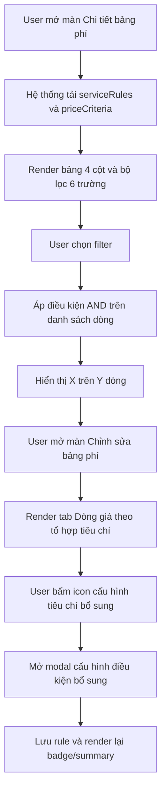

# BRD — UI ma trận bảng phí (xem & cấu hình)

**Phiên bản:** 1.0  
**Ngày:** 2026-08-03  
**Đối tượng:** BA, PO, Dev, QA, CSKH/Ops  
**Màn hình tham chiếu:** Portal Cứu hộ `rescue-fee-config` (Chi tiết bảng phí, Chỉnh sửa bảng phí)  
**Tài liệu nguồn:** [analysis-rescue-fee-matrix-ui.md](./analysis-rescue-fee-matrix-ui.md), [fee-table-pti-enterprise.md](./fee-table-pti-enterprise.md)  
**BRD tổng quan (cấu hình → đơn → tính lại → TT):** [BRD-Tong-quan-cau-hinh-va-tinh-phi-don.md](./BRD-Tong-quan-cau-hinh-va-tinh-phi-don.md)

---

## 1. Mô tả nghiệp vụ

### 1.1 Mục tiêu

Chuẩn hóa trải nghiệm xem và lọc ma trận dòng giá để người dùng vận hành có thể:

- Xem nhanh các dòng giá theo tổ hợp tiêu chí.
- Lọc chính xác theo loại dịch vụ và đặc trưng xe.
- Cấu hình tiêu chí bổ sung trên từng dòng mà không bị UI chiếm diện tích.

### 1.2 In scope

- Màn **Chi tiết bảng phí**:
  - Bảng ma trận chỉ hiển thị 4 cột chính.
  - Bộ lọc ma trận theo 6 trường nghiệp vụ.
- Màn **Chỉnh sửa bảng phí** (tab Dòng giá theo tổ hợp tiêu chí):
  - Nút cấu hình tiêu chí bổ sung dạng icon + badge.
  - Bộ lọc hỗ trợ thao tác nhanh khi cấu hình nhiều dòng.

### 1.3 Out of scope

- Logic tính phí nghiệp vụ (`FIXED`, `PER_UNIT`, công thức cộng dồn, surcharge).
- Thiết kế lại schema dữ liệu `fee_*`.
- Seed dữ liệu PTI.

### 1.4 Hệ thống tham gia

| Hệ thống | Vai trò |
|---|---|
| Portal cứu hộ | Hiển thị và thao tác UI |
| Dịch vụ bảng phí | Cung cấp dữ liệu `serviceRules`, `priceCriteria` |
| Danh mục tiêu chí | Cấp allowed values cho một số filter |

---

## 2. Sequence flow and description

PlantUML: [fee-matrix-ui-flow.puml](./diagrams/fee-matrix-ui-flow.puml)

| Step | Step name | Actor | Description |
|---|---|---|---|
| 1 | Mở màn Chi tiết | CSKH/Ops | Vào Chi tiết bảng phí từ danh sách bảng phí |
| 2 | Nạp dữ liệu ma trận | System | Nạp danh sách dòng giá và tiêu chí |
| 3 | Hiển thị lưới dữ liệu | System | Render 4 cột: Dịch vụ, Tổ hợp tiêu chí, Cách tính, Mức giá |
| 4 | Chọn bộ lọc | CSKH/Ops | Chọn 1 hoặc nhiều filter trong 6 trường |
| 5 | Lọc dữ liệu | System | Áp tất cả điều kiện lọc theo AND |
| 6 | Xem kết quả | CSKH/Ops | Theo dõi số dòng hiển thị và danh sách sau lọc |
| 7 | Mở màn Chỉnh sửa | Admin/Ops | Vào tab Dòng giá theo tổ hợp tiêu chí |
| 8 | Cấu hình tiêu chí bổ sung | Admin/Ops | Bấm icon cấu hình tại từng dòng để mở modal |
| 9 | Lưu cập nhật | System | Cập nhật summary tiêu chí và badge số lượng |

---

## 3. Permission

| Vai trò | Chi tiết bảng phí | Lọc ma trận | Chỉnh sửa dòng giá | Cấu hình tiêu chí bổ sung |
|---|---|---|---|---|
| Admin | Có | Có | Có | Có |
| Ops | Có | Có | Có (nếu được cấp quyền sửa bảng phí) | Có (nếu được cấp quyền sửa) |
| CSKH | Có | Có | Không | Không |

**Ghi chú:** Quyền sửa thực tế tuân theo cấu hình RBAC của hệ thống; tài liệu này mô tả quyền theo vai trò nghiệp vụ chuẩn.

---

## 4. Screen Description

### 4.1 Màn Chi tiết bảng phí — section “Ma trận giá dịch vụ theo tiêu chí”

#### 4.1.1 Cột hiển thị

| Cột | Mô tả |
|---|---|
| Dịch vụ | Tên đầu dịch vụ |
| Tổ hợp tiêu chí áp dụng | Danh sách chip điều kiện; nếu không có hiển thị “Giá mặc định” |
| Cách tính | Theo lượt / Theo đơn vị |
| Mức giá | Giá trị giá theo dòng |

**Bỏ khỏi UI:** Km gồm, Giá/km vượt, Vị trí.

#### 4.1.2 Bộ lọc

| Trường lọc | Nguồn dữ liệu | Kiểu | Nguyên tắc |
|---|---|---|---|
| Loại DV | `serviceType` | Select | Lọc exact |
| Đầu dịch vụ | `serviceDetail` | Select | Lọc exact |
| Loại xe khách | `vehicleType` | Select | Khớp điều kiện `=`/`IN` |
| Loại xe cứu hộ | `rescueVehicleType` | Select | Khớp điều kiện `=`/`IN` |
| Số chỗ | `seat_number` / `seats` | Input số | Khớp nằm trong khoảng `BETWEEN` |
| Trọng tải | `load_capacity` / `payload` | Input số | Khớp nằm trong khoảng `BETWEEN` |

#### 4.1.3 Trạng thái hiển thị

- Có đếm dòng: `Hiển thị X/Y dòng giá`.
- Có trạng thái rỗng khi không có kết quả lọc.

### 4.2 Màn Chỉnh sửa bảng phí — tab “Dòng giá theo tổ hợp tiêu chí”

| Thành phần | Mô tả |
|---|---|
| Bộ lọc ma trận | **Đồng bộ** với màn Chi tiết: Loại DV, Đầu dịch vụ, Loại xe khách, Loại xe cứu hộ, Số chỗ, Trọng tải |
| Nút cấu hình tiêu chí bổ sung | Dạng icon nhỏ, tiết kiệm không gian |
| Badge số lượng | Hiển thị số tiêu chí bổ sung đã cấu hình |
| Tooltip | Hiển thị thông tin cấu hình tiêu chí bổ sung theo từng dòng |
| Modal cấu hình | Mở khi bấm icon để thêm/sửa điều kiện bổ sung |

---

## 5. Use case

| Use case ID | Tên use case | Actor | Tiền điều kiện | Luồng chính | Kết quả mong đợi | Rule áp dụng |
|---|---|---|---|---|---|---|
| UC-01 | Xem ma trận giá rút gọn | CSKH/Ops | Có quyền xem bảng phí | Mở Chi tiết bảng phí | Chỉ hiển thị 4 cột chính, dễ đọc | BR-01, BR-03 |
| UC-02 | Lọc ma trận theo tiêu chí xe và dịch vụ | CSKH/Ops | Có dữ liệu dòng giá | Chọn 1..n filter | Danh sách cập nhật theo AND, có đếm X/Y | BR-01, BR-02, BR-04 |
| UC-03 | Xóa bộ lọc đang áp | CSKH/Ops | Đang có ít nhất 1 filter | Bấm “Xóa lọc” | Trả về danh sách đầy đủ | BR-04 |
| UC-04 | Cấu hình tiêu chí bổ sung cho một dòng giá | Admin/Ops có quyền sửa | Có quyền chỉnh sửa bảng phí | Bấm icon cấu hình -> chỉnh sửa trong modal -> lưu | Badge và summary tiêu chí của dòng cập nhật đúng | BR-05 |

---

## 6. Rule bases

| Rule ID | Mô tả rule |
|---|---|
| BR-01 | Các filter trên màn Chi tiết kết hợp theo logic AND. |
| BR-02 | Filter số (Số chỗ/Trọng tải) khớp khi giá trị nhập nằm trong biên `BETWEEN` của điều kiện dòng giá. |
| BR-03 | Màn Chi tiết không hiển thị các cột legacy: Km gồm, Giá/km vượt, Vị trí. |
| BR-04 | Giá trị filter trống hoặc “Tất cả” được coi là không áp điều kiện lọc cho trường đó. |
| BR-05 | Nút cấu hình tiêu chí bổ sung trên Form là hành vi UI hỗ trợ thao tác; không làm thay đổi công thức tính giá lõi. |

---

## Open points

| # | Chủ đề | Cần chốt |
|---|---|---|
| OP-01 | Đồng bộ bộ lọc Form ↔ Chi tiết | **Đã chốt: Đồng bộ** cùng 6 trường |
| OP-02 | `rescueVehicleType` khi line chưa gắn | **Đã chốt:** ẩn filter hoặc chỉ hiện khi bảng có dùng |
| OP-03 | Biên `BETWEEN` | **Đã chốt:** khớp BE (`>= from && <= to` trên preview) |

