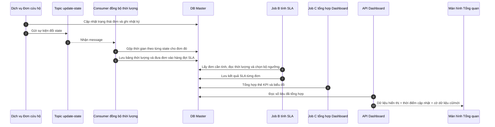
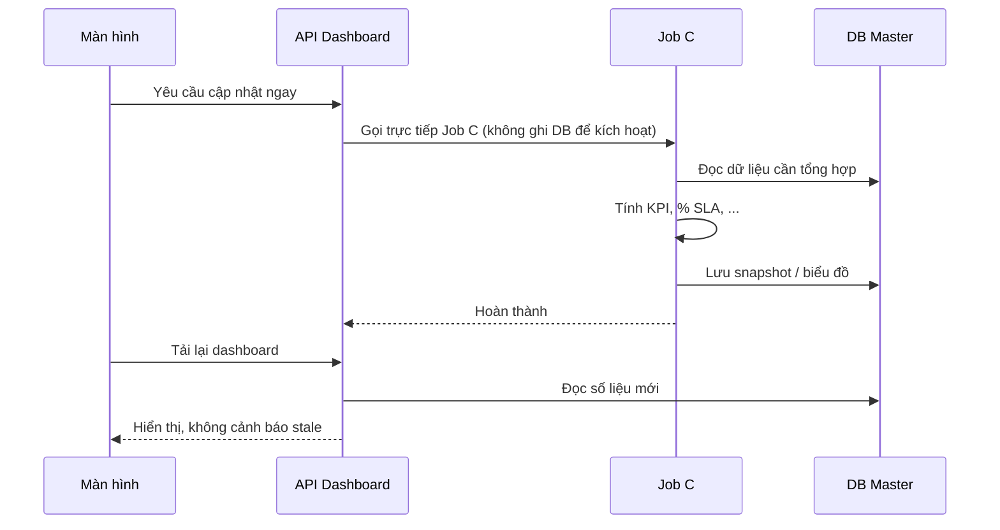

# Preview Sequence Diagram — SLA Pipeline (event-driven)

**Giải thích đối tượng, bảng, trường và thao tác DB (SELECT/INSERT…):** [SLA-flow-data-dictionary.md](./SLA-flow-data-dictionary.md) · BRD §14

**Diagram dùng văn mô tả nghiệp vụ.** Chi tiết kỹ thuật DB nằm ở tài liệu trên, không ghi trên flow.

**Flowchart chi tiết (cột Step = số trên diagram):** BRD [§14.11](./BRD-Giam-sat-cuu-ho-Tong-quan.md#1411-sequence--tính-sla-và-đổ-bảng-tổng-hợp-một-db-master) — Step **1–25** luồng chính, **26–33** đổi ngưỡng, **34–46** làm mới thủ công.

PlantUML: [SLA-sequence-preview.puml](./SLA-sequence-preview.puml)

**Phát hiện đổi state:** subscribe topic **`update-state`** (không quét toàn bộ lịch sử định kỳ).

## Luồng chính

## Nội dung sự kiện topic (gợi ý)

| Thông tin | Mục đích |
|-----------|----------|
| Mã đơn | Biết đơn cần xử lý |
| State cũ / state mới | Theo dõi, đối soát |
| Thời điểm sự kiện | Chốt timeline |
| Thời lượng vừa chốt (nếu có) | Giảm bước đọc lại lịch sử |
| Mã message | Tránh xử lý trùng |

Nếu message chưa có thời lượng → Consumer vẫn **đọc lịch sử chỉ của đơn đó** để gộp (chi tiết: data dictionary).

## Làm mới dashboard thủ công

## Các luồng đặc biệt khác

- **Đổi ngưỡng SLA:** xem PlantUML — không làm lại đơn đã chốt theo phiên bản cũ (BRD §14.9).
- **Reconcile:** chỉ khi mất message / consumer trễ — không thay topic trong luồng chính.
