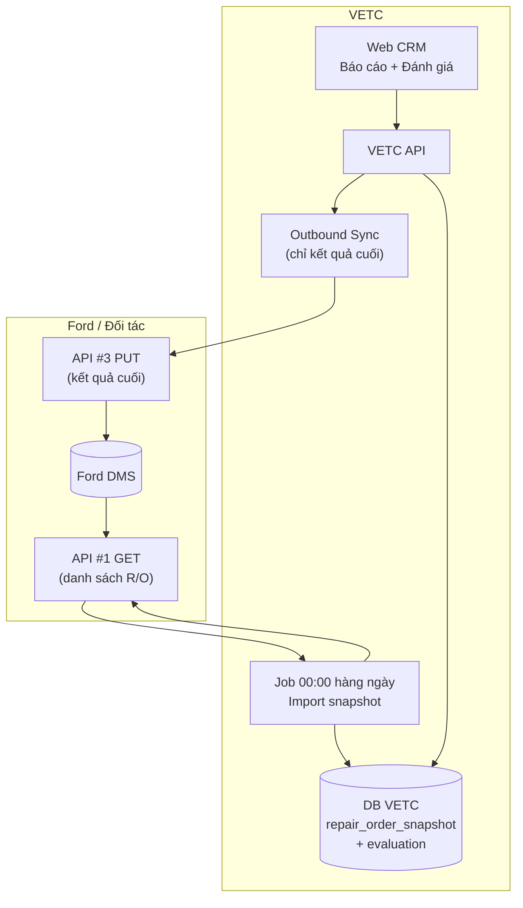
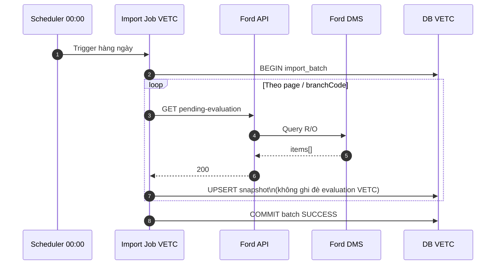
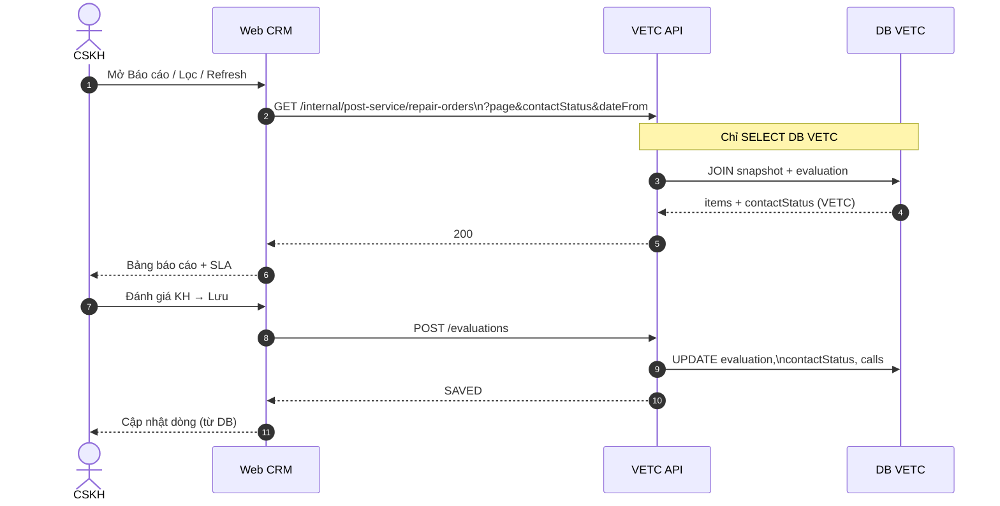
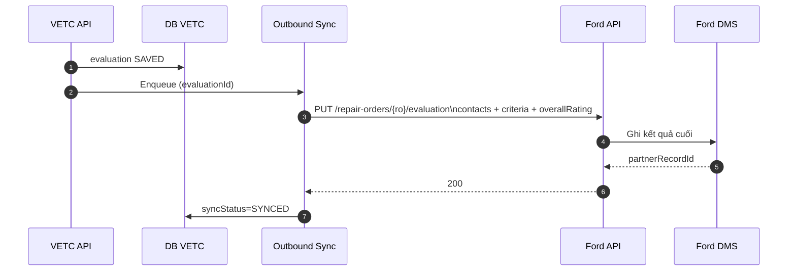
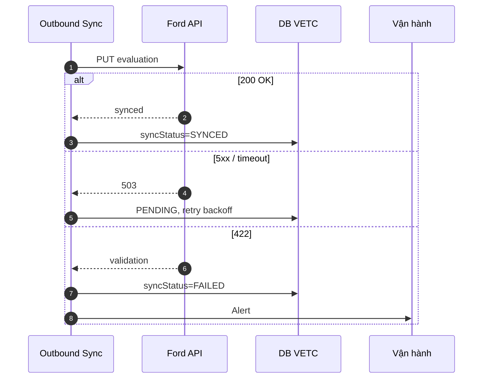
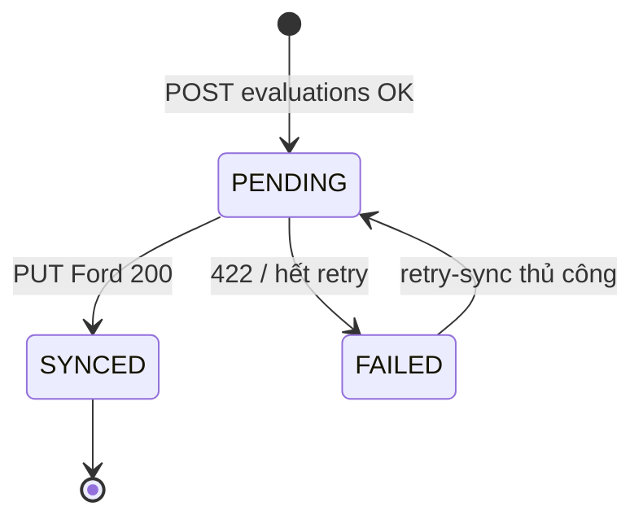

# Luồng tích hợp VETC ↔ Đối tác (Ford DMS) — Đánh giá sau sửa chữa

**Phiên bản:** 1.1  
**Tham chiếu API:** [Tasco-CRM-API.md](./Tasco-CRM-API.md) · PlantUML: [Tasco-CRM-integration-flow.puml](./Tasco-CRM-integration-flow.puml)

---

## 1. Nguyên tắc tích hợp (v1.1)

| Khía cạnh | Quyết định |
|-----------|------------|
| **Lấy danh sách báo cáo (API #1)** | **Không** gọi đối tác khi CSKH mở màn hình. **Job định kỳ 00:00 hàng ngày** gọi API #1 → lưu snapshot vào DB VETC. |
| **Màn hình báo cáo** | Chỉ đọc **DB VETC** (API nội bộ). Refresh UI = đọc lại DB, không hit Ford. |
| **Trạng thái / SLA / lần gọi** | **VETC quản lý** sau khi import (cập nhật khi CSKH submit đánh giá). |
| **Đối tác (Ford)** | Chỉ nhận **kết quả cuối** qua API #3 khi CSKH hoàn tất đánh giá — không đồng bộ trạng thái trung gian. |

---

## 2. Job import định kỳ — 00:00 hàng ngày

### 2.1 Lịch chạy

| Thuộc tính | Giá trị |
|------------|---------|
| Tên job | `post_service_import_partner_snapshot` |
| Cron | `0 0 * * *` (00:00 mỗi ngày, timezone `Asia/Ho_Chi_Minh`) |
| Nguồn | API #1 đối tác: `GET /repair-orders/pending-evaluation` |
| Đích | Bảng snapshot VETC (vd. `crm_repair_order_snapshot`) |

### 2.2 Phạm vi dữ liệu mỗi lần chạy

- `dateFrom` / `dateTo`: mặc định **T-30 → T** (có thể cấu hình theo `branchCode`).
- Phân trang: lặp đến hết `totalPages`.
- Mỗi `repairOrderNo`: **UPSERT** snapshot (thông tin xe, KH, km, ngày xe ra… từ Ford).
- Ghi log job: `import_batch_id`, `startedAt`, `finishedAt`, `recordsUpserted`, `status`.

### 2.3 Quy tắc merge với dữ liệu VETC đã xử lý

| Trường | Nguồn sau import |
|--------|------------------|
| Thông tin master R/O (biển số, KH, CVDV, ngày vào/ra…) | **Snapshot Ford** (ghi đè phần master) |
| `contactStatus`, Call 1–3, đánh giá, ghi chú CSKH | **Giữ bản VETC** nếu đã có `evaluation` — **không** ghi đè bởi snapshot |
| R/O mới (chưa có trên VETC) | Tạo dòng mới; `contactStatus` tính từ rule VETC (SLA 3 ngày) |

> Ford chỉ cung cấp **danh sách & dữ liệu gốc**; trạng thái vận hành CSKH là **single source of truth tại VETC**.

### 2.4 Sequence — Job 00:00

---

## 3. Luồng CSKH — Đọc DB VETC (không gọi Ford)

**Lưu ý UI:** Nút **Refresh** chỉ tải lại dữ liệu DB; hiển thị `lastImportAt` (thời điểm job 00:00 gần nhất).

---

## 4. Đồng bộ kết quả cuối sang Ford (API #3)

Chỉ khi CSKH **Lưu** đánh giá thành công → queue **một lần** PUT kết quả cuối.

Ford **không** nhận: trạng thái `CAN_GOI_LAI`, draft Call 2, SLA nội bộ — chỉ bản **hoàn tất** CSKH gửi.

---

## 5. Retry đồng bộ kết quả (API #3)

---

## 6. Phân vai trách dữ liệu

| Dữ liệu | Master | Ghi chú |
|---------|--------|---------|
| Danh sách R/O, thông tin xe/KH từ xưởng | Import Ford @ 00:00 → snapshot VETC | Cập nhật 1 lần/ngày |
| `contactStatus`, SLA, quá hạn | **VETC** | Tính/cập nhật khi CSKH làm việc |
| Call 1–3, ghi chú, tiêu chí 01–04 | **VETC** (`evaluation`) | Submit API #2 |
| Kết quả trên Ford DMS | **Ford** (sau API #3) | Chỉ bản cuối đã SYNCED |

---

## 7. Trạng thái đồng bộ sang Ford (`syncStatus`)

*(Khác với `contactStatus` — chỉ dùng nội bộ VETC, không đẩy Ford.)*

---

## 8. API nội bộ VETC (màn hình)

| Method | Endpoint | Mô tả |
|--------|----------|--------|
| GET | `/api/v1/internal/post-service/repair-orders` | Danh sách báo cáo từ DB (snapshot + evaluation) |
| GET | `/api/v1/internal/post-service/repair-orders/{repairOrderNo}` | Chi tiết 1 R/O cho panel đánh giá |
| POST | `/api/v1/post-service/evaluations` | Submit đánh giá (API #2) |
| GET | `/api/v1/internal/post-service/import-batches/latest` | Thời điểm import 00:00 gần nhất |

---

## 9. Checklist tích hợp

| Hạng mục | Ford | VETC |
|----------|------|------|
| API #1 GET danh sách | ✓ expose | Job 00:00 gọi, **không** gọi từ UI |
| Lưu snapshot DB | — | ✓ UPSERT + merge rule |
| API đọc báo cáo | — | ✓ internal GET từ DB |
| Quản lý trạng thái / SLA | — | ✓ |
| API #2 submit | — | ✓ |
| API #3 chỉ kết quả cuối | ✓ nhận PUT | ✓ outbound sau Lưu |
| Idempotency PUT | ✓ | ✓ |

PlantUML: [Tasco-CRM-integration-flow.puml](./Tasco-CRM-integration-flow.puml)
