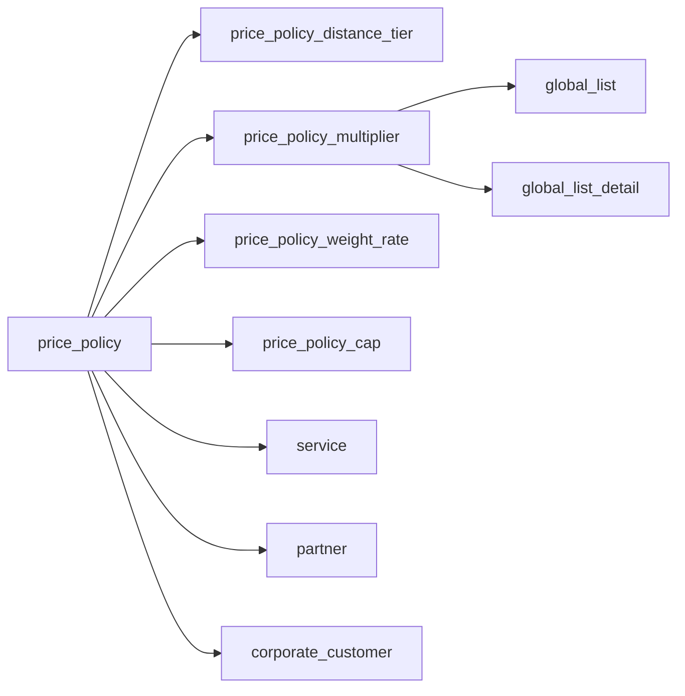
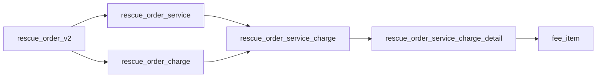
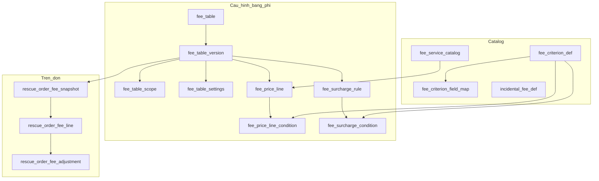

# Thiết kế lại DB phí cứu hộ (độc lập KH / NCC)

> Tài liệu thiết kế schema — căn cứ luồng cũ trên Postgres Dev (`rsa-dev` / `dev-rsa`) và mô hình chức năng mới trong `rsa-design` (`rescueFeeMockData.ts`, form cấu hình bảng phí).  
> **Phạm vi:** tài liệu BA/DBA review. Không thay migration production trong bước này.  
> **Ngày quan sát Dev:** 2026-08-03.  
> **BRD nghiệp vụ cấu hình + tính phí đơn:** [BRD-Tong-quan-cau-hinh-va-tinh-phi-don.md](./BRD-Tong-quan-cau-hinh-va-tinh-phi-don.md)

---

## 1. Mục tiêu


| Mục tiêu            | Mô tả                                                                       |
| ------------------- | --------------------------------------------------------------------------- |
| Độc lập KH / NCC    | Hai nhánh cấu hình & tính phí riêng (`target = CUSTOMER | SUPPLIER`)        |
| Linh động tiêu chí  | Thêm tiêu chí tính phí không cần `ALTER TABLE`                              |
| Bảng phí đa dịch vụ | Một bảng phí chứa nhiều dòng giá / nhiều dịch vụ + version                  |
| Snapshot trên đơn   | Biết bảng/version đã áp + số tiền đã chốt; không phụ thuộc cấu hình sau này |
| Chuyển đổi an toàn  | Song song với `price_policy*`; không drop luồng cũ giai đoạn 1              |


---

## 2. Hiện trạng luồng cũ (`dev-rsa`)

### 2.1. Sơ đồ cấu hình




### 2.2. Sơ đồ trên đơn




### 2.3. Số liệu quan sát Dev (2026-08-03)


| Chỉ số                            | Giá trị | Ý nghĩa                                                              |
| --------------------------------- | ------- | -------------------------------------------------------------------- |
| `price_policy`                    | **739** | Mỗi policy gắn 1 `service_id` → “bảng phí” bị phân mảnh theo dịch vụ |
| Policy không partner / không corp | **667** | Phần lớn là mặc định chung                                           |
| Policy có `partner_id`            | **48**  | Gắn NCC trên cùng model với KH                                       |
| Policy có `corporate_customer_id` | **24**  | Gắn DN trên cùng model                                               |
| `price_policy_distance_tier`      | ~890    | Bậc giá; cột km + weight + seat hard-code trên cùng bảng             |
| `price_policy_multiplier`         | ~285    | Hệ số phụ thuộc `global_list`                                        |
| `price_policy_weight_rate`        | ~20     | Giá theo trọng tải (tách bảng riêng)                                 |
| `price_policy_cap`                | ~22     | Trần/sàn                                                             |
| `rescue_order_service_charge`     | ~8036   | Charge theo dịch vụ trên đơn                                         |


`**customer_price_source` trên `rescue_order_service_charge`:**


| Source      | Số dòng (xấp xỉ) |
| ----------- | ---------------- |
| `null`      | 7210             |
| `VETC`      | 689              |
| `CORPORATE` | 121              |
| `MARKUP`    | 16               |


**Loại multiplier (`global_list`) được dùng nhiều:** Khu vực, Thời tiết, Thời gian, Mức độ nghiêm trọng.

`**multiplier_aggregation_mode`:** chủ yếu `HIGHEST`, một phần `PRODUCT`.

### 2.4. Cột then chốt luồng cũ (tóm tắt)

`**price_policy`:** `policy_id`, `policy_code`, `policy_name`, `scope`, `service_id` (NOT NULL), `partner_id`, `corporate_customer_id`, `inherit_mode`, `source_policy_id`, `pricing_formula`, `multiplier_aggregation_mode`, hiệu lực, status.

`**price_policy_distance_tier`:** khoảng km + `flat_price` / `per_km_price` + thêm `min/max_weight_ton`, `min/max_seat` trên cùng hàng.

`**price_policy_multiplier`:** `multiplier_type_id` → `global_list`, `multiplier_detail_id` → `global_list_detail`, `multiplier`, priority.

`**rescue_order_service`:** `init_supplier_fee`, `supplier_fee` (thiên về NCC).

`**rescue_order_service_charge_detail`:** `price`, `multiplier`, `amount`, `pricing_params` (jsonb), `multiplier_desc` — khó query/audit theo tiêu chí.

---

## 3. Vấn đề chính + ví dụ + hướng xử lý

### V1 — Một policy = một dịch vụ


|           |                                                                                     |
| --------- | ----------------------------------------------------------------------------------- |
| **Cũ**    | `service_id` bắt buộc → muốn bộ giá “NCC nội bộ” phải nhân hàng trăm policy.        |
| **Ví dụ** | Đổi hệ số mưa cho cả bảng NCC → sửa từng policy / từng multiplier.                  |
| **Mới**   | Entity **Fee Table** (nhiều dịch vụ, nhiều dòng giá), version + hiệu lực theo bảng. |


### V2 — KH và NCC chung một model


|           |                                                                                         |
| --------- | --------------------------------------------------------------------------------------- |
| **Cũ**    | Phân biệt nhờ `partner_id` / `corporate_customer_id` / logic app; không có `target`.    |
| **Ví dụ** | Policy partner A vừa ảnh hưởng giá NCC vừa bị suy ra giá KH → khó audit nguồn phí KH.   |
| **Mới**   | `target = CUSTOMER | SUPPLIER` + `kind`. Engine chọn **2 bảng độc lập** rồi tính riêng. |


### V3 — Tiêu chí hard-code cột trên tier


|           |                                                                                |
| --------- | ------------------------------------------------------------------------------ |
| **Cũ**    | Tier vừa km vừa weight/seat → tiêu chí mới = `ALTER TABLE`.                    |
| **Ví dụ** | Thêm “Loại xe cứu hộ” → sửa schema + code match.                               |
| **Mới**   | Catalog tiêu chí + điều kiện dạng hàng (`criterion_key`, `operator`, `value`). |


### V4 — Phụ phí gắn cứng `global_list`


|           |                                                                                                              |
| --------- | ------------------------------------------------------------------------------------------------------------ |
| **Cũ**    | Multiplier → list/detail; aggregation HIGHEST/PRODUCT trên policy.                                           |
| **Ví dụ** | Phụ phí Lễ/Tết cần danh sách ngày → không fit multiplier thuần.                                              |
| **Mới**   | **Surcharge rule**: `FIXED | COEFFICIENT`, conditions, `holiday_dates`, stack `STACK | MAX` ở settings bảng. |


### V5 — Formula / inherit khó kiểm soát


|           |                                                                                                     |
| --------- | --------------------------------------------------------------------------------------------------- |
| **Cũ**    | `pricing_formula` text; `inherit_mode` string; Dev có bản ghi `inherit_mode` lẫn payload injection. |
| **Ví dụ** | Không validate công thức; inherit khó giải thích khi audit.                                         |
| **Mới**   | Không lưu formula tự do. Inherit = version/copy bảng hoặc `SUPPLIER_EXTERNAL_FALLBACK`.             |


### V6 — Trên đơn: NCC / KH / DN chưa tách sạch theo dòng


|           |                                                                                       |
| --------- | ------------------------------------------------------------------------------------- |
| **Cũ**    | Service nghiêng `supplier_fee`; charge nghiêng thu KH; hệ số trong JSON.              |
| **Ví dụ** | Sửa tay phí KH không rõ giữ hệ số NCC; bảo lãnh DN thiếu KHCN/KHDN per line.          |
| **Mới**   | Snapshot per line: NCC / KH / KHCN / KHDN, hệ số, source, manual flags, bảng+version. |


### V7 — KH lẻ = Public × hệ số


|         |                                                                                      |
| ------- | ------------------------------------------------------------------------------------ |
| **Cũ**  | `MARKUP` rải rác trên charge, không phải loại bảng cấu hình.                         |
| **Mới** | `kind = CUSTOMER_RETAIL` + `retail_markup_factor` → không bắt buộc ma trận dòng giá. |


---

## 4. Mô hình đề xuất (ERD)

### 4.1. Tổng quan nhóm bảng




### 4.2. ERD chi tiết (cột chính + quan hệ)

#### Mục đích từng bảng

**Catalog — master data dùng chung**


| Bảng                      | Mục đích                                                                                                                                                                                                                   |
| ------------------------- | -------------------------------------------------------------------------------------------------------------------------------------------------------------------------------------------------------------------------- |
| `fee_criterion_def`       | Danh mục tiêu chí tính phí (thời tiết, km, loại xe…). Khai báo `key` + kiểu giá trị để dùng trong điều kiện dòng giá / phụ phí mà không hard-code cột.                                                                     |
| `fee_criterion_field_map` | Map mỗi `criterion_key` → nguồn dữ liệu thực tế trên đơn/xe/dòng dịch vụ (`order.weather`, `line.distanceKm`…). Giúp engine build context khi match điều kiện; thêm tiêu chí mới chủ yếu = thêm map, không ALTER bảng giá. |
| `fee_service_catalog`     | Danh mục đầu dịch vụ / dịch vụ con (ONSITE, kéo xe, cẩu…). Có thể map từ `service` cũ qua `legacy_service_id`.                                                                                                             |
| `incidental_fee_def`      | Danh mục phí phát sinh / “Dịch vụ khác” (gợi ý giá) khi thêm trên đơn, tách khỏi ma trận bảng phí chuẩn.                                                                                                                   |


**Cấu hình bảng phí — độc lập KH / NCC**


| Bảng                       | Mục đích                                                                                                                             |
| -------------------------- | ------------------------------------------------------------------------------------------------------------------------------------ |
| `fee_table`                | “Vỏ” bảng phí: mã, tên, `target` (CUSTOMER/SUPPLIER), `kind` (Public, Retail, DN, NCC nội bộ/ngoài/fallback), trạng thái hiện hành.  |
| `fee_table_version`        | Phiên bản nội dung bảng phí theo thời gian. Version ACTIVE coi là bất biến; sửa cấu hình = tạo version mới để đơn cũ vẫn audit được. |
| `fee_table_scope`          | Phạm vi áp dụng của một version: doanh nghiệp, NCC, khu vực, loại dịch vụ/xe. Null = không giới hạn chiều đó.                        |
| `fee_table_settings`       | Tham số tính của version: hệ số KH lẻ, làm tròn, nhân hệ số vs lấy max, cờ fallback, giá đã bao gồm VAT hay chưa. |
| `fee_price_line`           | Một dòng trong ma trận giá: gắn dịch vụ + giá cơ sở + FIXED/PER_UNIT. Nhiều dòng cùng dịch vụ = các tổ hợp tiêu chí khác nhau. **Không lưu value tiêu chí** — value nằm ở `fee_price_line_condition`. |
| `fee_price_line_condition` | **Bảng cấu hình value tiêu chí theo từng line.** Mỗi hàng: `fee_price_line_id` + `criterion_key` + `operator` + `value_json`. Nhiều hàng cùng line = AND (vd. PTI kéo: `vehicleType` + `seat_number` + `distanceKm BETWEEN`; cẩu: + `roadDistance BETWEEN`). Line không có hàng condition = khớp mọi context (vd. kích bình). |
| `fee_surcharge_rule`       | Phụ phí / hệ số điều kiện (FIXED tiền hoặc COEFFICIENT), gồm Lễ/Tết (`holiday_dates_json`), stackable, trần.                         |
| `fee_surcharge_condition`  | Điều kiện kích hoạt một surcharge (vd. `weather = Mưa`).                                                                             |


**Runtime trên đơn — snapshot kết quả, không dump cả bảng**


| Bảng                          | Mục đích                                                                                                                                                                         |
| ----------------------------- | -------------------------------------------------------------------------------------------------------------------------------------------------------------------------------- |
| `rescue_order_v2`             | Đơn cứu hộ hiện hữu (tham chiếu). Không thuộc schema phí mới; điểm neo snapshot.                                                                                                 |
| `rescue_order_service`        | Dịch vụ thực tế trên đơn (vận hành). Giữ nguyên; dòng phí mới gắn qua FK.                                                                                                        |
| `rescue_order_fee_snapshot`   | Header lần tính/chốt phí: bảng KH + NCC đã chọn (id/code/**version**), mode (Public/markup/DN…), context đầu vào, thời điểm tính. Trả lời “đơn này lấy phí từ đâu”.              |
| `rescue_order_fee_line`       | Nguồn sự thật số tiền per dịch vụ: NCC, KH, **KHCN**, **KHDN**, hệ số, source, cờ thủ công, breakdown, optional `matched_*_line_id`. Đổi bảng phí sau không làm lệch số đã chốt. |
| `rescue_order_fee_adjustment` | Lịch sử chỉnh tay / phân bổ lại tổng / tính lại — audit before/after.                                                                                                            |


@startuml
' ================== Entities & Fields ==================

entity fee_criterion_def {
  * id : bigint <<PK>>
  * key : varchar <<UK>> // "weather distanceKm batteryType"
  * label : varchar
  * value_type : varchar // "LIST RANGE TIME"
  * values_json : jsonb
  * status : varchar // "ACTIVE INACTIVE"
  * updated_at : timestamptz
}

entity fee_criterion_field_map {
  * id : bigint <<PK>>
  * criterion_key : varchar <<FK>>
  * source_path : varchar // "order.weather line.distanceKm"
  * transform : varchar // "nullable"
  * scope : varchar // "ORDER LINE VEHICLE"
  * status : varchar
}

entity fee_service_catalog {
  * id : bigint <<PK>>
  * code : varchar <<UK>>
  * name : varchar
  * service_type : varchar // "ONSITE TOWING CRANE"
  * parent_id : bigint <<FK>> // "nullable"
  * legacy_service_id : bigint // map service.service_id
  * status : varchar
}

entity incidental_fee_def {
  * id : bigint <<PK>>
  * code : varchar <<UK>>
  * name : varchar
  * suggested_price : numeric
  * is_catch_all : boolean
  * status : varchar
}

entity fee_table {
  * id : bigint <<PK>>
  * code : varchar <<UK>>
  * name : varchar
  * target : varchar // "CUSTOMER SUPPLIER"
  * kind : varchar // "PUBLIC RETAIL BUSINESS INTERNAL EXTERNAL FALLBACK"
  * current_version : int
  * status : varchar // "DRAFT ACTIVE EXPIRED INACTIVE"
}

entity fee_table_version {
  * id : bigint <<PK>>
  * fee_table_id : bigint <<FK>>
  * version : int <<UK>> // unique with fee_table_id
  * valid_from : date
  * valid_to : date
  * priority : int
  * status : varchar // "immutable when ACTIVE"
  * note : text
  * activated_at : timestamptz
}

entity fee_table_scope {
  * fee_table_version_id : bigint <<PK,FK>>
  * enterprise_code : varchar // "nullable KH"
  * supplier_id : varchar // "nullable NCC"
  * supplier_name : varchar
  * areas_json : jsonb
  * service_types_json : jsonb
  * vehicle_types_json : jsonb
}

entity fee_table_settings {
  * fee_table_version_id : bigint <<PK,FK>>
  * retail_markup_factor : numeric // "CUSTOMER_RETAIL"
  * round_mode : varchar // "NEAREST_1000 NEAREST_100 NONE"
  * stack_surcharges : boolean // "true=STACK false=MAX"
  * is_fallback : boolean
  * includes_vat : boolean // "true=gia da bao gom VAT"
}

entity fee_price_line {
  * id : bigint <<PK>>
  * fee_table_version_id : bigint <<FK>>
  * service_catalog_id : bigint <<FK>>
  * service_name : varchar
  * base_price : numeric
  * pricing_mode : varchar // "FIXED PER_UNIT"
  * unit : varchar // "km nullable"
  * included_qty : numeric
  * price_per_extra : numeric
  * min_price : numeric
  * max_price : numeric
  * sort_order : int
}

entity fee_price_line_condition {
  * id : bigint <<PK>>
  * fee_price_line_id : bigint <<FK>>
  * criterion_key : varchar <<FK>>
  * operator : varchar // "eq IN BETWEEN gte lte"
  * value_json : jsonb // "scalar array or from-to"
}

entity fee_surcharge_rule {
  * id : bigint <<PK>>
  * fee_table_version_id : bigint <<FK>>
  * name : varchar
  * type : varchar // "FIXED COEFFICIENT"
  * value : numeric
  * stackable : boolean
  * exclusive_group : varchar
  * cap_amount : numeric
  * holiday_dates_json : jsonb
  * sort_order : int
}

entity fee_surcharge_condition {
  * id : bigint <<PK>>
  * fee_surcharge_rule_id : bigint <<FK>>
  * criterion_key : varchar <<FK>>
  * operator : varchar
  * value_json : jsonb
}

entity rescue_order_v2 {
  * rescue_order_v2_id : bigint <<PK>>
  * order_code : varchar // "existing table"
}

entity rescue_order_service {
  * rescue_order_service_id : bigint <<PK>>
  * rescue_order_v2_id : bigint <<FK>>
  * service_id : bigint <<FK>>
  * additional_sv_name : varchar
}

entity rescue_order_fee_snapshot {
  * id : bigint <<PK>>
  * rescue_order_v2_id : bigint <<FK>>
  * supplier_table_id : bigint <<FK>>
  * supplier_table_code : varchar
  * supplier_version : int
  * customer_table_id : bigint <<FK>>
  * customer_table_code : varchar
  * customer_version : int
  * customer_fee_mode : varchar // "PACKAGE_PUBLIC RETAIL_MARKUP BUSINESS"
  * retail_markup_factor : numeric
  * input_context_json : jsonb
  * calculated_at : timestamptz
}

entity rescue_order_fee_line {
  * id : bigint <<PK>>
  * snapshot_id : bigint <<FK>>
  * rescue_order_service_id : bigint <<FK>>
  * service_name : varchar
  * supplier_amount : numeric
  * customer_amount : numeric
  * customer_individual_amount : numeric // "KHCN"
  * customer_enterprise_amount : numeric // "KHDN"
  * fixed_price : numeric
  * customer_coefficient : numeric
  * supplier_coefficient : numeric
  * customer_source : varchar
  * supplier_source : varchar
  * is_customer_manual : boolean
  * is_supplier_manual : boolean
  * matched_supplier_line_id : bigint <<FK>>
  * matched_customer_line_id : bigint <<FK>>
  * breakdown_json : jsonb
  * sort_order : int
}

entity rescue_order_fee_adjustment {
  * id : bigint <<PK>>
  * fee_line_id : bigint <<FK>> // "nullable"
  * snapshot_id : bigint <<FK>>
  * adjustment_type : varchar // "MANUAL_EDIT REDISTRIBUTE RECALC"
  * before_json : jsonb
  * after_json : jsonb
  * note : text
  * created_at : timestamptz
}


' ================== Relationships ==================

fee_criterion_def     ||--o{ fee_criterion_field_map        : maps_to_source
fee_criterion_def     ||--o{ fee_price_line_condition       : used_in
fee_criterion_def     ||--o{ fee_surcharge_condition        : used_in

fee_table             ||--|{ fee_table_version              : has_versions
fee_table_version     ||--|| fee_table_scope                : scope_1_1
fee_table_version     ||--|| fee_table_settings             : settings_1_1
fee_table_version     ||--o{ fee_price_line                 : price_lines
fee_table_version     ||--o{ fee_surcharge_rule             : surcharges

fee_service_catalog   ||--o{ fee_service_catalog            : parent_child
fee_service_catalog   ||--o{ fee_price_line                 : priced_as

fee_price_line        ||--o{ fee_price_line_condition       : AND_conditions
fee_surcharge_rule    ||--o{ fee_surcharge_condition        : AND_conditions

fee_table_version     ||--o{ rescue_order_fee_snapshot      : applied_as_supplier_or_customer
rescue_order_v2       ||--o| rescue_order_fee_snapshot      : has_fee_snapshot
rescue_order_fee_snapshot ||--o{ rescue_order_fee_line      : lines
rescue_order_service  ||--o| rescue_order_fee_line          : fee_for_service
rescue_order_fee_line ||--o{ rescue_order_fee_adjustment    : audit
rescue_order_fee_snapshot ||--o{ rescue_order_fee_adjustment: order_level_adj

@enduml


### 4.3. Cách đọc quan hệ chính


| Từ                     | Đến                               | Cardinality | Ý nghĩa                                         |
| ---------------------- | --------------------------------- | ----------- | ----------------------------------------------- |
| `fee_table`            | `fee_table_version`               | 1:N         | Mỗi lần publish = 1 version bất biến khi ACTIVE |
| `fee_table_version`    | `fee_table_scope` / `settings`    | 1:1         | Phạm vi + tham số tính theo version             |
| `fee_table_version`    | `fee_price_line`                  | 1:N         | Ma trận giá (nhiều dịch vụ / tổ hợp tiêu chí)   |
| `fee_price_line`       | `fee_price_line_condition`        | 1:N         | Điều kiện AND trên cùng dòng                    |
| `fee_table_version`    | `fee_surcharge_rule`              | 1:N         | Phụ phí FIXED / COEFFICIENT                     |
| `fee_criterion_def`    | `fee_criterion_field_map`         | 1:N         | Map `key` → field trên đơn/xe/dòng              |
| `fee_criterion_def`    | conditions                        | 1:N         | Dùng chung cho price line & surcharge           |
| `rescue_order_v2`      | `rescue_order_fee_snapshot`       | 1:0..1      | Header: bảng/version/mode lúc tính              |
| `snapshot`             | `rescue_order_fee_line`           | 1:N         | Số tiền đã chốt per dịch vụ                     |
| `rescue_order_service` | `rescue_order_fee_line`           | 1:0..1      | Gắn dịch vụ vận hành ↔ dòng phí                 |
| `fee_price_line`       | `matched_*_line_id` trên fee_line | 0..1        | Trace dòng ma trận đã khớp (optional)           |


### Nguyên tắc snapshot trên đơn (không dump cả bảng)

1. **Header** (`rescue_order_fee_snapshot`): bảng KH/NCC đã chọn (id, code, **version**), mode, context input, `calculated_at`.
2. **Dòng tiền** (`rescue_order_fee_line`): số đã tính/chốt (NCC, KH, KHCN, KHDN, hệ số, breakdown, manual).
3. **Master version bất biến**: sửa bảng phí = version mới; đơn cũ giữ version cũ → mở lại cấu hình lúc tính mà không copy full bảng vào mỗi đơn.

---

## 5. Danh sách bảng & cột đề xuất

### 5.1. Catalog

#### `fee_criterion_def`


| Cột                         | Kiểu               | Mô tả                                                   |
| --------------------------- | ------------------ | ------------------------------------------------------- |
| `id`                        | BIGSERIAL PK       |                                                         |
| `key`                       | VARCHAR(64) UNIQUE | Mã ổn định: `weather`, `distanceKm`, `batteryType`      |
| `label`                     | VARCHAR(255)       | Tên hiển thị                                            |
| `value_type`                | VARCHAR(16)        | `LIST` | `RANGE` | `TIME`                               |
| `values_json`               | JSONB              | Danh sách giá trị cho LIST (có thể rỗng nếu RANGE/TIME) |
| `status`                    | VARCHAR(16)        | `ACTIVE` | `INACTIVE`                                   |
| `created_at` / `updated_at` | TIMESTAMPTZ        |                                                         |
| `created_by` / `updated_by` | VARCHAR            |                                                         |


#### `fee_criterion_field_map`


| Cột             | Kiểu                     | Mô tả                                                                    |
| --------------- | ------------------------ | ------------------------------------------------------------------------ |
| `id`            | BIGSERIAL PK             |                                                                          |
| `criterion_key` | VARCHAR(64) FK → def.key |                                                                          |
| `source_path`   | VARCHAR(255)             | Đường dẫn dữ liệu: `order.weather`, `line.distanceKm`, `vehicle.payload` |
| `transform`     | VARCHAR(64) NULL         | Ví dụ: `UI_WEATHER_TO_LABEL`, `BOOL_OR_ROUTE_TO_YES_NO`           |
| `transform_params_json` | JSONB NULL         | Tham số transform (vd. map nhãn UI). Không dùng để gom nhóm G chỗ/tải — PTI cấu hình `seat_number` / `load_capacity` thẳng trên `fee_price_line_condition`. |
| `scope`         | VARCHAR(16)              | `ORDER` | `LINE` | `VEHICLE`                                             |
| `status`        | VARCHAR(16)              |                                                                          |


> Chi tiết ví dụ: mục **§8**. Demo PTI (pass/cargo AND): `fee-table-pti-enterprise-seed-demo.md`.

#### `fee_service_catalog`


| Cột                 | Kiểu               | Mô tả                                |
| ------------------- | ------------------ | ------------------------------------ |
| `id`                | BIGSERIAL PK       |                                      |
| `code`              | VARCHAR(64) UNIQUE |                                      |
| `name`              | VARCHAR(255)       | Tên dịch vụ (đầu dịch vụ / chi tiết) |
| `service_type`      | VARCHAR(32)        | `ONSITE` | `TOWING` | `CRANE` | …    |
| `parent_id`         | BIGINT NULL        | Nhóm cha (vd. Kéo xe → con)          |
| `legacy_service_id` | BIGINT NULL        | Map từ `service.service_id`          |
| `status`            | VARCHAR(16)        |                                      |


#### `incidental_fee_def`


| Cột               | Kiểu               | Mô tả                        |
| ----------------- | ------------------ | ---------------------------- |
| `id`              | BIGSERIAL PK       |                              |
| `code`            | VARCHAR(64) UNIQUE |                              |
| `name`            | VARCHAR(255)       | Phí phát sinh / dịch vụ khác |
| `suggested_price` | NUMERIC(18,2)      |                              |
| `is_catch_all`    | BOOLEAN            | Mục “Khác”                   |
| `status`          | VARCHAR(16)        |                              |


### 5.2. Cấu hình bảng phí

#### `fee_table`


| Cột                         | Kiểu               | Mô tả                                       |
| --------------------------- | ------------------ | ------------------------------------------- |
| `id`                        | BIGSERIAL PK       |                                             |
| `code`                      | VARCHAR(64) UNIQUE |                                             |
| `name`                      | VARCHAR(255)       |                                             |
| `target`                    | VARCHAR(16)        | `CUSTOMER` | `SUPPLIER`                     |
| `kind`                      | VARCHAR(64)        | Xem enum bên dưới                           |
| `current_version`           | INT                | Bản đang ACTIVE (denormalize)               |
| `status`                    | VARCHAR(16)        | `ACTIVE` | `EXPIRED` | `INACTIVE` (không dùng DRAFT — cấu hình tạm trên FE đến khi Lưu) |
| `updated_at` / `updated_by` |                    |                                             |


`**kind`:**


| Kind                         | Ý nghĩa                      |
| ---------------------------- | ---------------------------- |
| `CUSTOMER_PUBLIC`            | KH Public (gói)              |
| `CUSTOMER_RETAIL`            | KH lẻ — chủ yếu hệ số markup |
| `CUSTOMER_BUSINESS`          | KH doanh nghiệp              |
| `SUPPLIER_INTERNAL`          | NCC nội bộ                   |
| `SUPPLIER_EXTERNAL`          | NCC ngoài (riêng)            |
| `SUPPLIER_EXTERNAL_FALLBACK` | NCC ngoài fallback           |


#### `fee_table_version`


| Cột                             | Kiểu         | Mô tả                                                      |
| ------------------------------- | ------------ | ---------------------------------------------------------- |
| `id`                            | BIGSERIAL PK |                                                            |
| `fee_table_id`                  | BIGINT FK    |                                                            |
| `version`                       | INT          | Tăng dần; UNIQUE(`fee_table_id`,`version`)                 |
| `valid_from` / `valid_to`       | DATE         |                                                            |
| `priority`                      | INT          | Độ ưu tiên khi nhiều bảng match                            |
| `status`                        | VARCHAR(16)  | Version ACTIVE thì **immutable** nội dung lines/surcharges |
| `note`                          | TEXT         |                                                            |
| `activated_at` / `activated_by` |              |                                                            |


#### `fee_table_scope`


| Cột                    | Kiểu                | Mô tả                    |
| ---------------------- | ------------------- | ------------------------ |
| `fee_table_version_id` | BIGINT PK/FK        | 1-1 với version          |
| `enterprise_code`      | VARCHAR NULL        |                          |
| `supplier_id`          | VARCHAR/BIGINT NULL |                          |
| `supplier_name`        | VARCHAR NULL        |                          |
| `areas_json`           | JSONB               |                          |
| `service_types_json`   | JSONB               | Lọc loại dịch vụ áp dụng |
| `vehicle_types_json`   | JSONB               |                          |


Rule UX: `target=CUSTOMER` → không dùng `supplier_*`; `target=SUPPLIER` → không dùng `enterprise_code` (trừ khi nghiệp vụ mở rộng sau).

#### `fee_table_settings`


| Cột                    | Kiểu          | Mô tả                                             |
| ---------------------- | ------------- | ------------------------------------------------- |
| `fee_table_version_id` | BIGINT PK/FK  |                                                   |
| `retail_markup_factor` | NUMERIC(10,4) | Chỉ meaningful với `CUSTOMER_RETAIL`              |
| `round_mode`           | VARCHAR(32)   | `NEAREST_1000` | `NEAREST_100` | `NONE`           |
| `stack_surcharges`     | BOOLEAN       | `true` = nhân hệ số; `false` = lấy hệ số cao nhất |
| `is_fallback`          | BOOLEAN       | Đánh dấu bảng fallback NCC                        |
| `includes_vat`         | BOOLEAN       | `true` = mức giá trong bảng đã bao gồm VAT; `false` = chưa bao gồm |


#### `fee_price_line`


| Cột                       | Kiểu             | Mô tả                       |
| ------------------------- | ---------------- | --------------------------- |
| `id`                      | BIGSERIAL PK     |                             |
| `fee_table_version_id`    | BIGINT FK        |                             |
| `service_catalog_id`      | BIGINT FK        |                             |
| `service_name`            | VARCHAR          | Denormalize tên lúc publish |
| `base_price`              | NUMERIC(18,2)    |                             |
| `pricing_mode`            | VARCHAR(16)      | `FIXED` | `PER_UNIT`        |
| `unit`                    | VARCHAR(16) NULL | `km`, `tấn`, …              |
| `included_qty`            | NUMERIC NULL     | Km bao gồm (kéo xe)         |
| `price_per_extra`         | NUMERIC NULL     |                             |
| `min_price` / `max_price` | NUMERIC NULL     |                             |
| `sort_order`              | INT              |                             |


Với `CUSTOMER_RETAIL` + chỉ markup: **không bắt buộc** có `fee_price_line`.

#### `fee_price_line_condition`

**Mục đích:** lưu **value tiêu chí** gắn với một `fee_price_line`. Đây là chỗ cấu hình “line này áp khi loại xe = … / chỗ hoặc tải trong khoảng / độ sâu = …”, tách khỏi cột giá trên `fee_price_line`.

| Cột                 | Kiểu         | Mô tả                                                        |
| ------------------- | ------------ | ------------------------------------------------------------ |
| `id`                | BIGSERIAL PK |                                                              |
| `fee_price_line_id` | BIGINT FK    | Line giá cha                                                 |
| `criterion_key`     | VARCHAR FK   | Trỏ `fee_criterion_def.key`                                  |
| `operator`          | VARCHAR(16)  | `=` | `IN` | `BETWEEN` | `>=` | `<=`                         |
| `value_json`        | JSONB        | Scalar, array, hoặc `[from,to]` — **value thực tế trên line** |


Điều kiện trên cùng line = **AND**. Ví dụ PTI kéo: `vehicleType` + `seat_number` + `distanceKm BETWEEN`. Cẩu: `roadDistance BETWEEN [from,to]` (+ `cranePosture` nếu >150m). Nhiều line cùng dịch vụ = các tổ hợp tiêu chí khác nhau (ma trận).

#### `fee_surcharge_rule`


| Cột                    | Kiểu         | Mô tả                   |
| ---------------------- | ------------ | ----------------------- |
| `id`                   | BIGSERIAL PK |                         |
| `fee_table_version_id` | BIGINT FK    |                         |
| `name`                 | VARCHAR      | Thời tiết, Lễ/Tết, …    |
| `type`                 | VARCHAR(16)  | `FIXED` | `COEFFICIENT` |
| `value`                | NUMERIC      | Tiền hoặc hệ số         |
| `stackable`            | BOOLEAN      |                         |
| `exclusive_group`      | VARCHAR NULL |                         |
| `cap_amount`           | NUMERIC NULL |                         |
| `holiday_dates_json`   | JSONB NULL   | `["2026-01-01", …]`     |
| `sort_order`           | INT          |                         |


#### `fee_surcharge_condition`


| Cột                     | Kiểu         | Mô tả |
| ----------------------- | ------------ | ----- |
| `id`                    | BIGSERIAL PK |       |
| `fee_surcharge_rule_id` | BIGINT FK    |       |
| `criterion_key`         | VARCHAR      |       |
| `operator`              | VARCHAR      |       |
| `value_json`            | JSONB        |       |


### 5.3. Runtime trên đơn

#### `rescue_order_fee_snapshot`


| Cột                    | Kiểu         | Mô tả                                                          |
| ---------------------- | ------------ | -------------------------------------------------------------- |
| `id`                   | BIGSERIAL PK |                                                                |
| `rescue_order_v2_id`   | BIGINT FK    |                                                                |
| `supplier_table_id`    | BIGINT NULL  |                                                                |
| `supplier_table_code`  | VARCHAR      |                                                                |
| `supplier_version`     | INT          |                                                                |
| `customer_table_id`    | BIGINT NULL  |                                                                |
| `customer_table_code`  | VARCHAR NULL |                                                                |
| `customer_version`     | INT NULL     |                                                                |
| `customer_fee_mode`    | VARCHAR      | `PACKAGE_PUBLIC` | `RETAIL` | `RETAIL_MARKUP` | `BUSINESS` | … |
| `retail_markup_factor` | NUMERIC NULL |                                                                |
| `input_context_json`   | JSONB        | Weather, km, enterprise, … lúc tính                            |
| `calculated_at`        | TIMESTAMPTZ  |                                                                |
| `calculated_by`        | VARCHAR      |                                                                |


#### `rescue_order_fee_line`


| Cột                          | Kiểu         | Mô tả                                     |
| ---------------------------- | ------------ | ----------------------------------------- |
| `id`                         | BIGSERIAL PK |                                           |
| `snapshot_id`                | BIGINT FK    |                                           |
| `rescue_order_service_id`    | BIGINT FK    | Liên kết dịch vụ thực hiện                |
| `service_name`               | VARCHAR      |                                           |
| `supplier_amount`            | NUMERIC      | Giá NCC sau hệ số                         |
| `customer_amount`            | NUMERIC      | Tổng phí KH (KHCN+KHDN)                   |
| `customer_individual_amount` | NUMERIC      | **Phí KHCN**                              |
| `customer_enterprise_amount` | NUMERIC      | **Phí KHDN** (bảo lãnh)                   |
| `fixed_price`                | NUMERIC      | Giá cố định trước hệ số (nếu có)          |
| `customer_coefficient`       | NUMERIC      |                                           |
| `supplier_coefficient`       | NUMERIC      |                                           |
| `customer_source`            | VARCHAR      | `VETC` | `NCC` | `Thủ công` | …           |
| `supplier_source`            | VARCHAR      |                                           |
| `is_customer_manual`         | BOOLEAN      |                                           |
| `is_supplier_manual`         | BOOLEAN      |                                           |
| `matched_supplier_line_id`   | BIGINT NULL  | `fee_price_line.id`                       |
| `matched_customer_line_id`   | BIGINT NULL  |                                           |
| `breakdown_json`             | JSONB        | Surcharge items, công thức hệ số đọc được |
| `sort_order`                 | INT          |                                           |


#### `rescue_order_fee_adjustment`


| Cột                          | Kiểu           | Mô tả                                               |
| ---------------------------- | -------------- | --------------------------------------------------- |
| `id`                         | BIGSERIAL PK   |                                                     |
| `fee_line_id`                | BIGINT FK NULL | Null nếu điều chỉnh cấp tổng đơn                    |
| `snapshot_id`                | BIGINT FK      |                                                     |
| `adjustment_type`            | VARCHAR        | `MANUAL_EDIT` | `REDISTRIBUTE_TOTAL` | `RECALC` | … |
| `before_json` / `after_json` | JSONB          |                                                     |
| `note`                       | TEXT           |                                                     |
| `created_at` / `created_by`  |                |                                                     |


`rescue_order_service` giữ danh sách dịch vụ vận hành; **nguồn sự thật số tiền** là `rescue_order_fee_line` (dual-write giai chuyển).

---

## 6. Ví dụ dữ liệu theo `kind`

### 6.1. `SUPPLIER_INTERNAL` — `SUP-INT-2026`

```text
fee_table: code=SUP-INT-2026, target=SUPPLIER, kind=SUPPLIER_INTERNAL
version 3: stack_surcharges=true

fee_price_line:
  - Kéo xe về gara | FIXED 500000 | conditions: distanceKm BETWEEN [0,10], vehicleType=Xe chở người
  - Kéo xe về gara | PER_UNIT 10000/km | conditions: distanceKm BETWEEN [10,20]

fee_surcharge_rule:
  - name=Thời tiết, type=COEFFICIENT, value=1.2
    condition: weather = Mưa
```

### 6.2. `CUSTOMER_PUBLIC` — `CUS-PUB-2026`

```text
fee_table: target=CUSTOMER, kind=CUSTOMER_PUBLIC
Cùng dịch vụ nhưng base_price = 800000; surcharge riêng (có thể khác hệ số NCC).
Đơn gói: supplier_amount ← SUP-INT; customer_amount ← CUS-PUB (độc lập).
```

### 6.3. `CUSTOMER_BUSINESS` — `CUS-DN-ACME`

```text
scope.enterprise_code = ACME
Lines giá DN riêng; trên đơn tách customer_enterprise_amount theo % bảo lãnh,
customer_individual_amount = phần còn lại.
```

### 6.4. `CUSTOMER_RETAIL` — chỉ hệ số

```text
kind=CUSTOMER_RETAIL
settings.retail_markup_factor = 1.5
Không bắt buộc fee_price_line / fee_surcharge_rule
customer_amount = (giá Public hoặc base NCC tùy policy sản phẩm) × 1.5
snapshot.customer_fee_mode = RETAIL_MARKUP
```

### 6.5. `SUPPLIER_EXTERNAL` + `SUPPLIER_EXTERNAL_FALLBACK`

```text
Ưu tiên bảng external theo supplier_id;
không match → fallback is_fallback=true.
```

---

## 7. Quy tắc chọn bảng (engine)

Thực hiện ở application layer (không nhồi SQL phức tạp):

1. Lọc `target` + `kind` phù hợp context đơn.
2. Match `scope` (enterprise / supplier) + `valid_from/to`.
3. Ưu tiên specificity (có enterprise/supplier > null) → `priority` → `version`.
4. **NCC:** internal → external riêng → **fallback**.
5. **KH:** business table → public → retail table hoặc **markup**.

Tham chiếu hành vi mock: `resolveSupplierTable` / `resolveCustomerTable` trong `rsa-design/data/rescueFeeMockData.ts`.

---

## 8. Tiêu chí linh động — `fee_criterion_def` + `fee_criterion_field_map`

### 8.1. Vì sao cần field map?

Catalog chỉ cho **khai báo & dùng trong bảng giá**. Runtime match cần `context[criterion_key]`.  
Field map cho biết lấy giá trị từ đâu trên đơn/xe/dòng dịch vụ — **không hard-code whitelist trong code** mỗi lần thêm tiêu chí.

### 8.2. Ví dụ seed map


| criterion_key | source_path           | transform              | scope   |
| ------------- | --------------------- | ---------------------- | ------- |
| `weather`     | `order.weather`       | `UI_WEATHER_TO_LABEL`  | ORDER   |
| `severity`    | `order.severity`      | `UI_SEVERITY_TO_LABEL` | ORDER   |
| `distanceKm`  | `line.distanceKm`     | null                   | LINE    |
| `vehicleType` | `vehicle.vehicleType` | null                   | VEHICLE |
| `payload`     | `vehicle.payloadTons` | null                   | VEHICLE |
| `seats`       | `vehicle.seats`       | null                   | VEHICLE |
| `timeWindow`  | `order.requestTime`   | null                   | ORDER   |
| `holiday`     | `order.asOfDate`      | `DATE_IN_HOLIDAY_LIST` | ORDER   |


### 8.3. Ví dụ thêm tiêu chí **không ALTER**

**Nghiệp vụ:** phụ phí theo loại ắc quy `batteryType`.

1. Insert `fee_criterion_def`:
  - `key=batteryType`, `value_type=LIST`, `values_json=["Axit","Lithium"]`
2. Insert `fee_criterion_field_map`:
  - `source_path=vehicle.batteryType`, `scope=VEHICLE`
3. Đảm bảo API đơn / form xe đã có field (hoặc custom attribute) tương ứng.
4. Trên bảng phí: surcharge hoặc price line condition `batteryType = Lithium`.
5. Engine: duyệt map → build context → `valueMatchesCondition` — **không** sửa bảng `fee_price_line` schema.

Nếu thiếu bước 2–3: điều kiện **không bao giờ match** (`actual = undefined`).

### 8.4. Ranh giới vẫn cần sửa code

- Operator / `value_type` mới (vd. geo-polygon).
- Transform mới chưa có trong registry.
- Field đơn hoàn toàn chưa tồn tại trên domain model (cần API/UI trước).

---

## 9. Mapping ETL cũ → mới


| Cũ                                                    | Mới                                                                  | Ghi chú                                                           |
| ----------------------------------------------------- | -------------------------------------------------------------------- | ----------------------------------------------------------------- |
| Nhóm `price_policy` cùng partner/corp/null + category | 1 `fee_table` + `fee_table_version`                                  | Gom theo NCC/DN/mặc định thay vì 1 service = 1 policy             |
| `price_policy.service_id` + tiers                     | Nhiều `fee_price_line` + conditions                                  | `min/max_km` → `distanceKm BETWEEN`; weight/seat → condition rows |
| `price_policy_weight_rate`                            | `fee_price_line` + condition `payload`                               | Hoặc PER_UNIT theo tấn                                            |
| `price_policy_multiplier` + global_list               | `fee_surcharge_rule` + `fee_surcharge_condition`                     | List value → condition value                                      |
| `multiplier_aggregation_mode`                         | `fee_table_settings.stack_surcharges`                                | HIGHEST→false; PRODUCT→true                                       |
| `price_policy_cap`                                    | `min_price`/`max_price` trên line hoặc `cap_amount` surcharge        |                                                                   |
| `partner_id` trên policy                              | `target=SUPPLIER` + `scope.supplier_id`                              |                                                                   |
| `corporate_customer_id`                               | `target=CUSTOMER`, `kind=CUSTOMER_BUSINESS`, `scope.enterprise_code` |                                                                   |
| `pricing_formula` / `inherit_mode`                    | Không migrate nội dung; dùng version/fallback                        |                                                                   |
| `customer_price_source=MARKUP`                        | `CUSTOMER_RETAIL` + markup settings                                  |                                                                   |
| `rescue_order_service.supplier_fee`                   | `rescue_order_fee_line.supplier_amount`                              | Dual-write                                                        |
| `rescue_order_service_charge*`                        | `customer_*` trên fee_line + snapshot                                | Giữ bảng cũ đọc báo cáo giai đoạn 1                               |
| `global_list` tiêu chí phí                            | Seed `fee_criterion_def`                                             | Không bắt buộc thay toàn bộ global_list hệ thống                  |
| `fee_item`                                            | `incidental_fee_def` / catalog dịch vụ phát sinh                     |                                                                   |


### Pseudo ETL (1 policy tier → line + conditions)

```text
FOR each price_policy_distance_tier t:
  create fee_price_line(base_price=flat_price or per_km, pricing_mode=...)
  IF t.min_km/max_km set:
    condition distanceKm BETWEEN [min_km, max_km]
  IF t.min_weight_ton/max_weight_ton set:
    condition payload BETWEEN [...]
  IF t.min_seat/max_seat set:
    condition seats BETWEEN [...]
```

---

## 10. Chiến lược chuyển đổi

1. **Song song:** tạo schema `fee_`* + runtime mới; `price_policy*` vẫn chạy.
2. **ETL** nhóm policy → fee_table (mục §9).
3. **Dual-write / dual-read** trên đơn mới; so sánh lệch NCC/KH.
4. **Cắt** ghi `price_policy`* khi ổn định; giữ view đọc cũ nếu cần báo cáo.
5. **Không drop** bảng cũ trong giai đoạn 1.

---

## 11. Index gợi ý

- `fee_table (target, kind, status)`
- `fee_table_version (fee_table_id, version)` UNIQUE
- `fee_table_version (status, valid_from, valid_to)`
- `fee_price_line (fee_table_version_id, service_catalog_id)`
- `fee_price_line_condition (fee_price_line_id, criterion_key)`
- `fee_criterion_field_map (criterion_key)`
- `rescue_order_fee_snapshot (rescue_order_v2_id)`
- `rescue_order_fee_line (snapshot_id)`, `(rescue_order_service_id)`

---

## 12. Liên kết tài liệu / code tham chiếu


| Tài nguyên                                         | Vai trò                                                           |
| -------------------------------------------------- | ----------------------------------------------------------------- |
| `rsa-design/data/rescueFeeMockData.ts`             | Model & engine mock (`PriceTable`, `FeeSnapshot`, resolve KH/NCC) |
| `rsa-design/pages/RescueFeeForm.tsx`               | UX cấu hình bảng phí (target, kind, criteria, retail markup)      |
| `rsa-design/pages/RescueFeeCriteriaManagement.tsx` | Catalog tiêu chí / phí phát sinh (UI)                             |
| Postgres `rsa-dev` / `dev-rsa`                     | Nguồn quan sát luồng cũ                                           |


---

## 13. Checklist review BA/DBA

- [ ] Đồng ý tách `target` + `kind` và 2 bảng trên mỗi đơn  
- [ ] Đồng ý condition dạng hàng (không hard-code cột tier)  
- [ ] Đồng ý snapshot = header + dòng tiền + version bất biến (không dump full bảng)  
- [ ] Đồng ý field map cho tiêu chí mới  
- [ ] Đồng ý chiến lược song song / dual-write  
- [ ] Chốt map `CUSTOMER_RETAIL` lấy base từ Public hay từ NCC trước khi × hệ số  

---

*Hết tài liệu thiết kế schema phí v1.*