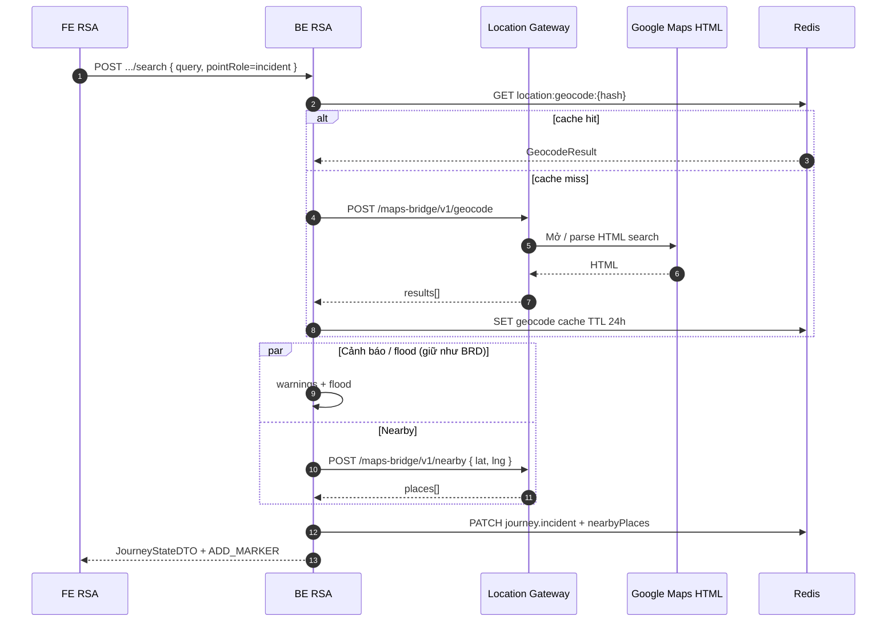

# Phân tích — API Location Gateway (Google Maps HTML Bridge)

| Thuộc tính | Giá trị |
|------------|---------|
| Phiên bản | 0.1 (draft) |
| Ngày | 15/07/2026 |
| Ngữ cảnh | Thay Geocoding/Places API chính thức bằng lớp trung gian scrape/parse HTML Google Maps (VN) |
| BRD liên quan | [`tim-kiem-vi-tri.md`](./tim-kiem-vi-tri.md) v1.7 |
| Spec chi tiết I/O | [`spec-maps-html-bridge-api.md`](./spec-maps-html-bridge-api.md) v1.2 |
| Trạng thái | **Đã chốt open points** (15/07/2026) |

---

## 1. AS-IS (theo BRD)

| Fact | Nguồn |
|------|--------|
| FE **không** gọi Google; BE RSA điều phối trung tâm | `[BRD:tim-kiem-vi-tri§1.3, 1.4]` |
| Sau tìm sự cố: Geocoding → warnings → **nearbyPlaces** → FE | `[BRD:tim-kiem-vi-tri§2.1 A5–A11]` |
| `nearbyPlaces` hiện mô tả lấy từ **CSDL RSA** (xăng, TTTM, mốc) | `[BRD:tim-kiem-vi-tri§2.1 A9]` |
| Geocode kết quả cần: `address`, `lat`, `lng`, `confidence` | `[BRD:tim-kiem-vi-tri§7.3]` |
| Cache geocode Redis `location:geocode:{hash}` TTL 24h | `[BRD:tim-kiem-vi-tri§7.4]` |
| Demo UI `NearbyPlace`: id, name, category, address, distanceKm, image, position | `[CODE:locationSearchMockData.ts]` |

**Gap chính:** BRD giả định Google Geocoding/Places API. Thực tế VN cần **Location Gateway** parse HTML Maps. Contract internal BE↔Gateway chưa có.

---

## 2. Kiến trúc đề xuất

```text
OSA → FE RSA → BE RSA (orchestrator)
                    │
                    ▼
           Location Gateway
           (service nội bộ)
                    │
                    ▼
         Google Maps (HTML / web)
              parse → DTO chuẩn
```

| Thành phần | Trách nhiệm |
|------------|-------------|
| **BE RSA** | Session Redis, warnings, flood, trạm RSA, hợp nhất JourneyStateDTO |
| **Location Gateway** | Chỉ tìm địa chỉ → tọa độ; lấy POI gần điểm; cache nội bộ; **không** biết session/journey |
| **FE** | Không gọi Gateway |

Nguyên tắc:

1. Gateway trả **dữ liệu thuần địa lý** — không gắn `sessionId`.
2. BE RSA gọi Gateway thay chỗ `Geocoding` / `Places` trong sequence A5 / A9 (nếu chốt nguồn nearby = Google).
3. Shape response ổn định; thay đổi parser HTML **không** làm gãy FE.

---

## 3. API 1 — Tìm theo địa chỉ (Geocode)

### 3.1. Mục đích

Chuẩn hóa mô tả địa chỉ / tên địa điểm → **1 hoặc nhiều** ứng viên `{ lat, lng }` + địa chỉ chuẩn.

Dùng cho: UC-01/02 (sự cố), UC-05/07/08 (trạm custom / kéo xe).

### 3.2. Contract

```
POST /maps-bridge/v1/geocode
Content-Type: application/json
```

**Request**

| Field | Type | Bắt buộc | Mô tả |
|-------|------|----------|--------|
| `query` | string | Có | Địa chỉ / tên địa điểm OSA nhập |
| `limit` | int | Không | Số ứng viên tối đa (đề xuất 1–5, default `5`) |

> `regionBias=VN`, `language=vi` hardcode config Gateway — không truyền API.

```json
{
  "query": "Ngã tư Sở, Thanh Xuân, Hà Nội",
  "limit": 5
}
```

**Response 200**

```json
{
  "requestId": "req-uuid",
  "query": "Ngã tư Sở, Thanh Xuân, Hà Nội",
  "results": [
    {
      "placeId": "gmhtml:...",
      "name": "Ngã tư Sở",
      "formattedAddress": "Ngã tư Sở, Thanh Xuân, Hà Nội, Việt Nam",
      "lat": 21.0012,
      "lng": 105.8145,
      "confidence": 0.91,
      "types": ["intersection", "geocode"],
      "source": "google_maps_html"
    }
  ]
}
```

| Field kết quả | BE RSA map sang |
|---------------|-----------------|
| `formattedAddress` / `name` | `journey.incident.address` |
| `lat`, `lng` | `journey.incident.lat/lng` |
| `confidence` | `journey.incident.confidence` |
| `placeId` | trace / cache key phụ (không bắt buộc FE) |

**Quy tắc chọn kết quả (BE):**

| Trường hợp | Hành vi đề xuất |
|------------|-----------------|
| `confidence ≥ 0.75` | Auto-pick `results[0]` → tiếp tục warnings + nearby |
| Nhiều kết quả / OSA cần chọn | Trả nguyên `results[]` — **FE tự xử lý UX** |
| `results = []` | `GEOCODE_NOT_FOUND` — không ghim marker (BR-UC01-01) |
| Gateway timeout / parse fail | `GEOCODE_UNAVAILABLE` — toast lỗi, không ghi journey |

**Mã lỗi**

| HTTP | code | Khi nào |
|------|------|---------|
| 400 | `INVALID_QUERY` | `query` rỗng / quá ngắn / quá dài |
| 404 | `GEOCODE_NOT_FOUND` | Parse OK nhưng không có điểm |
| 502 | `PROVIDER_ERROR` | HTML đổi cấu trúc / Google chặn / parse fail |
| 504 | `PROVIDER_TIMEOUT` | Vượt timeout Gateway (**4s**) |
| 429 | `RATE_LIMITED` | Quá hạn mức gọi |

---

## 4. API 2 — Danh sách điểm gần điểm đã tìm

### 4.1. Mục đích

Sau khi đã có `lat/lng` (từ API 1 hoặc điểm đã chọn), lấy danh sách **địa điểm tham chiếu lân cận** để OSA định vị nhanh (xăng, TTTM, mốc…).

> **Đã chốt:** nguồn **chỉ Google Maps HTML** — không CSDL RSA, không hybrid.

### 4.2. Contract

```
POST /maps-bridge/v1/nearby
Content-Type: application/json
```

*(POST thay GET để dễ gửi filter phức tạp và tránh lộ query dài trên log proxy.)*

**Request**

| Field | Type | Bắt buộc | Mô tả |
|-------|------|----------|--------|
| `lat` | number | Có | Tâm tìm kiếm |
| `lng` | number | Có | Tâm tìm kiếm |
| `radiusMeters` | int | Không | Default `1500` (đề xuất max `5000`) |
| `limit` | int | Không | Default `10`, max `20` |
| `categories` | string[] | Không | VD: `["gas_station","shopping_mall","landmark"]`. Rỗng = default set RSA |
| `anchorPlaceId` | string | Không | `placeId` từ API 1 — giúp Gateway tái dùng context HTML nếu có |

```json
{
  "lat": 21.0012,
  "lng": 105.8145,
  "radiusMeters": 1500,
  "limit": 10,
  "categories": ["gas_station", "shopping_mall", "landmark", "hospital"],
  "anchorPlaceId": "gmhtml:..."
}
```

**Response 200**

```json
{
  "requestId": "req-uuid",
  "center": { "lat": 21.0012, "lng": 105.8145 },
  "places": [
    {
      "placeId": "gmhtml:...",
      "name": "Cây xăng Petrolimex Nguyễn Trãi",
      "category": "gas_station",
      "categoryLabel": "Cây xăng",
      "formattedAddress": "…",
      "lat": 21.0021,
      "lng": 105.8130,
      "distanceMeters": 180,
      "distanceKm": 0.18,
      "imageUrl": null,
      "rating": null,
      "source": "google_maps_html"
    }
  ]
}
```

**Map sang FE `NearbyPlace`**

| Gateway | FE / JourneyState |
|---------|-------------------|
| `placeId` | `id` |
| `name` | `name` |
| `categoryLabel` hoặc map `category` | `category` |
| `formattedAddress` | `address` |
| `distanceKm` | `distanceKm` |
| `imageUrl` \|\| placeholder | `image` |
| `[lat, lng]` | `position` |

**Mã lỗi**

| HTTP | code | Khi nào |
|------|------|---------|
| 400 | `INVALID_COORDINATE` | lat/lng ngoài range / không phải VN (nếu chốt bound) |
| 400 | `INVALID_RADIUS` | radius vượt max |
| 200 + `places=[]` | — | Không có POI — **không** coi là lỗi cứng; FE ẩn khối hoặc empty state |
| 502 / 504 / 429 | giống API 1 | |

**Quy tắc BE sau geocode sự cố (đề xuất):**

1. Gọi API 1 → pick kết quả.
2. Gọi API 2 song song với warnings/flood *(hoặc tuần tự)*.
3. Nếu API 2 fail: vẫn ghim sự cố + warnings; `nearbyPlaces = []` + log — **không** fail cả UC-01.

---

## 5. Sequence tích hợp (BE RSA ↔ Gateway)



---

## 6. Gap & quyết định

| # | Chủ đề | Hiện tại (BRD) | Quyết định | Trạng thái |
|---|--------|----------------|------------|------------|
| 1 | Nguồn `nearbyPlaces` | CSDL RSA | **Chỉ Google Maps HTML** qua Gateway | Đã chốt |
| 2 | Nhiều kết quả geocode | BRD ngầm 1 điểm | Trả `results[]`; **FE tự xử lý UX** chọn | Đã chốt |
| 3 | Threshold confidence | Mock cố định | **0.75** (`≥ 0.75` auto-pick) | Đã chốt |
| 4 | Phân biệt API 2 vs trạm gần | Trạm = CSDL RSA | API 2 **không** thay `stations/nearby` | Giữ |
| 5 | Timeout / SLA | Chưa có | Geocode **4s**, Nearby **4s** | Đã chốt |
| 6 | Cache | Geocode 24h Redis BE | BE cache đủ; Gateway cache ngắn (VD 1h) | Infra — không blocking |
| 7 | Auth Gateway | Chưa có | mTLS hoặc internal API key | Infra — không blocking |
| 8 | Ảnh POI | Mock có `image` | Cho phép `null` + FE placeholder | Giữ |

---

## 7. Câu hỏi còn lại (không blocking contract)

1. Categories default cho RSA cứu hộ có cần chỉnh bộ enum không? *(spec đã có default)*
2. Location Gateway deploy riêng hay module trong BE RSA?

---

## Kết luận

- **Đã rõ / đã chốt:** 2 API Gateway; nearby **chỉ** Google HTML; confidence **0.75**; nhiều ứng viên do **FE xử lý**; timeout **4s / 4s**.
- **Chưa chốt (không blocking):** deploy model Gateway, tinh chỉnh categories.
- **Sẵn sàng đồng bộ BRD** `tim-kiem-vi-tri.md` bước A5/A9: **Có** (khi user yêu cầu).
