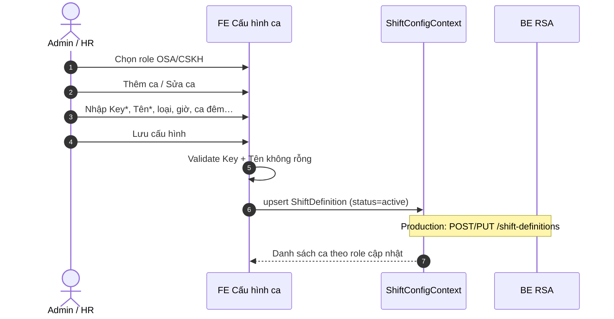

# Tài liệu nghiệp vụ — Cấu hình ca làm việc

| Thuộc tính | Giá trị |
|------------|---------|
| Phiên bản | 1.2 |
| Ngày | 13/07/2026 |
| Màn UI | `ShiftDefinitionManagement` — Menu **Quản trị hệ thống > Nhân sự > Cấu hình ca làm việc** |
| Route | `/shift-definition-management` |
| Liên quan | [`lich-ca-theo-thang.md`](./lich-ca-theo-thang.md) |

---

## 1. Mô tả nghiệp vụ

### 1.1. Mục đích

Màn **Cấu hình ca làm việc** quản lý **dữ liệu gốc KEY ca** (khung giờ + định biên min/max) theo nhóm role (**OSA** / **CSKH**) trên **một bảng duy nhất**. KEY ca (C1, CG1…) dùng cho lưới lịch tháng và import Excel. Màn này **không** phân ca theo ngày — phân ca nằm ở [`Lịch ca theo tháng`](./lich-ca-theo-thang.md).

### 1.2. Trong phạm vi (In scope)

| Hạng mục | Mô tả |
|----------|--------|
| KEY ca | Tạo / sửa / xóa định nghĩa ca theo role |
| Thuộc tính ca | Loại ca, khung giờ, ca đêm, nghỉ H+1, ca gãy (buổi), mô tả |
| Định biên | **Tối thiểu / tối đa** người trên cùng dòng ca (gộp 1 bảng) |
| Lọc | Role, tìm KEY/tên, loại ca |
| Chia sẻ state | Cùng `ShiftConfigProvider` với Lịch ca theo tháng |

### 1.3. Ngoài phạm vi (Out of scope)

- Phân ca NV theo ngày / tháng
- Mong muốn ngày nghỉ / ngày ưu tiên của NV
- Sắp xếp ca tự động
- Upload/parse Excel lịch tháng
- Phân quyền chi tiết trên UI demo *(chưa có ACL)*
- Nút **Tải template Excel** hiện **chưa gắn** logic tải file

### 1.4. Hệ thống tham gia

| Hệ thống | Vai trò |
|----------|---------|
| **Admin / HR** | Cấu hình KEY ca (kèm định biên) |
| **FE RSA** | Màn Cấu hình ca làm việc |
| **ShiftConfigContext** | State dùng chung với Lịch ca theo tháng |
| **BE** *(production)* | CRUD định nghĩa ca (gồm minStaff/maxStaff) |

---

## 2. Sequence flow and description

### 2.1. Sequence — Tạo / cập nhật KEY ca

#### Bảng mô tả

| Step | Step name | Actor | Description |
|:----:|-----------|-------|-------------|
| 1 | Chọn role | Admin | Chip **OSA** / **CSKH** — scope toàn màn. |
| 2 | Mở form | Admin | **Thêm ca làm việc** hoặc **Sửa**. |
| 3 | Nhập | Admin | Key ca (UPPERCASE), tên, loại, giờ, min/max; nếu SPLIT → buổi; nếu đêm → nghỉ H+1. |
| 4 | Lưu | FE | Chặn nếu thiếu Key/Tên. Nếu đang **sửa** và KEY còn ô lịch tương lai → **modal cảnh báo** trước khi ghi. |
| 5 | Đồng bộ | System | Lịch ca theo tháng đọc lại KEY `active` của role. |

### 2.2. Sequence — Xóa ca

| Step | Step name | Actor | Description |
|:----:|-----------|-------|-------------|
| D1 | Bấm Xóa | Admin | Icon xóa trên dòng danh sách ca. |
| D2 | Check usage | FE | Đếm ô lịch **tương lai** (sau hôm nay) đang gán KEY trên tháng hiện tại. |
| D3a | Không dùng | FE | Xóa ngay khỏi context. |
| D3b | Có dùng | FE | Mở **modal cảnh báo** (số ô / NV / ngày) → xác nhận mới xóa. |
| D4 | Phạm vi | System | Quá khứ + hôm nay **không** bị đụng bởi thao tác này. |

---

## 3. Permission

| Vai trò | Quyền | Ghi chú |
|---------|-------|---------|
| **Admin / HR** | Xem + CRUD KEY ca (kèm min/max) | Implied — menu Quản trị hệ thống |
| **OSA / CSKH** | — | Không vào màn cấu hình |
| **System** | Cung cấp định mức công tháng *(BE)* | Không cấu hình tại màn này |

---

## 4. Screen Description

### 4.1. Luồng màn hình

| # | Tên màn / Dialog | Điều kiện vào | Hành động chính |
|---|------------------|---------------|-----------------|
| 1 | **Cấu hình ca làm việc** | Menu Quản trị hệ thống > Nhân sự | Lọc role; CRUD ca (kèm định biên) |
| 2 | **Dialog — Thêm/Sửa ca** | Thêm ca / Sửa | Lưu KEY ca + khung giờ + min/max |
| 3 | **Dialog — Cảnh báo impact lịch** | Lưu sửa / Xóa khi KEY có ô tương lai | Xác nhận trước khi commit |

### 4.2. Bảng field (toàn bộ màn & dialog)

| Screen | Field | UI (Capture UI) | Data type | Mandatory | Description | Data |
|--------|-------|-----------------|-----------|:---------:|-------------|------|
| Cấu hình ca làm việc | page_title | Label (H1) | String | N | Tiêu đề màn | `Cấu hình ca làm việc` |
| Cấu hình ca làm việc | info_banner | Callout | String | N | Giải thích KEY + định biên | KEY dùng Excel/lịch; min/max theo từng KEY |
| Cấu hình ca làm việc | role | Toggle button | Enum | Y | Scope OSA/CSKH | `OSA` \| `CSKH` |
| Cấu hình ca làm việc | search | Text input | String | N | Tìm key / tên / mô tả | Placeholder: `Key ca, tên ca...` |
| Cấu hình ca làm việc | filter_type | Select | Enum | N | Lọc loại ca | Tất cả / Ca hành chính / Ca theo khung giờ / Ca gãy |
| Cấu hình ca làm việc | count_label | Label | String | N | Số ca sau lọc | `N ca được cấu hình cho {role}` |
| Cấu hình ca làm việc | btn_template | Button | Action | N | Tải template KEY ca | **Tải template Excel (key ca)** — demo chưa gắn |
| Cấu hình ca làm việc | btn_add_shift | Button primary | Action | N | Mở dialog thêm ca | **Thêm ca làm việc** |
| Danh sách ca | section_title | Section header | String | N | Một bảng duy nhất | `Danh sách ca — {role}` |
| Danh sách ca | stt | Table column | Number | N | STT | 1…n |
| Danh sách ca | shiftKey | Badge mono | String | N | KEY ca | VD: `C1`, `CG1`, `OT` |
| Danh sách ca | name | Table column | String | N | Tên ca | VD: `Ca 1` |
| Danh sách ca | type | Badge | Enum | N | Loại ca | ADMIN / TIME_SLOT / SPLIT |
| Danh sách ca | time_range | Table column | String | N | Khung giờ | `{timeStart} – {timeEnd}` |
| Danh sách ca | minStaff | Badge / number | Number | N | Tối thiểu người | Amber badge; `—` nếu trống |
| Danh sách ca | maxStaff | Table column | Number | N | Tối đa (cảnh báo thừa) | `—` nếu trống |
| Danh sách ca | night_flag | Badge | String | N | Ca đêm / nghỉ H+1 | `Nghỉ H+1` / `Đêm` / `—` |
| Danh sách ca | status | Badge | Enum | N | Trạng thái | Hoạt động / Ngừng |
| Danh sách ca | actions | Icon buttons | Action | N | Sửa / Xóa | Xóa không confirm |
| Dialog — Ca | dialog_title | Modal header | String | N | Tiêu đề | `Thêm/Chỉnh sửa ca làm việc — {role}` |
| Dialog — Ca | shiftKey | Text (UPPERCASE) | String | Y | KEY Excel / lưới | Placeholder `VD: HC, S1, G1` |
| Dialog — Ca | name | Text | String | Y | Tên hiển thị | — |
| Dialog — Ca | type | Select | Enum | N | Loại ca | Default `TIME_SLOT` |
| Dialog — Ca | timeStart | Time input | HH:mm | N | Giờ bắt đầu | Default `08:00` |
| Dialog — Ca | timeEnd | Time input | HH:mm | N | Giờ kết thúc | Default `17:00` |
| Dialog — Ca | minStaff | Number | Number | N | Tối thiểu (người) | Default `3` |
| Dialog — Ca | maxStaff | Number | Number | N | Tối đa (cảnh báo thừa) | Default `5`; có thể để trống |
| Dialog — Ca | splitPart | Select | Enum | N | Chỉ khi SPLIT | AM / PM |
| Dialog — Ca | isNightShift | Checkbox | Boolean | N | Ca đêm | Default `false` |
| Dialog — Ca | restDayAfterShift | Checkbox | Boolean | N | Hiện khi ca đêm | Nghỉ cả ngày hôm sau |
| Dialog — Ca | description | Textarea | String | N | Mô tả | — |
| Dialog — Ca | btn_save | Button primary | Action | N | Validate → lưu (có thể mở cảnh báo) | **Lưu cấu hình** |
| Dialog — Cảnh báo impact | title | Modal header | String | N | Theo action | Sửa / Xóa ca đang dùng trên lịch tương lai |
| Dialog — Cảnh báo impact | shiftKey | Label mono | String | N | KEY bị ảnh hưởng | VD: `C1` |
| Dialog — Cảnh báo impact | usage_summary | Text | String | N | Thống kê usage | Số ô / NV / danh sách ngày tháng hiện tại |
| Dialog — Cảnh báo impact | scope_note | Hint | String | N | Phạm vi giữ nguyên | Quá khứ + hôm nay giữ; ô tương lai giữ KEY trừ khi sửa lịch |
| Dialog — Cảnh báo impact | btn_cancel | Button | Action | N | Đóng, không commit | **Hủy** |
| Dialog — Cảnh báo impact | btn_confirm | Button danger/warn | Action | N | Commit sửa hoặc xóa | **Xác nhận lưu** / **Xác nhận xóa** |

---

## 5. Use Cases

| UC | Tên use case | Nhóm | Actor | Tiền điều kiện | Các bước | Hậu điều kiện | Quy tắc |
|:---:|--------------|------|-------|-----------------|----------|---------------|---------|
| UC-01 | Chọn nhóm role | Lọc | Admin | Vào màn | 1. Bấm chip OSA/CSKH 2. FE reset filter loại ca = Tất cả 3. Hai bảng reload theo role | Scope role hiện tại | BR-01 |
| UC-02 | Tìm / lọc danh sách ca | Lọc | Admin | Có dữ liệu ca | 1. Nhập search và/hoặc chọn loại ca 2. Bảng lọc realtime | List khớp bộ lọc | BR-02 |
| UC-03 | Thêm KEY ca | Ca | Admin | Đã chọn role | 1. **Thêm ca làm việc** 2. Nhập Key*, Tên*, loại, giờ, min/max… 3. **Lưu cấu hình** 4. Append definition `active` | KEY mới trên list & lịch tháng | BR-03–06, 08 |
| UC-04 | Sửa KEY ca | Ca | Admin | Có dòng ca | 1. **Sửa** → form prefill (kèm min/max) 2. Đổi field → **Lưu** 3. Nếu KEY có ô lịch tương lai → modal cảnh báo → xác nhận | Definition cập nhật theo `id` | BR-03, 08, 11 |
| UC-05 | Xóa KEY ca | Ca | Admin | Có dòng ca | 1. **Xóa** 2. Nếu KEY có ô lịch tương lai → modal cảnh báo → xác nhận; không thì xóa ngay | KEY biến mất khỏi list | BR-07, 11 |
| UC-06 | Đồng bộ sang lịch tháng | Tích hợp | System | Có KEY `active` | 1. Context cập nhật 2. Màn Lịch ca đọc `getShiftDefinitionsForRole` | Popup KEY / auto-schedule dùng KEY + minStaff | BR-09 |

---

## 6. Rule bases

### 6.1. Quy tắc tổng hợp

| ID | Quy tắc |
|----|---------|
| **BR-01** | Mọi thao tác luôn gắn **một** role: `OSA` hoặc `CSKH`. |
| **BR-02** | Search khớp `shiftKey`, `name`, `description` (không phân biệt hoa thường). |
| **BR-03** | Tạo/sửa ca: **Key ca** và **Tên ca** bắt buộc; Key ép **UPPERCASE**. |
| **BR-04** | Loại ca: `ADMIN` / `TIME_SLOT` / `SPLIT`. Field **Buổi** chỉ khi `SPLIT`. |
| **BR-05** | Ca đêm: checkbox **Ca đêm**; có thể bật **nghỉ cả ngày hôm sau (H+1)**. |
| **BR-06** | Lịch tháng / auto-schedule chỉ dùng definition `status=active`. |
| **BR-07** | Xóa ca: nếu KEY **không** có ô lịch tương lai → xóa ngay; nếu có → bắt buộc confirm trên modal. |
| **BR-08** | Định biên **theo từng KEY**: `minStaff` / `maxStaff` nhập trên form ca; hiển thị trên cùng bảng danh sách. |
| **BR-09** | Đổi KEY / min-max trên màn này ảnh hưởng ngay Lịch ca theo tháng (cùng Provider). |
| **BR-10** | Không còn bảng / dialog **Khung giờ & số người** riêng — đã gộp vào danh sách ca (v1.1). |
| **BR-11** | Sửa/xóa ca khi KEY còn gán trên **ngày sau hôm nay** (tháng hiện tại, mock lịch): hiện modal cảnh báo (số ô, NV, ngày). Quá khứ + hôm nay không bị clear bởi thao tác cấu hình. |

### 6.2. Quy tắc theo UC

| UC | Rule ID | Mô tả ngắn |
|----|---------|------------|
| UC-03 | BR-UC03-01 | `id` tạo mới: `{role}-{shiftKey.lower}-{timestamp}`. |
| UC-04/05 | BR-UC04-01 | Modal chỉ hiện khi `cellCount` usage tương lai > 0. |
| UC-05 | BR-UC05-01 | Production có thể soft-delete / chặn xóa cứng nếu policy chặt hơn confirm. |

### 6.3. Open points

| # | Nội dung | Trạng thái |
|---|----------|------------|
| 1 | Bật/tắt `status` trên form | Chỉ hiển thị list |
| 2 | Tải template Excel KEY | Button chưa gắn |
| 3 | Persist API | Demo in-memory |
| 4 | Đồng bộ `timeSlotRules` legacy trong context (nếu còn) khi sửa min/max | Optional cleanup |

### 6.4. Enum & nhãn

| Trường | Giá trị | Nhãn UI |
|--------|---------|---------|
| role | `OSA` / `CSKH` | OSA / CSKH |
| type | `ADMIN` / `TIME_SLOT` / `SPLIT` | Ca hành chính / Ca theo khung giờ / Ca gãy (Nửa ca) |
| status | `active` / `inactive` | Hoạt động / Ngừng |
| splitPart | `AM` / `PM` | Nửa ca sáng / Nửa ca chiều |

---

## Phụ lục

### A. KEY ca mẫu (mock)

| KEY | Tên | Loại | Giờ | Ghi chú |
|-----|-----|------|-----|---------|
| CG1–CG6 | Ca gãy 1–6 | SPLIT | 07:00–11:00 … 17:30–21:30 | staffingGroup SPLIT |
| C1 | Ca 1 | TIME_SLOT | 07:00–15:00 | FULL, min 3–5 |
| C2 | Ca 2 | TIME_SLOT | 13:30–21:30 | FULL |
| C3 | Ca 3 | TIME_SLOT | 21:30–07:00 | Đêm + nghỉ H+1 |
| OT | Ca OT | TIME_SLOT | (CSKH) | `isOvertime` |

### B. Liên kết

- Lịch phân ca: [`lich-ca-theo-thang.md`](./lich-ca-theo-thang.md)
- Code: `pages/ShiftDefinitionManagement.tsx`, `data/shiftConfigMockData.ts`, `context/ShiftConfigContext.tsx`
