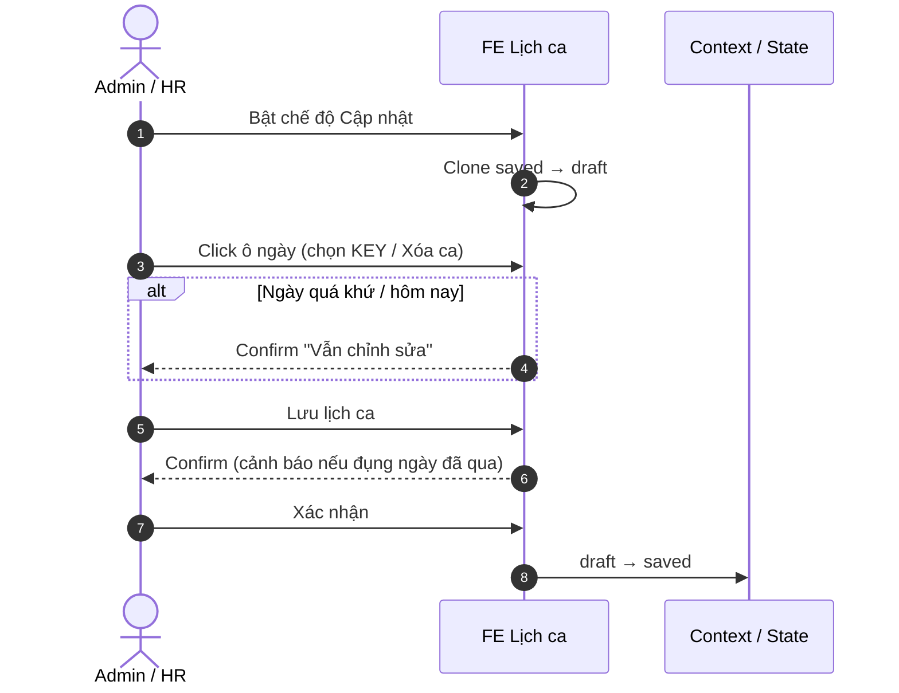
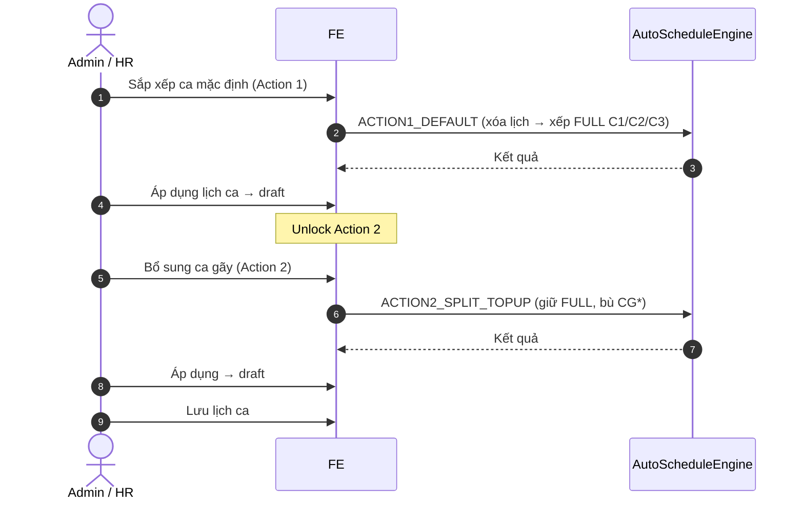

# Tài liệu nghiệp vụ — Lịch ca theo tháng

| Thuộc tính | Giá trị |
|------------|---------|
| Phiên bản | 1.0 |
| Ngày | 13/07/2026 |
| Màn UI | `ShiftMonthlySchedule` — Menu **Quản trị hệ thống > Nhân sự > Lịch ca theo tháng** |
| Route | `/shift-monthly-schedule` |
| Liên quan | [`cau-hinh-ca-lam-viec.md`](./cau-hinh-ca-lam-viec.md) |

---

## 1. Mô tả nghiệp vụ

### 1.1. Mục đích

Màn **Lịch ca theo tháng** giúp Admin/HR **xem và cập nhật** lịch phân ca theo tháng cho nhân sự **OSA** / **CSKH**: lưới NV × ngày, gán KEY ca (hỗ trợ nhiều ca/ngày), theo dõi đủ/thiếu theo buổi, **sắp xếp tự động** (2 bước), cấu hình **mong muốn theo ca**, và **import Excel** (preview).

KEY ca lấy từ màn [`Cấu hình ca làm việc`](./cau-hinh-ca-lam-viec.md) qua `ShiftConfigProvider`.

### 1.2. Trong phạm vi (In scope)

| Hạng mục | Mô tả |
|----------|--------|
| Lưới tháng | Xem / cập nhật assignment NV × ngày |
| Multi-KEY / ngày | VD `C1+CG1`; OFF = không ca |
| Tổng hợp buổi | Sáng / chiều / đêm + tổng quy đổi + số NV OFF |
| Auto-schedule | Action 1: ca mặc định (FULL); Action 2: bổ sung ca gãy |
| Mong muốn theo ca | Ngày nghỉ / muốn đi làm theo từng KEY |
| Excel | Upload preview + xác nhận import *(demo mock)* |
| Draft / Lưu | Chỉ **Lưu lịch ca** mới commit |

### 1.3. Ngoài phạm vi (Out of scope)

- CRUD KEY ca / định biên min-max *(màn cấu hình)*
- Parse Excel thật / nút **Tải mẫu** gắn file *(demo chưa)*
- Persist API lịch / preference *(in-memory)*
- Validate overlap giờ khi gán tay
- Highlight UNDERSTAFFED theo từng KEY trên ô NV *(tính trong data, UI chưa tô)*

### 1.4. Hệ thống tham gia

| Hệ thống | Vai trò |
|----------|---------|
| **Admin / HR** | Xem / cập nhật lịch, auto, import, preference |
| **FE RSA** | Màn Lịch ca theo tháng |
| **AutoScheduleEngine** | Thuật toán xếp ca mặc định & bù ca gãy |
| **ShiftConfigContext** | KEY ca `active`, preference, định mức công tháng (mock BE) |
| **BE** *(production)* | Roster, save schedule, đơn thực tế theo ngày |

---

## 2. Sequence flow and description

### 2.1. Sequence — Cập nhật lịch thủ công & lưu

#### Bảng mô tả

| Step | Step name | Actor | Description |
|:----:|-----------|-------|-------------|
| 1 | Vào edit | Admin | Toggle **Cập nhật** → làm việc trên **draft**. |
| 2 | Gán ca | Admin | Click ô → checkbox multi-KEY; **Xóa ca** = OFF. |
| 3 | Ngày quá khứ | FE | Bắt buộc confirm trước khi mở editor. |
| 4 | Lưu | Admin | **Lưu lịch ca** → confirm → commit draft. |
| 5 | Hủy / thoát | Admin | **Hủy thay đổi** hoặc về **Xem** khi dirty → confirm discard. |

### 2.2. Sequence — Sắp xếp ca tự động (2 bước)

#### Bảng mô tả

| Step | Step name | Actor | Description |
|:----:|-----------|-------|-------------|
| A1 | Action 1 | Admin | **Sắp xếp ca mặc định** — clear assignments, xếp ca FULL theo `minStaff` KEY. |
| A2 | Áp dụng | Admin | Ghi vào draft; `autoStep = action1_done`. |
| A3 | Action 2 | Admin | **Bổ sung ca gãy** — chỉ enable sau A2; bù SPLIT theo coverage. |
| A4 | Lưu | Admin | Commit như UC lưu thủ công. |

### 2.3. Sequence — Mong muốn theo ca & Import Excel

| Step | Step name | Actor | Description |
|:----:|-----------|-------|-------------|
| P1 | Mở preference | Admin | **Mong muốn theo ca** → chọn KEY, NV, ngày nghỉ / muốn đi làm. |
| P2 | Lưu preference | FE | Ghi context **ngay** (không qua Lưu lịch ca). |
| E1 | Upload | Admin | **Upload Excel** → overlay xử lý → preview impact. |
| E2 | Confirm | Admin | **Xác nhận import** (+ native confirm nếu đụng ngày quá khứ) → draft. |

---

## 3. Permission

| Vai trò | Quyền | Ghi chú |
|---------|-------|---------|
| **Admin / HR** | Xem + cập nhật lịch, auto, preference, import | Menu Quản trị hệ thống |
| **OSA / CSKH** | — | Chỉ là đối tượng được xếp ca trên lưới |
| **System / BE** | Định mức công tháng; dữ liệu đơn thực tế | Mock: OSA 16, CSKH 18 |

---

## 4. Screen Description

### 4.1. Luồng màn hình

| # | Tên màn / Dialog | Điều kiện vào | Hành động chính |
|---|------------------|---------------|-----------------|
| 1 | **Lịch ca theo tháng** | Menu > Lịch ca theo tháng | Xem/cập nhật lưới; auto; import |
| 2 | **Popover — Chọn ca ô** | Click ô (Cập nhật) | Multi-KEY / Xóa ca |
| 3 | **Dialog — Mong muốn theo ca** | Mong muốn theo ca | Ngày nghỉ / muốn đi làm |
| 4 | **Dialog — Kết quả auto** | Sau Action 1/2 | Áp dụng lịch ca |
| 5 | **Dialog — Preview Excel** | Sau upload | Xác nhận import |
| 6 | **Dialog — Cảnh báo ngày quá khứ** | Sửa ô past/today | Vẫn chỉnh sửa |
| 7 | **Dialog — Lưu / Hủy / Thoát** | Lưu hoặc discard | Confirm |

### 4.2. Bảng field (toàn bộ màn & dialog)

| Screen | Field | UI (Capture UI) | Data type | Mandatory | Description | Data |
|--------|-------|-----------------|-----------|:---------:|-------------|------|
| Lịch ca theo tháng | page_title | Label (H1) | String | N | Tiêu đề | `Lịch ca tháng {MM/YYYY}` |
| Lịch ca theo tháng | subtitle | Helper | String | N | Công thức quy đổi | Ca gãy = 0.5, ca nguyên = 1 |
| Lịch ca theo tháng | view_mode | Toggle | Enum | Y | Xem / Cập nhật | Default **Xem** |
| Lịch ca theo tháng | btn_template | Button | Action | N | Tải mẫu Excel | **Tải mẫu** — demo chưa gắn |
| Lịch ca theo tháng | btn_upload | Button | Action | N | Chỉ khi Cập nhật | **Upload Excel**; `.xlsx,.xls,.csv` |
| Lịch ca theo tháng | role | Toggle | Enum | Y | Roster theo role | `OSA` \| `CSKH` |
| Lịch ca theo tháng | month | Month input | YYYY-MM | Y | Đổi tháng → rebuild roster | Default mock `2026-07` |
| Lịch ca theo tháng | btn_preference | Button | Action | N | Chỉ Cập nhật | **Mong muốn theo ca** |
| Lịch ca theo tháng | btn_action1 | Button | Action | N | Auto FULL | **Sắp xếp ca mặc định** |
| Lịch ca theo tháng | btn_action2 | Button | Action | N | Auto SPLIT; disable đến khi Action 1 áp dụng | **Bổ sung ca gãy** |
| Lịch ca theo tháng | btn_discard | Button | Action | N | Hủy draft | **Hủy thay đổi** — disable nếu không dirty |
| Lịch ca theo tháng | btn_save | Button primary | Action | N | Commit draft | **Lưu lịch ca** — badge số ô đổi |
| Lịch ca theo tháng | chips_summary | Chips | Object | N | Đếm buổi | Thiếu / Thừa / Đủ |
| Lưới | emp_name | Text | String | N | Tên NV | — |
| Lưới | emp_code | Text mono | String | N | Mã NV | `OSA-001`, `CSKH-001` |
| Lưới | badge_new | Badge | Boolean | N | NV mới | **MỚI** |
| Lưới | month_units | Chip | String | N | Công tháng | `{assigned}/{minUnits}` — OSA `/16`, CSKH `/18` |
| Lưới | day_header | Column header | Number | N | Ngày 1…N + thứ | CN, T2…T7; quá khứ xám |
| Lưới | cell_assignment | Cell / button | String\|null | N | KEY hoặc multi `A+B`; null = OFF | VD: `C1`, `CG1+CG2`, `—` / `·` |
| Lưới | actual_badge | Badge | Enum | N | Ngày quá khứ | `Nđ` có đơn / `0đ` xếp ca không đơn |
| Lưới | summary_morning | Row | Number | N | Buổi sáng (quy đổi) | C1 + CG1/CG2 |
| Lưới | summary_afternoon | Row | Number | N | Buổi chiều | C2 + CG3–CG6 |
| Lưới | summary_night | Row | Number | N | Buổi đêm | C3 |
| Lưới | summary_total | Row | String | N | Tổng quy đổi / định mức ngày | vs sum minStaff C1+C2+C3 |
| Lưới | summary_off | Row | Number | N | Số NV OFF trong ngày | — |
| Popover chọn ca | shift_keys | Checkbox list | String[] | N | KEY `active` của role | CG1–CG6, C1–C3 (+ OT CSKH) |
| Popover chọn ca | btn_clear | Link | Action | N | Xóa ca ô | **Xóa ca** |
| Popover chọn ca | btn_close | Link | Action | N | Đóng | **Đóng** |
| Dialog — Preference | dialog_title | Modal header | String | N | Tiêu đề | `Mong muốn theo ca — {role} tháng {MM/YYYY}` |
| Dialog — Preference | search_emp | Search | String | N | Lọc NV | Placeholder tìm tên, mã |
| Dialog — Preference | employee | List select | String | Y | NV đang cấu hình | — |
| Dialog — Preference | off_quota | Badge | String | N | Đếm ngày nghỉ unique | `{n}/4` |
| Dialog — Preference | calendar | Month grid | Object | N | Chip nghỉ (đỏ) + muốn đi (xanh) đồng thời mọi KEY | Click mở popover |
| Dialog — Preference | day_popover | Popover | Action | N | Danh sách KEY ca trên ngày | **Nghỉ** / **Muốn đi** (toggle) |
| Dialog — Preference | btn_done | Button | Action | N | Đóng; đã lưu context | **Xong** |
| Dialog — Auto result | body | Text | String | N | Tóm tắt kết quả | Action 1 hoặc 2 |
| Dialog — Auto result | btn_apply | Button primary | Action | N | Ghi draft | **Áp dụng lịch ca** |
| Dialog — Excel preview | file_name | Text | String | N | Tên file | — |
| Dialog — Excel preview | impact | Read-only | Object | N | Số NV/ô đổi; cảnh báo quá khứ | Mock cycle |
| Dialog — Excel preview | btn_confirm | Button | Action | N | Import → draft | **Xác nhận import** |
| Dialog — Past edit | body | Warning | String | N | Cảnh báo sửa ngày đã/đang diễn ra | — |
| Dialog — Past edit | btn_force | Button | Action | N | Tiếp tục sửa | **Vẫn chỉnh sửa** |
| Dialog — Save | body | Confirm | String | N | Xác nhận lưu (+ cảnh báo quá khứ) | **Lưu lịch ca** |
| Dialog — Discard | body | Confirm | String | N | Bỏ thay đổi / thoát Cập nhật | **Thoát & bỏ thay đổi** |

---

## 5. Use Cases

| UC | Tên use case | Nhóm | Actor | Tiền điều kiện | Các bước | Hậu điều kiện | Quy tắc |
|:---:|--------------|------|-------|-----------------|----------|---------------|---------|
| UC-01 | Xem lịch tháng | Xem | Admin | Vào màn | 1. Chọn role + tháng 2. Xem lưới & tổng hợp buổi | — | BR-01, 02 |
| UC-02 | Bật cập nhật & gán ca | Sửa | Admin | Mode Cập nhật | 1. Toggle **Cập nhật** 2. Click ô → chọn KEY 3. (Past) confirm 4. Draft dirty | Ô đổi trên draft | BR-03–05 |
| UC-03 | Lưu lịch ca | Sửa | Admin | Draft dirty | 1. **Lưu lịch ca** 2. Confirm 3. draft → saved | Lịch persisted (memory) | BR-03 |
| UC-04 | Hủy / thoát bỏ thay đổi | Sửa | Admin | Draft dirty | 1. **Hủy thay đổi** hoặc về **Xem** 2. Confirm discard | Draft bị hủy | BR-03 |
| UC-05 | Sắp xếp ca mặc định | Auto | Admin | Mode Cập nhật | 1. **Sắp xếp ca mặc định** 2. *(Giữa tháng)* chọn phạm vi: cả tháng / giữ quá khứ / Hủy 3. Xem kết quả → **Áp dụng** 4. Unlock Action 2 | Draft FULL mới | BR-10–13, 18 |
| UC-06 | Bổ sung ca gãy | Auto | Admin | Đã áp Action 1 | 1. **Bổ sung ca gãy** 2. Áp dụng → draft | SPLIT bù coverage | BR-14, 15 |
| UC-07 | Cấu hình mong muốn theo ca | Pref | Admin | Mode Cập nhật | 1. **Mong muốn theo ca** 2. Chọn NV 3. Bấm ngày → popover chọn KEY (Nghỉ / Muốn đi) 4. *(Nếu tháng đã có lịch)* confirm lần đầu đổi 5. **Xong** | Pref lưu context ngay; lịch hiện đồng thời nghỉ+đi; `autoStep` reset nếu confirm khi đã xếp | BR-16, 19, 20 |
| UC-08 | Import Excel | Import | Admin | Mode Cập nhật | 1. Upload file 2. Preview impact 3. Xác nhận import | Draft theo preview | BR-17 |
| UC-09 | Đổi role / tháng | Lọc | Admin | — | 1. Đổi chip/tháng 2. Rebuild roster mock | Draft hiện tại mất (không confirm riêng) | BR-01 |

---

## 6. Rule bases

### 6.1. Quy tắc tổng hợp

| ID | Quy tắc |
|----|---------|
| **BR-01** | Chỉ xếp ca cho **OSA** hoặc **CSKH**; KEY lấy từ definition `active` cùng role. |
| **BR-02** | Quy đổi: ca nguyên (FULL/OT) = **1**; ca gãy (SPLIT) = **0.5**. |
| **BR-03** | Mọi sửa (tay / auto / import) vào **draft**; chỉ **Lưu lịch ca** mới thành lịch chính thức. |
| **BR-04** | Một ô: tối đa multi-KEY join `+`; null = OFF. |
| **BR-05** | Giới hạn engine trong ngày: max 4 KEY, max 2 FULL, max 4 SPLIT, không trùng KEY. |
| **BR-06** | Buổi sáng = C1 + CG1/CG2; chiều = C2 + CG3–CG6; đêm = C3. |
| **BR-07** | Định mức buổi ngày = `minStaff` của C1/C2/C3 từ cấu hình ca. |
| **BR-08** | Định mức công tháng (mock BE): OSA **16**, CSKH **18**. |
| **BR-09** | Sửa ngày quá khứ / hôm nay: bắt buộc confirm. |
| **BR-10** | Action 1 (tháng khác / không giữa tháng): **xóa hết** assignment → xếp FULL (đêm trước, rồi `minStaff` cao). |
| **BR-11** | Candidate Action 1: không blocked (nghỉ H+1 / offDays); preferred +điểm; thiếu quota tháng ưu tiên. |
| **BR-12** | Ca đêm C3: `restDayAfterShift` → không xếp hôm sau (engine). |
| **BR-13** | Action 1 UI **không** gán OT (OT chỉ mode FULL nội bộ). |
| **BR-14** | Action 2 chỉ enable sau khi đã **Áp dụng** Action 1 trong session. |
| **BR-15** | Action 2: giữ FULL; bù SPLIT theo thiếu coverage; C3 không có fallback split. Giữa tháng chỉ bù từ **ngày mai**. |
| **BR-16** | Preference theo **NV × KEY × ngày**: một KEY trong một ngày chỉ **Nghỉ** hoặc **Muốn đi** (không đồng thời). Lịch tháng preference hiển thị **đồng thời** mọi KEY nghỉ (đỏ) và muốn đi (xanh). |
| **BR-17** | Import Excel demo: không parse file thật — preview mock; xác nhận ghi draft. |
| **BR-18** | **Giữa tháng** (tháng đang xem = tháng hiện tại, còn ngày tương lai): Action 1 mở popup chọn phạm vi. **(1) Xếp lại cả tháng** → xóa & xếp FULL từ ngày 1 (gồm quá khứ). **(2) Giữ quá khứ** → giữ 1→hôm nay, tính công còn lại, xếp FULL từ ngày mai không vượt định mức. **(3) Hủy** → đóng, không chạy. |
| **BR-19** | Đổi **mong muốn theo ca** khi tháng **đã có ô lịch gán KEY**: hiện banner; lần đầu chỉnh → confirm “đã xếp xong, cần xếp lại ca tháng”; xác nhận → lưu pref + reset `autoStep` (khóa Action 2). |
| **BR-20** | Tối đa **4 ngày nghỉ / NV / tháng** (unique theo ngày lịch, gộp mọi KEY). Vượt → chặn + cảnh báo **Quá số ngày nghỉ cho phép**. |

### 6.2. Quy tắc theo UC

| UC | Rule ID | Mô tả ngắn |
|----|---------|------------|
| UC-02 | BR-UC02-01 | Gán tay **không** enforce nghỉ H+1 / overlap giờ. |
| UC-05 | BR-UC05-01 | Sửa tay / import / đổi role-tháng → reset `autoStep` (khóa lại Action 2). |
| UC-07 | BR-UC07-01 | Preference không cần bấm Lưu lịch ca. |
| UC-09 | BR-UC09-01 | Production nên confirm khi dirty trước khi đổi tháng/role. |

### 6.3. Open points

| # | Nội dung | Trạng thái |
|---|----------|------------|
| 1 | Tải mẫu Excel | Button no-op |
| 2 | Parse Excel thật | Mock preview |
| 3 | Persist schedule / preference API | In-memory |
| 4 | Tô màu ô NV theo UNDERSTAFFED KEY | Data có, UI chưa gắn |
| 5 | Confirm khi dirty + đổi tháng/role | Chưa có |

### 6.4. Map KEY → buổi (quy đổi)

| Buổi | KEY góp |
|------|---------|
| Sáng | C1 (1) + CG1, CG2 (0.5) |
| Chiều | C2 (1) + CG3…CG6 (0.5) |
| Đêm | C3 (1) |

---

## Phụ lục

### A. Engine modes

| Mode | Nút UI | Hành vi |
|------|--------|---------|
| `ACTION1_DEFAULT` | Sắp xếp ca mặc định | Clear → xếp FULL |
| `ACTION2_SPLIT_TOPUP` | Bổ sung ca gãy | Giữ lịch; bù SPLIT |
| `FULL` | (không gọi từ UI) | Action1 + Action2 + OT khi thiếu |

### B. Liên kết

- Cấu hình KEY ca: [`cau-hinh-ca-lam-viec.md`](./cau-hinh-ca-lam-viec.md)
- Code: `pages/ShiftMonthlySchedule.tsx`, `data/autoScheduleEngine.ts`, `components/EmployeeShiftPreferenceModal.tsx`, `context/ShiftConfigContext.tsx`
