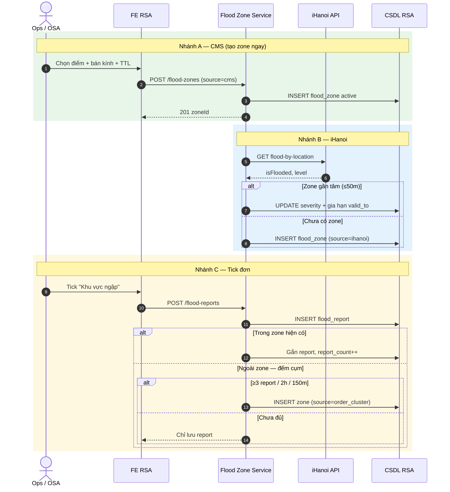
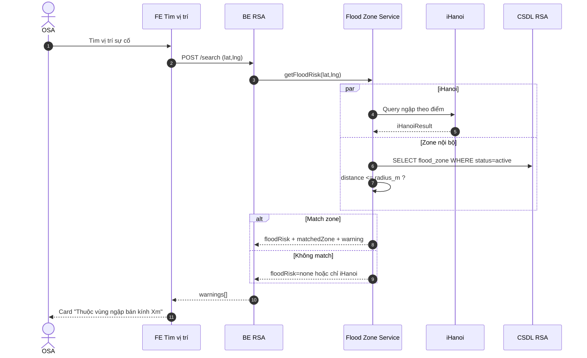
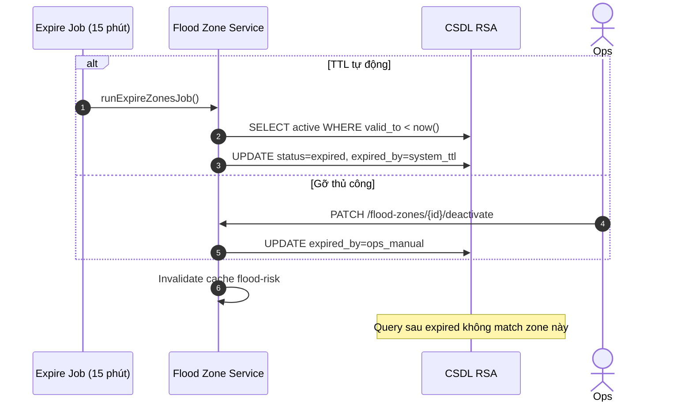

# Tài liệu nghiệp vụ — Quản lý khu vực ngập lụt (Flood Zone)

| Thuộc tính | Giá trị |
|------------|---------|
| Phiên bản | 1.4 |
| Ngày | 13/07/2026 |
| Diagram | [`flood-zone-flow.puml`](./flood-zone-flow.puml) |
| Màn UI | `FloodZoneManagement` — Menu **Quản trị hệ thống > Quản lý khu vực ngập lụt** |
| Liên quan | [`tim-kiem-vi-tri.md`](./tim-kiem-vi-tri.md) |

---

## 1. Mô tả nghiệp vụ

### 1.1. Mục đích

Màn **Quản lý khu vực ngập lụt** giúp Ops/Admin **xem, tạo, import và gỡ sớm** các vùng cảnh báo ngập trên CMS. Mỗi khu vực = **một tâm điểm (center) + bán kính cố định (radius_m)** — không dùng polygon, không theo Phường/Xã.

Hệ thống Flood Zone còn nhận zone từ **iHanoi** và **cụm báo cáo đơn** (ngoài màn này); khi OSA tìm vị trí sự cố, BE match điểm với zone `active` để hiển thị cảnh báo *(xem [`tim-kiem-vi-tri.md`](./tim-kiem-vi-tri.md))*.

### 1.2. Trong phạm vi (In scope)

| Hạng mục | Mô tả |
|----------|--------|
| **Màn CMS** | Danh sách / Bản đồ; lọc; tạo điểm; gỡ cảnh báo; xem chi tiết |
| **Import Excel** | Tải template CSV; upload preview; import dòng hợp lệ *(demo FE)* |
| Tạo zone | CMS thủ công, đồng bộ iHanoi, cụm báo cáo từ đơn (≥ ngưỡng) |
| Lưu report | Điểm ngập từ đơn (tick "Khu vực ngập") |
| Kiểm tra ngập | Khi tìm vị trí / validate tọa độ |
| Hết hạn | TTL riêng + job cron + gỡ thủ công trên CMS |

### 1.3. Ngoài phạm vi (Out scope)

- Ranh giới hành chính (Phường/Xã) làm đơn vị cảnh báo
- Vẽ polygon phức tạp trên CMS
- Reset toàn bộ zone lúc 00:00
- Tạo zone ngay khi OSA tick ngập trên **một** đơn lẻ
- Màn **Cài đặt** `flood_config` trên UI hiện tại *(chỉ mô tả nghiệp vụ — chưa có màn)*
- Parse Excel thật phía FE *(demo dùng preview mock)*

### 1.4. Hệ thống tham gia

| Hệ thống | Vai trò |
|----------|---------|
| **Ops / Admin** | CMS: tạo/gỡ zone, xem list/map, import Excel |
| **OSA** | Tick "Khu vực ngập" khi tạo đơn; xem cảnh báo trên màn tìm vị trí |
| **FE RSA** | Màn Quản lý khu vực ngập lụt; tìm vị trí; tạo đơn |
| **Flood Zone Service** | Orchestrator: tạo zone, match, expire, iHanoi |
| **Flood Report Handler** | Nhận `flood_report` từ đơn |
| **Flood Match Engine** | `distance(point, center) <= radius_m` |
| **Expire Job** | Cron TTL + dọn report cũ |
| **iHanoi Flood API** | Nguồn ngập công cộng |
| **CSDL RSA** | `flood_zone`, `flood_report`, `flood_config` |

---

## 2. Sequence flow and description

> PlantUML gốc: [`flood-zone-flow.puml`](./flood-zone-flow.puml) (Sơ đồ 1–19)

### 2.1. Sequence — Tạo Flood Zone (3 nguồn)

#### Bảng mô tả — Nhánh A: Ops tạo zone CMS

| Step | Step name | Actor | Description |
|:----:|-----------|-------|-------------|
| A1 | Mở CMS | Ops | Vào **CMS Cảnh báo ngập lụt**. |
| A2 | Chọn điểm | Ops | Click điểm trên bản đồ (không vẽ polygon). |
| A3 | Nhập tham số | Ops | Chọn mức độ (low/medium/high), bán kính (200/300/500m), thời hạn (`valid_to`). |
| A4 | Tạo zone | FE → FZS | `POST /flood-zones` `{ center, radius_m, severity, valid_to, source=cms }`. |
| A5 | Lưu DB | FZS → DB | `INSERT flood_zone` `status=active`. |
| A6 | Hiển thị | FE | Vòng tròn cảnh báo trên map CMS; zone có hiệu lực **ngay**. |

#### Bảng mô tả — Nhánh B: Đồng bộ iHanoi

| Step | Step name | Actor | Description |
|:----:|-----------|-------|-------------|
| B1 | Query iHanoi | FZS → iHanoi | `GET flood-by-location(lat,lng)` theo job hoặc trigger tìm vị trí. |
| B2 | Nhận kết quả | iHanoi → FZS | `isFlooded`, `level`, metadata. |
| B3 | Kiểm tra trùng | FZS | Tìm zone active có tâm cách ≤ **50m**. |
| B4a | Cập nhật zone cũ | FZS → DB | UPDATE `severity`; **gia hạn `valid_to`**. |
| B4b | Tạo zone mới | FZS → DB | INSERT `center=lat/lng`, `radius=config.default`, `source=ihanoi`. |

#### Bảng mô tả — Nhánh C: Tick "Khu vực ngập" trên đơn

| Step | Step name | Actor | Description |
|:----:|-----------|-------|-------------|
| C1 | Tick ngập | OSA | Trên màn **Tạo đơn cứu hộ**, tick **Khu vực ngập** khi lưu đơn. |
| C2 | Gửi report | FE → FZS | `POST /flood-reports` `{ orderId, lat, lng }`. |
| C3 | Lưu report | FZS → DB | INSERT `flood_report` — **chưa tạo zone**. |
| C4 | Check zone | FZS | Query zone active; tính distance report ↔ center. |
| C5a | Trong zone | FZS → DB | Gắn `zone_id`, `report_count++`; **không đổi radius/center**. |
| C5b | Ngoài zone | FZS | Đếm report lân cận: bán kính **150m**, cửa sổ **2 giờ**. |
| C6b | Đủ cụm | FZS → DB | INSERT zone mới: `center=centroid`, `radius=300m`, `source=order_cluster`, `valid_to=now+12h`. |
| C6c | Chưa đủ | FZS | Chỉ lưu report; **không** cảnh báo zone trên map. |

### 2.2. Sequence — Kiểm tra ngập khi tìm vị trí

#### Bảng mô tả — Kiểm tra ngập (FM)

| Step | Step name | Actor | Description |
|:----:|-----------|-------|-------------|
| FM-1 | Trigger | OSA / BE | Sau khi có lat/lng sự cố (tìm vị trí hoặc tạo đơn). |
| FM-2 | Gọi FZS | BE → FZS | `getFloodRisk(lat,lng)`. |
| FM-3 | Song song | FZS | Query iHanoi + query `flood_zone` active. |
| FM-4 | Match engine | FZS | Với mỗi zone: `distance(điểm, center) <= radius_m`. |
| FM-5 | Kết quả match | FZS | Gán `matchedZone`, severity, text cảnh báo kèm khoảng cách tới tâm. |
| FM-6 | Trả FE | BE → FE | `warnings[]` type=`flood`; vẽ vòng tròn trên map nếu match. |

### 2.3. Sequence — Hết hạn zone (Expired)

#### Bảng mô tả — Expired

| Step | Step name | Actor | Description |
|:----:|-----------|-------|-------------|
| EX-1 | Job cron | System | Mỗi **15 phút** quét zone `valid_to < now()`. |
| EX-2 | Expire TTL | FZS → DB | `status=expired`, `expired_at=now`, `expired_by=system_ttl`. |
| EX-3 | Gỡ sớm | Ops | CMS bấm **Gỡ cảnh báo** → `expired_by=ops_manual`. |
| EX-4 | Dọn report | FZS → DB | Xóa/archive report cũ hơn `report_retention_days` (7 ngày). |
| EX-5 | Hậu expired | FZS | `getFloodRisk` bỏ qua zone expired; report mới không attach zone cũ. |

### 2.4. Sequence — Vòng đời end-to-end (kịch bản 3+1 đơn)

| Giai đoạn | Sự kiện | Kết quả |
|-----------|---------|---------|
| 1 | 3 đơn tick ngập gần nhau | 3 `flood_report`, **chưa có zone** |
| 2 | Đơn thứ 4 (đủ cụm ≥3) | **1 zone** tại centroid, radius 300m, TTL 12h |
| 3 | Đơn thứ 5 trong vòng tròn | Gắn report, `report_count++`, không nở zone |
| 4 | Ops/CMS hoặc TTL | Zone expired → query không còn cảnh báo |

---

## 3. Permission

| Vai trò | Quyền | Ghi chú |
|---------|-------|---------|
| **Admin** | Cấu hình `flood_config`; bật/tắt nguồn cms/ihanoi/order; toàn quyền Ops | Màn Cài đặt *(phase sau)* |
| **Ops** | Tạo zone CMS; import Excel; xem list/map (active + expired); **Gỡ cảnh báo** | Không sửa config hệ thống |
| **OSA** | Tick "Khu vực ngập" trên đơn; **xem** cảnh báo trên tìm vị trí | Không vào màn quản lý zone |
| **System (job)** | Expire zone; đồng bộ iHanoi; dọn report | Cron nội bộ |

---

## 4. Screen Description

### 4.1. Luồng màn hình

| # | Tên màn / Dialog | Điều kiện vào | Hành động chính |
|---|------------------|---------------|-----------------|
| 1 | **Quản lý khu vực ngập lụt** | Menu **Quản trị hệ thống > Quản lý khu vực ngập lụt** | Lọc, xem list/map, tạo điểm, import Excel, gỡ cảnh báo |
| 2 | **Dialog — Tạo điểm ngập lụt** | Bấm **Tạo điểm** | Chọn tâm trên map + form → **Tạo cảnh báo** |
| 3 | **Dialog — Chi tiết khu vực** | Bấm Eye / **Chi tiết** | Xem metadata; gỡ hoặc xem trên bản đồ |
| 4 | **Dialog — Gỡ cảnh báo** | Bấm X / **Gỡ cảnh báo** | Confirm → zone `expired` |
| 5 | **Dialog — Preview import Excel** | Upload file Excel/CSV | Review dòng hợp lệ → **Import** |
| 6 | **Tìm vị trí / Tạo đơn** *(liên kết)* | OSA | Card ngập / tick khu vực ngập |
| 7 | **Cài đặt flood_config** *(TBD UI)* | Admin | Cấu hình tham số hệ thống |

### 4.2. Bảng field (toàn bộ màn & dialog)

> Một bảng duy nhất. Cột **Screen** = màn/dialog chứa field. View mặc định màn chính = **Bản đồ**. Layout: Header + thanh tra cứu + Danh sách|Bản đồ.

| Screen | Field | UI (Capture UI) | Data type | Mandatory | Description | Data |
|--------|-------|-----------------|-----------|:---------:|-------------|------|
| Quản lý khu vực ngập lụt | page_title | Label (H1) | String | N | Tiêu đề màn | `Quản lý khu vực ngập lụt` |
| Quản lý khu vực ngập lụt | page_subtitle | Label (helper) | String | N | Mô tả mô hình zone + số zone đang hiệu lực | `Khu vực = tâm điểm + bán kính cố định · {N} khu vực đang hiệu lực` |
| Quản lý khu vực ngập lụt | view_mode | Segmented button (2) | Enum | Y | Đổi giữa danh sách và bản đồ | `list` \| `map` — default `map`; nhãn: **Danh sách** / **Bản đồ** |
| Quản lý khu vực ngập lụt | search | Text input + icon Search | String | N | Tìm theo mã / tên / địa chỉ / ghi chú (không phân biệt hoa thường). Enter = áp dụng | Placeholder: `Tìm khu vực...` |
| Quản lý khu vực ngập lụt | filter_status | Select | Enum | N | Lọc trạng thái zone | `all` / `active` / `expired` — nhãn: Tất cả TT / Đang hiệu lực / Đã hết hạn — **default `active`** |
| Quản lý khu vực ngập lụt | filter_severity | Select | Enum | N | Lọc mức độ | `all` / `high` / `medium` / `low` — nhãn: Mức độ / Cao / Trung bình / Thấp — default `all` |
| Quản lý khu vực ngập lụt | filter_source | Select | Enum | N | Lọc nguồn tạo zone | `all` / `cms` / `ihanoi` / `order_cluster` — nhãn: Nguồn / CMS / iHanoi / Cụm đơn — default `all` |
| Quản lý khu vực ngập lụt | btn_search | Button primary | Action | N | Áp dụng draft filter → list/map | Label: **Tìm kiếm** |
| Quản lý khu vực ngập lụt | btn_clear_filter | Icon button (Trash) | Action | N | Reset filter về mặc định | Tooltip: `Xóa lọc` → status=`active`, severity/source=`all`, search rỗng |
| Quản lý khu vực ngập lụt | btn_create | Button primary | Action | N | Mở dialog tạo điểm (UC-02) | Label: **Tạo điểm** — căn phải |
| Quản lý khu vực ngập lụt | btn_excel | Button outline | Action | N | Chọn file Excel/CSV → preview import (UC-12) | Label: **Excel**; accept `.xlsx,.xls,.csv` |
| Quản lý khu vực ngập lụt | btn_download_template | Icon button (Download) | Action | N | Tải template CSV | Tooltip: `Tải template Excel`; file `flood_zone_template.csv` |
| Quản lý — Danh sách | list_section_title | Section header | String | N | Tiêu đề khối danh sách | `Danh sách khu vực ({count})` |
| Quản lý — Danh sách | empty_state | Empty text | String | N | Khi không có dòng sau lọc | `Không có khu vực phù hợp bộ lọc` |
| Quản lý — Danh sách | stt | Table column | Number | N | Số thứ tự theo list đã lọc | 1…n |
| Quản lý — Danh sách | actions | Icon buttons | Action | N | Thao tác trên dòng | 👁 Xem chi tiết · 📍 Xem trên bản đồ · ✕ Gỡ cảnh báo *(chỉ `active`)* |
| Quản lý — Danh sách | id | Table column (mono) | String | N | Mã khu vực | VD: `FZ-HN-001`, `FZ-CMS-…` |
| Quản lý — Danh sách | name_address | Table column (2 dòng) | String | N | Tên + địa chỉ | `name` · `address` |
| Quản lý — Danh sách | center | Table column | LatLng | N | Tọa độ tâm (5 decimal) | `{lat}, {lng}` |
| Quản lý — Danh sách | radius_m | Table column | Number (enum) | N | Bán kính cố định | `200` \| `300` \| `500` + hậu tố `m` |
| Quản lý — Danh sách | severity | Badge | Enum | N | Mức độ ngập | Thấp / Trung bình / Cao |
| Quản lý — Danh sách | source | Text | Enum | N | Nguồn tạo | CMS / iHanoi / Cụm đơn |
| Quản lý — Danh sách | report_count | Table column | Number | N | Số report gắn zone | Integer ≥ 0 |
| Quản lý — Danh sách | valid_to | Table column | DateTime | N | Thời điểm hết hạn | Format vi-VN |
| Quản lý — Danh sách | status | Badge | Enum | N | Trạng thái hiệu lực | Đang hiệu lực / Đã hết hạn |
| Quản lý — Bản đồ | map_section_title | Section header | String | N | Tiêu đề khối bản đồ | `Bản đồ cảnh báo ngập` |
| Quản lý — Bản đồ | map_hint | Helper text | String | N | Gợi ý chọn zone trên map | `Click marker / vòng tròn để chọn khu vực` |
| Quản lý — Bản đồ | zone_sidebar | List panel (~240px) | List\<Zone\> | N | Danh sách zone theo filter; click chọn + fly-to | Hiển thị: `id`, `name`, `{radius}m · {source}`, badge severity; nút gỡ nếu active |
| Quản lý — Bản đồ | map | Map (OSM + Leaflet) | Geo | N | Marker tâm + vòng tròn theo severity; expired = nét đứt, opacity thấp | Center mặc định `[21.0285, 105.8452]`, zoom 12; chọn zone → zoom ~15 |
| Quản lý — Bản đồ | selected_card | Bottom overlay card | Object | N | Tóm tắt zone đang chọn | name, address, badges, radius, report_count, valid_to |
| Quản lý — Bản đồ | btn_detail | Button trên card | Action | N | Mở dialog chi tiết | Label: **Chi tiết** |
| Dialog — Tạo điểm | dialog_title | Modal header | String | N | Tiêu đề dialog | `Tạo điểm ngập lụt` |
| Dialog — Tạo điểm | map_helper | Helper text | String | N | Hướng dẫn chọn tâm | `Click trên bản đồ để chọn tâm khu vực (không vẽ polygon). Bán kính preset 200 / 300 / 500m.` |
| Dialog — Tạo điểm | name | Text input | String | Y | Tên khu vực cảnh báo | Placeholder: `VD: Ngập phố Huế` — lỗi: *Vui lòng nhập tên khu vực.* |
| Dialog — Tạo điểm | address | Text input | String | N | Địa chỉ / mô tả vị trí tham chiếu | Placeholder: `Địa chỉ tham chiếu`; nếu trống khi click map → auto `Điểm {lat}, {lng}` |
| Dialog — Tạo điểm | lat | Number input | Decimal | Y | Vĩ độ tâm | Click map → 6 decimal; range ±90 — lỗi: *Vui lòng chọn điểm trên bản đồ hoặc nhập tọa độ hợp lệ.* |
| Dialog — Tạo điểm | lng | Number input | Decimal | Y | Kinh độ tâm | Click map → 6 decimal; range ±180 |
| Dialog — Tạo điểm | severity | Button group (3) | Enum | N | Mức độ cảnh báo | `low` / `medium` / `high` — nhãn Thấp / Trung bình / Cao — **default `medium`** |
| Dialog — Tạo điểm | radius_m | Button group (3) | Enum (Number) | N | Bán kính cố định (không vẽ polygon) | `200` / `300` / `500` (m) — **default `300`** |
| Dialog — Tạo điểm | valid_to | Datetime picker | DateTime | Y | Thời hạn hiệu lực | `datetime-local`; **default now + 12h** — lỗi: *Vui lòng chọn thời hạn hiệu lực.* |
| Dialog — Tạo điểm | note | Textarea | String | N | Ghi chú vận hành | Placeholder: mức nước, nguồn tin… |
| Dialog — Tạo điểm | pick_map | Map picker | Geo | N | Click map đặt tâm; preview marker đỏ + vòng tròn theo radius/severity | Không cho vẽ polygon |
| Dialog — Tạo điểm | btn_cancel | Button secondary | Action | N | Đóng không lưu | **Hủy** |
| Dialog — Tạo điểm | btn_submit | Button primary | Action | N | Validate → `POST /flood-zones` (`source=cms`, `status=active`, `report_count=0`) → đóng, chuyển Bản đồ, select zone mới | **Tạo cảnh báo** |
| Dialog — Chi tiết | dialog_title | Modal header | String | N | `{id}` + tên zone | VD: `FZ-HN-001` · `Ngập phố Huế` |
| Dialog — Chi tiết | severity | Badge | Enum | N | Mức độ | Thấp / Trung bình / Cao |
| Dialog — Chi tiết | status | Badge | Enum | N | Trạng thái | Đang hiệu lực / Đã hết hạn |
| Dialog — Chi tiết | source | Badge | Enum | N | Nguồn | CMS / iHanoi / Cụm đơn |
| Dialog — Chi tiết | address | Read-only text | String | N | Địa chỉ | — |
| Dialog — Chi tiết | center | Read-only text | LatLng | N | Tâm (6 decimal) | `{lat}, {lng}` |
| Dialog — Chi tiết | radius_m | Read-only text | Number | N | Bán kính | `{n}m` |
| Dialog — Chi tiết | report_count | Read-only text | Number | N | Số report gắn (MVP không list từng report) | Integer |
| Dialog — Chi tiết | valid_to | Read-only text | DateTime | N | Hết hạn | vi-VN |
| Dialog — Chi tiết | created_at | Read-only text | DateTime | N | Thời điểm tạo | vi-VN |
| Dialog — Chi tiết | note | Read-only text | String | N | Ghi chú (ẩn nếu trống) | — |
| Dialog — Chi tiết | expired_by | Read-only text | Enum | N | Chỉ hiện khi expired | `ops_manual` → Ops thủ công · `system_ttl` → Hệ thống (TTL) + `expired_at` |
| Dialog — Chi tiết | btn_view_map | Button | Action | N | Đóng dialog, chuyển Bản đồ, select zone | **Xem trên bản đồ** |
| Dialog — Chi tiết | btn_deactivate | Button danger | Action | N | Chỉ khi `active` → mở confirm gỡ | **Gỡ cảnh báo** |
| Dialog — Chi tiết | btn_close | Button | Action | N | Đóng dialog | **Đóng** |
| Dialog — Gỡ cảnh báo | dialog_title | Modal title | String | N | Tiêu đề confirm | `Gỡ cảnh báo ngập?` |
| Dialog — Gỡ cảnh báo | body | Modal body text | String | N | Xác nhận hậu quả | `Khu vực **{name}** ({id}) sẽ chuyển sang **expired**. Cảnh báo không còn hiển thị khi tìm vị trí.` |
| Dialog — Gỡ cảnh báo | btn_cancel | Button secondary | Action | N | Đóng không đổi | **Hủy** |
| Dialog — Gỡ cảnh báo | btn_confirm | Button danger | Action | N | `PATCH /flood-zones/{id}/deactivate` → `status=expired`, `expired_by=ops_manual`, `expired_at=now` — **không xóa** bản ghi | **Xác nhận gỡ** |
| Dialog — Preview Excel | dialog_title | Modal header | String | N | Tiêu đề preview | `Preview import Excel` |
| Dialog — Preview Excel | template_columns | CSV template | Schema | Y* | Cột file mẫu (*bắt buộc khi import) | `name,lat,lng,radius_m,severity,valid_to,note` |
| Dialog — Preview Excel | row_no | Table column | Number | N | Số dòng file | — |
| Dialog — Preview Excel | row_name | Table column | String | Y* | Tên zone | — |
| Dialog — Preview Excel | row_lat_lng | Table column | LatLng | Y* | Tọa độ tâm | — |
| Dialog — Preview Excel | row_radius | Table column | Enum | Y* | Bán kính | `200` \| `300` \| `500` |
| Dialog — Preview Excel | row_severity | Table column | Enum | Y* | Mức độ | `low` \| `medium` \| `high` |
| Dialog — Preview Excel | row_result | Table column / Badge | String | N | Kết quả validate dòng | `Hợp lệ` hoặc message lỗi (VD: `lat/lng không hợp lệ`) |
| Dialog — Preview Excel | import_note | Helper text | String | N | Quy tắc import | `Chỉ các dòng hợp lệ được import · source = cms · status = active ngay sau khi xác nhận.` |
| Dialog — Preview Excel | btn_import | Button primary | Action | N | Import các dòng hợp lệ; 0 dòng hợp lệ → alert. *(Demo FE: preview mock, không parse file thật.)* | **Import {n} điểm** |
| Tìm vị trí (liên kết) | flood_warning_card | Accordion card | Object | N | Cảnh báo ngập khi match zone active | type=`flood`; tách biệt weather |
| Tìm vị trí (liên kết) | flood_map_layer | Map circle | Geo | N | Vòng tròn zone matched trên map | Theo `center` + `radius_m` |
| Tạo đơn (liên kết) | flood_checkbox | Checkbox | Boolean | N | OSA tick vùng ngập → `POST /flood-reports` | Label: **Khu vực ngập** |
| Cài đặt flood_config *(TBD)* | default_radius_m | Number / Select | Number | Y | Bán kính mặc định zone iHanoi / cluster | `300` |
| Cài đặt flood_config *(TBD)* | default_ttl_hours | Number | Number | Y | TTL mặc định khi tạo zone tự động | `12` |
| Cài đặt flood_config *(TBD)* | expire_job_interval_min | Number | Number | Y | Chu kỳ job expire | `15` |
| Cài đặt flood_config *(TBD)* | report_retention_days | Number | Number | Y | Giữ flood_report bao nhiêu ngày | `7` |
| Cài đặt flood_config *(TBD)* | cluster_min_reports | Number | Number | Y | Ngưỡng số report để tạo zone cụm | `3` |
| Cài đặt flood_config *(TBD)* | cluster_window_hours | Number | Number | Y | Cửa sổ thời gian đếm cụm | `2` |
| Cài đặt flood_config *(TBD)* | cluster_search_radius_m | Number | Number | Y | Bán kính tìm report lân cận | `150` |
| Cài đặt flood_config *(TBD)* | enable_sources | Toggle group | Object | Y | Bật/tắt nguồn tạo zone | `cms` · `ihanoi` · `order` |

---

## 5. Use Cases

| UC | Tên use case | Nhóm | Actor | Tiền điều kiện | Các bước | Hậu điều kiện | Quy tắc |
|:---:|--------------|------|-------|-----------------|----------|---------------|---------|
| UC-01 | Cấu hình tham số flood | CMS | Admin | Quyền Admin | 1. Mở màn Cài đặt *(phase sau)* 2. Sửa radius/TTL/job/cụm/nguồn 3. `PUT /flood-config` | `flood_config` cập nhật | BR-01–03, 22 |
| UC-02 | Tạo zone thủ công (CMS) | CMS | Ops | Màn Quản lý khu vực ngập lụt | 1. Bấm **Tạo điểm** 2. Click map chọn tâm (hoặc nhập lat/lng) 3. Nhập tên; chọn mức độ, bán kính 200/300/500, valid_to 4. Bấm **Tạo cảnh báo** → validate 5. `POST /flood-zones` `{source=cms}` → active ngay 6. FE chuyển Bản đồ, chọn zone mới | Zone active trên map | BR-04–06, BR-UI-04, BR-UI-05 |
| UC-03 | Lọc & xem danh sách zone | CMS | Ops | — | 1. Chọn view **Danh sách** 2. Nhập search / chọn TT · mức độ · nguồn 3. Bấm **Tìm kiếm** (hoặc Enter) 4. Xem bảng; empty nếu không khớp | List theo filter | BR-07, BR-UI-01 |
| UC-04 | Gỡ cảnh báo zone sớm | CMS | Ops | Zone `active` | 1. Bấm ✕ trên list/sidebar hoặc **Gỡ cảnh báo** ở chi tiết 2. Confirm dialog 3. `PATCH .../deactivate` 4. `status=expired`, `expired_by=ops_manual` | Không còn match tìm vị trí | BR-08, 09, BR-UC04-01 |
| UC-05 | OSA tick ngập trên đơn | Đơn | OSA | Đang tạo/lưu đơn | 1. Xác định vị trí sự cố 2. Tick **Khu vực ngập** 3. Lưu đơn → `POST /flood-reports` 4. FZS lưu report; attach hoặc đếm cụm | `flood_report` lưu | BR-10, 11 |
| UC-06 | Cụm report → tạo zone | System | FZS | ≥3 report / 150m / 2h ngoài zone | 1. Report mới ngoài mọi zone active 2. Đếm cụm trong 150m / 2h 3. ≥3 → centroid → INSERT zone `order_cluster`, radius config, TTL 12h 4. Gắn report trong cụm | 1 zone mới | BR-12, 13 |
| UC-07 | Gắn report vào zone có sẵn | System | FZS | Report trong radius zone active | 1. Match distance ≤ radius 2. Gắn `zone_id`, `report_count++` 3. **Không** đổi center/radius | report_count++ | BR-14, 15 |
| UC-08 | Đồng bộ zone từ iHanoi | System | FZS | Nguồn iHanoi bật | 1. Query iHanoi theo điểm 2. `isFlooded` → tìm zone tâm ≤50m 3a. Có → UPDATE severity + gia hạn valid_to 3b. Không → INSERT `source=ihanoi` | Zone mới hoặc gia hạn | BR-16, 17 |
| UC-09 | Kiểm tra ngập khi tìm vị trí | Query | OSA / BE | Có lat/lng sự cố | 1. BE gọi `getFloodRisk` 2. Match zone active + iHanoi song song 3. `distance ≤ radius` → warning 4. FE card + vòng tròn map | warnings[] type=flood | BR-18, 19, 24 |
| UC-10 | Hết hạn zone theo TTL | System | Job | `valid_to < now` | 1. Cron mỗi 15 phút 2. UPDATE `expired`, `expired_by=system_ttl` 3. Invalidate cache flood-risk | Zone hết hiệu lực | BR-08, 20 |
| UC-11 | Dọn flood_report cũ | System | Job | — | 1. Quét report > retention (7 ngày) 2. Xóa/archive | Report cũ dọn | BR-21 |
| UC-12 | Import Excel nhiều điểm | CMS | Ops | Màn quản lý | 1. (Tuỳ chọn) Tải template CSV 2. Bấm **Excel**, chọn file 3. Preview: dòng hợp lệ / lỗi 4. **Import {n} điểm** → tạo zone `source=cms`, `active` 5. FE chuyển Danh sách, filter active | N zone mới | BR-05, BR-UI-02, BR-UI-04 |
| UC-13 | Xem chi tiết khu vực | CMS | Ops | Có zone | 1. Bấm Eye / **Chi tiết** 2. Xem metadata + badge 3. **Xem trên bản đồ** hoặc **Gỡ** / **Đóng** | — | BR-UI-03 |
| UC-14 | Xem zone trên bản đồ | CMS | Ops | — | 1. Toggle **Bản đồ** (mặc định) 2. Click sidebar / marker / vòng tròn 3. Fly-to + card đáy | Zone được chọn | BR-UI-01 |

---

## 6. Rule bases

### 6.1. Quy tắc tổng hợp

| ID | Quy tắc |
|----|---------|
| **BR-01** | Zone = **1 tâm (center) + bán kính cố định (radius_m)**; không polygon; không đơn vị Phường/Xã. |
| **BR-02** | `center` và `radius_m` **cố định sau khi tạo zone** — không auto-expand khi có report/đơn mới. |
| **BR-03** | Tham số mặc định lấy từ `flood_config`: radius 300m, TTL 12h, job 15 phút, retention 7 ngày, cụm 3 report / 2h / 150m. |
| **BR-04** | Chỉ **3 nguồn** được tạo zone mới: `cms`, `ihanoi`, `order_cluster`. |
| **BR-05** | CMS tạo zone → **hiệu lực ngay** (`status=active`); không cần chờ cụm report. |
| **BR-06** | Ops trên CMS chỉ: chọn điểm + chọn bán kính + chọn thời hạn — **không vẽ polygon**. |
| **BR-07** | Danh sách CMS chỉ hiển thị zone `status=active` trừ khi filter lịch sử. |
| **BR-08** | Hết hạn zone: (1) TTL `valid_to` qua job cron, hoặc (2) Ops gỡ sớm — **không** reset toàn bộ lúc 00:00. |
| **BR-09** | Sau expired: `getFloodRisk` **không match** zone đó; vòng tròn không hiển thị. |
| **BR-10** | Tick "Khu vực ngập" trên đơn → luôn tạo `flood_report`; **không** tạo zone ngay nếu chỉ 1 đơn lẻ. |
| **BR-11** | Một report gắn **một** `order_id`; có thể gắn `zone_id` sau khi match. |
| **BR-12** | Tạo zone từ cụm khi: report ngoài mọi zone **và** ≥ `cluster_min_reports` (3) trong `cluster_window_hours` (2h) và `cluster_search_radius_m` (150m). |
| **BR-13** | **Một cụm = một zone duy nhất** tại centroid; không tạo zone riêng cho từng đơn. |
| **BR-14** | Report mới **trong** zone active hiện có → attach report, `report_count++`; **không** tạo zone mới, **không** đổi radius/center. |
| **BR-15** | Report mới **không** attach vào zone đã **expired** — bắt đầu lại quy trình đếm cụm. |
| **BR-16** | iHanoi `isFlooded=true`: nếu có zone active tâm ≤ **50m** → cập nhật severity + **gia hạn valid_to**; else INSERT zone mới. |
| **BR-17** | iHanoi sync **không** mở rộng radius — chỉ cập nhật metadata/TTL/severity. |
| **BR-18** | Match ngập: `distance(điểm, zone.center) <= zone.radius_m` **và** `status=active` **và** chưa expired (`valid_to`). |
| **BR-19** | Cùng Phường/Xã nhưng ngoài vòng tròn → **không** coi là thuộc zone. |
| **BR-20** | Job expire: `expired_by=system_ttl`; invalidate cache flood-risk theo zone vừa expire. |
| **BR-21** | Job dọn report: xóa/archive report có `created_at` > `report_retention_days`. |
| **BR-22** | Admin có thể **bật/tắt** từng nguồn (cms / ihanoi / order) — nguồn tắt không tạo/xử lý zone từ nguồn đó. |
| **BR-23** | `severity`: `low` / `medium` / `high` — hiển thị màu cảnh báo tương ứng trên FE. |
| **BR-24** | Cảnh báo flood trên màn tìm vị trí **tách biệt** cảnh báo thời tiết (type=`flood` vs `weather`). |
| **BR-UI-01** | Filter mặc định trên màn CMS: `status=active`; Xóa lọc vẫn về active (không về « Tất cả »). |
| **BR-UI-02** | Import Excel: chỉ dòng hợp lệ; mỗi dòng → 1 zone `source=cms`, `status=active` ngay. |
| **BR-UI-03** | Dialog chi tiết chỉ hiển thị `report_count` — không bắt buộc list từng report ở MVP. |
| **BR-UI-04** | Bán kính trên form tạo / template Excel **chỉ** 200 / 300 / 500m. |
| **BR-UI-05** | TTL mặc định form tạo = **12 giờ** nếu Ops không đổi `valid_to`. |

### 6.2. Quy tắc theo UC

| UC | Rule ID | Mô tả ngắn |
|----|---------|------------|
| UC-02 | BR-UC02-01 | Bán kính CMS chỉ chọn preset 200/300/500m (hoặc theo config). |
| UC-02 | BR-UC02-02 | `valid_to` do Ops chọn; nếu không chọn → dùng TTL mặc định config / 12h. |
| UC-02 | BR-UC02-03 | Tạo xong → FE ưu tiên view Bản đồ + select zone mới. |
| UC-03 | BR-UC03-01 | Search match id/name/address/note; Enter = áp dụng filter. |
| UC-04 | BR-UC04-01 | Gỡ sớm không xóa lịch sử zone — chuyển `expired` để audit. |
| UC-05 | BR-UC05-01 | Tick ngập không bắt buộc — OSA tự đánh giá hiện trường. |
| UC-05 | BR-UC05-02 | Report dùng lat/lng **vị trí sự cố** trên đơn tại thời điểm lưu. |
| UC-06 | BR-UC06-01 | Report thứ 3 trong cụm **kích hoạt** tạo zone (không đợi đơn thứ 4). |
| UC-07 | BR-UC07-01 | Đơn thứ N trong zone chỉ tăng report_count; radius giữ nguyên. |
| UC-08 | BR-UC08-01 | iHanoi tiếp tục báo ngập → gia hạn TTL, tránh expire sớm khi ngập thực tế còn. |
| UC-09 | BR-UC09-01 | Không match zone nhưng iHanoi flooded → có thể trả cảnh báo iHanoi riêng. |
| UC-10 | BR-UC10-01 | Mỗi zone hết hạn theo `valid_to` **riêng**, không phụ thuộc zone khác. |
| UC-12 | BR-UC12-01 | Dòng lỗi (lat/lng sai…) bị bỏ qua; không chặn import các dòng hợp lệ còn lại. |
| UC-12 | BR-UC12-02 | Template cột bắt buộc: name, lat, lng, radius_m, severity, valid_to; note tùy chọn. |

### 6.3. Ma trận nguồn → hành vi

| Nguồn | Tạo zone | Cập nhật zone | Ghi report |
|-------|----------|---------------|------------|
| **cms** | Ngay lập tức (form / Excel) | Ops gỡ / TTL | — |
| **ihanoi** | Khi flooded & chưa có zone gần | Gia hạn TTL, severity | — |
| **order** (tick đơn) | Chỉ khi đủ cụm | Attach vào zone có sẵn | Luôn lưu report |
| **order_cluster** | Centroid cụm | — | Gắn report vào zone mới |

### 6.4. Enum & nhãn UI

| Trường | Giá trị | Nhãn |
|--------|---------|------|
| status | `active` / `expired` | Đang hiệu lực / Đã hết hạn |
| severity | `low` / `medium` / `high` | Thấp / Trung bình / Cao |
| source | `cms` / `ihanoi` / `order_cluster` | CMS / iHanoi / Cụm đơn |
| expired_by | `ops_manual` / `system_ttl` | Ops thủ công / Hệ thống (TTL) |

---

## Phụ lục

### A. Mô hình dữ liệu tóm tắt

**flood_zone:** id, name, address, center, radius_m, severity, source, status, valid_to, expired_at, expired_by, report_count, created_at, created_by, note

**flood_report:** order_id, lat, lng, zone_id (nullable), created_at

**flood_config:** default_radius_m, default_ttl_hours, expire_job_interval_min, report_retention_days, cluster_*, enable_sources

### B. API gợi ý

| Method | Endpoint | Ghi chú |
|--------|----------|---------|
| POST | `/flood-zones` | Tạo CMS / import |
| GET | `/flood-zones?status=&severity=&source=&q=` | List + filter |
| GET | `/flood-zones/{id}` | Chi tiết |
| PATCH | `/flood-zones/{id}/deactivate` | Gỡ sớm |
| POST | `/flood-zones/import` | Import Excel *(production)* |
| POST | `/flood-reports` | Tick ngập trên đơn |
| GET | `/flood-risk?lat=&lng=` | Match khi tìm vị trí |
| PUT | `/flood-config` | Admin settings |

### C. Demo FE vs production

| Hạng mục | Demo (`FloodZoneManagement`) | Production |
|----------|------------------------------|------------|
| Persistence | `useState` mock | CSDL qua API |
| Tạo / gỡ / import | Local state | POST / PATCH |
| Excel upload | Delay + preview mock cố định | Parse file + validate BE |
| TTL expire trên FE | Không | Job cron 15' |
| Màn Cài đặt | Chưa có | Admin `flood_config` |

### D. Sơ đồ tham chiếu

| Sơ đồ | Nội dung |
|-------|----------|
| 1 | Kiến trúc tổng quan |
| 2 | Luồng tạo zone (3 nguồn) |
| 3 | Kiểm tra ngập khi tìm vị trí |
| 4 | CMS cấu hình & vận hành |
| 5 | End-to-end vòng đời |
| 6–14 | Sequence chi tiết từng kịch bản |
| 15–19 | Expired: state, TTL, hậu expired |

### E. Open points

| # | Nội dung | Trạng thái |
|---|----------|------------|
| 1 | Màn CMS Cài đặt `flood_config` | Chưa có UI |
| 2 | List report gắn trong dialog chi tiết | Chỉ `report_count` |
| 3 | API import Excel chính thức | Chưa chốt path |
| 4 | Parse Excel thật trên FE/BE | Demo mock |
