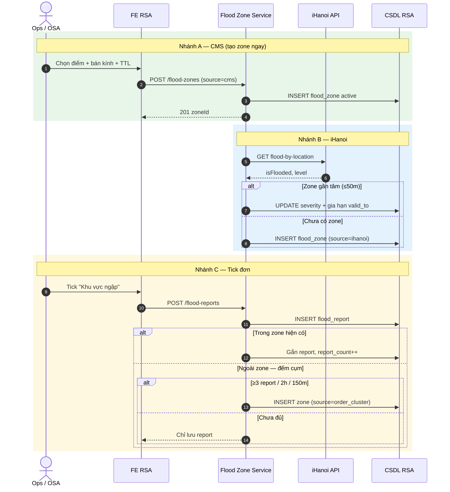
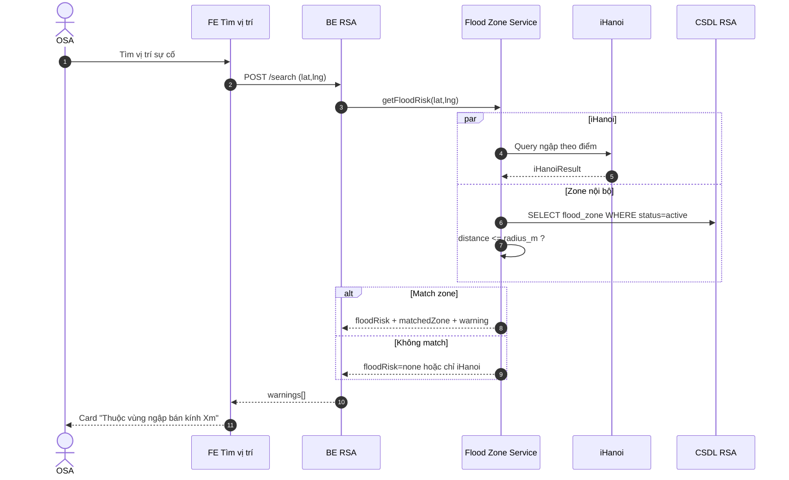
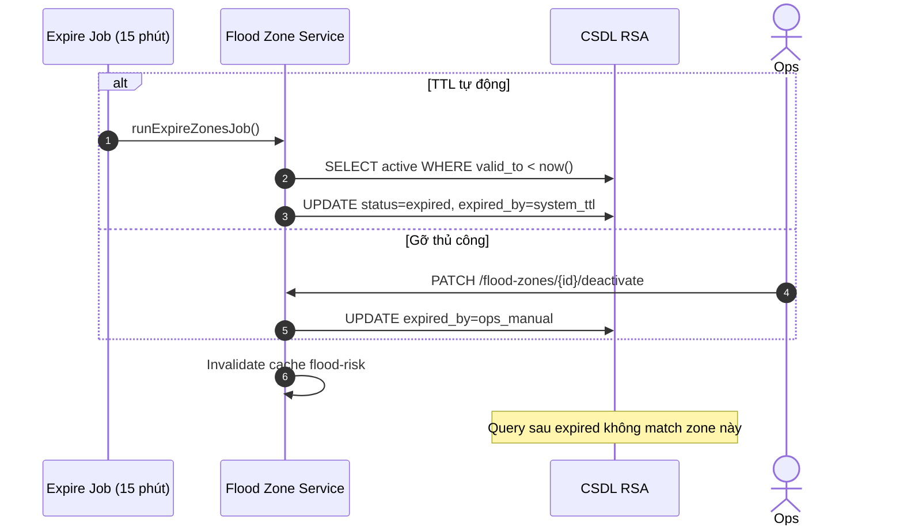

# Tài liệu nghiệp vụ — Quản lý khu vực ngập úng (Flood Zone)

| Thuộc tính | Giá trị |
|------------|---------|
| Phiên bản | 1.1 |
| Ngày | 11/07/2026 |
| Diagram | [`flood-zone-flow.puml`](./flood-zone-flow.puml) |
| Liên quan | [`tim-kiem-vi-tri.md`](./tim-kiem-vi-tri.md) |

---

## 1. Mô tả nghiệp vụ

### 1.1. Mục đích

Hệ thống Flood Zone giúp RSA **phát hiện, lưu trữ, cảnh báo và vận hành** các khu vực ngập úng khi điều phối cứu hộ. Mỗi vùng cảnh báo là **một tâm điểm (center) + bán kính cố định (radius_m)** — không dùng polygon, không theo Phường/Xã, không tự mở rộng khi có thêm đơn mới.

### 1.2. Trong phạm vi (In scope)

| Hạng mục | Mô tả |
|----------|--------|
| Tạo zone | CMS thủ công, đồng bộ iHanoi, cụm báo cáo từ đơn (≥ ngưỡng) |
| Lưu report | Điểm ngập từ đơn (tick "Khu vực ngập") |
| Kiểm tra ngập | Khi tìm vị trí / validate tọa độ |
| CMS vận hành | Cấu hình, tạo, xem, gỡ zone |
| Hết hạn | TTL riêng + job cron + gỡ thủ công |

### 1.3. Ngoài phạm vi (Out scope)

- Ranh giới hành chính (Phường/Xã) làm đơn vị cảnh báo
- Vẽ polygon phức tạp trên CMS
- Reset toàn bộ zone lúc 00:00
- Tạo zone ngay khi OSA tick ngập trên **một** đơn lẻ

### 1.4. Hệ thống tham gia

| Hệ thống | Vai trò |
|----------|---------|
| **OSA** | Tick "Khu vực ngập" khi tạo đơn; xem cảnh báo trên màn tìm vị trí |
| **Ops / Admin** | CMS: cấu hình, tạo/gỡ zone |
| **FE RSA** | Màn tìm vị trí, tạo đơn, CMS cảnh báo ngập |
| **Flood Zone Service** | Orchestrator: tạo zone, match, expire, iHanoi |
| **Flood Report Handler** | Nhận `flood_report` từ đơn |
| **Flood Match Engine** | `distance(point, center) <= radius_m` |
| **Expire Job** | Cron TTL + dọn report cũ |
| **iHanoi Flood API** | Nguồn ngập công cộng |
| **CSDL RSA** | `flood_zone`, `flood_report`, `flood_config` |

---

## 2. Sequence flow and description

> PlantUML gốc: [`flood-zone-flow.puml`](./flood-zone-flow.puml) (Sơ đồ 1–19)

### 2.1. Sequence — Tạo Flood Zone (3 nguồn)

#### Bảng mô tả — Nhánh A: Ops tạo zone CMS

| Step | Step name | Actor | Description |
|:----:|-----------|-------|-------------|
| A1 | Mở CMS | Ops | Vào **CMS Cảnh báo ngập lụt**. |
| A2 | Chọn điểm | Ops | Click điểm trên bản đồ (không vẽ polygon). |
| A3 | Nhập tham số | Ops | Chọn mức độ (low/medium/high), bán kính (200/300/500m), thời hạn (`valid_to`). |
| A4 | Tạo zone | FE → FZS | `POST /flood-zones` `{ center, radius_m, severity, valid_to, source=cms }`. |
| A5 | Lưu DB | FZS → DB | `INSERT flood_zone` `status=active`. |
| A6 | Hiển thị | FE | Vòng tròn cảnh báo trên map CMS; zone có hiệu lực **ngay**. |

#### Bảng mô tả — Nhánh B: Đồng bộ iHanoi

| Step | Step name | Actor | Description |
|:----:|-----------|-------|-------------|
| B1 | Query iHanoi | FZS → iHanoi | `GET flood-by-location(lat,lng)` theo job hoặc trigger tìm vị trí. |
| B2 | Nhận kết quả | iHanoi → FZS | `isFlooded`, `level`, metadata. |
| B3 | Kiểm tra trùng | FZS | Tìm zone active có tâm cách ≤ **50m**. |
| B4a | Cập nhật zone cũ | FZS → DB | UPDATE `severity`; **gia hạn `valid_to`**. |
| B4b | Tạo zone mới | FZS → DB | INSERT `center=lat/lng`, `radius=config.default`, `source=ihanoi`. |

#### Bảng mô tả — Nhánh C: Tick "Khu vực ngập" trên đơn

| Step | Step name | Actor | Description |
|:----:|-----------|-------|-------------|
| C1 | Tick ngập | OSA | Trên màn **Tạo đơn cứu hộ**, tick **Khu vực ngập** khi lưu đơn. |
| C2 | Gửi report | FE → FZS | `POST /flood-reports` `{ orderId, lat, lng }`. |
| C3 | Lưu report | FZS → DB | INSERT `flood_report` — **chưa tạo zone**. |
| C4 | Check zone | FZS | Query zone active; tính distance report ↔ center. |
| C5a | Trong zone | FZS → DB | Gắn `zone_id`, `report_count++`; **không đổi radius/center**. |
| C5b | Ngoài zone | FZS | Đếm report lân cận: bán kính **150m**, cửa sổ **2 giờ**. |
| C6b | Đủ cụm | FZS → DB | INSERT zone mới: `center=centroid`, `radius=300m`, `source=order_cluster`, `valid_to=now+12h`. |
| C6c | Chưa đủ | FZS | Chỉ lưu report; **không** cảnh báo zone trên map. |

### 2.2. Sequence — Kiểm tra ngập khi tìm vị trí

#### Bảng mô tả — Kiểm tra ngập (FM)

| Step | Step name | Actor | Description |
|:----:|-----------|-------|-------------|
| FM-1 | Trigger | OSA / BE | Sau khi có lat/lng sự cố (tìm vị trí hoặc tạo đơn). |
| FM-2 | Gọi FZS | BE → FZS | `getFloodRisk(lat,lng)`. |
| FM-3 | Song song | FZS | Query iHanoi + query `flood_zone` active. |
| FM-4 | Match engine | FZS | Với mỗi zone: `distance(điểm, center) <= radius_m`. |
| FM-5 | Kết quả match | FZS | Gán `matchedZone`, severity, text cảnh báo kèm khoảng cách tới tâm. |
| FM-6 | Trả FE | BE → FE | `warnings[]` type=`flood`; vẽ vòng tròn trên map nếu match. |

### 2.3. Sequence — Hết hạn zone (Expired)

#### Bảng mô tả — Expired

| Step | Step name | Actor | Description |
|:----:|-----------|-------|-------------|
| EX-1 | Job cron | System | Mỗi **15 phút** quét zone `valid_to < now()`. |
| EX-2 | Expire TTL | FZS → DB | `status=expired`, `expired_at=now`, `expired_by=system_ttl`. |
| EX-3 | Gỡ sớm | Ops | CMS bấm **Gỡ cảnh báo** → `expired_by=ops_manual`. |
| EX-4 | Dọn report | FZS → DB | Xóa/archive report cũ hơn `report_retention_days` (7 ngày). |
| EX-5 | Hậu expired | FZS | `getFloodRisk` bỏ qua zone expired; report mới không attach zone cũ. |

### 2.4. Sequence — Vòng đời end-to-end (kịch bản 3+1 đơn)

| Giai đoạn | Sự kiện | Kết quả |
|-----------|---------|---------|
| 1 | 3 đơn tick ngập gần nhau | 3 `flood_report`, **chưa có zone** |
| 2 | Đơn thứ 4 (đủ cụm ≥3) | **1 zone** tại centroid, radius 300m, TTL 12h |
| 3 | Đơn thứ 5 trong vòng tròn | Gắn report, `report_count++`, không nở zone |
| 4 | Ops/CMS hoặc TTL | Zone expired → query không còn cảnh báo |

---

## 3. Permission

| Vai trò | Quyền | Ghi chú |
|---------|-------|---------|
| **Admin** | Cấu hình `flood_config`; bật/tắt nguồn cms/ihanoi/order | Màn CMS > Cài đặt |
| **Ops** | Tạo zone CMS; xem danh sách active; **Gỡ cảnh báo** | Không sửa config hệ thống |
| **OSA** | Tick "Khu vực ngập" trên đơn; **xem** cảnh báo trên tìm vị trí | Không tạo/gỡ zone |
| **System (job)** | Expire zone; đồng bộ iHanoi; dọn report | Cron nội bộ |

---

## 4. Screen Description

### 4.1. Luồng màn hình

| # | Tên màn | Điều kiện vào | Hành động chính |
|---|---------|---------------|-----------------|
| 1 | **CMS — Cài đặt cảnh báo ngập** | Admin đăng nhập CMS | Cấu hình tham số hệ thống |
| 2 | **CMS — Quản lý cảnh báo ngập** | Ops/Admin | Tạo zone, xem active, gỡ sớm |
| 3 | **Tìm kiếm vị trí** | OSA | Xem card + vòng tròn cảnh báo ngập *(read-only)* |
| 4 | **Tạo đơn cứu hộ** | OSA | Tick **Khu vực ngập**; badge cảnh báo nếu match |

### 4.2. Chi tiết — CMS Quản lý cảnh báo ngập

| Thành phần | Mô tả |
|------------|--------|
| **Bản đồ CMS** | Click chọn **một điểm** làm tâm zone; preview vòng tròn theo bán kính chọn. |
| **Form tạo zone** | Mức độ (low/medium/high); bán kính (200m / 300m / 500m); thời hạn (preset hoặc datetime); nút **Tạo cảnh báo**. |
| **Danh sách zone active** | Bảng/card: zoneId, tâm, radius, severity, source, valid_to, report_count; filter `status=active`. |
| **Chi tiết zone** | Vòng tròn trên map; metadata; danh sách report gắn (nếu có). |
| **Nút Gỡ cảnh báo** | Confirm → PATCH deactivate; zone chuyển expired ngay. |

### 4.3. Chi tiết — CMS Cài đặt

| Thành phần | Mô tả |
|------------|--------|
| Bán kính mặc định | VD: 300m — áp dụng zone iHanoi/cluster |
| TTL mặc định | VD: 12 giờ |
| Chu kỳ job expire | VD: 15 phút |
| reportRetention | VD: 7 ngày |
| Ngưỡng cụm | Số report tối thiểu (3), cửa sổ (2h), bán kính cụm (150m) |
| Bật/tắt nguồn | cms · ihanoi · order |

### 4.4. Chi tiết — Màn Tìm kiếm vị trí (hiển thị cảnh báo)

| Thành phần | Mô tả |
|------------|--------|
| **Card cảnh báo ngập** | Trong accordion "Cảnh báo khu vực"; icon sóng; severity màu đỏ/cam/xanh. |
| **Nội dung card** | VD: "Thuộc vùng ngập trong bán kính 300m (cách tâm 100m)"; tách biệt cảnh báo thời tiết. |
| **Layer bản đồ** | Vòng tròn semi-transparent quanh tâm zone matched. |

### 4.5. Chi tiết — Màn Tạo đơn cứu hộ

| Thành phần | Mô tả |
|------------|--------|
| **Checkbox Khu vực ngập** | OSA tick khi xác nhận sự cố tại vùng ngập; gửi `flood_report` khi lưu đơn. |
| **FloodWarningBadge** | Hiển thị khi địa chỉ sự cố match zone *(prefill hoặc sau validate)*. |

---

## 5. Use case

| UC | Tên use case | Nhóm | Actor | Tiền điều kiện | Hậu điều kiện | Quy tắc |
|:---:|--------------|------|-------|-----------------|---------------|---------|
| UC-01 | Cấu hình tham số flood | CMS | Admin | Quyền Admin CMS | `flood_config` cập nhật | BR-01–BR-03 |
| UC-02 | Tạo zone thủ công (CMS) | CMS | Ops | Màn CMS quản lý ngập | Zone active ngay trên map | BR-04, BR-05, BR-06 |
| UC-03 | Xem danh sách zone active | CMS | Ops | — | List zone + report_count | BR-07 |
| UC-04 | Gỡ cảnh báo zone sớm | CMS | Ops | Zone đang active | `status=expired`, ops_manual | BR-08, BR-09 |
| UC-05 | OSA tick ngập trên đơn | Đơn | OSA | Đang tạo/lưu đơn | `flood_report` được lưu | BR-10, BR-11 |
| UC-06 | Xử lý cụm report → tạo zone | System | FZS | ≥3 report trong 150m/2h | 1 zone order_cluster | BR-12, BR-13 |
| UC-07 | Gắn report vào zone có sẵn | System | FZS | Report trong radius zone active | report_count++ | BR-14, BR-15 |
| UC-08 | Đồng bộ zone từ iHanoi | System | FZS | Nguồn iHanoi bật | Zone mới hoặc gia hạn TTL | BR-16, BR-17 |
| UC-09 | Kiểm tra ngập khi tìm vị trí | Query | OSA / BE | Có lat/lng sự cố | warnings[] trên FE | BR-18, BR-19 |
| UC-10 | Hết hạn zone theo TTL | System | Expire Job | valid_to < now | Zone expired | BR-08, BR-20 |
| UC-11 | Dọn flood_report cũ | System | Expire Job | — | Report > retention bị xóa/archive | BR-21 |

### 5.1. Chi tiết bước từng use case

#### UC-02 — Tạo zone thủ công (CMS)

| Bước | Mô tả |
|:----:|--------|
| 1 | Ops mở CMS Quản lý cảnh báo ngập. |
| 2 | Click điểm trên bản đồ làm tâm. |
| 3 | Chọn mức độ, bán kính (200/300/500m), thời hạn. |
| 4 | Bấm **Tạo cảnh báo** → POST `/flood-zones`. |
| 5 | Hệ thống hiển thị vòng tròn; zone `status=active`, `source=cms`. |

#### UC-05 — OSA tick ngập trên đơn

| Bước | Mô tả |
|:----:|--------|
| 1 | OSA nhập thông tin đơn, xác định vị trí sự cố. |
| 2 | Tick checkbox **Khu vực ngập**. |
| 3 | Lưu đơn → FE gửi `POST /flood-reports`. |
| 4 | FZS lưu report; xử lý attach hoặc đếm cụm (UC-06/07). |
| 5 | FE nhận OK; không bắt buộc hiển thị zone ngay nếu chưa đủ cụm. |

#### UC-06 — Cụm report tạo zone

| Bước | Mô tả |
|:----:|--------|
| 1 | Report mới nằm ngoài mọi zone active. |
| 2 | FZS đếm report trong bán kính 150m, cửa sổ 2 giờ. |
| 3 | Nếu count ≥ 3 (kể cả report hiện tại): tính centroid cụm. |
| 4 | INSERT 1 zone duy nhất: radius=config.default, TTL=12h, source=order_cluster. |
| 5 | Gắn tất cả report trong cụm vào zone mới. |

#### UC-09 — Kiểm tra ngập khi tìm vị trí

| Bước | Mô tả |
|:----:|--------|
| 1 | OSA tìm vị trí sự cố; BE có lat/lng. |
| 2 | BE gọi `getFloodRisk(lat,lng)`. |
| 3 | FZS match zone + query iHanoi song song. |
| 4 | Trả warning nếu `distance <= radius_m` và zone active. |
| 5 | FE hiển thị card + vòng tròn trên map. |

#### UC-04 — Gỡ cảnh báo sớm

| Bước | Mô tả |
|:----:|--------|
| 1 | Ops chọn zone trên CMS danh sách/map. |
| 2 | Bấm **Gỡ cảnh báo** → confirm. |
| 3 | PATCH `/flood-zones/{id}/deactivate`. |
| 4 | Zone `expired`, `expired_by=ops_manual`; vòng tròn biến mất ở query tiếp theo. |

---

## 6. Rule bases

### 6.1. Quy tắc tổng hợp

| ID | Quy tắc |
|----|---------|
| **BR-01** | Zone = **1 tâm (center) + bán kính cố định (radius_m)**; không polygon; không đơn vị Phường/Xã. |
| **BR-02** | `center` và `radius_m` **cố định sau khi tạo zone** — không auto-expand khi có report/đơn mới. |
| **BR-03** | Tham số mặc định lấy từ `flood_config`: radius 300m, TTL 12h, job 15 phút, retention 7 ngày, cụm 3 report / 2h / 150m. |
| **BR-04** | Chỉ **3 nguồn** được tạo zone mới: `cms`, `ihanoi`, `order_cluster`. |
| **BR-05** | CMS tạo zone → **hiệu lực ngay** (`status=active`); không cần chờ cụm report. |
| **BR-06** | Ops trên CMS chỉ: chọn điểm + chọn bán kính + chọn thời hạn — **không vẽ polygon**. |
| **BR-07** | Danh sách CMS chỉ hiển thị zone `status=active` trừ khi filter lịch sử. |
| **BR-08** | Hết hạn zone: (1) TTL `valid_to` qua job cron, hoặc (2) Ops gỡ sớm — **không** reset toàn bộ lúc 00:00. |
| **BR-09** | Sau expired: `getFloodRisk` **không match** zone đó; vòng tròn không hiển thị. |
| **BR-10** | Tick "Khu vực ngập" trên đơn → luôn tạo `flood_report`; **không** tạo zone ngay nếu chỉ 1 đơn lẻ. |
| **BR-11** | Một report gắn **một** `order_id`; có thể gắn `zone_id` sau khi match. |
| **BR-12** | Tạo zone từ cụm khi: report ngoài mọi zone **và** ≥ `cluster_min_reports` (3) trong `cluster_window_hours` (2h) và `cluster_search_radius_m` (150m). |
| **BR-13** | **Một cụm = một zone duy nhất** tại centroid; không tạo zone riêng cho từng đơn. |
| **BR-14** | Report mới **trong** zone active hiện có → attach report, `report_count++`; **không** tạo zone mới, **không** đổi radius/center. |
| **BR-15** | Report mới **không** attach vào zone đã **expired** — bắt đầu lại quy trình đếm cụm. |
| **BR-16** | iHanoi `isFlooded=true`: nếu có zone active tâm ≤ **50m** → cập nhật severity + **gia hạn valid_to**; else INSERT zone mới. |
| **BR-17** | iHanoi sync **không** mở rộng radius — chỉ cập nhật metadata/TTL/severity. |
| **BR-18** | Match ngập: `distance(điểm, zone.center) <= zone.radius_m` **và** `status=active` **và** chưa expired (`valid_to`). |
| **BR-19** | Cùng Phường/Xã nhưng ngoài vòng tròn → **không** coi là thuộc zone. |
| **BR-20** | Job expire: `expired_by=system_ttl`; invalidate cache flood-risk theo zone vừa expire. |
| **BR-21** | Job dọn report: xóa/archive report có `created_at` > `report_retention_days`. |
| **BR-22** | Admin có thể **bật/tắt** từng nguồn (cms / ihanoi / order) — nguồn tắt không tạo/xử lý zone từ nguồn đó. |
| **BR-23** | `severity`: `low` / `medium` / `high` — hiển thị màu cảnh báo tương ứng trên FE. |
| **BR-24** | Cảnh báo flood trên màn tìm vị trí **tách biệt** cảnh báo thời tiết (type=`flood` vs `weather`). |

### 6.2. Quy tắc theo UC

| UC | Rule ID | Mô tả ngắn |
|----|---------|------------|
| UC-02 | BR-UC02-01 | Bán kính CMS chỉ chọn preset 200/300/500m (hoặc theo config). |
| UC-02 | BR-UC02-02 | `valid_to` do Ops chọn; nếu không chọn → dùng TTL mặc định config. |
| UC-05 | BR-UC05-01 | Tick ngập không bắt buộc — OSA tự đánh giá hiện trường. |
| UC-05 | BR-UC05-02 | Report dùng lat/lng **vị trí sự cố** trên đơn tại thời điểm lưu. |
| UC-06 | BR-UC06-01 | Report thứ 3 trong cụm **kích hoạt** tạo zone (không đợi đơn thứ 4). |
| UC-07 | BR-UC07-01 | Đơn thứ N trong zone chỉ tăng report_count; radius giữ nguyên. |
| UC-08 | BR-UC08-01 | iHanoi tiếp tục báo ngập → gia hạn TTL, tránh expire sớm khi ngập thực tế còn. |
| UC-09 | BR-UC09-01 | Không match zone nhưng iHanoi flooded → có thể trả cảnh báo iHanoi riêng. |
| UC-10 | BR-UC10-01 | Mỗi zone hết hạn theo `valid_to` **riêng**, không phụ thuộc zone khác. |
| UC-04 | BR-UC04-01 | Gỡ sớm không xóa lịch sử zone — chuyển `expired` để audit. |

### 6.3. Ma trận nguồn → hành vi

| Nguồn | Tạo zone | Cập nhật zone | Ghi report |
|-------|----------|---------------|------------|
| **cms** | Ngay lập tức | Ops gỡ / TTL | — |
| **ihanoi** | Khi flooded & chưa có zone gần | Gia hạn TTL, severity | — |
| **order** (tick đơn) | Chỉ khi đủ cụm | Attach vào zone có sẵn | Luôn lưu report |
| **order_cluster** | Centroid cụm | — | Gắn report vào zone mới |

---

## Phụ lục

### A. Mô hình dữ liệu tóm tắt

**flood_zone:** center, radius_m, severity, source, status, valid_to, expired_at, expired_by, report_count

**flood_report:** order_id, lat, lng, zone_id (nullable), created_at

**flood_config:** default_radius_m, default_ttl_hours, expire_job_interval_min, report_retention_days, cluster_*, enable_sources

### B. API gợi ý

| Method | Endpoint |
|--------|----------|
| POST | `/flood-zones` |
| GET | `/flood-zones?status=active` |
| PATCH | `/flood-zones/{id}/deactivate` |
| POST | `/flood-reports` |
| GET | `/flood-risk?lat=&lng=` |
| PUT | `/flood-config` |

### C. Sơ đồ tham chiếu

| Sơ đồ | Nội dung |
|-------|----------|
| 1 | Kiến trúc tổng quan |
| 2 | Luồng tạo zone (3 nguồn) |
| 3 | Kiểm tra ngập khi tìm vị trí |
| 4 | CMS cấu hình & vận hành |
| 5 | End-to-end vòng đời |
| 6–14 | Sequence chi tiết từng kịch bản |
| 15–19 | Expired: state, TTL, hậu expired |
