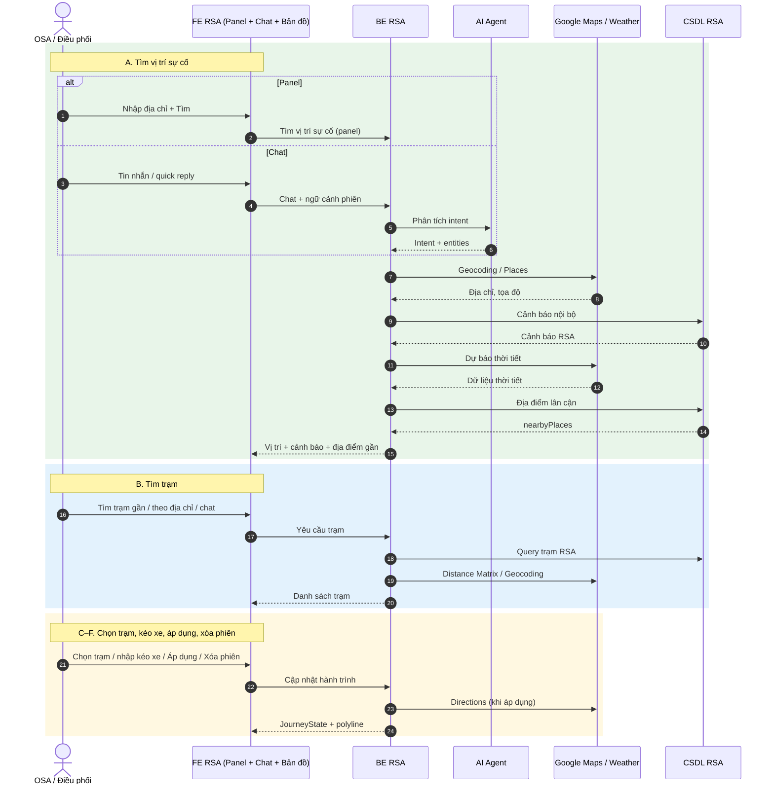
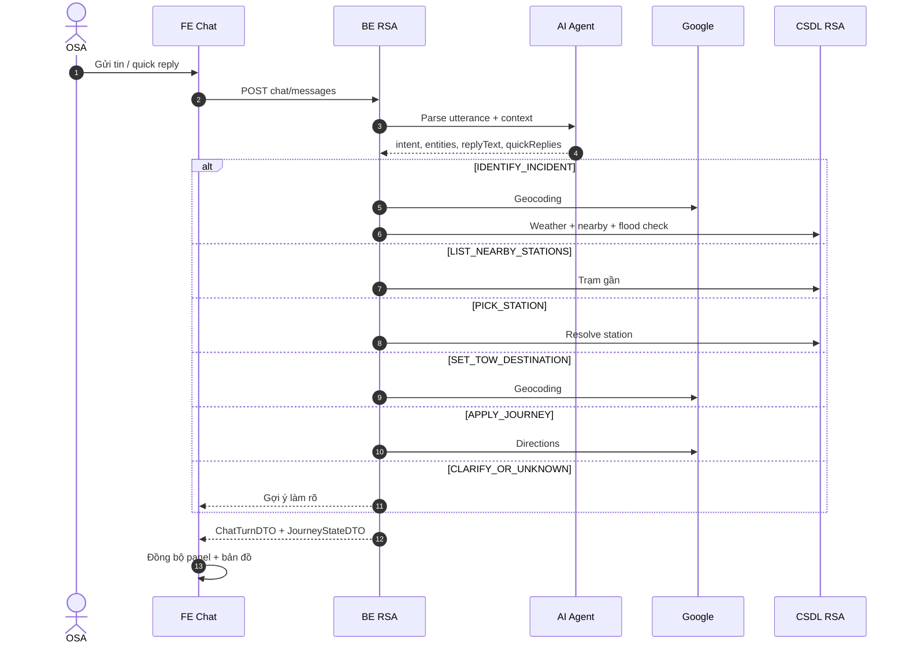
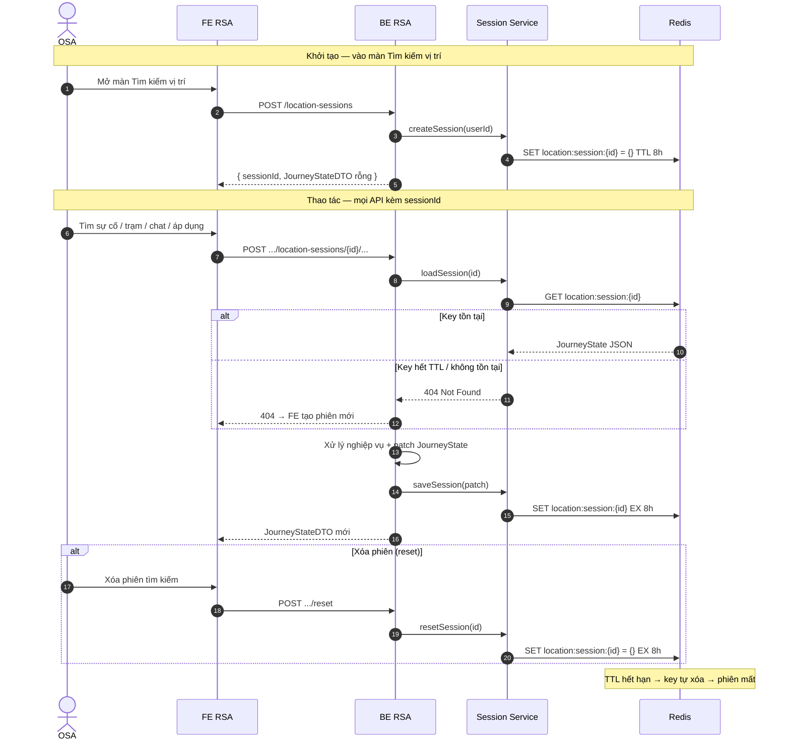
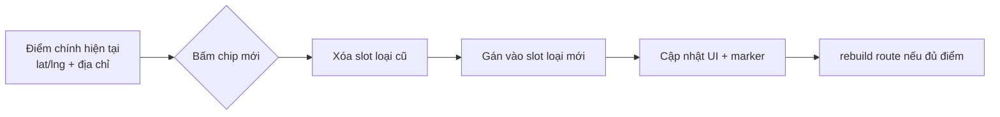
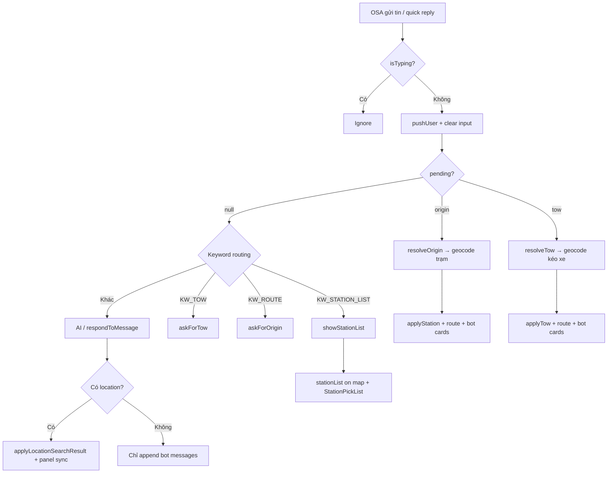
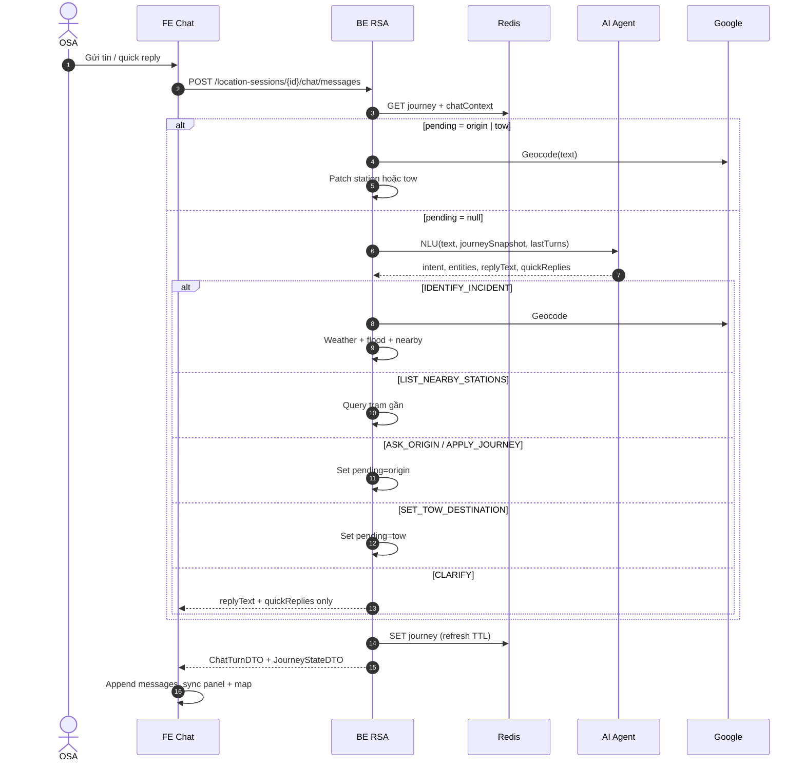
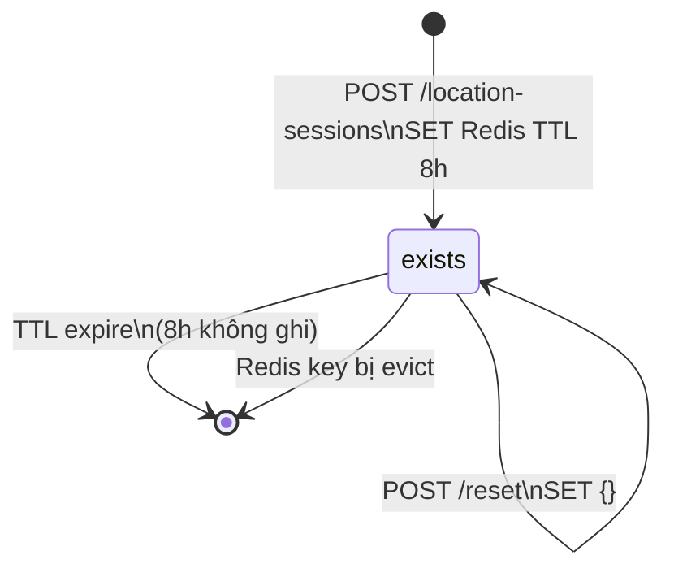

# Tài liệu nghiệp vụ — Tìm kiếm vị trí (Location Search)

| Thuộc tính | Giá trị |
|------------|---------|
| Phiên bản | 1.7 |
| Lưu phiên | **Phương án A** — chỉ Redis (MVP) |
| Ngày | 11/07/2026 |
| Diagram | [`location-search-sequence.puml`](./location-search-sequence.puml) · [`location-search-integration-flow.puml`](./location-search-integration-flow.puml) |
| Liên quan | [`quan-ly-khu-vuc-ngap-ung.md`](./quan-ly-khu-vuc-ngap-ung.md) |

---

## 1. Mô tả nghiệp vụ

### 1.1. Mục đích

Màn **Tìm kiếm vị trí** hỗ trợ OSA/điều phối xác định hành trình cứu hộ gồm **3 điểm**: vị trí sự cố, trạm/điểm xuất phát, và điểm kéo xe về (tùy chọn). OSA thao tác qua **panel trái** hoặc **khung chat trợ lý**; hai kênh dùng chung trạng thái hành trình và đồng bộ lên bản đồ.

### 1.2. Trong phạm vi (In scope)

- Tìm và ghim vị trí sự cố, trạm, điểm kéo xe
- Tìm trạm gần / theo địa chỉ-tên trạm
- Chọn trạm làm điểm xuất phát
- Áp dụng hành trình (vẽ tuyến trên bản đồ)
- Cảnh báo khu vực: thời tiết (2 nguồn) + ngập úng (Flood Zone)
- Chat trợ lý với quick reply
- **Phiên định vị trên Redis** (tạo, cập nhật, reset; TTL 8h; đồng bộ panel/chat/map)
- Xóa phiên tìm kiếm (reset journey)

### 1.3. Ngoài phạm vi (Out scope)

- Luồng **Tạo đơn cứu hộ** từ kết quả định vị *(có nút trên demo, chưa có sequence chính thức)*
- FE gọi trực tiếp Google Maps hoặc AI Agent
- Quản lý flood zone *(tài liệu riêng)*
- **Lưu phiên lâu dài PostgreSQL** *(phase 2 — khi có tạo đơn + audit)*
- **Đóng phiên / liên kết `session ↔ order`** *(phase 2)*
- **Lịch sử & analytics phiên** bỏ dở trên DB

### 1.4. Hệ thống tham gia

| Hệ thống | Vai trò |
|----------|---------|
| **OSA / Điều phối** | Người dùng chính |
| **FE RSA** | Panel hành trình, chat, bản đồ |
| **BE RSA** | Điều phối trung tâm; gọi AI Agent, Google, CSDL |
| **Session Service (BE)** | Lưu/trả `JourneyState` trên **Redis**; tạo / patch / reset phiên |
| **Redis** | **Nguồn duy nhất** lưu phiên active + cache API ngắn hạn (weather, geocode) |
| **AI Agent** | Phân tích NLU (kênh chat): intent, entities, gợi ý |
| **Google Maps / Weather** | Geocoding, Places, Directions, Distance Matrix, Weather |
| **CSDL RSA** | Trạm cứu hộ, cảnh báo nội bộ, địa điểm lân cận |
| **Flood Zone Service** | Kiểm tra ngập úng tại tọa độ sự cố |

---

## 2. Sequence flow and description

> PlantUML gốc: [`location-search-sequence.puml`](./location-search-sequence.puml)

### 2.1. Sequence tổng hợp — Tất cả luồng (A–F)



#### Bảng mô tả — A. Tìm vị trí sự cố

| Step | Step name | Actor | Description |
|:----:|-----------|-------|-------------|
| A1 | Nhập địa chỉ (panel) | OSA | OSA nhập mô tả địa chỉ vào ô tìm kiếm chính hoặc ô bước "Vị trí sự cố", bấm **Tìm**. |
| A2 | Gửi chat (chat) | OSA | OSA nhập tin nhắn tự do hoặc chọn gợi ý mẫu trên khung chat. |
| A3 | Gửi request BE | FE → BE | Panel: `POST /location-sessions/{id}/search` `{ pointRole=incident, channel=panel }`. Chat: `POST .../chat/messages` kèm ngữ cảnh phiên. |
| A4 | Phân tích NLU | BE → AI | Chỉ kênh chat: BE gửi câu + context; AI trả intent (`IDENTIFY_INCIDENT`) và entities (địa chỉ, mốc). |
| A5 | Geocoding | BE → Google | BE gọi Geocoding/Places để chuẩn hóa địa chỉ → lat/lng, confidence. FE **không** gọi Google. |
| A6 | Cảnh báo nội bộ | BE → DB | Query cảnh báo RSA theo vùng (thời tiết, giao thông, ngập…). |
| A7 | Dự báo thời tiết | BE → Google | Google Weather: current, public alerts, forecast 2–6h. |
| A8 | Kiểm tra ngập | BE → FZS | Gọi Flood Zone Service `getFloodRisk(lat,lng)` — chi tiết tài liệu flood zone. |
| A9 | Địa điểm lân cận | BE → DB | Lấy xăng, TTTM, mốc tham chiếu quanh sự cố. |
| A10 | Hợp nhất cảnh báo | BE | Gộp warnings; ưu tiên severity RSA > Google; thêm flood nếu match zone. |
| A11 | Trả kết quả FE | BE → FE | `JourneyStateDTO` + `warnings[]` + `nearbyPlaces[]` + lệnh map `ADD_MARKER`. |
| A12 | Hiển thị | FE → OSA | Ghim sự cố (xanh lá), card cảnh báo khu vực, danh sách địa điểm gần; đồng bộ panel + chat. |

#### Bảng mô tả — B. Tìm trạm / điểm xuất phát

| Step | Step name | Actor | Description |
|:----:|-----------|-------|-------------|
| B1 | Tìm trạm gần | OSA | Bấm **Tìm trạm gần vị trí sự cố** (tab Trạm gần). Tiền điều kiện: đã có vị trí sự cố hoặc điểm tham chiếu. |
| B2 | Query trạm | BE → DB | Lấy trạm cứu hộ RSA trong bán kính cấu hình. |
| B3 | Tính khoảng cách | BE → Google | Distance Matrix: km, phút tới từng trạm. |
| B4 | Tìm theo địa chỉ | OSA | Tab **Theo địa chỉ**: nhập tên trạm/địa chỉ + **Tìm**. BE tìm khớp nội bộ + Geocoding nếu cần. |
| B5 | Chat danh sách trạm | OSA | Chọn quick reply **Xem danh sách trạm**; AI → `LIST_NEARBY_STATIONS`. |
| B6 | Hiển thị kết quả | FE | Danh sách trạm trên panel (km, badge "Gần nhất"), card trong chat, marker viền xanh trên bản đồ. |

#### Bảng mô tả — C. Chọn trạm

| Step | Step name | Actor | Description |
|:----:|-----------|-------|-------------|
| C1 | Chọn trạm | OSA | Click 1 trạm trên panel, card chat, hoặc marker bản đồ. |
| C2 | Gán xuất phát | FE → BE | `POST .../journey/station` `{ stationId }`. |
| C3 | Cập nhật UI | FE | Banner **Đã chọn: {tên trạm}**; marker trạm (xanh dương); bước 2 hoàn thành. |

#### Bảng mô tả — D. Điểm kéo xe về (tùy chọn)

| Step | Step name | Actor | Description |
|:----:|-----------|-------|-------------|
| D1 | Bật bước kéo xe | OSA | Bấm **+ Thêm điểm kéo xe về** hoặc chat **Chọn vị trí kéo xe tới**. |
| D2 | Nhập địa điểm | OSA | Nhập garage/xưởng/điểm tập kết (panel hoặc chat). |
| D3 | Geocoding | BE → Google | Chuẩn hóa tọa độ điểm kéo xe. |
| D4 | Cập nhật hành trình | BE → FE | Bước 3 filled; ghim cam trên bản đồ. |

#### Bảng mô tả — E. Áp dụng hành trình

| Step | Step name | Actor | Description |
|:----:|-----------|-------|-------------|
| E1 | Yêu cầu vẽ tuyến | OSA | Bấm **Áp dụng hành trình** hoặc chat **Xem đường đi**. |
| E2 | Validate | BE | Bắt buộc: vị trí sự cố + trạm xuất phát. Điểm kéo xe tùy chọn. |
| E3 | Directions | BE → Google | Chặng 1: trạm → sự cố. Chặng 2 (nếu có): sự cố → kéo xe. |
| E4 | Hiển thị tuyến | FE | Polyline xanh dương (chặng 1), cam nét đứt (chặng 2); km/phút trên panel và card chat. |

#### Bảng mô tả — F. Xóa phiên

| Step | Step name | Actor | Description |
|:----:|-----------|-------|-------------|
| F1 | Xóa phiên | OSA | Bấm **Xóa phiên tìm kiếm**. |
| F2 | Reset BE | FE → BE | `POST .../reset` — ghi `{}` vào Redis key phiên, **giữ** `sessionId`. |
| F3 | Reset FE | FE | Xóa panel, marker, polyline, chat về tin nhắn chào ban đầu; bản đồ về view mặc định. |

### 2.2. Sequence — Luồng chat (intent)



#### Bảng mô tả — Intent chat

| Step | Step name | Actor | Description |
|:----:|-----------|-------|-------------|
| C1 | Gửi tin nhắn | OSA | Nhập text hoặc chọn quick reply. |
| C2 | Forward BE | FE → BE | Kèm `sessionId`, trạng thái hành trình hiện tại. |
| C3 | NLU | BE → AI | Trích intent + entities + gợi ý trả lời. |
| C4 | Map handler | BE | Ánh xạ intent → handler nghiệp vụ (geocode, trạm, route…). |
| C5 | Đồng bộ UI | FE | Cập nhật panel trái (nguồn hiển thị chính) + layer bản đồ. |

### 2.3. Sequence — Vòng đời phiên (Phương án A — chỉ Redis)



#### Bảng mô tả — Khởi tạo phiên (S1)

| Step | Step name | Actor | Description |
|:----:|-----------|-------|-------------|
| S1 | Vào màn | OSA | Mở menu **Tìm kiếm vị trí** / Trợ lý cứu hộ. |
| S2 | Tạo phiên | FE → BE | `POST /location-sessions` — không cần OSA bấm thêm. |
| S3 | Ghi Redis | Session Service | `SET location:session:{sessionId}` = JSON rỗng; TTL **8 giờ**. |
| S4 | Trả FE | BE → FE | `sessionId` + `JourneyStateDTO` rỗng; FE lưu `sessionId` trong sessionStorage. |

#### Bảng mô tả — Cập nhật phiên theo thao tác (S2)

| Step | Step name | Actor | Description |
|:----:|-----------|-------|-------------|
| S5 | Request có sessionId | FE → BE | Mọi API con path `/location-sessions/{id}/...`; thiếu hoặc key Redis không tồn tại → **404**. |
| S6 | Load phiên | Session Service | `GET location:session:{id}` từ Redis — **không** fallback DB. |
| S7 | Patch JourneyState | BE | Merge thay đổi (incident / station / tow / route / warnings / chatContext). |
| S8 | Persist | Session Service | `SET` lại key; **refresh TTL 8h** mỗi lần ghi. |
| S9 | Trả snapshot | BE → FE | Mỗi response chứa **toàn bộ** `JourneyStateDTO` — FE render lại panel/map. |

#### Bảng mô tả — Reset & hết hạn (S3)

| Step | Step name | Actor | Description |
|:----:|-----------|-------|-------------|
| S10 | Reset (Xóa phiên) | OSA | `POST .../reset` — ghi `{}` vào Redis key, **giữ** `sessionId`. |
| S11 | Hết hạn TTL | Redis | Key tự expire sau 8h không cập nhật; OSA F5 → 404 → tạo phiên mới (UC-15). |

---

## 3. Permission

| Vai trò | Quyền | Ghi chú |
|---------|-------|---------|
| **OSA / Điều phối** | Xem + thao tác toàn bộ màn Tìm kiếm vị trí | Trạm trong phạm vi được phân quyền (nếu có row-level) |
| **Supervisor** | Xem | Giám sát, không bắt buộc quyền sửa hành trình |
| **Admin hệ thống** | — | Không thao tác trực tiếp màn này |

---

## 4. Screen Description

### 4.1. Luồng màn hình

| # | Tên màn | Điều kiện vào | Hành động chính |
|---|---------|---------------|-----------------|
| 1 | **Tìm kiếm vị trí** | Menu RSA > Trợ lý cứu hộ / Tìm vị trí | Xác định hành trình 3 điểm, xem cảnh báo, áp dụng tuyến |
| 2 | **Tạo đơn cứu hộ** *(liên kết)* | Bấm "Tạo đơn cứu hộ" từ chat *(ngoài scope sequence)* | Prefill địa chỉ/tuyến |

### 4.2. Chi tiết — Màn Tìm kiếm vị trí

Layout: **Bản đồ toàn màn** + **panel trái** + **khung chat** (có thể thu gọn).

| Khu vực | Thành phần | Mô tả / Hành vi |
|---------|------------|-----------------|
| **Thanh tìm ban đầu** | Ô "Mô tả / tìm địa chỉ..." + nút **Tìm** | Hiện khi chưa có điểm nào trên hành trình. Submit → tìm vị trí sự cố. |
| **Panel hành trình** | Header điểm chính | Hiện sau khi có ít nhất 1 điểm. Hiển thị loại điểm (Sự cố / Trạm / Kéo xe), địa chỉ, nút **Đổi**. |
| | Chip chuyển loại điểm | 3 chip **Sự cố / Trạm / Kéo xe** — tái phân loại điểm chính nếu tìm nhầm (xem **4.4**). |
| | Nút **Đổi** (header) | Xóa toàn bộ điểm + hành trình, quay về thanh tìm ban đầu — **khác** với chip (xem **4.4.5**). |
| | Bảng 3 bước (kéo thả thứ tự) | Bước 1 Vị trí sự cố · Bước 2 Trạm/điểm xuất phát · Bước 3 Điểm kéo xe về *(Tùy chọn)*. Mỗi bước có ô nhập + **Tìm**. |
| | Tab trạm | **Trạm gần** \| **Theo địa chỉ**; nút tìm trạm gần; list trạm + km. |
| | Banner đã chọn trạm | Nền xanh nhạt: "Đã chọn: {tên trạm}". |
| | Nút **+ Thêm điểm kéo xe về** | Mở bước 3; disabled nếu chưa có sự cố. |
| | Nút **Áp dụng hành trình** | Vẽ polyline; disabled nếu thiếu sự cố hoặc trạm. |
| | Nút **Xóa phiên tìm kiếm** | Góc panel; reset toàn bộ. |
| **Cảnh báo khu vực** | Accordion "Cảnh báo khu vực (N)" | Card theo loại: thời tiết, ngập, giao thông, nhu cầu. Màu theo severity (cao/vừa/thấp). |
| **Địa điểm gần** | Danh sách PlaceCard | Ảnh, loại, tên, km; click → fly-to trên bản đồ. |
| **Bản đồ** | Marker sự cố | Ghim xanh lá (#00A859). |
| | Marker trạm đã chọn | Tròn xanh dương. |
| | Marker trạm ứng viên | Viền xanh rỗng; click chọn. |
| | Marker kéo xe | Cam. |
| | Polyline | Xanh dương: trạm→sự cố; cam nét đứt: sự cố→kéo xe. |
| | Vòng cảnh báo ngập | Layer flood zone *(nếu match)*. |
| | Zoom +/- | Góc dưới phải. |
| **Chat trợ lý** | Khung tin nhắn | Bot avatar VETC; tin user/bot; card trạm, card tuyến. |
| | Quick replies | Gợi ý: Xem danh sách trạm, Chọn vị trí kéo xe tới, Xem đường đi… |
| | Ô nhập + Gửi | Placeholder đổi theo trạng thái chờ (xuất phát / kéo xe). |
| | FAB thu gọn | Góc phải; bật/tắt chat. |

### 4.3. Trạng thái màn hình

| Trạng thái | Điều kiện | UI |
|------------|-----------|-----|
| Trống | Chưa tìm điểm nào | Chỉ thanh tìm + bản đồ mặc định |
| Đã có sự cố | Bước 1 xong | Ghim sự cố + cảnh báo + địa điểm gần |
| Đã chọn trạm | Bước 2 xong | Banner trạm + marker xanh dương |
| Có kéo xe | Bước 3 xong | Ghim cam |
| Đã áp dụng | Sau Directions | Polyline + km/phút |
| Lỗi | Validate fail | Toast/text đỏ dưới panel (VD: "Bước trạm: cần chọn trạm…") |

### 4.4. Chi tiết — Action đổi loại điểm (3 chip Sự cố / Trạm / Kéo xe)

#### 4.4.1. Mục đích

Khi OSA tìm một địa chỉ trên **thanh tìm chính**, hệ thống mặc định gán kết quả là **Vị trí sự cố**. Nếu OSA **tìm nhầm loại** (VD: vừa geocode một garage nhưng thực ra đó là trạm xuất phát, không phải nơi sự cố), ba chip cho phép **tái phân loại** cùng một tọa độ sang loại điểm khác mà không cần nhập lại địa chỉ.

#### 4.4.2. Vị trí & giao diện

Hiển thị trong **header panel hành trình** (sau khi đã có ít nhất một điểm trên map), ngay dưới dòng địa chỉ điểm chính:

| Thành phần | Mô tả |
|------------|--------|
| **Tiêu đề loại** | Chữ in hoa theo loại đang chọn: *Vị trí sự cố* / *Trạm / điểm xuất phát* / *Điểm kéo xe về* |
| **Dòng địa chỉ** | Địa chỉ/tên điểm chính hiện tại (tối đa 2 dòng) |
| **3 chip** | **Sự cố** (xanh lá) · **Trạm** (xanh dương) · **Kéo xe** (cam) — chip đang chọn được tô đặc, chip còn lại viền xám |
| **Gợi ý** | Text nhỏ: *"Đổi loại điểm nếu tìm nhầm (sự cố / trạm / kéo xe)"* |
| **Màu header** | Nền header đổi theo loại: xanh lá nhạt (sự cố) · xanh dương nhạt (trạm) · cam nhạt (kéo xe) |

#### 4.4.3. Khái niệm « điểm chính » (primary point)

| Khái niệm | Mô tả |
|-----------|--------|
| **Điểm chính** | Điểm vừa tìm qua thanh tìm đầu tiên hoặc đang được chip đánh dấu |
| **Các bước « Tiếp theo »** | Hai loại còn lại hiển thị ở khối bên dưới header để OSA bổ sung (không trùng loại với điểm chính) |
| **Marker bản đồ** | Ghim đổi kiểu theo loại mới sau khi chọn chip |

#### 4.4.4. Luồng xử lý khi bấm chip

**Tiền điều kiện:** Điểm chính hiện tại **đã có tọa độ** (đã geocode thành công). Nếu chưa có dữ liệu → bấm chip **không có tác dụng**.

**Các bước (logic nghiệp vụ):**

| Bước | Hành vi |
|:----:|---------|
| 1 | OSA bấm chip loại **mới** (khác loại đang chọn). |
| 2 | Hệ thống lấy **cùng một cặp** `{ địa chỉ, lat, lng }` của điểm chính hiện tại. |
| 3 | **Xóa** dữ liệu ở loại **cũ** (VD: chuyển từ Sự cố → Trạm thì xóa `incident`, cảnh báo vùng gắn sự cố có thể mất). |
| 4 | **Gán** tọa độ đó vào loại **mới** (VD: gán vào `routeOrigin` nếu chọn Trạm). |
| 5 | Cập nhật header (màu + tiêu đề + chip active). |
| 6 | **Tính lại** polyline nếu đủ điều kiện (trạm↔sự cố, sự cố↔kéo xe). |
| 7 | Khối « Tiếp theo » ẩn loại vừa thành điểm chính, hiện hai loại còn lại. |



#### 4.4.5. Ma trận chuyển đổi

Giả sử điểm chính đang ở cột **Từ**, OSA bấm chip **Sang**:

| Từ ↓ / Sang → | **Sự cố** | **Trạm** | **Kéo xe** |
|---------------|-----------|----------|------------|
| **Sự cố** | — *(không đổi)* | Xóa sự cố + cảnh báo/nearby gắn sự cố; gán làm trạm xuất phát | Xóa sự cố; bật bước kéo xe; gán làm điểm kéo về |
| **Trạm** | Gán làm vị trí sự cố *(chưa tự load cảnh báo — OSA có thể tìm lại)* | — | Xóa trạm; gán làm điểm kéo về |
| **Kéo xe** | Gán làm vị trí sự cố | Xóa kéo xe; gán làm trạm | — |

**Lưu ý nghiệp vụ:**

- Chuyển **sang Sự cố** từ Trạm/Kéo xe: tọa độ được giữ, nhưng **cảnh báo khu vực** và **địa điểm lân cận** chỉ có đầy đủ khi OSA **tìm lại** qua luồng geocode sự cố (UC-01) — chip chỉ di chuyển tọa độ.
- Chuyển **sang Kéo xe**: tự **bật** bước 3 (khối « Tiếp theo » hiện bước kéo xe nếu chưa có).
- Chuyển **sang Trạm**: gán dạng điểm tùy chỉnh geocode (`kind=custom`) trừ khi trùng tên trạm trong list.

#### 4.4.6. Ảnh hưởng lên bản đồ & hành trình

| Thành phần | Khi đổi loại |
|------------|--------------|
| Marker điểm chính | Đổi icon/màu: ghim xanh lá (sự cố) · tròn xanh dương (trạm) · cờ cam (kéo xe) |
| Polyline trạm→sự cố | Tính lại nếu **cả hai** slot incident và station đều có giá trị sau chuyển |
| Polyline sự cố→kéo xe | Tính lại nếu **cả hai** slot incident và tow đều có giá trị |
| Cảnh báo khu vực | Giữ nguyên chỉ khi sự cố **không bị xóa**; mất nếu chuyển **từ** Sự cố sang loại khác |
| Danh sách trạm ứng viên | Không tự load lại — OSA dùng bước Trạm bên dưới nếu cần |

#### 4.4.7. Phân biệt: Chip đổi loại vs Nút « Đổi »

| | **3 chip (UC-13)** | **Nút « Đổi » (header)** |
|--|---------------------|---------------------------|
| Mục đích | Tái phân loại **cùng tọa độ** | **Hủy** điểm chính, làm lại từ đầu |
| Tọa độ | Giữ nguyên, chuyển sang slot khác | Xóa toàn bộ (sự cố, trạm, kéo xe, route, cảnh báo) |
| UI sau thao tác | Vẫn ở panel hành trình | Quay về **thanh tìm ban đầu** (màn trống) |
| Phiên Redis | Patch `journey` (di chuyển điểm) | Tương đương reset cục bộ FE; production nên gọi `POST /reset` hoặc patch rỗng |

#### 4.4.8. API gợi ý (production)

```
PATCH /location-sessions/{id}/journey/reclassify
Body: { "fromRole": "incident", "toRole": "station" }
```

BE thực hiện logic bước 2–6 mục 4.4.4, trả `JourneyStateDTO` đầy đủ.

### 4.5. Chi tiết — Khung chat bot (Trợ lý xác định vị trí)

#### 4.5.1. Mục đích & nguyên tắc

Khung chat là **kênh nhập liệu tự nhiên** song song với panel trái. OSA có thể mô tả lời khách, chọn gợi ý nhanh, chọn trạm hoặc xem tuyến — mọi kết quả **đồng bộ** lên panel và bản đồ (BR-02, BR-16).

| Nguyên tắc | Mô tả |
|------------|--------|
| **Một JourneyState** | Chat không giữ state riêng; mỗi thao tác cập nhật chung phiên Redis |
| **Panel là nguồn hiển thị chính** | Cảnh báo khu vực & địa điểm gần hiển thị trên **panel/bản đồ**, chat chỉ **xác nhận** đã hiển thị |
| **Quick reply chỉ trên tin cuối** | Gợi ý hành động và danh sách trạm chỉ active ở **message bot mới nhất** |
| **Pending mode** | Khi bot hỏi điểm xuất phát / kéo xe, tin nhắn tiếp theo được hiểu là **trả lời** chứ không phân tích intent mới |
| **Typing lock** | Đang `isTyping` → không gửi tin / không bấm quick reply |

#### 4.5.2. Cấu trúc UI

```
┌─────────────────────────────────────┐
│ Header: Trợ lý xác định vị trí  [X]│
├─────────────────────────────────────┤
│ Vùng tin nhắn (scroll)              │
│  • Bot / OSA bubble                 │
│  • StationPickList (tin cuối)      │
│  • RouteResultCard                  │
│  • Quick reply pills (tin cuối)     │
│  • Typing indicator (...)           │
├─────────────────────────────────────┤
│ Câu mẫu (chỉ khi ≤1 tin bot)        │
├─────────────────────────────────────┤
│ [ Input placeholder động    ] [Gửi] │
└─────────────────────────────────────┘
        FAB góc phải — bật/tắt chat
```

| Thành phần | Mô tả |
|------------|--------|
| **Header** | Nền xanh #00A859; avatar VETC; trạng thái « Đang hoạt động »; nút thu gọn |
| **Tin bot** | Bubble trắng, avatar bot trái |
| **Tin OSA** | Bubble xanh dương, avatar user phải |
| **StationPickList** | Danh sách trạm clickable (km, badge Gần nhất) — chọn → UC-06 |
| **RouteResultCard** | From → To, km, phút; màu theo chặng |
| **Quick replies** | Pill xanh lá; icon theo loại (trạm / kéo xe / tạo đơn / đường đi) |
| **Câu mẫu** | 3 SAMPLE_PROMPTS — click = gửi như tin OSA |
| **Ô nhập** | Placeholder đổi theo `pending` (xem 4.5.4) |
| **FAB** | Mở chat (avatar) / đóng (X) khi chat đang mở |

**Tin chào ban đầu (`INITIAL_BOT_MESSAGE`):**

> *"Xin chào! Mô tả vị trí sự cố ở panel bên trái hoặc chat tại đây — kết quả hiển thị chung trên panel. Sau đó chọn trạm và thêm điểm kéo xe (nếu cần)."*

Quick reply mặc định: 3 địa điểm mẫu (cây xăng Petrolimex, Vincom, ngã tư sở).

#### 4.5.3. Mô hình dữ liệu tin nhắn

| Trường `ChatMessageData` | Mô tả |
|--------------------------|--------|
| `id` | UUID tin |
| `role` | `osa` \| `bot` |
| `text` | Nội dung text |
| `location` | Ghim preview vị trí *(tùy chọn)* |
| `stations` | Danh sách trạm embed trong chat |
| `route` | Kết quả 1 chặng (km, phút, path) |
| `quickReplies` | Mảng gợi ý bấm nhanh |

**Ngữ cảnh phiên cho chat (Redis `journey.chatContext`):**

| Trường | Giá trị | Ý nghĩa |
|--------|---------|---------|
| `pending` | `null` | Chế độ bình thường |
| `pending` | `origin` | Đang chờ OSA nhập **điểm xuất phát** |
| `pending` | `tow` | Đang chờ OSA nhập **điểm kéo xe** |
| `lastIntent` | string | Intent xử lý gần nhất *(production)* |
| `lastTurns` | array | 3–5 lượt gần nhất gửi AI Agent |

#### 4.5.4. Luồng xử lý tin nhắn (decision tree)



**Thứ tự ưu tiên khi `pending = null`:**

1. Keyword **danh sách trạm** → `showStationList`
2. Keyword **kéo xe** → `askForTow`
3. Keyword **đường đi / route** → `askForOrigin`
4. Còn lại → engine xác định vị trí / AI Agent

#### 4.5.5. Bảng keyword routing (demo FE)

| Nhóm | Từ khóa (`hasKeyword`) | Handler | Intent production |
|------|------------------------|---------|-------------------|
| **Trạm** | `danh sách trạm`, `ds trạm`, `trạm gần`, `liệt kê trạm`, `các trạm`, `xem trạm` | `showStationList` | `LIST_NEARBY_STATIONS` |
| **Đường đi** | `đường đi`, `chỉ đường`, `từ trạm`, `bao xa`, `bao nhiêu km`, `route`, `quãng đường`… | `askForOrigin` | `APPLY_JOURNEY` / `ASK_ORIGIN` |
| **Kéo xe** | `kéo xe tới`, `kéo về`, `garage`, `xưởng`, `điểm kéo`… | `askForTow` | `SET_TOW_DESTINATION` |
| **Đổi trạm** | `đổi trạm`, `đổi điểm xuất phát` *(quick reply)* | `askForOrigin` | `ASK_ORIGIN` |
| **Tạo đơn** | `tạo đơn` *(quick reply)* | `createOrder` | `CREATE_ORDER` *(phase 2)* |
| **Vị trí khác** | `địa điểm khác`, `tìm lại`, `sai vị trí`, `chỗ khác`… | Engine → geocode lại | `IDENTIFY_INCIDENT` |
| **Xác nhận** | `xác nhận`, `chốt`, `đồng ý` | Xác nhận ghim hiện tại | `CONFIRM_INCIDENT` |
| **Mô tả địa chỉ** | Từ khóa địa điểm (cây xăng, ngã tư, phố…) **hoặc** độ dài ≥ 12 ký tự | Geocode sự cố | `IDENTIFY_INCIDENT` |
| **Fallback** | Câu quá ngắn / không khớp | Hỏi làm rõ + 3 quick reply mẫu | `CLARIFY_OR_UNKNOWN` |

#### 4.5.6. Các luồng hội thoại chi tiết

##### Luồng 1 — Xác định vị trí sự cố (UC-02)

| Bước | Actor | Hành vi |
|:----:|-------|---------|
| 1 | OSA | Gõ mô tả lời khách hoặc chọn câu mẫu / quick reply địa điểm |
| 2 | FE | `POST .../chat/messages` *(production)* hoặc `respondToMessage` *(demo)* |
| 3 | BE/AI | Geocode → cảnh báo + nearby + flood check |
| 4 | Bot trả **1 tin** gộp xác nhận địa chỉ + thông báo cảnh báo/nearby trên map + quick replies |
| 5 | FE `applyLocationSearchResult` → panel + map sync |

##### Luồng 2 — Xem danh sách trạm (UC-10)

| Bước | Điều kiện | Hành vi |
|:----:|-----------|---------|
| 1 | **Có** vị trí sự cố | Query ≤5 trạm gần; bot gửi `stations[]`; hiện StationPickList + marker viền xanh map |
| 1b | **Chưa có** sự cố | Bot: *"Mình chưa có vị trí sự cố… mô tả vị trí khách trước nhé"* — **dừng** |

##### Luồng 3 — Xem đường đi / hỏi điểm xuất phát (UC-11)

| Bước | Hành vi |
|:----:|---------|
| 1 | Bot set `pending = origin`; placeholder ô nhập → *"Nhập vị trí xuất phát..."* |
| 2 | Bot hỏi + quick reply **Xem danh sách trạm** |
| 3a | OSA gõ tên trạm/địa chỉ → `resolveOrigin` → geocode → `applyStation` → vẽ route trạm→sự cố |
| 3b | OSA chọn trạm từ list → `handlePickStation` |
| 4 | Bot: RouteResultCard + *"Bước tiếp theo…"* với `NEXT_STEP_REPLIES` |

**`NEXT_STEP_REPLIES` (sau khi có tuyến trạm→sự cố):**

- Chọn vị trí kéo xe tới
- Tạo đơn cứu hộ
- Đổi trạm xuất phát

##### Luồng 4 — Thêm điểm kéo xe (UC-08)

| Bước | Điều kiện | Hành vi |
|:----:|-----------|---------|
| 1 | **Có** route trạm→sự cố (`route`) | `pending = tow`; bot hỏi địa điểm kéo xe |
| 1b | **Chưa có** route | Bot: *"Cần có tuyến xuất phát → sự cố trước…"* |
| 2 | OSA gõ garage/xưởng | `resolveTow` → geocode → `applyTow` → vẽ chặng sự cố→kéo xe |
| 3 | Bot | RouteResultCard chặng kéo + gợi ý **Tạo đơn cứu hộ** |

##### Luồng 5 — Chọn trạm từ card chat (UC-06 qua chat)

| Bước | Hành vi |
|:----:|---------|
| 1 | OSA click 1 dòng StationPickList |
| 2 | FE hiển thị tin OSA ảo: *"Chọn trạm: {tên}"* |
| 3 | `applyStation` + vẽ route; marker trạm trên map |
| 4 | Bot xác nhận + RouteResultCard + NEXT_STEP_REPLIES |

##### Luồng 6 — Tạo đơn cứu hộ *(demo, phase 2)*

| Bước | Điều kiện | Hành vi |
|:----:|-----------|---------|
| 1 | Có sự cố + trạm | Bot tổng hợp bullet địa chỉ/km → điều hướng màn Tạo đơn với prefill |
| 1b | Thiếu dữ liệu | Bot từ chối |

#### 4.5.7. Sequence — Chat tích hợp (production)



#### 4.5.8. Quy tắc hiển thị trong chat

| Quy tắc | Mô tả |
|---------|--------|
| **QR-01** | Quick replies & StationPickList **chỉ** render khi `isLast === true` |
| **QR-02** | Tin bot cũ giữ text/card tuyến (read-only); không còn nút bấm |
| **QR-03** | RouteResultCard: `fromLabel`/`toLabel` suy từ `route.toName === location.address` |
| **QR-04** | Mở chat khi gửi tin nếu đang thu gọn (`setChatOpen(true)`) |
| **QR-05** | Focus ô panel → `closeChatPanel()` để tránh che map |
| **QR-06** | Xóa phiên (UC-12) reset `messages` về `INITIAL_BOT_MESSAGE`; xóa `pending` |

#### 4.5.9. Mapping demo → production

| Demo (hiện tại) | Production |
|-----------------|------------|
| `respondToMessage()` keyword | AI Agent intent + BE handler |
| `setTimeout` 650–750ms typing | BE streaming / polling `isTyping` |
| State `pending` local React | `journey.chatContext.pending` trên Redis |
| `geocodeOrigin()` mock | BE → Google Geocoding |
| Quick reply hardcoded | `quickReplies[]` từ AI / BE template |

#### 4.5.10. API chat

```
POST /location-sessions/{id}/chat/messages
Body: {
  "text": "Khách đang ở gần Big C Thăng Long",
  "quickReplyId": null   // optional, nếu bấm pill
}

Response: {
  "turns": [ ChatMessageData, ... ],
  "journey": JourneyStateDTO,
  "chatContext": { "pending": null | "origin" | "tow" }
}
```

#### 4.5.11. Quick action theo intent

Nguyên tắc thiết kế quick action:

| # | Nguyên tắc | Mô tả |
|---|------------|--------|
| 1 | **Tối đa 3 pill** | Mỗi tin bot chỉ hiển thị ≤ 3 quick reply; tránh quá tải |
| 2 | **Theo ngữ cảnh** | Chỉ hiện action **khả thi** với `JourneyState` hiện tại |
| 3 | **Phân tầng UI** | Chọn trạm = **StationPickList** (card); điều hướng luồng = **pill** |
| 4 | **Pending ưu tiên** | Khi `pending ≠ null`, pill hỗ trợ chuyển kênh (VD: list trạm) thay vì NLU |
| 5 | **BE trả template** | Production: AI/BE trả `quickReplies[]` + `quickReplyId` ổn định |

##### Bảng đề xuất — 9 intent

| # | Intent (NLU) | Khi nào bot trả intent | Tin bot (tóm tắt) | Quick action đề xuất | Ghi chú UI |
|---|--------------|------------------------|-------------------|----------------------|------------|
| 1 | **Mô tả vị trí sự cố** `IDENTIFY_INCIDENT` | OSA mô tả địa chỉ / chọn câu mẫu; chưa có hoặc đang cập nhật sự cố | *"Mình xác định vị trí sự cố… (X%)"* + tin xác nhận cảnh báo/nearby trên map | ① **Xác nhận chốt vị trí** · ② **Xem danh sách trạm** · ③ **Tìm địa điểm khác** | Tin 2 (sau xác nhận map). Icon: ✓ / trạm / refresh |
| 2 | **Xác nhận chốt vị trí** `CONFIRM_INCIDENT` | OSA bấm « Xác nhận » / gõ *xác nhận, chốt, đồng ý* | *"Đã ghim vị trí sự cố: {địa chỉ}. Chọn bước tiếp theo."* | ① **Xem danh sách trạm** · ② **Xem đường đi** · ③ **Tìm địa điểm khác** | **Chưa có sự cố** → không hiện pill; bot hỏi lại + 3 câu mẫu địa điểm (intent #8) |
| 3 | **Nói sai — tìm lại** `RE_IDENTIFY_INCIDENT` | OSA gõ *sai vị trí, tìm lại, chỗ khác, không đúng* | *"Mình xác định lại vị trí sự cố…"* (geocode mới) | ① **Xác nhận chốt vị trí** · ② **Xem danh sách trạm** · ③ **Xem đường đi** | Giống hậu #1; giữ pill « Tìm địa điểm khác » ở tin trước nếu OSA chưa chốt |
| 4 | **Xem trạm gần** `LIST_NEARBY_STATIONS` | OSA bấm pill / gõ *trạm gần, danh sách trạm* | *"Các trạm gần vị trí sự cố (chọn 1 trạm…)"* | **StationPickList** (≤5 trạm) + pill phụ: ① **Nhập điểm xuất phát tùy ý** | Pill phụ chỉ khi list hiển thị. **Chưa có sự cố** → pill: 3 câu mẫu mô tả vị trí |
| 5 | **Chọn trạm cụ thể** `SELECT_STATION` | OSA click 1 dòng trong StationPickList | *"Đã chọn {tên trạm}… vẽ đường đi tới sự cố"* + RouteResultCard | ① **Chọn vị trí kéo xe tới** · ② **Tạo đơn cứu hộ** · ③ **Đổi trạm xuất phát** | `NEXT_STEP_REPLIES`; không dùng pill cho danh sách trạm |
| 6 | **Nhập điểm xuất phát tùy ý** `ASK_ORIGIN` / `SET_CUSTOM_ORIGIN` | OSA bấm *Xem đường đi* / *Nhập điểm xuất phát* → `pending=origin` | *"Gõ tên trạm, mốc hoặc địa chỉ xuất phát…"* | ① **Xem danh sách trạm** · ② **Chọn trạm gần nhất** *(tùy chọn)* · ③ **Hủy — quay lại sự cố** | Placeholder ô nhập: *"Nhập vị trí xuất phát…"*. Pill ② auto-pick trạm #1 trong list |
| 7 | **Nhập điểm kéo xe** `SET_TOW_DESTINATION` | OSA bấm *Chọn vị trí kéo xe tới* → `pending=tow` | *"Gõ garage/xưởng/điểm tập kết…"* | ① **Garage gần nhất** *(mock)* · ② **Bỏ qua bước kéo xe** · ③ **Xem lại hành trình** | **Chưa có route trạm→sự cố** → pill: **Xem đường đi** · **Xem danh sách trạm** (không vào pending) |
| 8 | **Thiếu thông tin** `CLARIFY_MISSING_INFO` | Câu quá ngắn / thiếu mốc nhưng **có ý định** mô tả vị trí | *"Cho mình thêm mốc gần nhất, tên đường hoặc số nhà…"* | ① **Gần cây xăng Petrolimex…** · ② **Đối diện Vincom…** · ③ **Ở ngã tư sở** | 3 câu mẫu **theo khu vực** (BE config). Khác #9: vẫn trong luồng định vị |
| 9 | **Không hiểu câu** `CLARIFY_OR_UNKNOWN` | Câu ngoài ngữ cảnh / không map intent | *"Mình chưa rõ ý anh/chị. Anh/chị muốn…?"* | **Có sự cố:** ① **Xem danh sách trạm** · ② **Xem đường đi** · ③ **Tìm địa điểm khác** · **Chưa có sự cố:** ① **Mô tả vị trí khách** · ② **Xem hướng dẫn** · ③ 1 câu mẫu địa điểm | Menu định hướng lại; **không** geocode bừa |

##### Ma trận quick action theo trạng thái hành trình

| Trạng thái `JourneyState` | Pill ưu tiên hiển thị |
|---------------------------|------------------------|
| Trống (chưa sự cố) | Mô tả vị trí (câu mẫu) · Hướng dẫn |
| Có sự cố, chưa trạm | Xác nhận chốt · Xem danh sách trạm · Xem đường đi · Tìm lại |
| Có sự cố + trạm, chưa kéo xe | Chọn vị trí kéo xe tới · Tạo đơn · Đổi trạm |
| Đủ 3 điểm / đã route | Tạo đơn cứu hộ · Xem lại hành trình · Tìm địa điểm khác |
| `pending = origin` | Xem danh sách trạm · Chọn trạm gần nhất · Hủy |
| `pending = tow` | Garage mẫu · Bỏ qua kéo xe · Xem lại hành trình |

##### Mapping icon pill (FE demo)

| Pattern label | Icon |
|---------------|------|
| trạm / danh sách trạm | `Building2` |
| kéo xe / garage | `Truck` |
| đường đi / route / đổi điểm | `Route` |
| tạo đơn | `FilePlus` |
| xác nhận / chốt | `CheckCircle` |
| tìm lại / khác | `RefreshCw` |
| mặc định | `MessageCircle` |

##### `quickReplyId` gợi ý (production API)

| `quickReplyId` | Label hiển thị | Intent kích hoạt |
|----------------|----------------|------------------|
| `confirm_incident` | Xác nhận chốt vị trí | `CONFIRM_INCIDENT` |
| `list_stations` | Xem danh sách trạm | `LIST_NEARBY_STATIONS` |
| `ask_route` | Xem đường đi | `ASK_ORIGIN` |
| `re_identify` | Tìm địa điểm khác | `RE_IDENTIFY_INCIDENT` |
| `ask_tow` | Chọn vị trí kéo xe tới | `SET_TOW_DESTINATION` |
| `create_order` | Tạo đơn cứu hộ | `CREATE_ORDER` |
| `change_origin` | Đổi trạm xuất phát | `ASK_ORIGIN` |
| `pick_nearest_station` | Chọn trạm gần nhất | `SELECT_STATION` |
| `skip_tow` | Bỏ qua bước kéo xe | `SKIP_TOW` |
| `show_help` | Xem hướng dẫn | `SHOW_HELP` |

---

## 5. Use Cases

| UC | Tên use case | Nhóm | Actor | Tiền điều kiện | Các bước | Hậu điều kiện | Quy tắc |
|:---:|--------------|------|-------|-----------------|----------|---------------|---------|
| UC-01 | Tìm vị trí sự cố (panel) | Sự cố | OSA | Đang ở màn Tìm kiếm vị trí | 1. Nhập mô tả vào ô tìm (thanh chính hoặc bước 1)<br>2. Bấm **Tìm**<br>3. FE → BE geocode + cảnh báo + nearby<br>4. Ghim sự cố, mở panel, hiển thị cảnh báo & địa điểm gần<br>5. Bản đồ fly-to vị trí sự cố | Có ghim sự cố + cảnh báo + nearby | BR-01–04 |
| UC-02 | Tìm vị trí sự cố (chat) | Sự cố | OSA | Chat đang mở | 1. Mô tả vị trí trong chat hoặc chọn câu mẫu<br>2. FE `POST .../chat/messages`; BE/AI → `IDENTIFY_INCIDENT`<br>3. BE geocode + cảnh báo + nearby; patch Redis<br>4. Bot trả **1 tin** gộp xác nhận địa chỉ + thông báo map + quick replies<br>5. Panel & bản đồ đồng bộ | Giống UC-01 | BR-01, 02, 05 |
| UC-03 | Xem cảnh báo khu vực | Cảnh báo | OSA | Đã có lat/lng sự cố | 1. Tự động load sau UC-01/02<br>2. Panel hiện accordion « Cảnh báo khu vực (N) »<br>3. OSA mở/xem card (thời tiết, ngập, giao thông…)<br>4. Bản đồ vẽ vòng ngập nếu match flood zone | Hiển thị N cảnh báo trên panel | BR-03, 04 |
| UC-04 | Tìm trạm gần | Trạm | OSA | Có vị trí tham chiếu (sự cố) | 1. Mở bước 2, tab **Trạm gần**<br>2. Bấm **Tìm trạm gần vị trí sự cố**<br>3. BE query trạm + Distance Matrix<br>4. List ≤5 trạm (badge Gần nhất) + marker ứng viên | List trạm + km + marker | BR-06, 07 |
| UC-05 | Tìm trạm theo địa chỉ/tên | Trạm | OSA | — | 1. Mở bước 2, tab **Theo địa chỉ**<br>2. Nhập tên/địa chỉ trạm hoặc điểm xuất phát<br>3. Bấm **Tìm**<br>4. BE geocode → gán `routeOrigin` (trạm nội bộ hoặc `kind=custom`) | 1 điểm xuất phát được geocode | BR-06 |
| UC-06 | Chọn trạm xuất phát | Trạm | OSA | Có danh sách trạm hoặc kết quả tìm | 1. Click 1 dòng list hoặc marker trên map<br>2. FE/BE gán trạm làm `routeOrigin`<br>3. Banner « Đã chọn »; marker trạm xanh đặc | `routeOrigin` được gán | BR-07, 08 |
| UC-07 | Thêm điểm kéo xe (panel) | Kéo xe | OSA | Có vị trí sự cố | 1. Bấm **+ Thêm điểm kéo xe về** (bước 3)<br>2. Nhập garage/xưởng/điểm tập kết<br>3. Bấm **Tìm**<br>4. Geocode → ghim cam; bật `showTowStep` | Bước 3 filled; ghim cam | BR-09 |
| UC-08 | Thêm điểm kéo xe (chat) | Kéo xe | OSA | Có route trạm→sự cố; chat mở | 1. Bấm quick reply **Chọn vị trí kéo xe tới**<br>2. Bot set `pending=tow`<br>3. OSA gõ garage/xưởng<br>4. BE geocode → `towDestination` + chặng sự cố→kéo xe; clear pending | Giống UC-07 | BR-05, 09, CHAT-03 |
| UC-09 | Áp dụng hành trình | Hành trình | OSA | Có sự cố + trạm | 1. Bấm **Áp dụng hành trình**<br>2. BE validate đủ sự cố + trạm<br>3. BE Directions (1 hoặc 2 chặng)<br>4. FE vẽ polyline; hiện km/phút<br>5. Chat gợi ý: kéo xe / tạo đơn / đổi trạm | Polyline + km/phút lưu session | BR-10, 11 |
| UC-10 | Chat — Xem danh sách trạm | Chat | OSA | Có sự cố | 1. Bấm **Xem danh sách trạm** hoặc gõ từ khóa trạm<br>2. BE kiểm tra sự cố; không có → bot từ chối<br>3. Query ≤5 trạm; bot embed `stations[]` + marker map<br>4. OSA chọn trạm → UC-20 | Card trạm trong chat + marker | BR-05, 06, CHAT-02 |
| UC-11 | Chat — Xem đường đi | Chat | OSA | Có sự cố | 1. Bấm **Xem đường đi** → `pending=origin`<br>2. OSA nhập trạm/địa chỉ hoặc chọn từ list<br>3. Bot **1 tin**: RouteResultCard + NEXT_STEP_REPLIES | Route card hoặc chờ nhập xuất phát | BR-05, CHAT-01 |
| UC-12 | Xóa phiên tìm kiếm | Phiên | OSA | Có dữ liệu trên màn | 1. Bấm **Xóa phiên tìm kiếm**<br>2. FE `POST .../reset` (giữ `sessionId`)<br>3. BE ghi `{}` vào Redis key<br>4. FE xóa marker/polyline/warnings; chat về `INITIAL_BOT_MESSAGE`; map về center | Redis key = `{}`; giữ `sessionId` | BR-12, 17 |
| UC-13 | Đổi loại điểm (chip) | Panel | OSA | Điểm chính đã có tọa độ | 1. Xác định tìm nhầm loại (VD: garage gán nhầm sự cố)<br>2. Bấm chip **Sự cố / Trạm / Kéo xe** (khác loại hiện tại)<br>3. Giữ `{địa chỉ, lat, lng}`; xóa slot cũ; gán slot mới<br>4. Header + marker + khối « Tiếp theo » cập nhật<br>5. Vẽ lại polyline nếu đủ cặp điểm<br>6. Bổ sung bước còn thiếu ở « Tiếp theo » | Cùng tọa độ, loại mới; slot cũ xóa | BR-13, 13a–d |
| UC-13b | Xóa điểm chính (nút Đổi) | Panel | OSA | Đang có panel hành trình | 1. Bấm **Đổi** header (không phải chip)<br>2. Xóa toàn bộ: sự cố, trạm, kéo xe, route, cảnh báo, nearby<br>3. Bản đồ về view mặc định; hiện thanh tìm ban đầu<br>4. Production: `POST .../reset` hoặc patch journey rỗng | Về thanh tìm ban đầu | BR-13b |
| UC-14 | Xem địa điểm lân cận | Tham chiếu | OSA | Có sự cố | 1. Panel hiện danh sách PlaceCard sau định vị<br>2. OSA click 1 card<br>3. Bản đồ fly-to marker địa điểm | Map fly-to điểm chọn | BR-14 |
| UC-15 | Khởi tạo phiên định vị | Phiên | System / OSA | Vào màn Tìm kiếm vị trí | 1. OSA mở màn<br>2. FE `POST /location-sessions`<br>3. BE `SET location:session:{id}` = `{}`, TTL 8h<br>4. FE lưu `sessionId`; màn trống + chat chào | `sessionId` + key Redis TTL 8h | BR-17, 18 |
| UC-16 | Khôi phục phiên (F5) | Phiên | OSA | Key Redis còn TTL | 1. Refresh / quay lại màn<br>2. FE đọc `sessionId` từ sessionStorage<br>3. FE `GET /location-sessions/{id}`<br>4. BE trả `JourneyStateDTO` → render panel/map/chat<br>5. 404 → xóa sessionStorage, chạy UC-15 | JourneyState khôi phục từ Redis | BR-19, 20 |
| UC-18 | Chat — Nhập điểm xuất phát | Chat | OSA | `pending=origin`; có sự cố | 1. Sau askForOrigin: `pending=origin`<br>2. OSA gõ tên trạm/địa chỉ (placeholder *Nhập vị trí xuất phát…*)<br>3. BE geocode → `routeOrigin` → vẽ route → clear pending<br>4. Bot **1 tin**: RouteResultCard + NEXT_STEP_REPLIES | Trạm gán + route card | BR-05, CHAT-01 |
| UC-19 | Chat — Nhập điểm kéo xe | Chat | OSA | `pending=tow`; có route trạm→sự cố | 1. Sau askForTow: `pending=tow`<br>2. OSA gõ garage/xưởng<br>3. BE geocode → `towDestination` + chặng kéo xe → clear pending<br>4. Bot **1 tin**: route card + gợi ý **Tạo đơn cứu hộ** | Kéo xe gán + route card | BR-05, CHAT-01, 03 |
| UC-20 | Chat — Chọn trạm từ card | Chat | OSA | Bot đã gửi StationPickList | 1. Click 1 trạm trong list (tin bot cuối)<br>2. FE sync `routeOrigin`, polyline, banner « Đã chọn »<br>3. Bot **1 tin**: xác nhận + RouteResultCard + NEXT_STEP_REPLIES | Giống UC-06; sync panel | BR-05, 07, 20 |
| UC-21 | Chat — Tạo đơn *(demo)* | Chat | OSA | Có sự cố + trạm | 1. Bấm **Tạo đơn cứu hộ** (thiếu dữ liệu → bot từ chối)<br>2. Bot tổng hợp địa chỉ, km, kéo xe (nếu có)<br>3. FE điều hướng màn Tạo đơn với prefill | Prefill → màn Tạo đơn | BR-05, CHAT-07 |

---

## 6. Rule bases

### 6.1. Quy tắc tổng hợp

| ID | Quy tắc |
|----|---------|
| **BR-01** | Mọi request định vị từ FE **phải** đi qua BE RSA; FE không gọi trực tiếp AI Agent hay Google backend. |
| **BR-02** | Panel và Chat **dùng chung một** `JourneyState` trên cùng `sessionId`; thao tác kênh nào cập nhật kênh kia và bản đồ. |
| **BR-03** | Cảnh báo thời tiết lấy từ **2 nguồn**: CSDL RSA + Google Weather; hợp nhất severity với **ưu tiên RSA > Google**. |
| **BR-04** | Cảnh báo ngập úng do **Flood Zone Service** xử lý riêng (tâm + bán kính); không gộp logic zone vào cảnh báo thời tiết. |
| **BR-05** | Kênh chat: utterance qua AI Agent (production) hoặc keyword engine (demo); BE map intent → handler; `CLARIFY` → gợi ý, không đoán tọa độ. |
| **BR-CHAT-01** | Khi `pending ≠ null`, tin OSA **bỏ qua** NLU — xử lý trực tiếp geocode origin/tow. |
| **BR-CHAT-02** | `showStationList` / LIST_NEARBY_STATIONS **bắt buộc** có vị trí sự cố — không có thì bot từ chối. |
| **BR-CHAT-03** | `askForTow` **bắt buộc** đã có route trạm→sự cố (hoặc tương đương trong JourneyState). |
| **BR-CHAT-04** | Cảnh báo & nearby **không** render trong bubble chat — chỉ panel/map; bot chỉ text xác nhận số lượng. |
| **BR-CHAT-05** | Quick replies & StationPickList **chỉ** trên message bot cuối cùng. |
| **BR-CHAT-06** | Mọi side-effect chat (location, station, route) phải patch Redis và trả `JourneyStateDTO` đồng bộ panel. |
| **BR-CHAT-07** | Quick reply **Tạo đơn cứu hộ** chỉ khả dụng khi đã có sự cố **và** trạm/điểm xuất phát; thiếu dữ liệu → bot từ chối. |
| **BR-06** | Tìm trạm gần cần **vị trí tham chiếu** (ưu tiên vị trí sự cố); mặc định trả tối đa **5** trạm gần nhất (theo demo). |
| **BR-07** | Một phiên chỉ có **một** trạm/điểm xuất phát active; chọn trạm mới ghi đè trạm cũ. |
| **BR-08** | Trạm có thể chọn từ danh sách nội bộ RSA **hoặc** điểm tùy chỉnh geocode (tab Theo địa chỉ). |
| **BR-09** | Điểm kéo xe là **tùy chọn**; bước 3 chỉ enable sau khi có vị trí sự cố. |
| **BR-10** | **Áp dụng hành trình** bắt buộc có: (1) vị trí sự cố, (2) trạm/điểm xuất phát. Thiếu một trong hai → từ chối + thông báo lỗi. |
| **BR-11** | Tuyến đường: chặng 1 = trạm → sự cố; chặng 2 (nếu có kéo xe) = sự cố → điểm kéo xe. |
| **BR-12** | **Xóa phiên** (UI) = **Reset** journey: xóa hành trình trên FE/BE nhưng **giữ** `sessionId`; không tạo phiên mới. |
| **BR-13** | Ba chip **Sự cố / Trạm / Kéo xe** **tái phân loại** điểm chính: giữ nguyên tọa độ, **xóa slot loại cũ**, gán vào slot loại mới; các bước « Tiếp theo » là hai loại còn lại. |
| **BR-13a** | Chip chỉ hoạt động khi điểm chính **đã có tọa độ**; bấm chip trùng loại hiện tại → không làm gì. |
| **BR-13b** | Nút **« Đổi »** trên header **khác** chip: xóa **toàn bộ** hành trình và quay về thanh tìm ban đầu — không chuyển loại. |
| **BR-13c** | Chuyển **ra khỏi** Vị trí sự cố → xóa cảnh báo khu vực và nearby gắn sự cố; chuyển **vào** Vị trí sự cố qua chip **không** tự gọi lại weather/flood — OSA nên tìm lại (UC-01) để có cảnh báo đầy đủ. |
| **BR-13d** | Chuyển **sang** Kéo xe → tự bật bước 3 (`showTowStep=true`). |
| **BR-14** | Địa điểm lân cận chỉ hiển thị **sau khi** xác định sự cố; click card chỉ fly-to map, không ghi vào hành trình. |
| **BR-15** | Thuật ngữ UI thống nhất: **Vị trí sự cố** · **Trạm / điểm xuất phát** · **Vị trí kéo xe tới**. |
| **BR-16** | Nguồn hiển thị trạng thái hành trình **chính** là panel trái; chat là kênh nhập liệu/phản hồi bổ sung. |
| **BR-17** | Mỗi lần vào màn (hoặc Redis miss), BE tạo **một** `sessionId` mới và key Redis tương ứng — trừ khi FE khôi phục key còn TTL (BR-19). |
| **BR-18** | Mọi API nghiệp vụ **bắt buộc** gắn `sessionId` trên path; key Redis không tồn tại → **404**, FE tạo phiên mới. |
| **BR-19** | FE giữ `sessionId` trong **sessionStorage** để khôi phục sau F5; chỉ hợp lệ trong **TTL 8h** của key Redis. |
| **BR-20** | **BE (Redis) là nguồn sự thật** cho `JourneyState`; FE render từ `JourneyStateDTO` trả về, không tự merge xuyên request. |
| **BR-21** | Phiên **chỉ lưu Redis** — không ghi PostgreSQL; hết TTL = mất dữ liệu, OSA làm lại từ đầu *(chấp nhận MVP)*. |
| **BR-22** | Chat context (`pending`, `lastIntent`, vài turn gần nhất) nằm trong JSON phiên Redis — BE gửi kèm AI Agent mỗi lượt chat. |
| **BR-23** | Mỗi lần patch JourneyState → `SET` Redis + **refresh TTL 8h**; không write-through DB. |
| **BR-24** | Cache weather/geocode trên Redis riêng (key không phụ thuộc session); TTL 15 phút / 24h. |

### 6.2. Quy tắc theo UC

| UC | Rule ID | Mô tả ngắn |
|----|---------|------------|
| UC-01, UC-02 | BR-UC01-01 | Geocode thất bại → hiển thị lỗi, không ghim marker. |
| UC-01, UC-02 | BR-UC01-02 | Cảnh báo flood chỉ hiện khi `getFloodRisk` match zone active. |
| UC-04 | BR-UC04-01 | Không có sự cố → nút tìm trạm gần vẫn chạy theo "điểm đã chọn" nếu có context khác. |
| UC-09 | BR-UC09-01 | Có kéo xe → Directions 2 chặng; không có → 1 chặng. |
| UC-09 | BR-UC09-02 | Sau áp dụng, snapshot route lưu vào session để tái sử dụng. |
| UC-12 | BR-UC12-01 | Reset không xóa dữ liệu đơn đã tạo từ phiên trước (nếu đã chuyển màn tạo đơn). |
| UC-12 | BR-UC12-02 | Sau reset, `sessionId` **giữ nguyên** — Redis key ghi lại `{}`. |
| UC-15 | BR-UC15-01 | Một OSA chỉ **một** phiên active trên màn; không lưu lịch sử phiên cũ trên DB. |
| UC-16 | BR-UC16-01 | GET phiên trả 404 → FE xóa sessionStorage và chạy UC-15. |
| UC-13 | BR-UC13-01 | Sau reclassify, BE trả full JourneyStateDTO; FE re-render marker theo loại mới. |
| UC-13 | BR-UC13-02 | Reclassify xóa `route` snapshot cũ nếu thiếu cặp điểm hợp lệ; OSA cần **Áp dụng hành trình** lại. |
| UC-13b | BR-UC13b-01 | Nút « Đổi » tương đương reset journey trên phiên, không đổi `sessionId`. |
| UC-02 | BR-UC02-01 | Chat identify incident reset journey panel trước khi gán sự cố mới (trừ khi `resetJourneyFirst: false`). |
| UC-10 | BR-UC10-01 | `showStationList` từ chat tuân BR-CHAT-02 — không có sự cố thì không list. |
| UC-11, UC-18 | BR-UC11-01 | `askForOrigin` set `pending=origin`; tin tiếp theo resolve geocode, không qua NLU. |
| UC-08, UC-19 | BR-UC08-01 | `askForTow` tuân BR-CHAT-03; resolve tow clear `pending`. |
| UC-18, UC-19 | BR-UC18-01 | Sau resolve origin/tow thành công → `pending = null`. |
| UC-20 | BR-UC20-01 | Chọn trạm chat = chọn trạm panel — một `routeOrigin` duy nhất. |

---

## 7. Logic phiên — Phương án A (chỉ Redis)

> Phiên định vị **chỉ tồn tại trên Redis** (TTL 8h). Không có bảng PostgreSQL, không audit lịch sử. Đủ cho MVP định vị; persist DB khi có luồng tạo đơn (phase 2).

### 7.1. Khái niệm

**Phiên định vị** là một key Redis gom toàn bộ trạng thái OSA trên màn Tìm kiếm vị trí: hành trình 3 điểm, cảnh báo, ngữ cảnh chat, snapshot tuyến. Panel, chat và bản đồ là **3 view** của cùng một `JourneyState`.

| Khái niệm | Mô tả |
|-----------|--------|
| `sessionId` | UUID; FE giữ trong sessionStorage suốt phiên làm việc |
| Redis key | `location:session:{sessionId}` |
| `JourneyState` | JSON value: incident, station, tow, route, warnings, chatContext |
| Reset | Ghi `{}` vào key, giữ `sessionId` |
| Hết TTL | Key tự xóa — phiên mất, không khôi phục được |

### 7.2. Vòng đời



| Sự kiện | Kết quả |
|---------|---------|
| Tạo phiên | Key mới, value `{}`, TTL 8h |
| Mỗi thao tác | Patch value, **refresh TTL** |
| Xóa phiên (UI) | Value = `{}`, giữ key + sessionId |
| F5 trong TTL | GET key → khôi phục |
| Quá 8h / key miss | 404 → tạo phiên mới |

### 7.3. Cấu trúc value Redis

Key: `location:session:{sessionId}`

```json
{
  "userId": "uuid-osa",
  "updatedAt": "2026-07-11T06:30:00Z",
  "journey": {
    "incident": { "address": "...", "lat": 21.031, "lng": 105.799, "confidence": 0.92 },
    "routeOrigin": null,
    "towDestination": null,
    "route": null,
    "warnings": [],
    "nearbyPlaces": [],
    "chatContext": { "pending": null, "lastIntent": null, "lastTurns": [] },
    "metadata": { "stepOrder": ["incident", "station", "tow"] }
  }
}
```

| Trường | Cập nhật khi |
|--------|--------------|
| `journey.incident` | UC-01, UC-02 |
| `journey.routeOrigin` | UC-06 |
| `journey.towDestination` | UC-07, UC-08 |
| `journey.route` | UC-09 |
| `journey.warnings` | Sau geocode sự cố |
| `journey.chatContext` | Mỗi lượt chat |

### 7.4. Cache API (Redis — key riêng, không gộp phiên)

| Key pattern | TTL | Mục đích |
|-------------|-----|----------|
| `location:session:{id}` | 8h | JourneyState phiên |
| `location:weather:{lat}:{lng}` | 15 phút | Cảnh báo thời tiết |
| `location:geocode:{hash}` | 24h | Kết quả geocode |

### 7.5. Đồng bộ FE ↔ BE

| Nguyên tắc | Mô tả |
|------------|--------|
| Single snapshot | Mỗi response trả full `JourneyStateDTO`; FE replace state |
| sessionStorage | Chỉ lưu `sessionId` — không cache journey trên client làm source of truth |
| 404 handling | Key hết TTL → POST tạo phiên mới, thông báo nhẹ nếu cần |

```
OSA thao tác → FE API(sessionId) → Redis GET
→ patch → Redis SET (EX 8h) → JourneyStateDTO → FE render
```

### 7.6. Invalidation

| Sự kiện | Hành vi |
|---------|---------|
| Tìm sự cố mới | Ghi đè incident; xóa route; invalidate weather cache lat/lng cũ |
| Chọn trạm mới | Ghi đè routeOrigin; xóa route |
| Reset | `journey` = `{}` trong key |
| TTL hết | Toàn bộ phiên mất |

### 7.7. Demo vs Production

| | Demo | Production (Phương án A) |
|--|------|--------------------------|
| State | React `useState` | Redis qua BE |
| Tạo phiên | Không API | `POST /location-sessions` |
| Reset | Local clear | `POST /reset` → Redis `{}` |
| Persist | Không | Chỉ Redis TTL 8h |

### 7.8. Phase 2 (ngoài scope hiện tại)

Khi có **Tạo đơn cứu hộ**: cân nhắc ghi PostgreSQL **chỉ phiên đã gắn đơn** (`linked_order_id`) — chuyển sang Phương án B. MVP hiện tại **không** cần.

---

## Phụ lục

### A. API phiên (Phương án A)

| API | Method | Mô tả |
|-----|--------|--------|
| `/location-sessions` | POST | Tạo phiên — `SET` Redis key mới |
| `/location-sessions/{id}` | GET | Lấy JourneyState từ Redis (404 nếu hết TTL) |
| `/location-sessions/{id}/search` | POST | Tìm điểm |
| `/location-sessions/{id}/stations/nearby` | GET | Trạm gần |
| `/location-sessions/{id}/stations/search` | POST | Tìm trạm theo từ khóa |
| `/location-sessions/{id}/journey/station` | POST | Gán trạm |
| `/location-sessions/{id}/journey/apply` | POST | Vẽ tuyến |
| `/location-sessions/{id}/chat/messages` | POST | Chat |
| `/location-sessions/{id}/reset` | POST | Ghi `{}` vào Redis key (giữ sessionId) |
| `/location-sessions/{id}/journey/reclassify` | PATCH | Tái phân loại điểm chính `{ fromRole, toRole }` |

> `POST /close` — **phase 2** (khi có tạo đơn + persist DB).

### B. Cấu hình Redis

| Tham số | Mặc định | Mô tả |
|---------|----------|--------|
| `session.ttl_hours` | 8 | TTL key `location:session:{id}` |
| `session.redis_prefix` | `location:session:` | Prefix key phiên |
| `weather.cache_ttl_min` | 15 | Cache cảnh báo thời tiết |
| `geocode.cache_ttl_hours` | 24 | Cache geocode |
